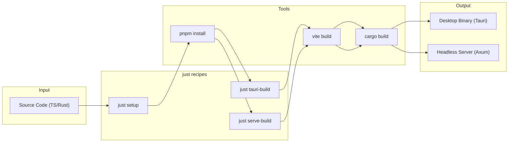
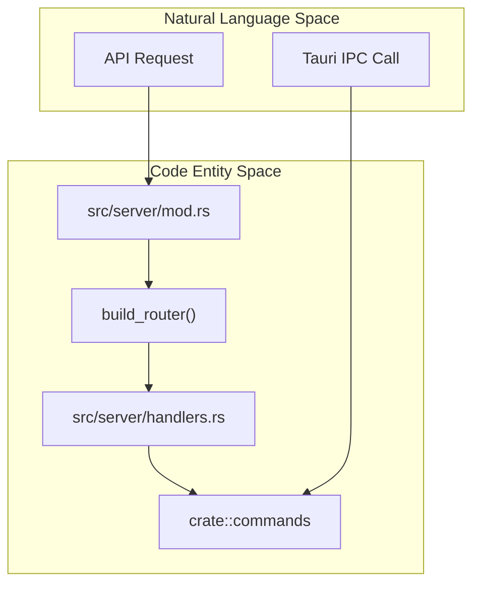

# Installation and Setup

<details>
<summary>Relevant source files</summary>

The following files were used as context for generating this wiki page:

- [.dockerignore](.dockerignore)
- [.github/workflows/server-release.yml](.github/workflows/server-release.yml)
- [.github/workflows/updater-release.yml](.github/workflows/updater-release.yml)
- [Dockerfile](Dockerfile)
- [contrib/cchv.service](contrib/cchv.service)
- [docker-compose.yml](docker-compose.yml)
- [docs/server-guide.ko.md](docs/server-guide.ko.md)
- [docs/server-guide.md](docs/server-guide.md)
- [index.html](index.html)
- [install-server.sh](install-server.sh)
- [justfile](justfile)
- [pnpm-lock.yaml](pnpm-lock.yaml)
- [src-tauri/.cargo/config.toml](src-tauri/.cargo/config.toml)
- [src-tauri/capabilities/default.json](src-tauri/capabilities/default.json)
- [src-tauri/src/server/handlers.rs](src-tauri/src/server/handlers.rs)
- [src-tauri/src/server/mod.rs](src-tauri/src/server/mod.rs)
- [src/index.css](src/index.css)
- [src/utils/fileDialog.ts](src/utils/fileDialog.ts)
- [tailwind.config.js](tailwind.config.js)

</details>


This page describes how to obtain and run the Claude Code History Viewer. Four installation paths are available: Homebrew (macOS/Linux), pre-built binary download (all platforms), building from source using the `just` command runner, and the **WebUI Server Mode** for headless environments.

For information about the overall architecture of the application, see page [2]().

## System Requirements

The Claude Code History Viewer is a cross-platform application built with Tauri v2 (Desktop) and Axum (Server).

### Supported Platforms

| Platform | Architecture | Desktop Format | Server Format |
|----------|-------------|----------------|---------------|
| **macOS** | Universal (ARM64 + x86_64) | `.dmg` | `.tar.gz` |
| **Windows** | x64 | `.exe` / Portable `.zip` | N/A |
| **Linux** | x64 / ARM64 | `.AppImage` | `.tar.gz` / Docker |

Sources: [.github/workflows/updater-release.yml:59-70](), [.github/workflows/server-release.yml:21-34]()

### Prerequisites for Running

The application reads from these default provider locations at startup:

| Provider | Default Data Path |
|----------|-------------------|
| **Claude Code** | `~/.claude/projects/` |
| **Codex CLI** | `~/.codex/sessions/` |
| **OpenCode** | `~/.local/share/opencode/` |

Sources: [docs/server-guide.md:152-163](), [docs/server-guide.ko.md:150-161]()

---

## Installation Methods

### Method 1: Homebrew (macOS & Linux)

The application is distributed via a dedicated tap at `jhlee0409/tap`.

**Desktop App (macOS Cask):**
```bash
brew install --cask jhlee0409/tap/claude-code-history-viewer
```

**Headless Server (Formula):**
```bash
brew install jhlee0409/tap/cchv-server
```

Sources: [docs/server-guide.md:60-62](), [docs/server-guide.md:141-142](), [.github/workflows/server-release.yml:154-171]()

---

### Method 2: WebUI Server Mode (Headless)

The application can run as a standalone web server. This is ideal for VPS, Docker, or remote access. The server binary embeds the frontend using `rust-embed` [src-tauri/src/server/mod.rs:42-44]().

**Quick Start:**
```bash
# Run the server
cchv-server --serve
```

**CLI Options:**
| Flag | Default | Description |
|------|---------|-------------|
| `--serve` | — | **Required.** Starts HTTP server instead of Desktop UI [src-tauri/src/server/mod.rs:180-188]() |
| `--port` | `3727` | Server port [src-tauri/src/server/mod.rs:50-52]() |
| `--host` | `0.0.0.0` | Bind address [src-tauri/src/server/mod.rs:55-56]() |
| `--token` | UUID v4 | Custom auth token for browser access [src-tauri/src/server/mod.rs:49-52]() |

Sources: [src-tauri/src/server/mod.rs:1-56](), [docs/server-guide.md:176-190]()

#### Docker Deployment
A multi-stage `Dockerfile` is provided to build the server with embedded assets [Dockerfile:1-57]().

```bash
docker compose up -d
```
Sources: [Dockerfile:1-57](), [docker-compose.yml:1-15]()

---

### Method 3: Build from Source

Building from source requires Node.js 20, pnpm 9+, and the Rust toolchain.

#### Using the `justfile` (Recommended)

The project uses a `justfile` [justfile:1-197]() as the primary task runner.

| Recipe | Command | Purpose |
|--------|---------|---------|
| `just setup` | `mise install` + `pnpm install` | Initialize environment [justfile:17-22]() |
| `just dev` | `tauri dev` | Desktop dev mode [justfile:44-45]() |
| `just tauri-build` | `tauri build` | Build production desktop app [justfile:69-76]() |
| `just serve-build` | `cargo build --release --features webui-server` | Build headless server [justfile:112-113]() |

**Diagram: Build Pipeline Flow**



Sources: [justfile:17-22](), [justfile:112-113](), [Dockerfile:4-32]()

---

## Technical Implementation

### Server Mode Architecture
The `webui-server` feature flag enables an Axum-based HTTP server [src-tauri/src/server/mod.rs:1-4](). It maps Tauri command logic to REST endpoints via the `handlers` module [src-tauri/src/server/handlers.rs:1-15]().

**Diagram: Code Entity Mapping (Server vs Desktop)**



Sources: [src-tauri/src/server/mod.rs:47-162](), [src-tauri/src/server/handlers.rs:1-15]()

### `justfile` Logic
The `justfile` automates complex platform-specific tasks, such as creating Universal Binaries for macOS [justfile:74-76]() and syncing version numbers between `package.json` and `Cargo.toml` [justfile:79-80]().

Sources: [justfile:74-80](), [justfile:112-113]()

---

## Troubleshooting

### Linux AppImage Crashes
On rolling-release distributions (like Arch Linux), the AppImage may crash due to EGL/Mesa library mismatches. The CI pipeline includes a post-processing step to remove these conflicting libraries [ .github/workflows/updater-release.yml:186-215]().

### Version Mismatch
If the Rust backend and Frontend report different versions, run the synchronization script:
```bash
just sync-version
```
Sources: [justfile:79-80]()

## Data Privacy and Security

The application is **100% offline**.
- **Desktop Mode**: Permissions are strictly controlled via Tauri capabilities [src-tauri/capabilities/default.json:1-24]().
- **Server Mode**: Includes **Bearer token authentication** [src-tauri/src/server/mod.rs:49-52]() and configurable CORS [src-tauri/src/server/mod.rs:49-62]().
- **Systemd**: The provided service file includes security hardening like `ProtectSystem=strict` and `NoNewPrivileges=true` [contrib/cchv.service:38-52]().

Sources: [src-tauri/capabilities/default.json:1-24](), [src-tauri/src/server/mod.rs:49-62](), [contrib/cchv.service:38-52]()

## Auto-Update System

The desktop application features a built-in updater that checks for signed releases on GitHub [.github/workflows/updater-release.yml:1-51](). It supports automated metadata generation for Tauri's update protocol.

Sources: [.github/workflows/updater-release.yml:1-51](), [src-tauri/capabilities/default.json:15-16]()
