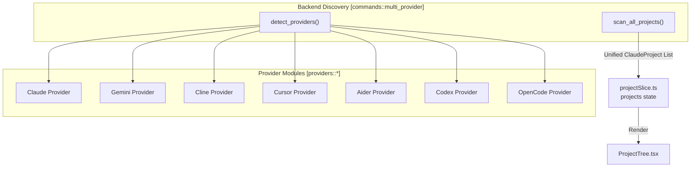
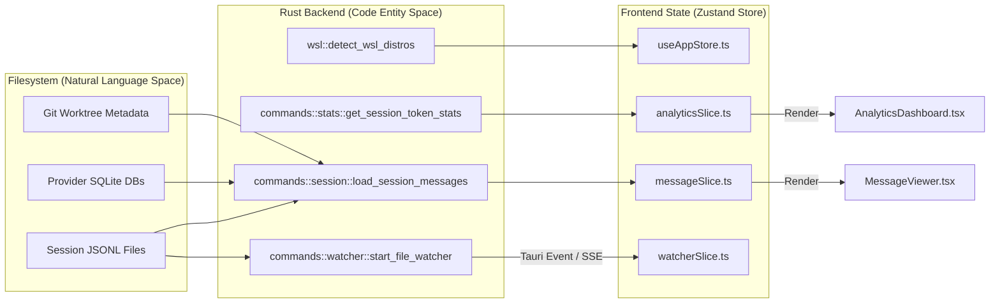

# Key Features

Relevant source files

The following files were used as context for generating this wiki page:

- [CHANGELOG.md](CHANGELOG.md)
- [README.ja.md](README.ja.md)
- [README.ko.md](README.ko.md)
- [README.md](README.md)
- [README.zh-CN.md](README.zh-CN.md)
- [README.zh-TW.md](README.zh-TW.md)
- [docs/HOMEBREW.md](docs/HOMEBREW.md)
- [package.json](package.json)
- [src-tauri/Cargo.toml](src-tauri/Cargo.toml)
- [src-tauri/src/commands/mod.rs](src-tauri/src/commands/mod.rs)
- [src-tauri/src/lib.rs](src-tauri/src/lib.rs)
- [src-tauri/src/models.rs](src-tauri/src/models.rs)
- [src-tauri/tauri.conf.json](src-tauri/tauri.conf.json)
- [src/App.tsx](src/App.tsx)
- [src/components/ArchiveManager/ArchiveBrowser.tsx](src/components/ArchiveManager/ArchiveBrowser.tsx)
- [src/components/ArchiveManager/ArchiveOverview.tsx](src/components/ArchiveManager/ArchiveOverview.tsx)
- [src/components/MessageViewer.tsx](src/components/MessageViewer.tsx)
- [src/components/ProjectTree.tsx](src/components/ProjectTree.tsx)
- [src/hooks/index.ts](src/hooks/index.ts)
- [src/hooks/useProjectSessions.ts](src/hooks/useProjectSessions.ts)
- [src/store/slices/archiveSlice.ts](src/store/slices/archiveSlice.ts)
- [src/store/useAppStore.ts](src/store/useAppStore.ts)
- [src/test/ArchiveBrowser.test.tsx](src/test/ArchiveBrowser.test.tsx)
- [src/test/ProjectTree.worktree.test.tsx](src/test/ProjectTree.worktree.test.tsx)
- [src/test/archiveSlice.test.ts](src/test/archiveSlice.test.ts)
- [src/test/useProjectSessions.test.tsx](src/test/useProjectSessions.test.tsx)
- [src/types/core/project.ts](src/types/core/project.ts)
- [src/types/index.ts](src/types/index.ts)

## Purpose and Scope

The Claude Code History Viewer (CCHV) is a unified offline desktop application and headless web server designed to browse, search, and analyze conversation histories from multiple AI coding assistants. This document details the technical implementation and user-facing capabilities of its core features, including 7-provider support, visual session analysis, and real-time monitoring.

---

## Feature Overview

CCHV abstracts the data formats of different AI assistants into a unified interface, supporting both a Tauri-based desktop app and a headless Axum server.

| Category | Key Capabilities | Primary Code Entities |
|----------|------------------|-------------------|
| **Multi-Provider** | Support for 7 providers (Claude, Gemini, Cline, etc.) | `detect_providers`, `providerSlice` |
| **Project Management** | Scanning, worktree grouping, WSL support | `scan_projects`, `ProjectTree`, `projectSlice` |
| **Session Analysis** | Multi-session board, attribute brushing, timeline | `SessionBoard`, `boardSlice`, `ActivityTimeline` |
| **Message Viewing** | Virtual scrolling, ANSI rendering, Export | `MessageViewer`, `MessageNavigator`, `messageSlice` |
| **Analytics** | Token stats, cost breakdown, heatmaps | `get_global_stats_summary`, `AnalyticsDashboard` |
| **System Services** | File watching, auto-updates, Archive Manager | `start_file_watcher`, `useUpdater`, `ArchiveManager` |

**Sources:** [src/App.tsx:23-68](), [src-tauri/src/lib.rs:111-191](), [README.md:90-103]()

---

## Multi-Provider Conversation Browser

The application functions as a unified viewer for **seven** AI coding assistants.

### Supported Providers
The backend detects installed providers by checking standard local filesystem paths or project-specific directories.

| Provider | Data Source | Path Convention |
|----------|-------------|-----------------|
| **Claude Code** | JSONL | `~/.claude/projects/` |
| **Gemini CLI** | SQLite/JSON | `~/.gemini/history/` |
| **Codex CLI** | JSON | `~/.codex/sessions/` |
| **Cline** | JSON | `~/.cline/tasks/` |
| **Cursor** | SQLite | `~/.cursor/` |
| **Aider** | JSON/Markdown | Project directories |
| **OpenCode** | JSON | `~/.local/share/opencode/` |

**Sources:** [README.md:68-76](), [src-tauri/src/lib.rs:31-34](), [src-tauri/src/lib.rs:185-189]()

### Provider Discovery Flow

**Sources:** [src-tauri/src/lib.rs:31-34](), [src-tauri/src/lib.rs:185-189](), [src/store/slices/providerSlice.ts:62-64]()

---

## Session Board with Visual Analysis

The **Session Board** provides a multi-session timeline view for cross-session workflow analysis, managed by the `boardSlice`.

### Multi-Level Zoom and Visualization
The `InteractionCard` component renders session data through three distinct zoom levels:
1.  **Pixel View**: A high-density heatmap where card height is determined by token count.
2.  **Skim View**: Compact cards showing tool icons (terminal, file, web).
3.  **Read View**: Detailed cards displaying message snippets and precise token metrics.

**Sources:** [src/store/slices/boardSlice.ts:42-44](), [src/types/board.types.ts:241-251](), [README.md:104]()

### Activity Timeline
The board includes a `SessionActivityTimeline` and a `ContributionGrid` SVG bar chart. The `useActivityData` hook computes daily activity metrics, streaks, and handles date filtering from raw session data.

**Sources:** [src/types/board.types.ts:247](), [src/store/slices/boardSlice.ts:1-117]()

---

## Analytics and Token Management

The **Analytics Dashboard** provides cost and usage transparency.

### Dual-Mode Token Statistics
The system calculates statistics via `get_session_token_stats` and `get_global_stats_summary` in two modes:
-   **Billing Total**: Includes all overhead (prompt caching, system instructions).
-   **Conversation Only**: Focuses on actual user/assistant exchange.

### Cost and Distribution
The dashboard features a `BillingBreakdownCard` using `MODEL_PRICING` for cost calculations and a `ProviderDistributionChart` to compare usage across the 7 supported assistants.

**Sources:** [src-tauri/src/lib.rs:46-49](), [src/types/stats.types.ts:199-214](), [src/types/analytics.ts:233-238]()

---

## System Services

### Archive Manager
Users can manage long-term history via the `ArchiveManager`.
-   **Creation**: `create_archive` command packages sessions into a managed storage area.
-   **Browsing**: `ArchiveBrowser` allows viewing archived sessions without re-importing.
-   **Export**: Supports exporting sessions to HTML, Markdown, or JSON.

**Sources:** [src-tauri/src/lib.rs:13-18](), [src-tauri/src/lib.rs:191-193](), [src/store/slices/archiveSlice.ts:66-68]()

### Real-time File Monitoring
The `watcher.rs` module utilizes a debounced file watcher. When a session file is updated (e.g., during an active Claude Code session), the backend pushes events to the frontend `watcherSlice` via the Tauri event bridge or SSE (in server mode).

**Sources:** [src-tauri/src/lib.rs:53](), [src-tauri/src/lib.rs:182-183](), [src/store/slices/watcherSlice.ts:54-56]()

### WSL Support
For Windows users, CCHV can scan projects inside Linux distributions. The `wsl.rs` module detects installed distros and bridges the filesystem gap to load Claude Code projects from the WSL environment.

**Sources:** [src-tauri/src/lib.rs:54](), [src-tauri/src/lib.rs:125](), [src/types/core/project.ts:113-114]()

---

## Data Flow Architecture

This diagram traces the flow from raw filesystem data to the UI components.

**Sources:** [src-tauri/src/lib.rs:1-55](), [src/store/useAppStore.ts:81-117](), [src/App.tsx:23-68](), [src-tauri/src/models.rs:1-10]()
