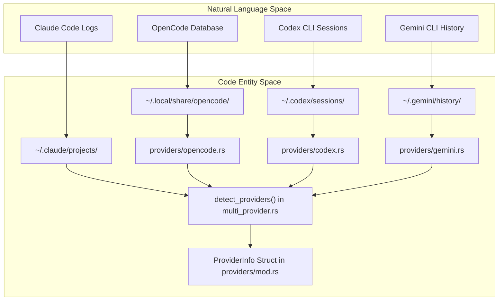
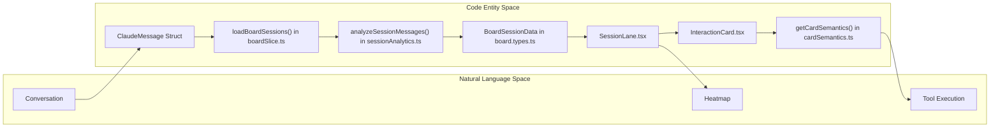

# Glossary

Relevant source files

The following files were used as context for generating this wiki page:

- [CHANGELOG.md](CHANGELOG.md)
- [README.ja.md](README.ja.md)
- [README.ko.md](README.ko.md)
- [README.md](README.md)
- [README.zh-CN.md](README.zh-CN.md)
- [README.zh-TW.md](README.zh-TW.md)
- [docs/HOMEBREW.md](docs/HOMEBREW.md)
- [package.json](package.json)
- [src-tauri/Cargo.toml](src-tauri/Cargo.toml)
- [src-tauri/src/commands/mod.rs](src-tauri/src/commands/mod.rs)
- [src-tauri/src/lib.rs](src-tauri/src/lib.rs)
- [src-tauri/src/models.rs](src-tauri/src/models.rs)
- [src-tauri/src/providers/codex.rs](src-tauri/src/providers/codex.rs)
- [src-tauri/src/providers/gemini.rs](src-tauri/src/providers/gemini.rs)
- [src-tauri/src/providers/opencode.rs](src-tauri/src/providers/opencode.rs)
- [src-tauri/src/utils.rs](src-tauri/src/utils.rs)
- [src-tauri/tauri.conf.json](src-tauri/tauri.conf.json)
- [src/App.tsx](src/App.tsx)
- [src/components/MessageViewer.tsx](src/components/MessageViewer.tsx)
- [src/components/ProjectTree.tsx](src/components/ProjectTree.tsx)
- [src/components/SessionBoard/BoardControls.tsx](src/components/SessionBoard/BoardControls.tsx)
- [src/components/SessionBoard/InteractionCard.tsx](src/components/SessionBoard/InteractionCard.tsx)
- [src/components/SessionBoard/SessionBoard.tsx](src/components/SessionBoard/SessionBoard.tsx)
- [src/components/SessionBoard/SessionLane.tsx](src/components/SessionBoard/SessionLane.tsx)
- [src/components/SmartJsonDisplay.tsx](src/components/SmartJsonDisplay.tsx)
- [src/components/ToolIcon.tsx](src/components/ToolIcon.tsx)
- [src/components/contentRenderer/ClaudeContentArrayRenderer.tsx](src/components/contentRenderer/ClaudeContentArrayRenderer.tsx)
- [src/components/contentRenderer/OpenCodeStepRenderer.tsx](src/components/contentRenderer/OpenCodeStepRenderer.tsx)
- [src/hooks/index.ts](src/hooks/index.ts)
- [src/i18n/locales/en/renderers.json](src/i18n/locales/en/renderers.json)
- [src/i18n/locales/ja/renderers.json](src/i18n/locales/ja/renderers.json)
- [src/i18n/locales/ko/renderers.json](src/i18n/locales/ko/renderers.json)
- [src/i18n/locales/zh-CN/renderers.json](src/i18n/locales/zh-CN/renderers.json)
- [src/i18n/locales/zh-TW/renderers.json](src/i18n/locales/zh-TW/renderers.json)
- [src/store/slices/boardSlice.ts](src/store/slices/boardSlice.ts)
- [src/store/useAppStore.ts](src/store/useAppStore.ts)
- [src/test/ProjectTree.worktree.test.tsx](src/test/ProjectTree.worktree.test.tsx)
- [src/types/board.types.ts](src/types/board.types.ts)
- [src/types/core/project.ts](src/types/core/project.ts)
- [src/types/index.ts](src/types/index.ts)
- [src/utils/sessionAnalytics.ts](src/utils/sessionAnalytics.ts)
- [src/utils/toolSummaries.ts](src/utils/toolSummaries.ts)

This page defines codebase-specific terms, jargon, and domain concepts used throughout the Claude Code History Viewer (CCHV). It provides a mapping between natural language concepts and their technical implementations in both the Rust backend and React frontend.

## Domain Concepts

### Provider
A "Provider" represents a specific AI coding assistant that generates conversation logs. CCHV abstracts multiple providers into a unified interface.
*   **Claude Code**: The primary provider, storing logs in `~/.claude/projects/` [README.md:68-70]().
*   **Gemini CLI**: Stores history in `~/.gemini/history/` [README.md:71]().
*   **Codex CLI**: Stores session rollouts in `~/.codex/sessions/` [README.md:72]().
*   **Cline**: Stores tasks in `~/.cline/tasks/` [README.md:73]().
*   **Cursor**: Stores composer/chat logs in `~/.cursor/` [README.md:74]().
*   **Aider**: Stores logs in project directories [README.md:75]().
*   **OpenCode**: Stores sessions in `~/.local/share/opencode/` [README.md:76]().

### Project
A logical grouping of sessions, typically corresponding to a git repository or a specific workspace directory [src-tauri/src/providers/opencode.rs:147-151]().
*   **Implementation**: Represented by the `ClaudeProject` struct [src-tauri/src/models.rs:11-25]().
*   **Grouping**: Projects can be grouped by `worktree` or `directory` [src/App.tsx:162-166]().

### Session
A single continuous conversation between a user and an AI assistant.
*   **Implementation**: Represented by the `ClaudeSession` struct [src/types/index.ts:102-124]().
*   **Sidechain**: Refers to auxiliary background processes (like thinking or progress updates) that may contain token usage but are not part of the primary message flow [src-tauri/src/commands/stats.rs:34-42]().

### Board / Session Board
A high-level visual analysis tool for viewing multiple sessions side-by-side in a grid or lane layout [src/components/SessionBoard/SessionBoard.tsx:20-40]().

---

## Technical Jargon & Abbreviations

| Term | Definition | Code Pointer |
| :--- | :--- | :--- |
| **ANSI** | Standard for terminal colors and formatting. Rendered via `ansi-to-html` utilities. | [package.json:43](), [src-tauri/src/commands/session.rs:120-140]() |
| **Brushing** | A filtering mechanism on the Session Board where hovering over an attribute (e.g., a tool name) highlights all matching cards across all lanes. | [src/components/SessionBoard/SessionBoard.tsx:117-155](), [src/components/SessionBoard/BoardControls.tsx:104-105]() |
| **Frecency** | A combination of **Frequency** and **Recency** used to rank the most relevant terminal commands or tools. | [src/components/SessionBoard/SessionBoard.tsx:157-160]() |
| **IPC** | Inter-Process Communication. In Tauri, this is the `invoke` bridge between TypeScript and Rust. | [src-tauri/src/lib.rs:111-191]() |
| **JSONL** | JSON Lines format. Used by providers like Codex and Gemini to store session rollouts. | [src-tauri/src/providers/codex.rs:68-73](), [src-tauri/src/commands/stats.rs:182-186]() |
| **MCP** | Model Context Protocol. A standard for connecting AI models to external tools and data sources. | [src/components/SessionBoard/InteractionCard.tsx:115-117](), [src-tauri/src/commands/claude_settings.rs:100-120]() |
| **Rollout** | A Codex-specific term for a session log file (e.g., `rollout-*.jsonl`). | [src-tauri/src/providers/codex.rs:68-73](), [src-tauri/src/commands/stats.rs:178-186]() |
| **Sidechain** | Background token usage (e.g., `progress`, `queue-operation`) often excluded in "Conversation Only" stats mode. | [src-tauri/src/commands/stats.rs:66-71]() |

---

## System Mapping: Natural Language to Code

The following diagrams bridge user-facing concepts to specific code entities and data structures.

### Data Provider Discovery
This diagram shows how the system maps physical file locations to Provider entities.

**Sources:** [src-tauri/src/lib.rs:30-33](), [src-tauri/src/providers/opencode.rs:23-34](), [src-tauri/src/providers/codex.rs:14-26](), [README.md:68-76]()

### Session Board Data Flow
This diagram illustrates how raw messages are transformed into visual "Lanes" and "Cards" on the Session Board.

**Sources:** [src/store/slices/boardSlice.ts:114-153](), [src/components/SessionBoard/SessionLane.tsx:60-115](), [src/components/SessionBoard/InteractionCard.tsx:108-117](), [src/utils/sessionAnalytics.ts](), [src/types/board.types.ts:35-45]()

---

## State & Storage Terms

### AppStore
The global Zustand store created in `useAppStore.ts` that composes multiple "slices" [src/store/useAppStore.ts:101-117]().

### Slice Pattern
A state management pattern where the global store is split into domain-specific modules:
*   **`projectSlice`**: Manages project scanning, selection, and grouping logic [src/store/slices/projectSlice.ts]().
*   **`boardSlice`**: Manages session board data, zoom levels, and attribute brushing [src/store/slices/boardSlice.ts:18-30]().
*   **`metadataSlice`**: Handles user-defined renames, hidden projects, and persistent metadata storage [src/store/slices/metadataSlice.ts]().

### Stats Mode
Determines how token costs are calculated [src-tauri/src/commands/stats.rs:27-31]():
*   **`billing_total`**: Includes all messages and sidechain processes (e.g., thinking time).
*   **`conversation_only`**: Excludes system noise and sidechain token usage to show actual chat costs.

---

## UI Components & Interactions

### Zoom Levels
Specific viewing modes for the Session Board that determine the level of detail and layout [src/types/board.types.ts:11-16]():
1.  **Pixel (0)**: A heatmap/miniature view showing token density and activity patterns [src/components/SessionBoard/SessionLane.tsx:152-173]().
2.  **Skim (1)**: Icon-based view for quick scanning of tool usage and conversation flow [src/components/SessionBoard/SessionLane.tsx:179-183]().
3.  **Read (2)**: Full content view similar to a chat interface, optimized for readability [src/components/SessionBoard/SessionLane.tsx:185-188]().

### Semantic Variants
Categorization of tool executions and message types used for consistent styling, iconography, and brushing:
*   **`terminal`**: Shell commands and script executions [src/components/SessionBoard/SessionBoard.tsx:129-130]().
*   **`mcp`**: Interactions with Model Context Protocol servers [src/components/SessionBoard/SessionBoard.tsx:117-120]().
*   **`git`**: Specifically identified git commands (commit, log, etc.) [src/components/SessionBoard/SessionBoard.tsx:140-142]().
*   **`file_edit`**: File modification operations (write, edit, patch) [src/components/SessionBoard/InteractionCard.tsx:38-51]().

**Sources:** [src/components/SessionBoard/BoardControls.tsx:64-99](), [src/components/SessionBoard/InteractionCard.tsx:112-117](), [src/utils/toolIconUtils.ts](), [src/utils/cardSemantics.ts]()
