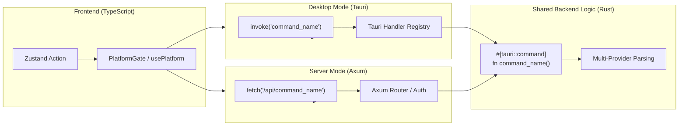

# Architecture Overview

<details>
<summary>Relevant source files</summary>

The following files were used as context for generating this wiki page:

- [CHANGELOG.md](CHANGELOG.md)
- [README.ja.md](README.ja.md)
- [README.ko.md](README.ko.md)
- [README.md](README.md)
- [README.zh-CN.md](README.zh-CN.md)
- [README.zh-TW.md](README.zh-TW.md)
- [docs/HOMEBREW.md](docs/HOMEBREW.md)
- [package.json](package.json)
- [src-tauri/Cargo.toml](src-tauri/Cargo.toml)
- [src-tauri/src/commands/mod.rs](src-tauri/src/commands/mod.rs)
- [src-tauri/src/lib.rs](src-tauri/src/lib.rs)
- [src-tauri/src/models.rs](src-tauri/src/models.rs)
- [src-tauri/tauri.conf.json](src-tauri/tauri.conf.json)
- [src/App.tsx](src/App.tsx)
- [src/components/MessageViewer.tsx](src/components/MessageViewer.tsx)
- [src/components/ProjectTree.tsx](src/components/ProjectTree.tsx)
- [src/hooks/index.ts](src/hooks/index.ts)
- [src/store/useAppStore.ts](src/store/useAppStore.ts)
- [src/test/ProjectTree.worktree.test.tsx](src/test/ProjectTree.worktree.test.tsx)
- [src/types/core/project.ts](src/types/core/project.ts)
- [src/types/index.ts](src/types/index.ts)

</details>


## Purpose and Scope

This document provides a high-level overview of the Claude Code History Viewer's system architecture, describing the major subsystems and how they interact. It introduces the three-tier architecture (Frontend, Backend, Build System), the technology stack, and key architectural patterns used throughout the application, including the headless server mode.

For detailed information about specific subsystems:
- **System Architecture**: Overall topology, file watcher side-channel, and headless server mode. See [System Architecture](#2.1).
- **Frontend Architecture**: React component hierarchy and Zustand state management. See [Frontend Architecture](#2.2).
- **Backend Architecture**: Rust command modules and multi-provider logic. See [Backend Architecture](#2.3).
- **Data Flow**: End-to-end trace from JSONL/SQLite files to UI components. See [Data Flow](#2.4).
- **Multi-Provider System**: Abstracting Claude Code, Gemini, Codex, Cline, Cursor, Aider, and OpenCode. See [Multi-Provider System](#2.5).

---

## Three-Tier Architecture

The application is organized into three distinct architectural layers:

### Frontend Layer (React + TypeScript)
A desktop UI built with React 19, TypeScript, and Vite, using Zustand for state management. The frontend renders session data, manages user interactions, and communicates with the backend through Tauri's IPC system or an HTTP REST API in server mode.

**Key Technologies:**
- `react` 19 — UI framework [package.json:58-58]()
- `zustand` — State management [src/store/useAppStore.ts:8-8]()
- `@tanstack/react-virtual` — Virtual scrolling for performance [package.json:34-34]()
- `i18next` — Internationalization supporting 5 languages [src/App.tsx:2-2]()

### Backend Layer (Rust + Tauri)
A native Rust backend that handles file system operations, session parsing, analytics computation, and file watching. Organized into top-level modules declared in `lib.rs`: `commands`, `models`, `providers`, and `utils`. It optionally includes an `axum` server for headless mode.

| Module | Path | Role |
|--------|------|------|
| `commands` | `src-tauri/src/commands/` | Tauri command handlers exposed to frontend [src-tauri/src/lib.rs:13-55]() |
| `models` | `src-tauri/src/models/` | Shared Rust data structures [src-tauri/src/lib.rs:2-2]() |
| `providers` | `src-tauri/src/providers/` | Per-provider data reading logic (7 providers) [src-tauri/src/lib.rs:3-3]() |
| `server` | `src-tauri/src/server/` | Axum HTTP server for headless WebUI mode [src-tauri/src/lib.rs:8-8]() |

### Build System
Development and release pipeline using `justfile` for task automation, GitHub Actions for CI/CD, and Tauri's updater plugin for distribution.

**Sources:** [src-tauri/src/lib.rs:1-55](), [src/App.tsx:1-21](), [src/store/useAppStore.ts:1-75](), [package.json:1-68]()

---

## System Overview with Code Entities

The following diagram shows the three architectural layers and maps them to specific code entities in the codebase, including the multi-provider backend:

**System Topology — code entity map**

```mermaid
graph TB
    subgraph Frontend["Frontend Layer (src/)"]
        App["App.tsx"]
        Store["useAppStore.ts\nZustand combined store"]

        subgraph Views["Core Views"]
            SessionBoard["SessionBoard/"]
            MessageViewer["MessageViewer.tsx"]
            ProjectTree["ProjectTree.tsx"]
            AnalyticsDashboard["AnalyticsDashboard.tsx"]
        end

        subgraph StateSlices["State Slices (store/slices/)"]
            ProjectSlice["projectSlice.ts"]
            MessageSlice["messageSlice.ts"]
            BoardSlice["boardSlice.ts"]
            ProviderSlice["providerSlice.ts"]
            WatcherSlice["watcherSlice.ts"]
        end
    end

    subgraph Communication["Communication Layer"]
        TauriIPC["Tauri IPC Bridge\ninvoke()"]
        HttpServer["Axum HTTP Server\nREST API + SSE"]
    end

    subgraph Backend["Backend Layer (src-tauri/src/)"]
        LibRs["lib.rs\nrun() / run_tauri()"]

        subgraph Commands["commands/"]
            MultiProviderCmd["multi_provider.rs\nscan_all_projects\nload_provider_sessions"]
            StatsCmd["stats.rs\nget_global_stats_summary"]
            WatcherCmd["watcher.rs\nstart_file_watcher"]
            ArchiveCmd["archive.rs\ncreate_archive"]
        end

        subgraph Providers["providers/"]
            ClaudeProvider["claude.rs"]
            GeminiProvider["gemini.rs"]
            ClineProvider["cline.rs"]
            AiderProvider["aider.rs"]
            OtherProviders["cursor.rs, codex.rs,\nopencode.rs"]
        end
    end

    subgraph Data["Data Sources (local filesystem)"]
        ClaudeFS["~/.claude/projects/"]
        ClineFS["~/.cline/tasks/"]
        AiderFS["Local Git Worktrees"]
    end

    App --> Store
    Store --> StateSlices
    ProjectTree --> ProjectSlice
    StateSlices --> Communication
    Communication --> LibRs
    LibRs --> Commands
    
    MultiProviderCmd --> ClaudeProvider
    MultiProviderCmd --> GeminiProvider
    MultiProviderCmd --> ClineProvider
    MultiProviderCmd --> AiderProvider

    ClaudeProvider --> ClaudeFS
    ClineProvider --> ClineFS
    AiderProvider --> AiderFS
```



**Sources:** [src/App.tsx:23-68](), [src/store/useAppStore.ts:81-117](), [src-tauri/src/lib.rs:111-191](), [README.md:68-76]()

---

## Tauri IPC and Server Command Flow

The application supports two primary execution modes: the standard Tauri desktop app and the headless WebUI server.



**Example Command Registration:**

The backend registers commands for the Tauri environment in [src-tauri/src/lib.rs:117-191]():
```rust
.invoke_handler(tauri::generate_handler![
    scan_all_projects,
    load_provider_sessions,
    load_provider_messages,
    get_global_stats_summary,
    start_file_watcher,
    // ...
])
```

**Sources:** [src-tauri/src/lib.rs:117-191](), [src/App.tsx:77-77](), [src-tauri/Cargo.toml:19-19]()

---

## State Management Architecture

The application uses Zustand with a slice pattern to organize state by domain. The `AppStore` is a composition of 15 specialized slices.

**Slice Inventory (from `useAppStore.ts`):**

| Slice | Domain |
|-------|--------|
| `projectSlice` | Project and session selection [src/store/useAppStore.ts:10-12]() |
| `messageSlice` | Conversation messages and pagination [src/store/useAppStore.ts:14-16]() |
| `providerSlice` | Active provider detection (Claude, Gemini, etc.) [src/store/useAppStore.ts:62-64]() |
| `boardSlice` | Session board visualization state [src/store/useAppStore.ts:42-44]() |
| `analyticsSlice` | Token usage and cost analytics [src/store/useAppStore.ts:22-24]() |
| `archiveSlice` | Archive management and browsing [src/store/useAppStore.ts:66-68]() |

**Sources:** [src/store/useAppStore.ts:81-117]()

---

## Key Architectural Patterns

### 1. Multi-Provider Abstraction
The backend uses a unified interface to handle seven different AI assistants. Commands like `scan_all_projects` iterate through registered providers to aggregate data from disparate filesystem locations including `~/.claude`, `~/.cline`, and local git worktrees [src-tauri/src/lib.rs:31-34](), [README.md:68-76]().

### 2. Double Virtualization
For high-performance rendering, the application employs virtualization in both the **Message Viewer** (via `useMessageVirtualization`) and the **Session Board** (handling hundreds of sessions and thousands of messages) [src/types/index.ts:34-37](), [src/types/index.ts:241-251]().

### 3. Debounced File Watching
The `watcher.rs` system monitors local session files. To prevent UI flickering during rapid writes by AI agents, it uses `notify-debouncer-mini` to batch filesystem events before emitting them via Tauri events or SSE [src-tauri/src/lib.rs:113-116](), [src-tauri/Cargo.toml:56-57]().

### 4. Progressive Loading
The application loads metadata first (`scan_projects`), then session lists, and finally individual messages or token stats only when requested by the user, ensuring the UI remains responsive even with large history datasets [src/App.tsx:179-216]().

**Sources:** [src-tauri/src/lib.rs:39-44](), [src/App.tsx:86-93](), [src/types/index.ts:193-214]()
