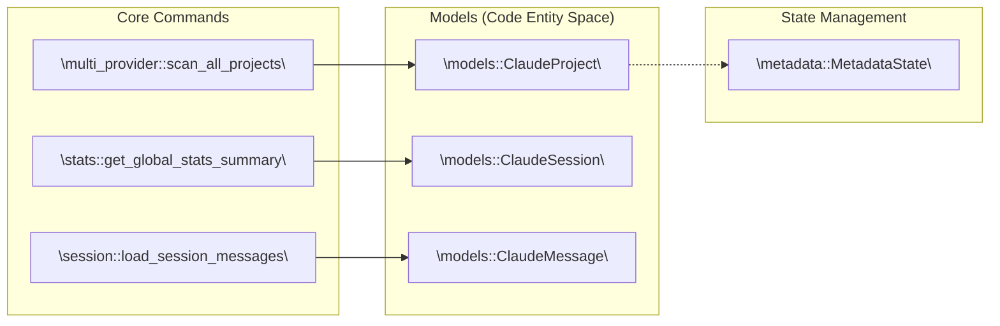
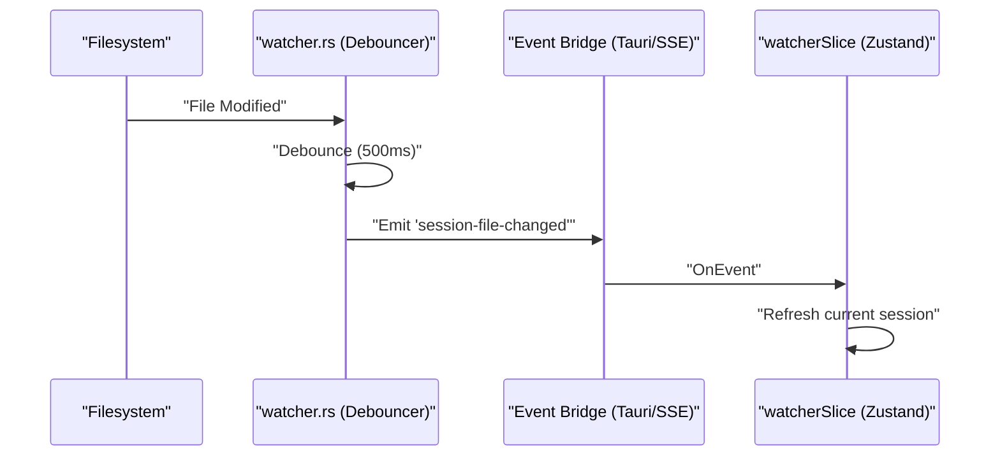

# System Architecture

<details>
<summary>Relevant source files</summary>

The following files were used as context for generating this wiki page:

- [.dockerignore](.dockerignore)
- [.github/workflows/server-release.yml](.github/workflows/server-release.yml)
- [Dockerfile](Dockerfile)
- [contrib/cchv.service](contrib/cchv.service)
- [docker-compose.yml](docker-compose.yml)
- [docs/server-guide.ko.md](docs/server-guide.ko.md)
- [docs/server-guide.md](docs/server-guide.md)
- [index.html](index.html)
- [install-server.sh](install-server.sh)
- [src-tauri/src/commands/mod.rs](src-tauri/src/commands/mod.rs)
- [src-tauri/src/lib.rs](src-tauri/src/lib.rs)
- [src-tauri/src/models.rs](src-tauri/src/models.rs)
- [src-tauri/src/server/handlers.rs](src-tauri/src/server/handlers.rs)
- [src-tauri/src/server/mod.rs](src-tauri/src/server/mod.rs)
- [src/App.tsx](src/App.tsx)
- [src/components/MessageViewer.tsx](src/components/MessageViewer.tsx)
- [src/components/ProjectTree.tsx](src/components/ProjectTree.tsx)
- [src/hooks/index.ts](src/hooks/index.ts)
- [src/store/useAppStore.ts](src/store/useAppStore.ts)
- [src/test/ProjectTree.worktree.test.tsx](src/test/ProjectTree.worktree.test.tsx)
- [src/types/core/project.ts](src/types/core/project.ts)
- [src/types/index.ts](src/types/index.ts)
- [src/utils/fileDialog.ts](src/utils/fileDialog.ts)

</details>


This page describes the overall system topology of the Claude Code History Viewer: the filesystem data sources, the Rust backend command layer, the Tauri IPC bridge, the headless WebUI server mode, the React/Zustand frontend, and the file watcher side-channel.

---

## Overview

The application operates in two distinct modes: **Tauri Desktop App** and **Headless WebUI Server**. Both share the same Rust core logic for disk I/O, provider parsing, and cost calculations.

*   **Desktop Mode:** A Tauri application where the Rust process communicates with a React/TypeScript WebView via an IPC bridge (`tauri::generate_handler!`).
*   **Server Mode:** A headless Axum HTTP server (`cchv-server`) that serves the React frontend (embedded via `rust-embed`) and provides a REST API mirroring the Tauri commands.

**High-Level System Topology**

```mermaid
flowchart TD
    subgraph "Data Sources"
        FS_CLAUDE["\"~/.claude/projects/ (*.jsonl)\""]
        FS_SQLITE["\"Cursor/Aider (SQLite/JSON)\""]
        FS_OPENCODE["\"OpenCode (*.json)\""]
    end

    subgraph "src-tauri/ (Rust Core)"
        subgraph "providers/"
            P_CLAUDE["\"claude/\""]
            P_MULTI["\"multi_provider.rs\""]
            P_OTHERS["\"cursor.rs, aider.rs, etc.\""]
        end
        subgraph "commands/"
            C_PROJ["\"project.rs\""]
            C_SESSION["\"session.rs\""]
            C_STATS["\"stats.rs\""]
            C_WATCHER["\"watcher.rs\""]
        end
        MODELS["\"models.rs\""]
    end

    subgraph "Distribution Modes"
        TAURI["\"Tauri Desktop App\""]
        AXUM["\"Axum WebUI Server\""]
    end

    subgraph "src/ (Frontend)"
        STORE["\"useAppStore.ts (Zustand)\""]
        APP["\"App.tsx (React)\""]
    end

    FS_CLAUDE --> P_CLAUDE
    FS_SQLITE --> P_OTHERS
    FS_OPENCODE --> P_MULTI

    P_MULTI --> C_PROJ
    P_MULTI --> C_SESSION
    
    C_PROJ --> TAURI
    C_SESSION --> TAURI
    C_STATS --> AXUM
    C_WATCHER -.->|"SSE / Tauri Event"| STORE

    TAURI -->|"IPC"| STORE
    AXUM -->|"HTTP/REST"| STORE
    STORE --> APP
```

Sources: [src-tauri/src/lib.rs:58-70](), [src-tauri/src/commands/mod.rs:1-14](), [src/store/useAppStore.ts:81-95](), [src-tauri/src/server/mod.rs:1-10]()

---

## Filesystem Sources

The application abstracts seven different AI providers. Each stores data in unique locations and formats, which are unified by the backend `providers/` module.

| Provider | Default Base Path | Format | Detection Logic |
|---|---|---|---|
| Claude Code | `~/.claude/projects/` | JSONL | `commands/project.rs` |
| Cursor | `~/Library/Application Support/Cursor/...` | SQLite | `providers/cursor.rs` |
| Aider | `.aider.chat.history.md` | Markdown/YAML | `providers/aider.rs` |
| Cline | `~/Library/Application Support/Code/User/globalStorage/saoudrizwan.claude-dev/...` | JSON | `providers/cline.rs` |

Claude Code project paths are encoded (e.g., `-Users-jack-app`) and are decoded using `decode_project_path` in `utils/` [src-tauri/src/lib.rs:4-4](). Git worktree membership is detected at scan time via `detect_git_worktree_info` to enable grouping in the `ProjectTree` [src/test/ProjectTree.worktree.test.tsx:84-106]().

Sources: [src-tauri/src/commands/multi_provider.rs:31-34](), [src-tauri/src/commands/project.rs:35-38]()

---

## Backend Architecture

The backend is organized as a Rust library crate. It handles high-performance data processing, filesystem monitoring, and cost calculations.

**Backend Entity Map**



Sources: [src-tauri/src/lib.rs:1-55](), [src-tauri/src/models.rs:1-50](), [src-tauri/src/commands/metadata.rs:26-30]()

All public commands are registered in `run_tauri()` via `tauri::generate_handler!` [src-tauri/src/lib.rs:117-193](). The `MetadataState` is managed as a `tauri::State` for persistence [src-tauri/src/lib.rs:112-112]().

---

## WebUI Server Mode (Headless)

When started with the `--serve` flag, the application runs as a headless Axum server [src-tauri/src/lib.rs:62-67]().

*   **Axum HTTP Server:** Mirrors all Tauri commands as REST endpoints (e.g., `POST /api/scan_all_projects`) [src-tauri/src/server/handlers.rs:40-61]().
*   **Authentication:** Uses Bearer token authentication via the `AUTH_TOKEN` environment variable.
*   **Real-time Events:** Uses Server-Sent Events (SSE) to push file watcher notifications to the web frontend, replacing the Tauri event bus.
*   **Static Assets:** Frontend files are embedded into the binary using `rust-embed`, making the server a single portable binary [Dockerfile:4-32]().

Sources: [src-tauri/src/server/mod.rs:1-20](), [src-tauri/src/server/handlers.rs:1-15](), [Dockerfile:49-57]()

---

## React/Zustand Frontend Layer

The frontend is a React application using `useAppStore` (Zustand) for global state. It uses a `PlatformProvider` to abstract the difference between Tauri IPC and Web REST calls [src/App.tsx:11-11]().

**Frontend State Slices**

| Slice | Responsibility | Key Entity |
|---|---|---|
| `projectSlice` | Project/Session lists | `ClaudeProject` |
| `messageSlice` | Conversation content | `ClaudeMessage` |
| `boardSlice` | Visual analysis data | `BoardSessionData` |
| `archiveSlice` | Archived session management | `ArchiveEntry` |

Sources: [src/store/useAppStore.ts:9-68](), [src/types/index.ts:105-108]()

---

## File Watcher Side-Channel

The `watcher.rs` module monitors the filesystem for changes to session files and pushes notifications to the frontend [src-tauri/src/commands/watcher.rs:27-53]().



The watcher uses `notify_debouncer_mini` to prevent UI flickering during rapid AI write operations [src-tauri/src/lib.rs:113-116]().

Sources: [src-tauri/src/commands/watcher.rs:67-80](), [src/hooks/useFileWatcher.ts:21-23]()

---

## Docker Deployment

The application is containerized for server-mode deployment. The `Dockerfile` uses a multi-stage build:
1.  **Frontend Stage:** Builds the Vite/React assets [Dockerfile:5-15]().
2.  **Backend Stage:** Compiles the Rust binary with the `webui-server` feature, embedding the assets [Dockerfile:17-32]().
3.  **Runtime Stage:** A minimal Debian image containing only the binary and necessary shared libraries [Dockerfile:34-57]().

Sources: [Dockerfile:1-57](), [.github/workflows/server-release.yml:6-35]()
