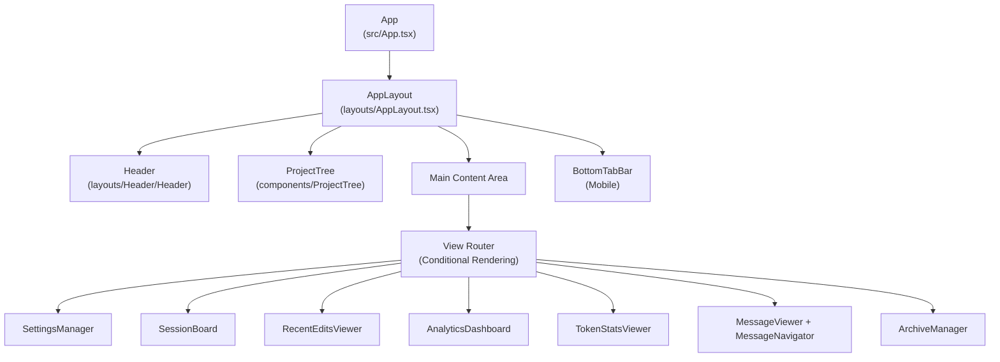
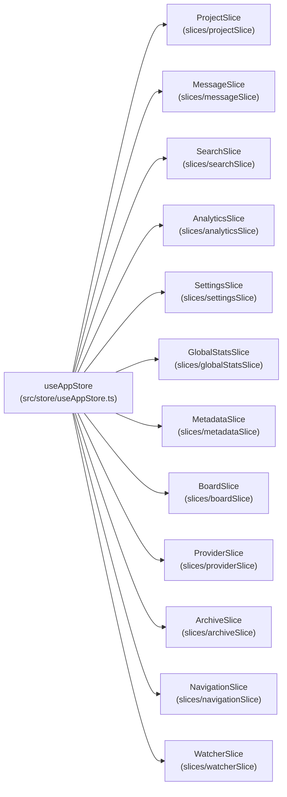
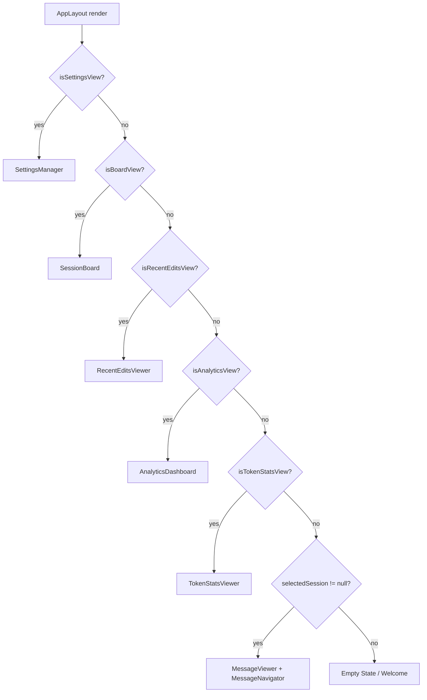
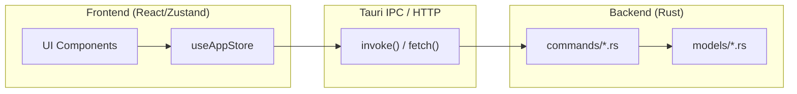

# Frontend Architecture

Relevant source files

The following files were used as context for generating this wiki page:

- [src-tauri/src/commands/mod.rs](src-tauri/src/commands/mod.rs)
- [src-tauri/src/lib.rs](src-tauri/src/lib.rs)
- [src-tauri/src/models.rs](src-tauri/src/models.rs)
- [src/App.tsx](src/App.tsx)
- [src/components/MessageViewer.tsx](src/components/MessageViewer.tsx)
- [src/components/ProjectTree.tsx](src/components/ProjectTree.tsx)
- [src/components/contentRenderer/ThinkingRenderer.tsx](src/components/contentRenderer/ThinkingRenderer.tsx)
- [src/components/contentRenderer/ToolResultCard.tsx](src/components/contentRenderer/ToolResultCard.tsx)
- [src/components/contentRenderer/toolUseRenderers/ToolUseCard.tsx](src/components/contentRenderer/toolUseRenderers/ToolUseCard.tsx)
- [src/components/renderers/RendererCard.tsx](src/components/renderers/RendererCard.tsx)
- [src/components/renderers/styles.ts](src/components/renderers/styles.ts)
- [src/contexts/platform/PlatformGate.tsx](src/contexts/platform/PlatformGate.tsx)
- [src/contexts/platform/PlatformProvider.tsx](src/contexts/platform/PlatformProvider.tsx)
- [src/contexts/platform/context.ts](src/contexts/platform/context.ts)
- [src/contexts/platform/index.ts](src/contexts/platform/index.ts)
- [src/hooks/index.ts](src/hooks/index.ts)
- [src/layouts/AppLayout.tsx](src/layouts/AppLayout.tsx)
- [src/shared/RendererHeader.tsx](src/shared/RendererHeader.tsx)
- [src/store/useAppStore.ts](src/store/useAppStore.ts)
- [src/test/ProjectTree.worktree.test.tsx](src/test/ProjectTree.worktree.test.tsx)
- [src/types/core/project.ts](src/types/core/project.ts)
- [src/types/index.ts](src/types/index.ts)

The frontend is a React/TypeScript application rendered inside the Tauri webview. The root entry point is `App.tsx`, which composes all major rendering subsystems and wires them to the global Zustand store (`useAppStore`).

For backend details see page 2.3. For end-to-end data flow see page 2.4.

## Overview

The frontend architecture follows these key principles:
- Component tree rooted at `App` in `src/App.tsx` [src/App.tsx:23-23]().
- Centralized state management using Zustand with domain-specific slices composed into `useAppStore` [src/store/useAppStore.ts:101-117]().
- Communication with the Rust backend exclusively via Tauri's `invoke` IPC or HTTP REST in server mode [src-tauri/src/lib.rs:111-191]().
- View switching driven by `analytics.currentView` in the store, surfaced through the `useAnalytics` hook [src/App.tsx:70-74]().
- Environment-aware execution via `PlatformProvider` to handle Tauri desktop vs. headless web mode differences [src/App.tsx:77-77]().

Sources: [src/App.tsx:23-203](), [src/store/useAppStore.ts:1-118]()

## Component Hierarchy

The `App` function renders a fixed shell with structural regions: a `Header`, a `ProjectTree` sidebar, a main content area, and a footer status bar. The layout is managed by `AppLayout`.

**Diagram: App Component Tree**

Sources: [src/App.tsx:357-602](), [src/layouts/AppLayout.tsx:136-203]()

## State Management

The application has a single Zustand store assembled from domain slices in `src/store/useAppStore.ts`. The exported `useAppStore` hook gives components access to all slices simultaneously.

**Diagram: useAppStore Slice Composition**

### Slice Responsibilities

| Slice | Key state fields | Key actions |
|---|---|---|
| `projectSlice` | `projects[]`, `sessions[]`, `selectedProject` | `selectProject`, `clearProjectSelection` |
| `messageSlice` | `messages[]` | `selectSession`, `loadMoreMessages` |
| `searchSlice` | `sessionSearch` | `setSessionSearchQuery`, `goToNextMatch` |
| `analyticsSlice` | `analytics.currentView` | `setAnalyticsCurrentView` |
| `boardSlice` | `boardSessions`, `zoomLevel` | `loadBoardSessions`, `setZoomLevel` |
| `providerSlice` | `providers[]`, `activeProviders[]` | `detectProviders`, `setActiveProviders` |
| `metadataSlice` | `userMetadata` | `updateUserSettings`, `loadUserMetadata` |
| `archiveSlice` | `archives[]` | `listArchives`, `createArchive` |

Sources: [src/store/useAppStore.ts:81-117](), [src/App.tsx:24-68]()

## Platform Context

The application uses a platform abstraction layer to maintain compatibility between the Tauri desktop environment and the headless web server mode.

- **PlatformProvider**: Provides `isDesktop`, `isMobile`, and platform-specific API implementations [src/App.tsx:77-77]().
- **PlatformGate**: A wrapper component used to conditionally render UI elements based on the platform (e.g., hiding desktop-only settings in the web UI) [src/layouts/AppLayout.tsx:32-32]().

## View Routing

The main content area is a conditional render chain inside `AppLayout`. The active view is controlled by `computed` properties from `useAnalytics`, which read `analytics.currentView` from the store.

**Diagram: View Routing Logic**

Sources: [src/App.tsx:458-557](), [src/layouts/AppLayout.tsx:159-203]()

## Major Rendering Subsystems

### ProjectTree
The left sidebar (`src/components/ProjectTree/index.tsx`) manages navigation between coding projects and AI sessions.
- **Grouping Modes**: Supports `none`, `directory`, and `worktree` grouping [src/test/ProjectTree.worktree.test.tsx:156-189]().
- **Provider Filtering**: Supports multi-provider tabs (Claude, Codex, OpenCode, etc.) [src/App.tsx:95-119]().

### MessageViewer
The conversation display engine (`src/components/MessageViewer/MessageViewer.tsx`) handles large volumes of AI interaction data.
- **Virtualization**: Optimized for performance with large message histories [src/components/MessageViewer.tsx:8-16]().
- **Specialized Renderers**: Includes custom components for different message types like `ThinkingRenderer` for model reasoning [src/components/contentRenderer/ThinkingRenderer.tsx:18-24]().

### AnalyticsDashboard
Provides high-level insights across projects and providers.
- **Views**: Routes between Global, Project, and Session stats [src/App.tsx:151-156]().
- **Hook-driven**: Orchestrated via the `useAnalytics` hook [src/App.tsx:70-74]().

## Communication with Backend

The frontend communicates with the Rust backend via Tauri's command system. Commands are invoked using `invoke` and results are typically stored in Zustand slices.

**Diagram: Frontend-Backend Bridge**

Key IPC commands include `scan_projects`, `load_project_sessions`, `load_session_messages_paginated`, and `get_global_stats_summary` [src-tauri/src/lib.rs:112-191]().

Sources: [src-tauri/src/lib.rs:111-191](), [src/store/useAppStore.ts:1-117](), [src/layouts/AppLayout.tsx:50-134]()
