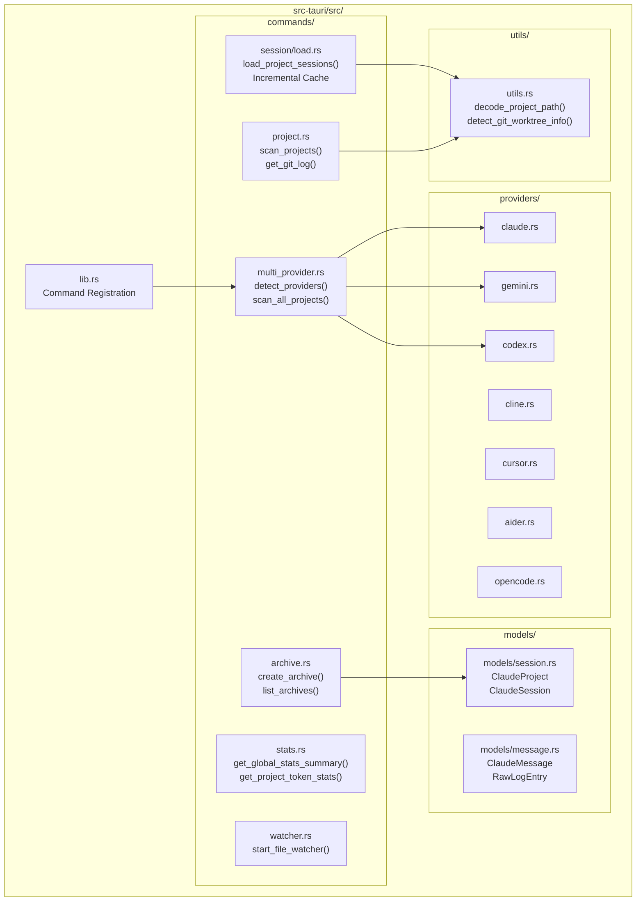
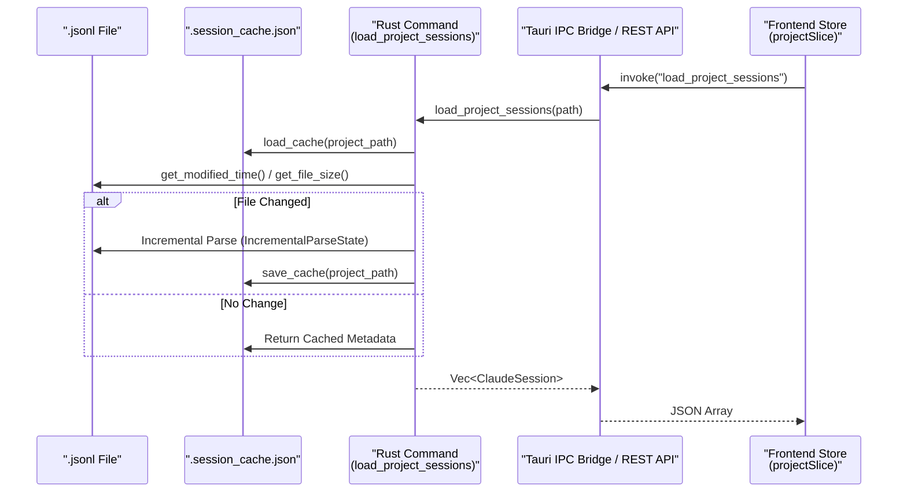

# Backend Architecture

Relevant source files

The following files were used as context for generating this wiki page:

- [src-tauri/src/commands/archive.rs](src-tauri/src/commands/archive.rs)
- [src-tauri/src/commands/mod.rs](src-tauri/src/commands/mod.rs)
- [src-tauri/src/commands/session/load.rs](src-tauri/src/commands/session/load.rs)
- [src-tauri/src/lib.rs](src-tauri/src/lib.rs)
- [src-tauri/src/main.rs](src-tauri/src/main.rs)
- [src-tauri/src/models.rs](src-tauri/src/models.rs)
- [src-tauri/src/models/session.rs](src-tauri/src/models/session.rs)
- [src-tauri/src/models/snapshot_tests.rs](src-tauri/src/models/snapshot_tests.rs)
- [src-tauri/src/models/snapshots/claude_code_history_viewer_lib__models__snapshot_tests__session_snapshots__claude_session.snap](src-tauri/src/models/snapshots/claude_code_history_viewer_lib__models__snapshot_tests__session_snapshots__claude_session.snap)
- [src/App.tsx](src/App.tsx)
- [src/components/MessageViewer.tsx](src/components/MessageViewer.tsx)
- [src/components/ProjectTree.tsx](src/components/ProjectTree.tsx)
- [src/hooks/index.ts](src/hooks/index.ts)
- [src/store/useAppStore.ts](src/store/useAppStore.ts)
- [src/test/ProjectTree.worktree.test.tsx](src/test/ProjectTree.worktree.test.tsx)
- [src/types/core/project.ts](src/types/core/project.ts)
- [src/types/core/session.ts](src/types/core/session.ts)
- [src/types/index.ts](src/types/index.ts)

The backend layer provides the Rust/Tauri foundation for file system access, multi-provider data processing, and system integration. This page documents the command module organization, the multi-provider abstraction, high-performance data processing, and key utilities.

## Overview

The backend is built on Rust and Tauri, organized into specialized command modules that expose functionality to the frontend via IPC. It features a unified provider system that abstracts differences between seven providers: **Claude Code**, **Gemini CLI**, **Codex CLI**, **Cline**, **Cursor**, **Aider**, and **OpenCode**.

**Backend System Topology**

Sources: [src-tauri/src/lib.rs:1-55](), [src-tauri/src/commands/mod.rs:1-14](), [src-tauri/src/commands/session/load.rs:1-14]()

## Command Module Organization

Commands are domain-specific modules decorated with `#[tauri::command]`. They are registered in `src-tauri/src/lib.rs` and invoked by the React frontend via the Tauri `invoke` API.

| Module | Responsibility | Key Code Entities |
| :--- | :--- | :--- |
| `multi_provider.rs` | Orchestrates cross-provider discovery and data loading. | `detect_providers`, `scan_all_projects`, `search_all_providers` |
| `project.rs` | Local filesystem project scanning and Git integration. | `scan_projects`, `get_git_log`, `detect_claude_config_dir` |
| `session/` | Heavy-duty parsing of JSONL session logs and session management. | `load_project_sessions`, `load_session_messages_paginated`, `restore_file` |
| `stats.rs` | Analytics and token usage calculation with billing/conversation modes. | `get_project_token_stats`, `get_global_stats_summary`, `get_session_comparison` |
| `archive.rs` | Management of archived sessions in `~/.claude-history-viewer/archives/`. | `create_archive`, `list_archives`, `get_archive_sessions` |
| `watcher.rs` | Real-time monitoring of session files via `notify`. | `start_file_watcher`, `stop_file_watcher` |
| `wsl.rs` | Integration with Windows Subsystem for Linux filesystems. | `detect_wsl_distros`, `is_wsl_available` |

Sources: [src-tauri/src/lib.rs:117-200](), [src-tauri/src/commands/session/load.rs:203-210](), [src-tauri/src/commands/archive.rs:1-16]()

## Multi-Provider Architecture

The backend supports a wide array of AI coding assistants by abstracting their unique data formats into a common `ClaudeProject` and `ClaudeSession` model.

### Provider Detection
The `detect_providers` command identifies available history sources on the user's machine:
*   **Claude Code**: `~/.claude/projects`.
*   **Gemini CLI**: `~/.config/gemini-cli`.
*   **Codex CLI**: `$CODEX_HOME` or `~/.codex/sessions`.
*   **Cline/Cursor/Aider**: Standard configuration and log directories for each tool.

### Unified Scanning
The `scan_all_projects` command executes parallel scans across all detected providers, normalizing the results into a unified list for the frontend `ProjectTree`.

Sources: [src-tauri/src/lib.rs:185-189](), [src/types/core/session.ts:11-18](), [src/types/core/session.ts:45-62]()

## Data Loading & Performance

The backend uses a multi-tier strategy to handle large session histories efficiently.

### 1. Incremental Metadata Caching
The `session/load.rs` module implements a `SessionMetadataCache` to avoid re-parsing massive JSONL files on every refresh.
*   **Cache Structure**: Stores `modified_time`, `file_size`, and `last_byte_offset` in `.session_cache.json` within the project folder. [src-tauri/src/commands/session/load.rs:17-54]()
*   **Incremental Updates**: If a file grows, the parser resumes from `last_byte_offset` instead of the beginning. [src-tauri/src/commands/session/load.rs:114-141]()

### 2. Fast Line Classification
Instead of full JSON deserialization for every line during a scan, the backend uses `QuickLineClassifier` to extract only essential fields like `sessionId`, `timestamp`, and `isSidechain`. [src-tauri/src/commands/session/load.rs:184-194]()

### 3. SIMD-Accelerated Parsing
Utilities in `utils.rs` leverage `memchr` for SIMD-accelerated newline detection, identifying line boundaries in memory-mapped buffers before parsing.

Sources: [src-tauri/src/commands/session/load.rs:17-56](), [src-tauri/src/commands/session/load.rs:184-194]()

## Key Utilities

### Path Decoding
Claude Code encodes project paths into directory names (e.g., `/Users/jack/project` becomes `-Users-jack-project`). The `decode_project_path` function in `utils.rs` resolves these back to real filesystem paths using:
1.  **Index Lookup**: Checking `sessions-index.json` for the `originalPath` key.
2.  **Filesystem Probing**: `decode_recursive` attempts to reconstruct the path by checking directory existence at every hyphen split.

### Git Worktree Detection
The `detect_git_worktree_info` function (called during `scan_projects`) identifies if a project is a Git worktree. It distinguishes between `main` repositories and `linked` worktrees, enabling the frontend to group them visually. [src/types/core/session.ts:24-31]()

Sources: [src-tauri/src/utils.rs:119-154](), [src-tauri/src/commands/project.rs:175-178](), [src/test/ProjectTree.worktree.test.tsx:84-106]()

## Headless Server Module

When the `webui-server` feature is enabled, the backend can run as a standalone HTTP server using the `server` module.

*   **Technology**: Built with the **Axum** web framework.
*   **Functionality**: Mirrors all Tauri IPC commands as REST API endpoints.
*   **Authentication**: Implements Bearer token authentication for secure remote access.
*   **Real-time**: Replaces Tauri's event system with **Server-Sent Events (SSE)** for file watcher updates.

Sources: [src-tauri/src/lib.rs:7-8](), [src-tauri/src/lib.rs:60-67]()

## Data Flow: Disk to Frontend

Sources: [src-tauri/src/commands/session/load.rs:64-74](), [src-tauri/src/commands/session/load.rs:77-96](), [src-tauri/src/commands/session/load.rs:114-141](), [src/store/useAppStore.ts:10-12]()
