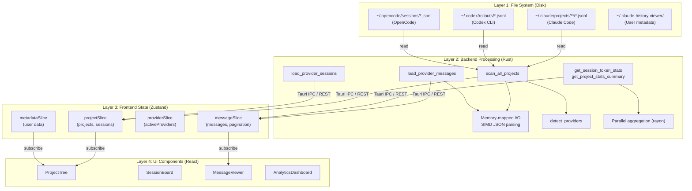
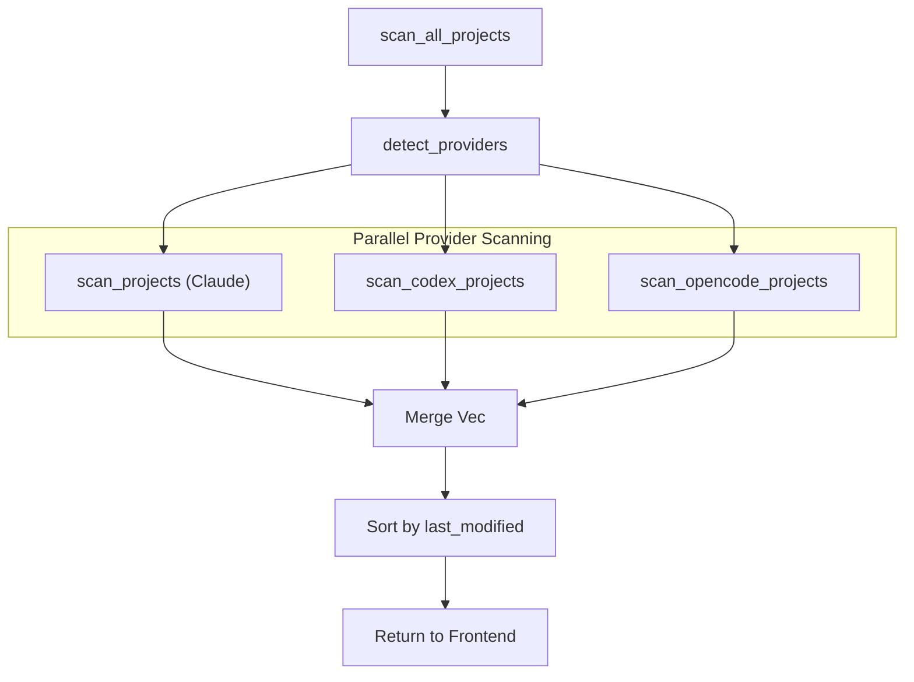

# Data Flow

<details>
<summary>Relevant source files</summary>

The following files were used as context for generating this wiki page:

- [src-tauri/src/commands/archive.rs](src-tauri/src/commands/archive.rs)
- [src-tauri/src/commands/mod.rs](src-tauri/src/commands/mod.rs)
- [src-tauri/src/commands/project.rs](src-tauri/src/commands/project.rs)
- [src-tauri/src/commands/session/load.rs](src-tauri/src/commands/session/load.rs)
- [src-tauri/src/lib.rs](src-tauri/src/lib.rs)
- [src-tauri/src/models.rs](src-tauri/src/models.rs)
- [src-tauri/src/models/session.rs](src-tauri/src/models/session.rs)
- [src-tauri/src/models/snapshot_tests.rs](src-tauri/src/models/snapshot_tests.rs)
- [src-tauri/src/models/snapshots/claude_code_history_viewer_lib__models__snapshot_tests__session_snapshots__claude_session.snap](src-tauri/src/models/snapshots/claude_code_history_viewer_lib__models__snapshot_tests__session_snapshots__claude_session.snap)
- [src/App.tsx](src/App.tsx)
- [src/components/MessageViewer.tsx](src/components/MessageViewer.tsx)
- [src/components/MessageViewer/MessageViewer.tsx](src/components/MessageViewer/MessageViewer.tsx)
- [src/components/ProjectTree.tsx](src/components/ProjectTree.tsx)
- [src/hooks/index.ts](src/hooks/index.ts)
- [src/store/slices/projectSlice.ts](src/store/slices/projectSlice.ts)
- [src/store/slices/types.ts](src/store/slices/types.ts)
- [src/store/useAppStore.ts](src/store/useAppStore.ts)
- [src/test/ProjectTree.worktree.test.tsx](src/test/ProjectTree.worktree.test.tsx)
- [src/types/core/project.ts](src/types/core/project.ts)
- [src/types/core/session.ts](src/types/core/session.ts)
- [src/types/index.ts](src/types/index.ts)

</details>


## Purpose and Scope

This document describes how data flows through the Claude Code History Viewer application, from persistent storage on disk through backend processing to frontend rendering. It covers the complete data pipeline: file system access, multi-provider backend processing with SIMD optimization, IPC communication via Tauri commands (or HTTP REST in server mode), frontend state management with Zustand, and final UI rendering.

For information about the state management architecture and store slices, see [Store Architecture](4.1). For details about backend command modules, see [Backend Systems](5). For UI component structure, see [Frontend Architecture](2.2).

---

## Overview: Three-Layer Data Flow

The application processes data through three distinct layers:



**Sources:**
- [src-tauri/src/lib.rs:112-191]()
- [src/store/useAppStore.ts:81-117]()
- [src/App.tsx:23-68]()

---

## Data Sources

### Provider Session Files

The application supports multiple providers, each with distinct file conventions and directory structures. The backend abstracts these into a unified `ClaudeProject` and `ClaudeSession` model.

| Provider | Default Directory | File Format | Path Protocol |
|----------|-------------------|-------------|---------------|
| **Claude Code** | `~/.claude/projects/` | `.jsonl` | `file://` |
| **Codex CLI** | `~/.codex/rollouts/` | `rollout-*.jsonl` | `codex://` |
| **OpenCode** | `~/.opencode/sessions/` | `.jsonl` | `opencode://` |

**Sources:**
- [src-tauri/src/commands/multi_provider.rs:30-49]()
- [src-tauri/src/commands/project.rs:64-83]()
- [src-tauri/src/commands/session/load.rs:16-45]()

### User Metadata and Configuration

User preferences, custom session names, and project visibility are managed by the `metadata` module. This data is persisted in a local JSON structure to ensure that user annotations survive provider-side file changes.

```json
{
  "version": 8,
  "sessions": {
    "session-uuid": {
      "customName": "Refactor Feature X",
      "starred": true
    }
  },
  "projects": {
    "/path/to/project": {
      "hidden": false
    }
  },
  "settings": {
    "groupingMode": "worktree",
    "activeProviders": ["claude", "gemini"]
  }
}
```

**Sources:**
- [src/types/core/project.ts:110-124]()
- [src/store/slices/metadataSlice.ts:34-36]()
- [src-tauri/src/commands/session/load.rs:48-54]()

---

## Backend Processing Pipeline

### Multi-Provider Scanning Flow

The `scan_all_projects` command orchestrates scanning across all detected providers. It uses the `WalkDir` crate for efficient filesystem traversal and applies heuristics to detect project boundaries and git worktrees.



**Sources:**
- [src-tauri/src/commands/multi_provider.rs:60-100]()
- [src-tauri/src/commands/project.rs:159-212]()
- [src/store/slices/projectSlice.ts:190-210]()

### Optimized Message Parsing

Message loading in `load_session_messages` and `load_session_messages_paginated` uses high-performance Rust primitives to handle large `.jsonl` files without blocking the UI.

1.  **Memory Mapping:** Files are accessed via `memmap2::Mmap` to avoid copying large buffers into memory [src-tauri/src/commands/session/load.rs:6-6]().
2.  **Incremental Caching:** The `SessionMetadataCache` stores byte offsets and modification times to skip re-parsing unchanged files [src-tauri/src/commands/session/load.rs:17-45]().
3.  **Parallel Aggregation:** `rayon` is used to parallelize the processing of JSON lines across CPU cores [src-tauri/src/commands/session/load.rs:7-7]().
4.  **SIMD JSON:** The backend uses `serde_json` (and `simd_json` in specific builds) to deserialize `RawLogEntry` structures [src-tauri/src/commands/session/load.rs:3-3]().

**Sources:**
- [src-tauri/src/commands/session/load.rs:1-212]()
- [src-tauri/src/commands/session/load.rs:63-74]()

---

## IPC Communication Layer

The frontend communicates with the Rust backend through a unified `api` wrapper. In the desktop app, this uses Tauri's `invoke` bridge. In server mode, this is translated to HTTP REST calls.

### Key Command Endpoints

| Command | Role | Implementation |
|---------|------|----------------|
| `scan_all_projects` | Discovers all projects across providers | `commands::multi_provider::scan_all_projects` |
| `load_provider_sessions` | Lists sessions for a specific project | `commands::multi_provider::load_provider_sessions` |
| `load_session_messages` | Parses messages from JSONL files | `commands::session::load::load_session_messages` |
| `get_project_stats_summary` | Computes token usage and costs | `commands::stats::get_project_stats_summary` |
| `start_file_watcher` | Monitors session files for live updates | `commands::watcher::start_file_watcher` |

**Sources:**
- [src-tauri/src/lib.rs:112-191]()
- [src/store/slices/projectSlice.ts:120-183]()
- [src/store/slices/messageSlice.ts:151-173]()

---

## Frontend State Management

### Zustand Store Slices

The `useAppStore` acts as the single source of truth, composed of multiple domain-specific slices that react to backend data.

*   **`projectSlice`**: Manages the hierarchy of projects and sessions. It handles the transition from raw project lists to grouped views (Worktree/Directory) [src/store/slices/projectSlice.ts:28-52]().
*   **`messageSlice`**: Stores the current conversation history. It supports paginated loading and subagent session stacks [src/store/slices/messageSlice.ts:109-148]().
*   **`searchSlice`**: Handles global and session-specific search results using a local search index [src/store/useAppStore.ts:18-20]().
*   **`metadataSlice`**: Syncs user-defined metadata (renames, hidden status) between the backend and UI [src/store/useAppStore.ts:34-36]().

**Sources:**
- [src/store/useAppStore.ts:81-117]()
- [src/store/slices/projectSlice.ts:112-117]()
- [src/store/slices/types.ts:96-194]()

---

## UI Rendering Pipeline

### Message Rendering Flow

When a session is selected, messages flow through a specialized rendering pipeline optimized for performance and rich content.

1.  **Selection**: `handleSessionSelect` in `App.tsx` triggers the loading sequence [src/App.tsx:179-199]().
2.  **Loading**: `messageSlice` calls `load_provider_messages`, which returns a `MessagePage` [src/store/slices/messageSlice.ts:151-173]().
3.  **Virtualization**: `MessageViewer` uses `useMessageVirtualization` from `@tanstack/react-virtual` to render only the visible messages in the viewport [src/components/MessageViewer/MessageViewer.tsx:25-25]().
4.  **Filtering**: The `displayMessages` memoized selector applies role and content-type filters (e.g., hiding "Thinking" blocks) before rendering [src/components/MessageViewer/MessageViewer.tsx:89-124]().
5.  **Specialized Rendering**: Individual message nodes are rendered by `ClaudeMessageNode`, which routes tool outputs to specific renderers like `FileEditItem` or `AnsiText` [src/components/MessageViewer/MessageViewer.tsx:1-17]().

**Sources:**
- [src/components/MessageViewer/MessageViewer.tsx:45-124]()
- [src/store/slices/messageSlice.ts:151-221]()
- [src/App.tsx:179-199]()

### Live Update Flow

The application supports real-time updates when session files change on disk.

1.  **Watcher**: Backend `watcher.rs` monitors the project directory [src-tauri/src/lib.rs:53-53]().
2.  **Event**: When a `.jsonl` file is modified, the backend emits a Tauri event or SSE message [src-tauri/src/lib.rs:182-183]().
3.  **Frontend Sync**: `useAppInitialization` listens for these events and triggers `refreshCurrentSession` in the `messageSlice`, which performs an incremental fetch of new messages [src/App.tsx:84-84]().

**Sources:**
- [src-tauri/src/lib.rs:182-183]()
- [src/store/slices/projectSlice.ts:41-52]()
- [src/App.tsx:81-85]()
