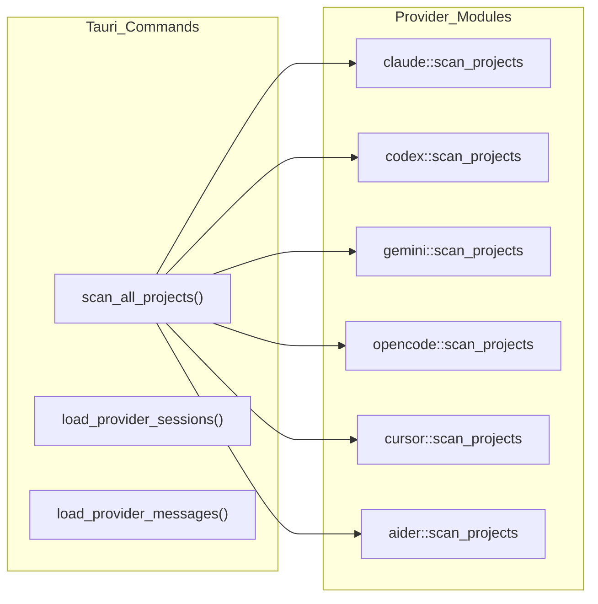
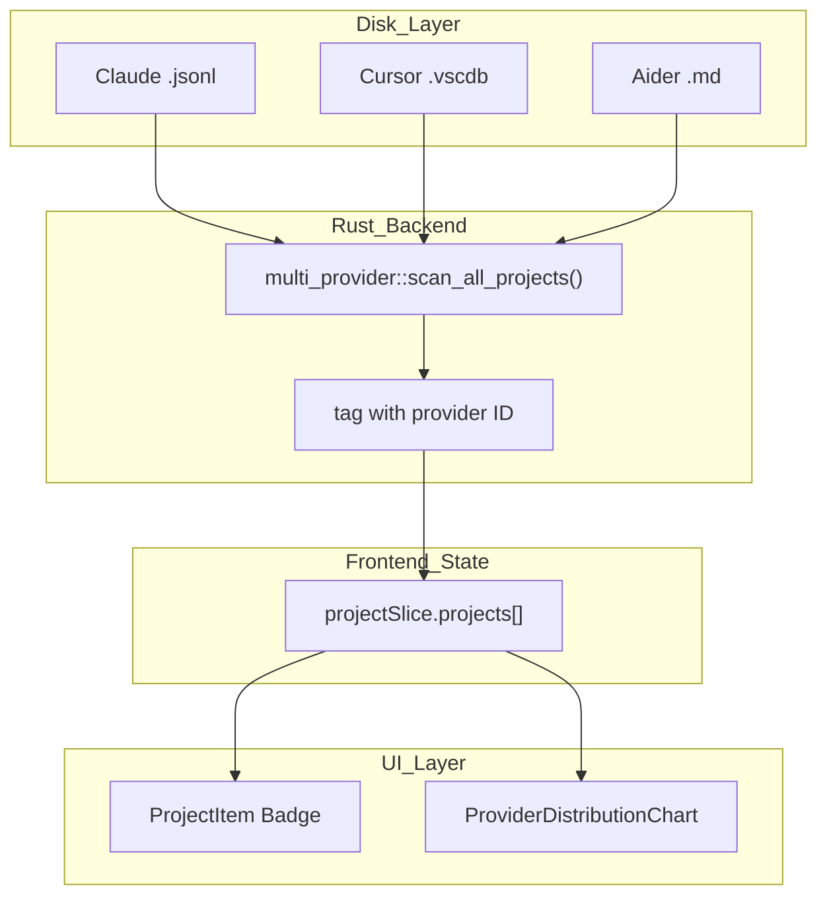

# Multi-Provider System

Relevant source files

The following files were used as context for generating this wiki page:

- [docs/superpowers/specs/2026-03-28-wsl-support-design.md](docs/superpowers/specs/2026-03-28-wsl-support-design.md)
- [src-tauri/src/commands/multi_provider.rs](src-tauri/src/commands/multi_provider.rs)
- [src-tauri/src/providers/aider.rs](src-tauri/src/providers/aider.rs)
- [src-tauri/src/providers/cline.rs](src-tauri/src/providers/cline.rs)
- [src-tauri/src/providers/codex.rs](src-tauri/src/providers/codex.rs)
- [src-tauri/src/providers/cursor.rs](src-tauri/src/providers/cursor.rs)
- [src-tauri/src/providers/gemini.rs](src-tauri/src/providers/gemini.rs)
- [src-tauri/src/providers/mod.rs](src-tauri/src/providers/mod.rs)
- [src-tauri/src/providers/opencode.rs](src-tauri/src/providers/opencode.rs)
- [src-tauri/src/utils.rs](src-tauri/src/utils.rs)
- [src/components/AnalyticsDashboard/components/ProviderDistributionChart.tsx](src/components/AnalyticsDashboard/components/ProviderDistributionChart.tsx)
- [src/components/MessageViewer/components/MessageHeader.tsx](src/components/MessageViewer/components/MessageHeader.tsx)
- [src/components/MessageViewer/helpers/agentProgressHelpers.ts](src/components/MessageViewer/helpers/agentProgressHelpers.ts)
- [src/components/SimpleUpdateManager.tsx](src/components/SimpleUpdateManager.tsx)
- [src/components/contentRenderer/toolUseRenderers/ApplyPatchToolRenderer.tsx](src/components/contentRenderer/toolUseRenderers/ApplyPatchToolRenderer.tsx)
- [src/components/contentRenderer/toolUseRenderers/TaskToolRenderer.tsx](src/components/contentRenderer/toolUseRenderers/TaskToolRenderer.tsx)
- [src/components/contentRenderer/toolUseRenderers/UpdatePlanToolRenderer.tsx](src/components/contentRenderer/toolUseRenderers/UpdatePlanToolRenderer.tsx)
- [src/test/updateSettings.test.ts](src/test/updateSettings.test.ts)
- [src/types/updateSettings.ts](src/types/updateSettings.ts)
- [src/utils/providers.ts](src/utils/providers.ts)
- [src/utils/updateSettings.ts](src/utils/updateSettings.ts)

This page describes the unified multi-provider architecture that abstracts Claude Code, Codex CLI, OpenCode, Gemini CLI, Cline, Cursor, and Aider into a single common interface. It covers provider detection, per-provider file layout conventions, project scanning, session and message loading, cross-provider search, and frontend filtering.

For backend command implementations in detail, see [Backend Systems](5) and [Project and Session Commands](5.1). For statistics that are provider-scoped, see [Statistics and Analytics](5.2).

---

## Supported Providers

Seven providers are integrated. All produce `ClaudeProject`, `ClaudeSession`, and `ClaudeMessage` records that carry an optional `provider` string tag [src-tauri/src/models/session.rs:27-66]().

| Provider | ID string | Default Base Path | Data Format |
|---|---|---|---|
| Claude Code | `"claude"` | `~/.claude` | JSONL per session |
| Codex CLI | `"codex"` | `~/.codex` | JSONL rollout files |
| OpenCode | `"opencode"` | `~/.local/share/opencode` | JSON/SQLite hybrid |
| Gemini CLI | `"gemini"` | `~/.gemini` | JSON chats |
| Cline | `"cline"` | *(Platform specific)* | JSON history |
| Cursor | `"cursor"` | *(Platform specific)* | SQLite (`state.vscdb`) |
| Aider | `"aider"` | Local project dirs | Markdown history |

Sources: [src-tauri/src/commands/multi_provider.rs:31-41](), [src-tauri/src/providers/opencode.rs:28-34](), [src-tauri/src/providers/gemini.rs:13-19](), [src-tauri/src/providers/cursor.rs:15-21](), [src-tauri/src/providers/aider.rs:28-37](), [src/utils/providers.ts:3-17]()

---

## File Layout Per Provider

Each provider stores data at a different location and in a different structure. The backend translates these into the shared Rust data model.

**Provider Storage Layouts**

```mermaid
graph TD
  subgraph "Claude_Code"
    CL_BASE["~/.claude/"]
    CL_PROJ["projects/"]
    CL_HASH["[encoded-path]/"]
    CL_JSONL["session.jsonl"]
    CL_BASE --> CL_PROJ --> CL_HASH --> CL_JSONL
  end

  subgraph "Gemini_CLI"
    GEM_BASE["~/.gemini/"]
    GEM_TMP["tmp/"]
    GEM_PROJ["[project-uuid]/"]
    GEM_CHATS["chats/*.json"]
    GEM_BASE --> GEM_TMP --> GEM_PROJ --> GEM_CHATS
  end

  subgraph "Cursor"
    CUR_BASE["Cursor/User/"]
    CUR_WS["workspaceStorage/"]
    CUR_HASH["[workspace-id]/"]
    CUR_DB["state.vscdb (SQLite)"]
    CUR_BASE --> CUR_WS --> CUR_HASH --> CUR_DB
  end

  subgraph "Aider"
    AID_ROOT["Project Root"]
    AID_HIST[".aider.chat.history.md"]
    AID_ROOT --> AID_HIST
  end
```

Sources: [src-tauri/src/providers/gemini.rs:36-63](), [src-tauri/src/providers/cursor.rs:43-68](), [src-tauri/src/providers/aider.rs:7-11](), [src-tauri/src/providers/opencode.rs:68-84]()

### Base Path Resolution

Each provider checks environment variable overrides before falling back to platform-specific defaults:

| Provider | Env Override | Default (macOS Example) |
|---|---|---|
| Claude | *(Stored Setting)* | `~/.claude` |
| Codex | `$CODEX_HOME` | `~/.codex` |
| Gemini | `$GEMINI_HOME` | `~/.gemini` |
| OpenCode | `$OPENCODE_HOME` | `~/.local/share/opencode` |
| Cursor | N/A | `~/Library/Application Support/Cursor/User` |

Sources: [src-tauri/src/providers/codex.rs:29-46](), [src-tauri/src/providers/gemini.rs:22-30](), [src-tauri/src/providers/opencode.rs:37-62](), [src-tauri/src/providers/cursor.rs:24-41]()

---

## Virtual Path Scheme

The system uses **virtual path prefixes** to distinguish provider-scoped resources and allow the backend to route requests to the correct loader.

| Provider | Project `path` field | Session `file_path` field |
|---|---|---|
| Claude | Real filesystem path | Real filesystem `.jsonl` path |
| Gemini | `gemini://{project_dir}` | Real filesystem `.json` path |
| Cursor | `cursor://{ws_path}` | `cursor://{composer_id}` |
| Aider | `aider://{project_dir}` | `aider://{history_file}#{index}` |

Sources: [src-tauri/src/providers/gemini.rs:104-105](), [src-tauri/src/providers/cursor.rs:100-101](), [src-tauri/src/providers/aider.rs:83-84](), [src-tauri/src/providers/aider.rs:137-139]()

---

## Backend Command Architecture

All multi-provider Tauri commands live in `src-tauri/src/commands/multi_provider.rs`. They act as a dispatch layer, iterating through active providers.

**Multi-Provider Command Dispatch**

Sources: [src-tauri/src/commands/multi_provider.rs:23-149](), [src-tauri/src/commands/multi_provider.rs:153-182]()

### `scan_all_projects`

Iterates over `active_providers`. It specifically handles Claude (including custom paths and WSL support) before calling into other provider modules [src-tauri/src/commands/multi_provider.rs:46-182](). It filters out empty projects (`session_count > 0`) and sorts results by `last_modified` using `parse_rfc3339_utc` for robust cross-provider sorting [src-tauri/src/commands/multi_provider.rs:185-207]().

### `load_provider_messages`

Routes loading based on the provider ID. For most providers, it invokes the respective `load_messages` function. After loading, it applies `merge_tool_execution_messages` to unify tool results with their calls [src-tauri/src/commands/multi_provider.rs:222-261]().

---

## Provider-Specific Data Formats

### Cursor SQLite Storage
Cursor stores conversation data ("composers") in a SQLite database at `workspaceStorage/{id}/state.vscdb`. The backend queries the `composerData:{id}` key from the `globalStorage` table to retrieve JSON blobs containing the conversation history [src-tauri/src/providers/cursor.rs:191-210]().

### Aider Markdown History
Aider stores history in `.aider.chat.history.md`. The backend splits this file by the `# aider chat started at` header [src-tauri/src/providers/aider.rs:7-8](). It parses the Markdown content to identify user and assistant turns, mapping them to the unified `ClaudeMessage` model [src-tauri/src/providers/aider.rs:158-187]().

### OpenCode Hybrid
OpenCode prefers reading from `opencode.db` (SQLite) but falls back to scanning JSON files in the `storage/project` and `storage/session` directories [src-tauri/src/providers/opencode.rs:81-112]().

---

## Frontend State and UI

### `providerSlice`
Manages the list of detected providers and the current active filter set. `getProviderId` ensures that unknown provider strings default to `"claude"` [src/utils/providers.ts:50-63]().

### UI Rendering
The `MessageHeader` component dynamically renders the provider label for assistant messages if the provider is not the default `"claude"` [src/components/MessageViewer/components/MessageHeader.tsx:64-68]().

The `ProviderDistributionChart` in the Analytics Dashboard uses a color mapping for each provider to visualize usage [src/components/AnalyticsDashboard/components/ProviderDistributionChart.tsx:12-20]():
- `aider`: Red
- `claude`: Amber
- `cline`: Teal
- `codex`: Green
- `cursor`: Cyan
- `gemini`: Purple
- `opencode`: Blue

Sources: [src/components/AnalyticsDashboard/components/ProviderDistributionChart.tsx:12-20](), [src/utils/providers.ts:94-102](), [src/components/MessageViewer/components/MessageHeader.tsx:64-68]()

---

## Provider Identity Flow (End-to-End)

The diagram below maps the provider tag through the full stack from disk to rendered UI.

Sources: [src-tauri/src/commands/multi_provider.rs:43-149](), [src/utils/providers.ts:75-82](), [src/components/AnalyticsDashboard/components/ProviderDistributionChart.tsx:41-64]()
