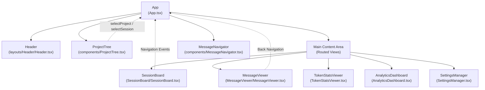
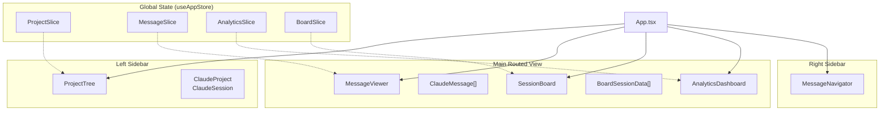

# Core Components

Relevant source files

The following files were used as context for generating this wiki page:

- [src-tauri/src/commands/mod.rs](src-tauri/src/commands/mod.rs)
- [src-tauri/src/lib.rs](src-tauri/src/lib.rs)
- [src-tauri/src/models.rs](src-tauri/src/models.rs)
- [src/App.tsx](src/App.tsx)
- [src/components/MessageViewer.tsx](src/components/MessageViewer.tsx)
- [src/components/ProjectTree.tsx](src/components/ProjectTree.tsx)
- [src/components/contentRenderer/ThinkingRenderer.tsx](src/components/contentRenderer/ThinkingRenderer.tsx)
- [src/components/contentRenderer/ToolResultCard.tsx](src/components/contentRenderer/ToolResultCard.tsx)
- [src/components/contentRenderer/toolUseRenderers/ToolUseCard.tsx](src/components/contentRenderer/toolUseRenderers/ToolUseCard.tsx)
- [src/components/renderers/RendererCard.tsx](src/components/renderers/RendererCard.tsx)
- [src/components/renderers/styles.ts](src/components/renderers/styles.ts)
- [src/hooks/index.ts](src/hooks/index.ts)
- [src/layouts/AppLayout.tsx](src/layouts/AppLayout.tsx)
- [src/shared/RendererHeader.tsx](src/shared/RendererHeader.tsx)
- [src/store/useAppStore.ts](src/store/useAppStore.ts)
- [src/test/ProjectTree.worktree.test.tsx](src/test/ProjectTree.worktree.test.tsx)
- [src/types/core/project.ts](src/types/core/project.ts)
- [src/types/index.ts](src/types/index.ts)

This page documents the main user interface components that comprise the Claude Code History Viewer application. These components provide the primary interaction surfaces for browsing projects, analyzing sessions, viewing messages, and configuring settings.

For information about state management architecture, see [State Management](#4). For backend command modules, see [Backend Systems](#5). For content rendering internals, see [Content Rendering](#6).

## Overview

The application consists of several primary UI components orchestrated by the root `App` component ([src/App.tsx:23-605]()), which handles layout, view routing, and global state coordination via `useAppStore` ([src/store/useAppStore.ts:101-117]()).

| Component | Sub-page | Purpose | Primary File |
|-----------|----------|---------|--------------|
| **Header** | [Header and Navigation](#3.7) | Navigation buttons, view switching, settings dropdown | `src/layouts/Header/Header.tsx` |
| **Project Tree** | [Project Tree](#3.1) | Project and session navigation with Git worktree grouping | `src/components/ProjectTree.tsx` |
| **Session Board** | [Session Board](#3.2) | Multi-session timeline visualization with interactive filtering | `src/components/SessionBoard/SessionBoard.tsx` |
| **Message Viewer** | [Message Viewer](#3.3) | Single session detail view with virtual scrolling | `src/components/MessageViewer.tsx` |
| **Analytics Dashboard** | [Analytics Dashboard](#3.4) | Project/global usage metrics, model and tool breakdowns | `src/components/AnalyticsDashboard.tsx` |
| **Token Stats Viewer** | [Token Stats Viewer](#3.5) | Per-session and per-project token statistics with date filtering | `src/components/TokenStatsViewer.tsx` |
| **Settings Manager** | [Settings Manager](#3.6) | Configuration UI for Claude Code settings and MCP servers | `src/components/SettingsManager.tsx` |
| **Archive Manager** | [Archive Manager](#3.8) | Browser for managed and expiring session archives | `src/components/ArchiveManager.tsx` |
| **Recent Edits Viewer** | [Recent Edits Viewer](#3.9) | File modification history and diff viewer | `src/components/RecentEditsViewer.tsx` |

Sources: [src/App.tsx:23-605](), [src/layouts/AppLayout.tsx:13-31](), [src/store/useAppStore.ts:101-117]()

## Application Layout Structure

The layout is defined in `AppLayout` ([src/layouts/AppLayout.tsx:136-230]()), which organizes the sidebar, header, and main content area.

### Visual Layout Component Hierarchy
This diagram maps UI regions to the underlying React components and their corresponding data models.

**View Routing Logic**: The main content area displays different views based on the `analytics.currentView` state ([src/App.tsx:458-556]()) and the `selectedSession` context.

Sources: [src/App.tsx:458-556](), [src/layouts/AppLayout.tsx:136-230]()

## Component Hierarchy and Props Flow

The following diagram bridges the high-level UI components with the specific TypeScript types and store slices they consume.

**State Management Pattern**: Components access global state through the `useAppStore` hook ([src/store/useAppStore.ts:101-117]()). The `App` component typically reads high-level state and passes it down to layout components like `AppLayout` ([src/layouts/AppLayout.tsx:50-134]()).

Sources: [src/App.tsx:24-68](), [src/store/useAppStore.ts:101-117](), [src/layouts/AppLayout.tsx:50-134]()

## Core Component Summaries

### Project Tree
The `ProjectTree` ([src/components/ProjectTree.tsx:3]()) manages project navigation. It supports three grouping modes: `none`, `directory`, and `worktree` ([src/types/index.ts:117]()). It filters projects based on `activeProviders` ([src/App.tsx:67]()) and allows for hiding/unhiding specific project paths via `updateProjectMetadata` ([src-tauri/src/lib.rs:28]()).
For details, see [Project Tree](#3.1).

### Session Board
The `SessionBoard` ([src/layouts/AppLayout.tsx:26]()) provides a multi-session visual analysis view. It utilizes `boardSlice` state ([src/store/useAppStore.ts:42-44]()) to manage zoom levels (Pixel/Skim/Read) and panning across a horizontal timeline of interaction cards.
For details, see [Session Board](#3.2).

### Message Viewer
The `MessageViewer` ([src/components/MessageViewer.tsx:8]()) is the primary interface for reading conversation histories. It utilizes virtual scrolling via `useMessageVirtualization` and handles complex content types like `ThinkingContent` ([src/components/contentRenderer/ThinkingRenderer.tsx]()) and `ToolUseContent` ([src/types/index.ts:62]()).
For details, see [Message Viewer](#3.3).

### Analytics Dashboard
The `AnalyticsDashboard` ([src/components/AnalyticsDashboard.tsx]()) orchestrates the display of usage statistics. It routes between `GlobalStatsView`, `ProjectStatsView`, and `SessionStatsView` based on the user's selection context, powered by the `useAnalytics` hook ([src/App.tsx:70-74]()).
For details, see [Analytics Dashboard](#3.4).

### Token Stats Viewer
The `TokenStatsViewer` ([src/components/TokenStatsViewer.tsx]()) provides detailed breakdowns of token usage, including cache hits and costs, supporting pagination and date range filtering via `get_session_token_stats` ([src-tauri/src/lib.rs:48]()).
For details, see [Token Stats Viewer](#3.5).

### Settings Manager
The `SettingsManager` ([src/components/SettingsManager.tsx]()) allows users to modify `ClaudeCodeSettings`, manage MCP server configurations, and apply `UnifiedPresets` ([src/hooks/index.ts:5]()) for environment-specific configurations.
For details, see [Settings Manager](#3.6).

### Header and Navigation
The `Header` ([src/layouts/Header/Header.tsx]()) contains the primary view-switching logic and global controls. It integrates the `MessageNavigator` ([src/layouts/AppLayout.tsx:20]()) for navigating within long message threads and a settings dropdown for theme and language selection.
For details, see [Header and Navigation](#3.7).

### Archive Manager
The `ArchiveManager` ([src/components/ArchiveManager.tsx]()) provides an interface for managing archived sessions. It interfaces with backend commands like `list_archives` and `get_archive_sessions` ([src-tauri/src/lib.rs:16-17]()) to allow users to browse historical data outside their active projects.
For details, see [Archive Manager](#3.8).

### Recent Edits Viewer
The `RecentEditsViewer` ([src/components/RecentEditsViewer.tsx]()) tracks file modifications made by AI agents across sessions. It displays diffs and allows for file restoration via the `restore_file` command ([src-tauri/src/lib.rs:43]()).
For details, see [Recent Edits Viewer](#3.9).

Sources: [src/App.tsx:23-605](), [src/layouts/AppLayout.tsx:136-230](), [src-tauri/src/lib.rs:13-55](), [src/types/index.ts:1-271]()
