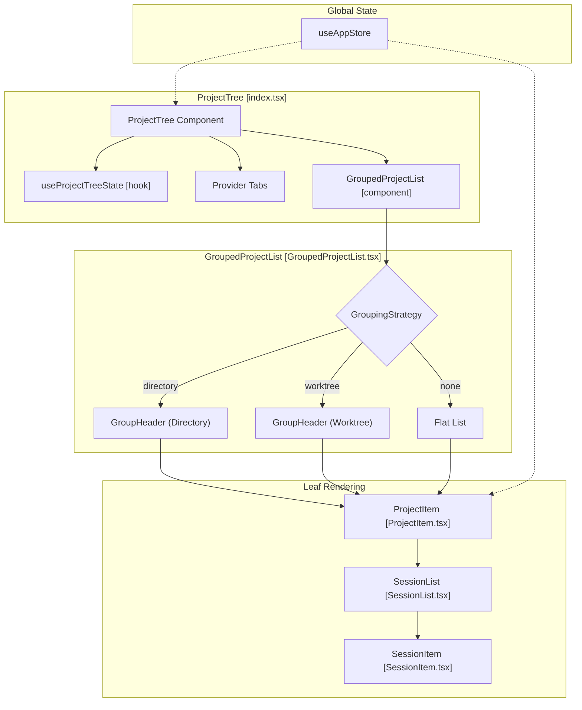
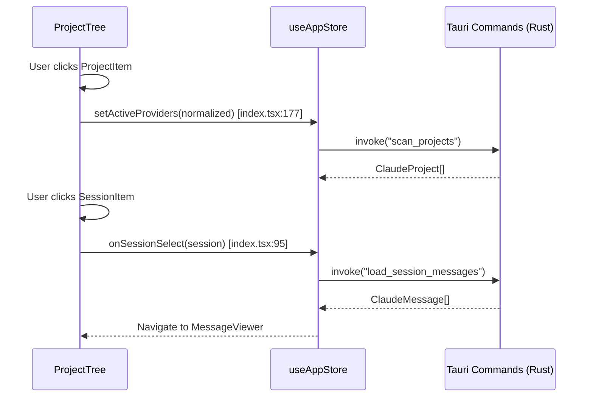

# Project Tree

Relevant source files

The following files were used as context for generating this wiki page:

- [src/components/ProjectContextMenu.tsx](src/components/ProjectContextMenu.tsx)
- [src/components/ProjectTree/components/GroupHeader.tsx](src/components/ProjectTree/components/GroupHeader.tsx)
- [src/components/ProjectTree/components/GroupedProjectList.tsx](src/components/ProjectTree/components/GroupedProjectList.tsx)
- [src/components/ProjectTree/components/ProjectItem.tsx](src/components/ProjectTree/components/ProjectItem.tsx)
- [src/components/ProjectTree/components/__tests__/GroupedProjectList.test.tsx](src/components/ProjectTree/components/__tests__/GroupedProjectList.test.tsx)
- [src/components/ProjectTree/components/__tests__/TreeSemantics.test.tsx](src/components/ProjectTree/components/__tests__/TreeSemantics.test.tsx)
- [src/components/ProjectTree/index.tsx](src/components/ProjectTree/index.tsx)
- [src/components/ProjectTree/types.ts](src/components/ProjectTree/types.ts)
- [src/contexts/modal/ModalProvider.tsx](src/contexts/modal/ModalProvider.tsx)
- [src/i18n/locales/en/common.json](src/i18n/locales/en/common.json)
- [src/i18n/locales/en/error.json](src/i18n/locales/en/error.json)
- [src/i18n/locales/ja/common.json](src/i18n/locales/ja/common.json)
- [src/i18n/locales/ja/error.json](src/i18n/locales/ja/error.json)
- [src/i18n/locales/ko/common.json](src/i18n/locales/ko/common.json)
- [src/i18n/locales/ko/error.json](src/i18n/locales/ko/error.json)
- [src/i18n/locales/zh-CN/common.json](src/i18n/locales/zh-CN/common.json)
- [src/i18n/locales/zh-CN/error.json](src/i18n/locales/zh-CN/error.json)
- [src/i18n/locales/zh-TW/common.json](src/i18n/locales/zh-TW/common.json)
- [src/i18n/locales/zh-TW/error.json](src/i18n/locales/zh-TW/error.json)
- [src/store/slices/settingsSlice.ts](src/store/slices/settingsSlice.ts)
- [src/test/App.accessibility.test.tsx](src/test/App.accessibility.test.tsx)

The **Project Tree** is the primary navigation sidebar of the Claude Code History Viewer. It provides a hierarchical interface for browsing AI coding assistant histories across seven supported providers, allowing users to filter, group, and select specific projects and sessions.

For details on the individual session entries within the tree, see [Session Item](#3.1.1).

## Purpose and Functionality

The Project Tree acts as the central command hub for data navigation, enabling users to:
1. **Filter by Provider**: Toggle visibility of projects based on the AI tool that generated them (Claude Code, Gemini CLI, Codex CLI, Cline, Cursor, Aider, OpenCode) [src/components/ProjectTree/index.tsx:101-118]().
2. **Organize Projects**: Switch between flat, directory-based, or git-worktree-based grouping modes [src/components/ProjectTree/components/GroupedProjectList.tsx:109-183]().
3. **Manage Selection**: Orchestrate the flow from project selection to session loading and final message display [src/components/ProjectTree/index.tsx:93-99]().
4. **Access Global Search**: Launch the cross-project message search modal via the `ModalContext` [src/contexts/modal/ModalProvider.tsx:41-47]().

## Component Architecture

The `ProjectTree` component is a complex container that manages provider filtering and layout state, delegating the rendering of the actual list to `GroupedProjectList`. It utilizes `useProjectTreeState` to track expansion states and context menu positioning.

### System Interaction Diagram

Sources: [src/components/ProjectTree/index.tsx:42-68](), [src/components/ProjectTree/components/GroupedProjectList.tsx:33-52](), [src/components/ProjectTree/components/ProjectItem.tsx:10-20]()

## Grouping Modes

The tree supports three `GroupingStrategy` modes to handle large numbers of repositories:

| Mode | Logic | Visual Indicator |
| :--- | :--- | :--- |
| **None** | A flat list of all detected projects. | Standard folder icon [src/components/ProjectTree/components/ProjectItem.tsx:120]() |
| **Directory** | Groups projects by their parent directory path. | `FolderTree` icon [src/components/ProjectTree/components/GroupedProjectList.tsx:122]() |
| **Worktree** | Detects Git worktrees and groups children under a "Main" project. | `GitBranch` icon [src/components/ProjectTree/components/GroupedProjectList.tsx:160]() |

Sources: [src/components/ProjectTree/components/GroupedProjectList.tsx:109-183](), [src/components/ProjectTree/components/ProjectItem.tsx:93-112]()

## Selection and Loading Flow

Selecting a project or session triggers a sequence of state updates in the `useAppStore` (Zustand) and backend IPC calls.

Sources: [src/components/ProjectTree/index.tsx:156-206](), [src/components/ProjectTree/index.tsx:93-99]()

## Project Context Menu

The `ProjectContextMenu` provides administrative actions for specific projects, including path copying and visibility management.

- **Copy Path**: Copies the `actual_path` of the project to the system clipboard [src/components/ProjectContextMenu.tsx:73-88]().
- **Hide/Unhide**: Toggles the project's visibility in the tree. Hidden projects are managed via the `onHide` and `onUnhide` callbacks [src/components/ProjectContextMenu.tsx:90-97]().
- **Positioning**: The menu automatically adjusts its `x` and `y` coordinates to ensure it remains within the viewport [src/components/ProjectContextMenu.tsx:53-71]().

Sources: [src/components/ProjectContextMenu.tsx:9-25](), [src/components/ProjectContextMenu.tsx:105-153]()

## Keyboard Navigation

The tree implements robust keyboard support for accessibility and power-user workflows:
- **Arrow Keys**: `ArrowRight` expands a project node, while `ArrowLeft` collapses it [src/components/ProjectTree/components/ProjectItem.tsx:53-61]().
- **Type-ahead**: Users can focus projects by typing the first few letters of their name, handled by `findTypeaheadMatchIndex` [src/components/ProjectTree/index.tsx:28-31]().
- **Announcements**: Utilizes `buildTreeItemAnnouncement` to provide screen reader feedback during navigation [src/components/ProjectTree/index.tsx:27-31]().

Sources: [src/components/ProjectTree/index.tsx:25-31](), [src/components/ProjectTree/components/ProjectItem.tsx:53-61]()

***

### Child Pages
- [Session Item](#3.1.1) — Detailed documentation on individual session rendering, context menus, and the native renaming flow.
