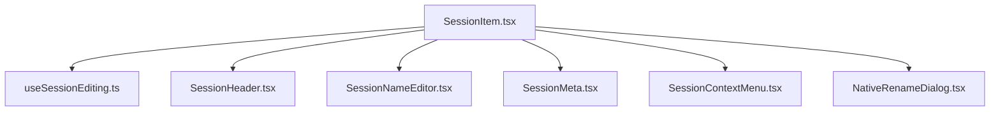
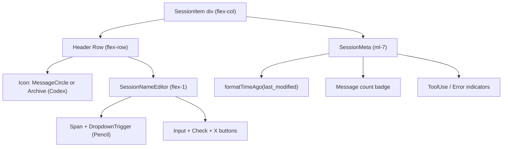
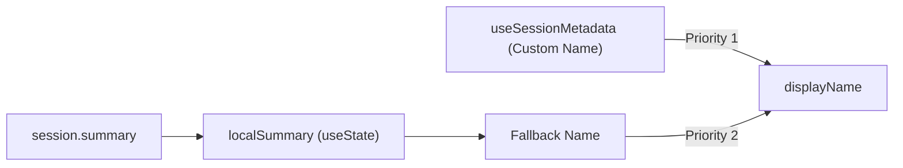
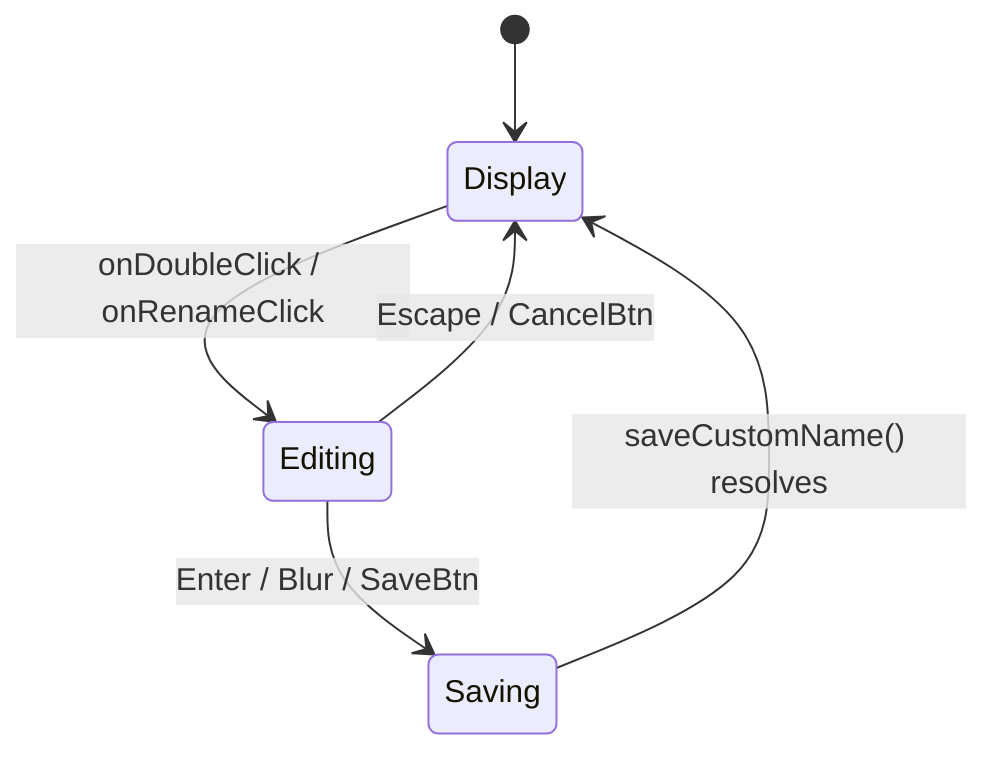
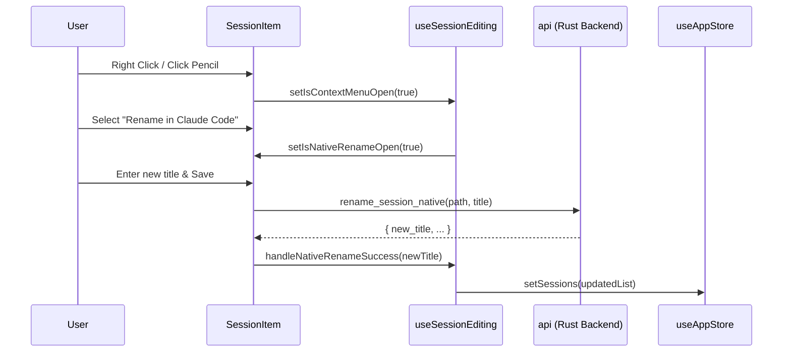

# Session Item

Relevant source files

The following files were used as context for generating this wiki page:

- [.spec-placeholder](.spec-placeholder)
- [docs/BRUSHING_SPEC.md](docs/BRUSHING_SPEC.md)
- [docs/specs/issue-80-session-sorting-search.md](docs/specs/issue-80-session-sorting-search.md)
- [src-tauri/src/commands/session/rename.rs](src-tauri/src/commands/session/rename.rs)
- [src/components/NativeRenameDialog.tsx](src/components/NativeRenameDialog.tsx)
- [src/components/ProjectTree/components/SessionList.tsx](src/components/ProjectTree/components/SessionList.tsx)
- [src/components/ProjectTree/components/__tests__/SessionList.test.tsx](src/components/ProjectTree/components/__tests__/SessionList.test.tsx)
- [src/components/SessionItem.tsx](src/components/SessionItem.tsx)
- [src/components/SessionItem/SessionItem.tsx](src/components/SessionItem/SessionItem.tsx)
- [src/components/SessionItem/components/SessionContextMenu.tsx](src/components/SessionItem/components/SessionContextMenu.tsx)
- [src/components/SessionItem/components/SessionMeta.tsx](src/components/SessionItem/components/SessionMeta.tsx)
- [src/components/SessionItem/components/SessionNameEditor.tsx](src/components/SessionItem/components/SessionNameEditor.tsx)
- [src/components/SessionItem/hooks/useSessionEditing.ts](src/components/SessionItem/hooks/useSessionEditing.ts)
- [src/components/SessionItem/types.ts](src/components/SessionItem/types.ts)
- [src/components/renderers/index.ts](src/components/renderers/index.ts)
- [src/components/renderers/types.ts](src/components/renderers/types.ts)
- [src/hooks/useNativeRename.ts](src/hooks/useNativeRename.ts)
- [src/i18n/locales/en/session.json](src/i18n/locales/en/session.json)
- [src/i18n/locales/ja/session.json](src/i18n/locales/ja/session.json)
- [src/i18n/locales/ko/session.json](src/i18n/locales/ko/session.json)
- [src/i18n/locales/zh-CN/session.json](src/i18n/locales/zh-CN/session.json)
- [src/i18n/locales/zh-TW/session.json](src/i18n/locales/zh-TW/session.json)
- [src/test/SessionItem.test.tsx](src/test/SessionItem.test.tsx)
- [src/types/metadata.types.ts](src/types/metadata.types.ts)
- [src/utils/brushMatchers.ts](src/utils/brushMatchers.ts)
- [src/utils/toolIconUtils.ts](src/utils/toolIconUtils.ts)

This page documents the `SessionItem` component: how it renders a single session entry in the project tree sidebar, the two renaming systems it exposes (inline custom rename and native file rename), and its context-menu clipboard actions.

---

## Overview

`SessionItem` ([src/components/SessionItem/SessionItem.tsx:11-17]()) is a self-contained card rendered once per session inside a project's expanded session list. It is responsible for:

- Displaying session metadata (display name, last-modified time, message count, tool-use and error indicators).
- Providing an inline rename flow that stores a custom name in app-level metadata.
- Providing a native rename flow that edits the underlying session file, visible to the CLI.
- Offering a context-menu with clipboard actions (copy session ID, copy resume command, copy file path).

---

## Props

| Prop | Type | Description |
|---|---|---|
| `session` | `ClaudeSession` | The session object to render |
| `isSelected` | `boolean` | Whether this item is the currently active session |
| `onSelect` | `() => void` | Called when the user clicks to select this session |
| `onHover` | `() => void` (optional) | Called on `mouseEnter` (skipped when editing) |
| `formatTimeAgo` | `(date: string) => string` | Injected from `ProjectTree` to format `last_modified` |

Sources: [src/components/SessionItem/types.ts:7-13](), [src/components/ProjectTree/components/SessionList.tsx:43-49]()

---

## Component Architecture

The `SessionItem` implementation is modularized into specialized sub-components and a dedicated hook for state management.

**Session Item — Component Hierarchy**

Sources: [src/components/SessionItem/SessionItem.tsx:4-8](), [src/components/SessionItem/SessionItem.tsx:107-134]()

**Session Item — Visual Layout**

Sources: [src/components/SessionItem/SessionItem.tsx:60-104](), [src/components/SessionItem/components/SessionNameEditor.tsx:61-165]()

---

## Display Name Resolution

The component uses `useSessionEditing` ([src/components/SessionItem/hooks/useSessionEditing.ts:39]()) which leverages metadata hooks to resolve names:

- `useSessionDisplayName(session_id, localSummary)` — prefers a stored custom name over the `localSummary` fallback ([src/components/SessionItem/hooks/useSessionEditing.ts:60]()).
- `useSessionMetadata(session_id)` — manages `customName` and `hasClaudeCodeName` persistence ([src/components/SessionItem/hooks/useSessionEditing.ts:61-66]()).

`localSummary` is a component-local copy of `session.summary` kept in sync via `useEffect` ([src/components/SessionItem/hooks/useSessionEditing.ts:56-58]()).

**Name Resolution Logic**

Sources: [src/components/SessionItem/hooks/useSessionEditing.ts:56-71](), [src/test/SessionItem.test.tsx:27-30]()

---

## Renaming Systems

### 1. Inline Custom Rename
Stores a "nickname" in the application's local metadata database without modifying the provider's source files. Activated by double-click or the context menu.

**Inline Rename State Machine**

Sources: [src/components/SessionItem/hooks/useSessionEditing.ts:73-97](), [src/components/SessionItem/components/SessionNameEditor.tsx:126-191]()

### 2. Native Rename
Directly modifies the underlying source file for supported providers (`claude`, `opencode`). This change is visible to the CLI tools.

- **Claude**: Modifies the first user message in the `.jsonl` file to include a title prefix `[Title] original message...` ([src-tauri/src/commands/session/rename.rs:128-152]()).
- **OpenCode**: Updates the session title in the storage metadata.

Sources: [src/components/SessionItem/hooks/useSessionEditing.ts:50](), [src/components/NativeRenameDialog.tsx:63-65](), [src-tauri/src/commands/session/rename.rs:94-110]()

---

## Context Menu and Clipboard

A context menu is available via a hover-trigger (Pencil icon) or right-click.

| Action | Text Copied | Provider Availability |
|---|---|---|
| **Copy Session ID** | `session.actual_session_id` | All |
| **Copy Resume Command** | `claude --resume [id]` | `claude` only |
| **Copy File Path** | `session.file_path` | All |
| **Reveal in Finder** | N/A (Opens folder) | All (Absolute paths only) |
| **Delete Session** | N/A (Moves to Trash) | All (Absolute paths only) |

Sources: [src/components/SessionItem/hooks/useSessionEditing.ts:170-225](), [src/components/SessionItem/components/SessionContextMenu.tsx:37-122]()

---

## Provider-Specific Indicators

`SessionItem` renders specific badges and icons based on the session provider and state.

- **Codex Archive**: If a Codex session is located in `archived_sessions`, an `Archive` icon is shown instead of the message bubble ([src/components/SessionItem/hooks/useSessionEditing.ts:51-53]()).
- **CLI Sync Badge**: For Claude sessions, a `CLI` badge is shown if a native rename title is detected in the summary ([src/components/SessionItem/hooks/useSessionEditing.ts:68-70]()).
- **Storage Type**: Displays `JSON` or `SQLite` badges in metadata based on the file format ([src/components/SessionItem/components/SessionMeta.tsx:38-49]()).

**Provider Feature Matrix**

| Feature | Claude | Codex | OpenCode | Others |
|---|---|---|---|---|
| Native Rename | ✓ | ✗ | ✓ | ✗ |
| Resume Command | ✓ | ✗ | ✗ | ✗ |
| Archive Icon | ✗ | ✓ | ✗ | ✗ |
| CLI Sync Badge | ✓ | ✗ | ✗ | ✗ |

Sources: [src/components/SessionItem/hooks/useSessionEditing.ts:49-53](), [src/components/SessionItem/components/SessionNameEditor.tsx:129-160](), [src/components/SessionItem/components/SessionMeta.tsx:38-49]()

---

## Interaction Flow

Sources: [src/components/SessionItem/SessionItem.tsx:107-133](), [src/components/SessionItem/hooks/useSessionEditing.ts:257-285](), [src-tauri/src/commands/session/rename.rs:94-110]()
