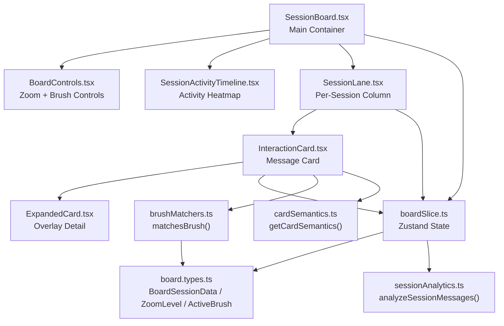
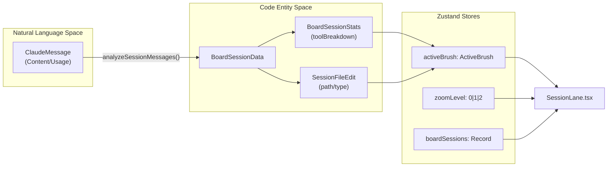

# Session Board

Relevant source files

The following files were used as context for generating this wiki page:

- [src/components/AnalyticsDashboard/components/DailyTrendChart.tsx](src/components/AnalyticsDashboard/components/DailyTrendChart.tsx)
- [src/components/AnalyticsDashboard/components/TokenDistributionChart.tsx](src/components/AnalyticsDashboard/components/TokenDistributionChart.tsx)
- [src/components/SessionBoard/BoardControls.tsx](src/components/SessionBoard/BoardControls.tsx)
- [src/components/SessionBoard/ContributionGrid.tsx](src/components/SessionBoard/ContributionGrid.tsx)
- [src/components/SessionBoard/InteractionCard.tsx](src/components/SessionBoard/InteractionCard.tsx)
- [src/components/SessionBoard/SessionActivityTimeline.tsx](src/components/SessionBoard/SessionActivityTimeline.tsx)
- [src/components/SessionBoard/SessionBoard.tsx](src/components/SessionBoard/SessionBoard.tsx)
- [src/components/SessionBoard/SessionLane.tsx](src/components/SessionBoard/SessionLane.tsx)
- [src/components/SessionBoard/useActivityData.ts](src/components/SessionBoard/useActivityData.ts)
- [src/components/SmartJsonDisplay.tsx](src/components/SmartJsonDisplay.tsx)
- [src/components/ToolIcon.tsx](src/components/ToolIcon.tsx)
- [src/components/ui/chart-tooltip.tsx](src/components/ui/chart-tooltip.tsx)
- [src/store/slices/boardSlice.ts](src/store/slices/boardSlice.ts)
- [src/test/useActivityData.test.ts](src/test/useActivityData.test.ts)
- [src/types/board.types.ts](src/types/board.types.ts)
- [src/utils/sessionAnalytics.ts](src/utils/sessionAnalytics.ts)
- [src/utils/toolSummaries.ts](src/utils/toolSummaries.ts)

The Session Board is a multi-session timeline visualization that provides simultaneous analysis of dozens to hundreds of Claude sessions. It implements three zoom levels (Pixel, Skim, Read) for overview-to-detail navigation and an interactive brushing system for cross-session pattern recognition. This component addresses the core use case of understanding tool usage patterns, error clusters, and file edit workflows across an entire project's conversation history.

For single-session message detail viewing, see page 3.3. For session-level statistics aggregation, see page 3.4. Interaction card rendering and lane virtualization details are in page 3.2.1; the activity timeline heatmap is documented in page 3.2.2.

---

## Purpose and Scope

The Session Board serves as the primary interface for:

- **Cross-Session Analysis**: Viewing 50-200+ sessions simultaneously in a horizontal timeline layout.
- **Pattern Recognition**: Identifying which sessions touched specific files, tools, or encountered errors through visual brushing.
- **Zoom-Based Navigation**: Switching between pixel heatmaps (token density), skim cards (tool summaries), and read cards (full content).
- **Performance at Scale**: Handling 10,000+ messages across sessions using double virtualization (horizontal columns + vertical rows).

This component implements the overview-zoom-filter paradigm for attribute-based brushing in columnar visualizations.

---

## Component Architecture

The Session Board bridges the **Natural Language Space** (summaries and message content) with the **Code Entity Space** (files, shell commands, and git commits) by analyzing tool usage blocks.

### Component Hierarchy

> `BoardControls` and `SessionActivityTimeline` are purely props-driven and do not access the Zustand store directly; all state is passed down from `SessionBoard`.

**Sources**: [src/components/SessionBoard/SessionBoard.tsx:1-41](), [src/components/SessionBoard/SessionLane.tsx:41-53](), [src/components/SessionBoard/InteractionCard.tsx:75-88](), [src/store/slices/boardSlice.ts:18-41]()

---

## Data Flow and State Management

The board state is managed by `boardSlice.ts`, which coordinates how raw `ClaudeMessage` data is transformed into `BoardSessionData` via `analyzeSessionMessages`.

### State Interaction Diagram

| State Field | Type | Purpose |
|-------------|------|---------|
| `boardSessions` | `Record<string, BoardSessionData>` | Full session data keyed by session ID [src/store/slices/boardSlice.ts:19](). |
| `allSortedSessionIds` | `string[]` | All session IDs sorted by relevance then recency [src/store/slices/boardSlice.ts:21](). |
| `visibleSessionIds` | `string[]` | Currently visible session IDs after date filtering [src/store/slices/boardSlice.ts:20](). |
| `zoomLevel` | `0 \| 1 \| 2` | Current zoom level (Pixel/Skim/Read) [src/types/board.types.ts:45](). |
| `activeBrush` | `ActiveBrush \| null` | Active filter by tool/file/status [src/types/board.types.ts:57](). |
| `stickyBrush` | `boolean` | Whether brush persists after mouse leave [src/store/slices/boardSlice.ts:25](). |
| `selectedMessageId` | `string \| null` | Expanded card UUID [src/store/slices/boardSlice.ts:26](). |
| `dateFilter` | `DateFilter` | Start/end date range filter [src/types/board.types.ts:47](). |

**Sources**: [src/store/slices/boardSlice.ts:18-30](), [src/types/board.types.ts:36-50](), [src/components/SessionBoard/SessionBoard.tsx:21-40]()

---

## Zoom Levels

The board provides three distinct zoom levels, each optimized for different analysis tasks:

### Zoom Level 0: Pixel View
Renders sessions as vertical heatmaps with pixel-height cards. 
- **Heuristic**: Each card's height is proportional to token count (min 4px, max 20px) [src/components/SessionBoard/SessionLane.tsx:172]().
- **Visuals**: Color represents tool variant category using heatmap CSS variables (`--heatmap-empty`, `--heatmap-low`, etc.) [src/components/SessionBoard/ContributionGrid.tsx:26-32]().

### Zoom Level 1: Skim View
Displays compact cards with tool names, icons, and content previews.
- **Grouping Logic**: Sequential tool events or text-to-tool sequences are merged into single blocks with sibling indicators [src/components/SessionBoard/SessionLane.tsx:93-102]().
- **Content**: Shows a natural language summary via `getNaturalLanguageSummary` [src/components/SessionBoard/InteractionCard.tsx:18]().

### Zoom Level 2: Read View
Full-detail cards showing complete message content and execution metadata.
- **Details**: Displays `exitCode` [src/components/SessionBoard/InteractionCard.tsx:59](), `FileEditDisplay` [src/components/SessionBoard/InteractionCard.tsx:38](), and `verifiedCommit` links [src/components/SessionBoard/InteractionCard.tsx:120]().

**Sources**: [src/types/board.types.ts:45](), [src/components/SessionBoard/SessionLane.tsx:152-198](), [src/components/SessionBoard/InteractionCard.tsx:23-36]()

---

## Session Lane Structure

Each `SessionLane` component represents one session as a vertical column. 

### Lane Header and Analytics
- **Match Ratio**: When a brush is active, the header shows the ratio of matching messages to total messages [src/components/SessionBoard/SessionLane.tsx:118-141]().
- **Activity Metrics**: Summarizes `fileEditCount`, `shellCount`, and `gitToolCount` using icons from `lucide-react` [src/components/SessionBoard/SessionLane.tsx:6-14]().
- **Session Depth**: Categorized as `deep` (if messages > 15 or toolCount > 5) or `shallow` [src/store/slices/boardSlice.ts:96-103]().

**Sources**: [src/components/SessionBoard/SessionLane.tsx:41-53](), [src/types/board.types.ts:36-43](), [src/store/slices/boardSlice.ts:96-103]()

---

## Double Virtualization

The board uses two levels of virtualization to handle large datasets efficiently:

1.  **Horizontal Virtualization (Columns)**: Managed by `useVirtualizer` in `SessionBoard.tsx` for rendering session lanes [src/components/SessionBoard/SessionBoard.tsx:2]().
2.  **Vertical Virtualization (Rows per Lane)**: Managed by `rowVirtualizer` in `SessionLane.tsx` for rendering interaction cards [src/components/SessionBoard/SessionLane.tsx:143]().

**Sources**: [src/components/SessionBoard/SessionBoard.tsx:2](), [src/components/SessionBoard/SessionLane.tsx:143-198]()

---

## Brushing System

Brushing provides interactive cross-session filtering by highlighting cards that match a selected attribute.

### Brush Types and Matching
Brushes can be based on `model`, `status`, `tool`, `file`, `hook`, `command`, or `mcp` [src/types/board.types.ts:57-60](). The `getCardSemantics` utility determines if a specific message matches the active brush [src/components/SessionBoard/InteractionCard.tsx:108-110]().

### Sticky Brushing
Brushes can be "sticky," meaning they persist even when the mouse leaves the trigger area [src/store/slices/boardSlice.ts:25](). Pressing the `Escape` key clears all active and sticky brushes [src/components/SessionBoard/SessionBoard.tsx:43-52]().

**Sources**: [src/types/board.types.ts:57-60](), [src/components/SessionBoard/SessionBoard.tsx:43-52](), [src/store/slices/boardSlice.ts:35-36]()

---

## Board Controls

The `BoardControls` component provides the toolbar for zoom and brush controls [src/components/SessionBoard/BoardControls.tsx:39]().

- **Zoom Controls**: Toggle between `Layout` (Pixel), `Layers` (Skim), and `Eye` (Read) icons [src/components/SessionBoard/BoardControls.tsx:64-100]().
- **Brush Dropdowns**: Populates options for `tool`, `mcp`, and `command` (top 10 by frecency) [src/components/SessionBoard/BoardControls.tsx:103-200]().
- **Date Filtering**: Integrated `DatePickerHeader` for filtering sessions by time range [src/components/SessionBoard/BoardControls.tsx:11]().

**Sources**: [src/components/SessionBoard/BoardControls.tsx:39-55](), [src/components/SessionBoard/SessionBoard.tsx:79-168]()

---

## Activity Timeline

The `SessionActivityTimeline` provides a high-level heatmap of project activity. For details, see [Activity Timeline](#3.2.2).

- **Contribution Grid**: An SVG-based bar chart showing session frequency and token intensity per day [src/components/SessionBoard/ContributionGrid.tsx:79-132]().
- **Streak Tracking**: Uses `useActivityData` to calculate `currentStreak` and `longestStreak` [src/components/SessionBoard/useActivityData.ts:95-147]().
- **Date Selection**: Clicking a bar in the grid triggers `setDateFilter`, which updates `visibleSessionIds` [src/components/SessionBoard/SessionActivityTimeline.tsx:41-51]().

**Sources**: [src/components/SessionBoard/SessionActivityTimeline.tsx:19-28](), [src/components/SessionBoard/ContributionGrid.tsx:9-13](), [src/components/SessionBoard/useActivityData.ts:149-153]()

---

## Data Pipeline: `loadBoardSessions`

The board data is prepared through a pipeline that includes git log retrieval and session analytics:

1.  **Git Correlation**: Fetches git logs for the project via `get_git_log` to correlate messages with actual commits [src/store/slices/boardSlice.ts:128-131]().
2.  **Session Analytics**: Executes `analyzeSessionMessages` to derive metrics like `errorCount`, `fileEditCount`, and `toolBreakdown` [src/store/slices/boardSlice.ts:153-178]().
3.  **Relevance Scoring**: Uses `getSessionRelevance` to determine session display priority based on tool use, errors, and documentation work [src/store/slices/boardSlice.ts:69-94]().

**Sources**: [src/store/slices/boardSlice.ts:114-180](), [src/utils/sessionAnalytics.ts:23-39]()
