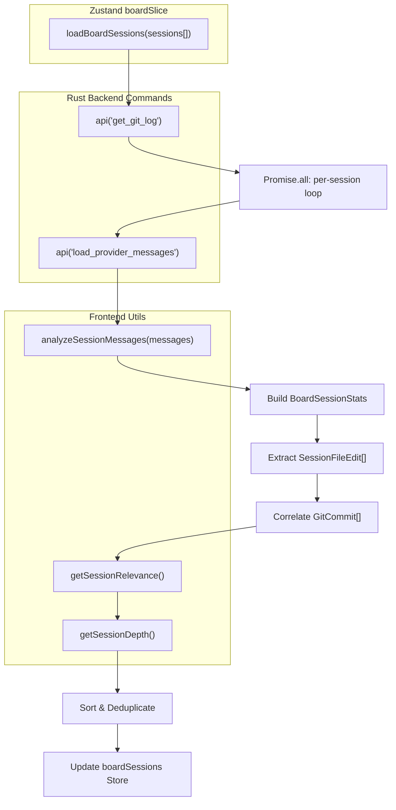
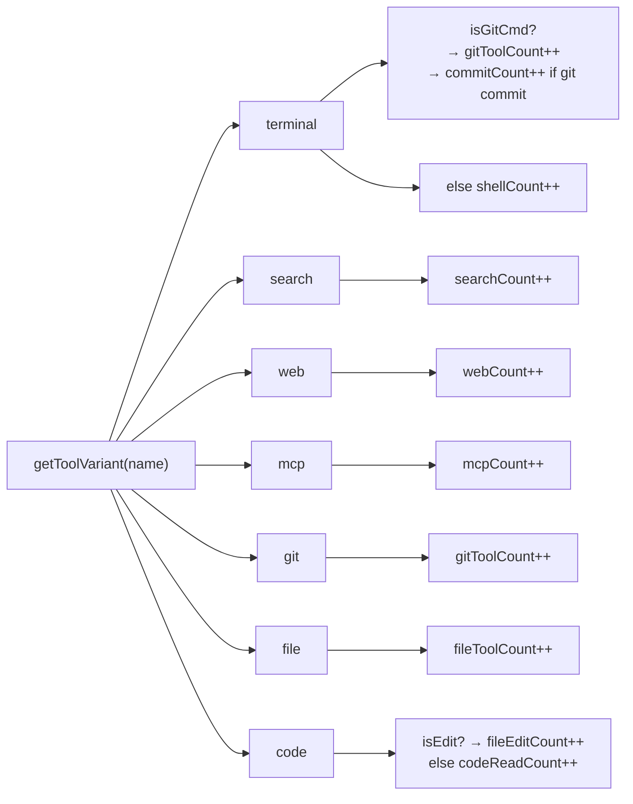
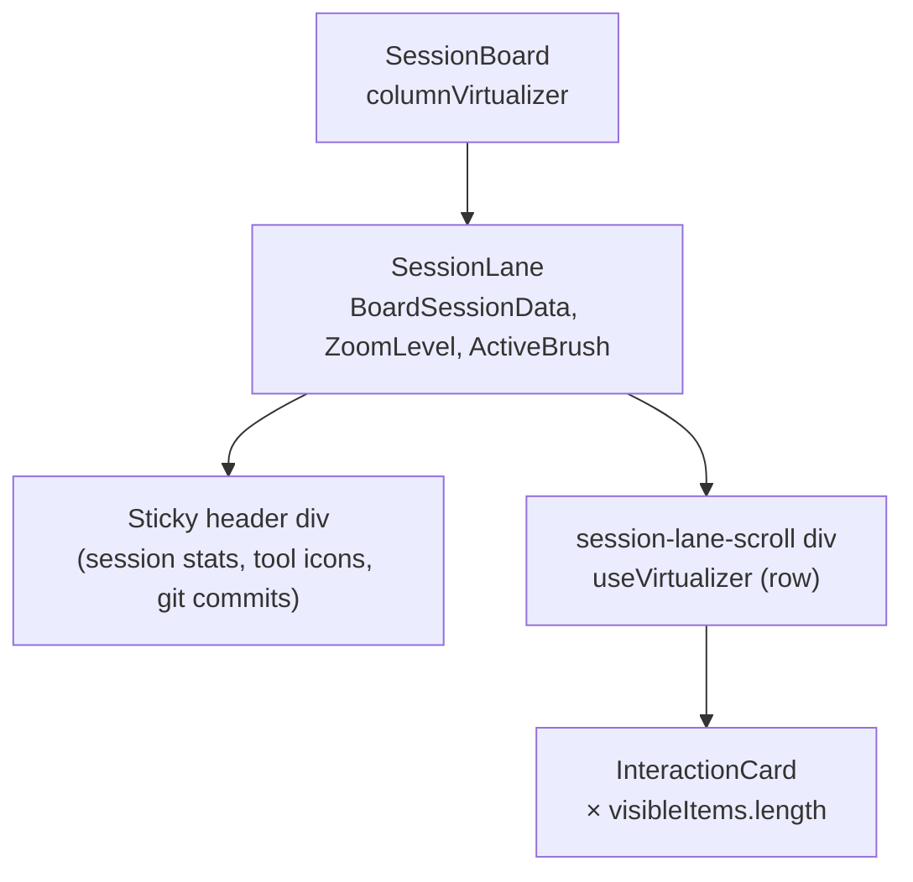
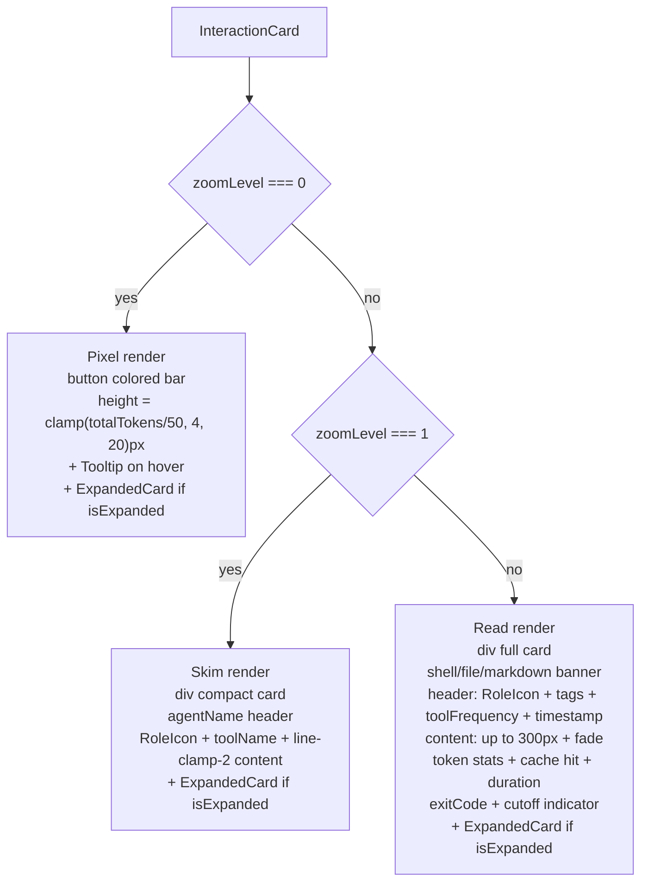

# Interaction Cards and Lanes

Relevant source files

The following files were used as context for generating this wiki page:

- [docs/BRUSHING_SPEC.md](docs/BRUSHING_SPEC.md)
- [src/components/SessionBoard/BoardControls.tsx](src/components/SessionBoard/BoardControls.tsx)
- [src/components/SessionBoard/InteractionCard.tsx](src/components/SessionBoard/InteractionCard.tsx)
- [src/components/SessionBoard/SessionBoard.tsx](src/components/SessionBoard/SessionBoard.tsx)
- [src/components/SessionBoard/SessionLane.tsx](src/components/SessionBoard/SessionLane.tsx)
- [src/components/SessionItem.tsx](src/components/SessionItem.tsx)
- [src/components/SmartJsonDisplay.tsx](src/components/SmartJsonDisplay.tsx)
- [src/components/ToolIcon.tsx](src/components/ToolIcon.tsx)
- [src/components/renderers/index.ts](src/components/renderers/index.ts)
- [src/components/renderers/types.ts](src/components/renderers/types.ts)
- [src/store/slices/boardSlice.ts](src/store/slices/boardSlice.ts)
- [src/test/SessionItem.test.tsx](src/test/SessionItem.test.tsx)
- [src/types/board.types.ts](src/types/board.types.ts)
- [src/utils/brushMatchers.ts](src/utils/brushMatchers.ts)
- [src/utils/sessionAnalytics.ts](src/utils/sessionAnalytics.ts)
- [src/utils/toolIconUtils.ts](src/utils/toolIconUtils.ts)
- [src/utils/toolSummaries.ts](src/utils/toolSummaries.ts)

This page documents the `InteractionCard` and `SessionLane` components — the two building blocks that render individual AI messages and per-session columns in the Session Board view. It covers their three zoom levels, the message grouping and row virtualization strategy, and the `loadBoardSessions` data pipeline that populates the board.

For broader context on the `SessionBoard` container that hosts lanes (column virtualization, panning, brushing controls, and the timeline), see [Section 3.2](). For details on the brushing system and the `matchesBrush` predicate, see [Section 6.2]().

---

## Data Model

The board operates on `BoardSessionData`, a composite type defined in `src/types/board.types.ts`.

**`BoardSessionData` shape:**

| Field | Type | Description |
|---|---|---|
| `session` | `ClaudeSession` | Session metadata (id, timestamps, path, provider) |
| `messages` | `ClaudeMessage[]` | Full message list loaded from JSONL |
| `stats` | `BoardSessionStats` | Aggregated analytics for header display |
| `fileEdits` | `SessionFileEdit[]` | Extracted file mutation events for the timeline |
| `gitCommits` | `GitCommit[]` | Real git commits correlated to this session's time window |
| `depth` | `SessionDepth` | `"deep"` or `"shallow"`, controls lane width |

**`BoardSessionStats` fields** [[src/types/board.types.ts:3-25]]():

| Stat field | Meaning |
|---|---|
| `totalTokens`, `inputTokens`, `outputTokens` | Token budget for the session |
| `errorCount` | Messages with error signals |
| `durationMs` | Sum of `durationMs` from assistant messages |
| `toolCount` | Total number of tool-use messages |
| `fileEditCount` | Mutations (write/edit/replace) to files |
| `shellCount` | Non-git shell command invocations |
| `commitCount` | `git commit` invocations |
| `searchCount`, `webCount`, `mcpCount` | Search, web-fetch, MCP tool calls |
| `fileToolCount` | File listing/creation tools |
| `codeReadCount` | File read tool calls |
| `gitToolCount` | Git status/diff/log calls |
| `hasMarkdownEdits`, `markdownEditCount` | Markdown file mutation tracking |
| `filesTouchedCount` | Unique file paths touched |

**`ZoomLevel`** is a literal union `0 | 1 | 2`, aliased as:
- `0` → PIXEL (Heatmap)
- `1` → SKIM (Kanban)
- `2` → READ (Detail)

Sources: [[src/types/board.types.ts:1-86]]()

---

## `loadBoardSessions` Data Pipeline

The `boardSlice` action `loadBoardSessions` in `src/store/slices/boardSlice.ts` populates the board from a list of `ClaudeSession` objects. The pipeline runs on every project or session list change.

**Pipeline: `loadBoardSessions`**

Sources: [[src/store/slices/boardSlice.ts:114-278]]()

**Relevance scoring** (`getSessionRelevance`) [[src/store/slices/boardSlice.ts:69-94]]():

| Condition | Score delta |
|---|---|
| `messages.length < 3` | Fixed `0.2` |
| Base score | `0.5` |
| `stats.toolCount > 5` | `+0.3` |
| `stats.errorCount > 0` | `+0.2` |
| Any `.md` file edited | `+0.2` |
| `stats.commitCount > 0` | `+0.3` |

Maximum clamped to `1.0`. Sessions are rendered left-to-right in descending relevance order.

**Depth classification** (`getSessionDepth`) [[src/store/slices/boardSlice.ts:96-103]]():
- `"deep"` if `messages.length > 15` OR `stats.toolCount > 5`
- `"shallow"` otherwise

---

## `analyzeSessionMessages`

`analyzeSessionMessages` in `src/utils/sessionAnalytics.ts` is called once per session during `loadBoardSessions`. It iterates every `ClaudeMessage` and populates a `SessionStats` object by inspecting each assistant `toolUse` block through `getToolVariant`.

**Tool variant mapping in analytics:**

Sources: [[src/utils/sessionAnalytics.ts:23-143]](), [[src/utils/toolIconUtils.ts:8-54]]()

---

## `SessionLane`

`SessionLane` renders a single vertical column for one session. It is instantiated by `SessionBoard`'s column virtualizer once per visible session ID.

**Component diagram:**

Sources: [[src/components/SessionBoard/SessionLane.tsx:41-53]](), [[src/components/SessionBoard/SessionBoard.tsx:284-301]]()

### Lane Width

Lane width is determined by `depth` and `zoomLevel` [[src/components/SessionBoard/SessionLane.tsx:208-231]]():

| `zoomLevel` | `depth` | Width |
|---|---|---|
| `0` | any | `80px` |
| `1` or `2` | `"shallow"` | `320px` |
| `1` or `2` | `"deep"` | `380px` |

### Message Grouping

Before row virtualization, `SessionLane` reduces the raw message list into `visibleItems`, a list of `{ head: ClaudeMessage, siblings: ClaudeMessage[] }` groups. This serves two purposes: filter out empty non-tool messages, and merge consecutive related messages into one rendered card.

**Grouping rules** [[src/components/SessionBoard/SessionLane.tsx:60-115]]():

| Zoom level | Grouping condition |
|---|---|
| `0` (Pixel) | Same `role` AND same tool/non-tool status → merge into one color band |
| `1`, `2` (Skim/Read) | Both are tool events → merge; or current is tool and head is assistant → merge |

Siblings are passed to `InteractionCard` for aggregate display (merged count badge, tool frequency summary).

### Lane Header

The sticky header displays:
- Session timestamp
- Token totals (`inputTokens`, `outputTokens`, `totalTokens` via `formatNumber`)
- Duration (`formatDuration`)
- Tool activity icons (shell, file, search, web, MCP, git, docs, code edits, code reads) — each clickable to set `activeBrush`
- Match ratio bar when a brush is active (e.g., `3/12 ▌▌▌░░░░░`)
- Correlated git commit list (first two shown, remainder counted)

Sources: [[src/components/SessionBoard/SessionLane.tsx:247-583]]()

---

## `InteractionCard`

`InteractionCard` renders one grouped message block. It is `memo`-wrapped.

**Props** [[src/components/SessionBoard/InteractionCard.tsx:23-36]]():

| Prop | Type | Role |
|---|---|---|
| `message` | `ClaudeMessage` | Primary (head) message |
| `zoomLevel` | `ZoomLevel` | Controls render branch |
| `isExpanded` | `boolean` | Shows `ExpandedCard` overlay when true |
| `gitCommits` | `GitCommit[]` | Used for verified commit detection |
| `siblings` | `ClaudeMessage[]` | Merged group members |
| `activeBrush` | `ActiveBrush \| null` | Current brush for highlight/dim |
| `onClick`, `onNext`, `onPrev` | callbacks | Expansion and navigation |
| `onToggleSticky` | callback | Pins the active brush |
| `onFileClick` | callback | Deep links to recent edits view |

### Card Semantics

All semantic properties (variant, tool status, error flags) are computed once via `getCardSemantics` [[src/components/SessionBoard/InteractionCard.tsx:107-110]](). This utility ensures consistent categorization between the rendering layer and the brushing system.

`brushMatch` is the result of the active brush predicate evaluated against this card's properties. When `brushMatch` is false and a brush is active, the card is visually dimmed or ringed based on zoom level.

Sources: [[src/utils/cardSemantics.ts]](), [[src/utils/brushMatchers.ts:4-55]]()

### Three Zoom Level Renders

**Render branch diagram:**

Sources: [[src/components/SessionBoard/InteractionCard.tsx:217-612]]()

#### Level 0 — Pixel (Heatmap)

- Background color encodes message type via `getToolVariant` → CSS variable (e.g., `var(--tool-code)`, `var(--tool-terminal)`).
- User messages: blue; assistant messages: neutral grey; tool messages: variant color.
- Special overrides: errors → red, cancelled → orange, commits → indigo, markdown edits → amber.
- Height: `Math.min(Math.max(totalTokens / 50, 4), 20)` pixels [[src/components/SessionBoard/SessionLane.tsx:172]]().
- Unmatched cards under an active brush: `opacity-40`.
- On hover: Tooltip with agent name, timestamp, token count, content preview.

#### Level 1 — Skim (Kanban)

- Role icon in 20×20 circle, tool name in 9px uppercase, content in `line-clamp-2`.
- Sibling count badge: `Layers x{n}` if `siblings.length > 0`.
- Shell command preview at 10px mono, truncated at 60 chars.
- Error state: pulsing red dot (top-right absolute).
- `onToggleSticky` wired to role icon and tool name clicks.

#### Level 2 — Read (Detail)

- Full content up to `max-h-[300px]` with gradient fade overlay.
- Banner row (top): shell command (`isShell`), file edit (`isFileEdit`), or markdown edit (`editedMdFile`) badge.
- Header row: role icon, semantic tags (GIT, SHELL, DOCS), tool frequency pills, timestamp.
- Token footer: `input_tokens`, `output_tokens`, cache hit (`Zap` icon), duration (`Timer` icon).
- Status footer: exit code (`CheckCircle2` / `X`), token cutoff indicator (`Scissors` for `stop_reason === "max_tokens"`).
- Error footer: `AlertTriangle` + "Error detected" row.

### Verified Git Commits

When `isCommit` is true, `InteractionCard` scans `gitCommits` to find a matching commit by message substring and timestamp proximity (within 60 seconds). A matched commit adds a `CheckCircle2` overlay on the role icon [[src/components/SessionBoard/InteractionCard.tsx:120-134]]().

### `ExpandedCard` Overlay

When `isExpanded` is true at any zoom level, an `ExpandedCard` component is rendered alongside the base card. The trigger element's `DOMRect` is captured via `cardRef` and passed as `triggerRect` for positioning [[src/components/SessionBoard/InteractionCard.tsx:94-101]]().

---

## Row Virtualization

`SessionLane` uses `@tanstack/react-virtual`'s `useVirtualizer` to render only the visible subset of `visibleItems` [[src/components/SessionBoard/SessionLane.tsx:143-198]]().

**`estimateSize` per zoom level:**

| `zoomLevel` | Message type | Estimated row height |
|---|---|---|
| `0` | any | `clamp(totalTokens / 50, 4, 20)` px |
| `1` | tool | `80 + (siblings.length > 0 ? 12 : 0)` px |
| `1` | text, `len < 100` | `60` px |
| `1` | text, `len >= 100` | `90` px |
| `2` | tool | `140` px |
| `2` | text, `len < 50` | `70` px |
| `2` | text, `len < 200` | `120` px |
| `2` | text, `len < 500` | `180` px |
| `2` | text, long | `250` px |

`overscan: 10` keeps 10 extra rows rendered above and below the visible window for smooth scroll.

The virtualizer scroll container is the outer `session-lane-scroll` div. Its `totalSize` is reported upward via the `onHeightChange` prop so `SessionBoard` can compute `maxContentHeight` for the absolute-positioned container [[src/components/SessionBoard/SessionLane.tsx:200-206]](), [[src/components/SessionBoard/SessionBoard.tsx:248-261]]().

Sources: [[src/components/SessionBoard/SessionLane.tsx:143-206]]()

---

## Brushing Integration

Both `SessionLane` and `InteractionCard` participate in the brushing system.

**Lane header:** Each tool activity icon is a `<button>` that calls `onHover('tool', variant)` on click, which sets `activeBrush` in the store. When `activeBrush` matches a button's category, the button gets the `brush-match` class.

**Lane match ratio:** `matchStats` is a `useMemo` over `visibleItems` that counts matched/total messages using `getCardSemantics` [[src/components/SessionBoard/SessionLane.tsx:117-141]](). The ratio is displayed as a segmented bar in the header.

**Card brushing behavior:**

| Zoom | Matched | Unmatched |
|---|---|---|
| `0` (Pixel) | `opacity-100` (full) | `opacity-40` (dimmed) |
| `1`, `2` | `!ring-4 !ring-blue-500 overflow-visible z-50 !shadow-2xl` | no change |

The `brushClass` CSS class `"brush-match"` is applied when `brushMatch && !!activeBrush` [[src/components/SessionBoard/InteractionCard.tsx:136-148]]().

Sources: [[src/components/SessionBoard/InteractionCard.tsx:136-148]](), [[src/components/SessionBoard/SessionLane.tsx:117-141]](), [[src/components/SessionBoard/SessionLane.tsx:322-562]](), [[src/utils/brushMatchers.ts:4-55]]()
