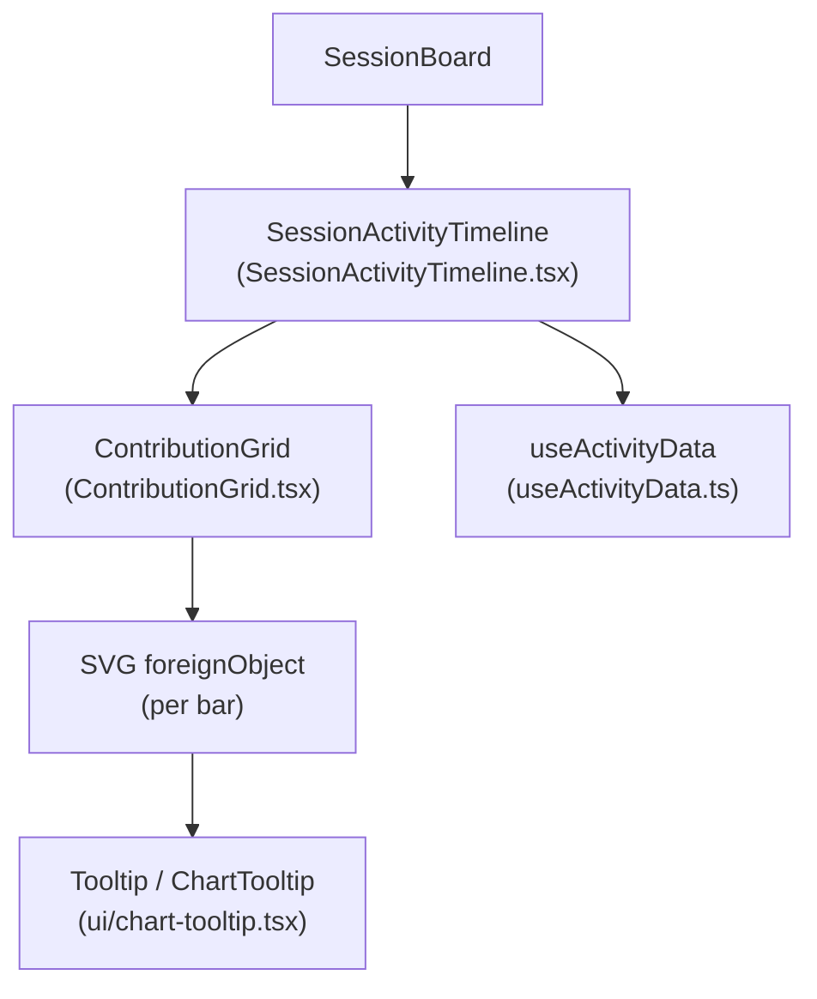
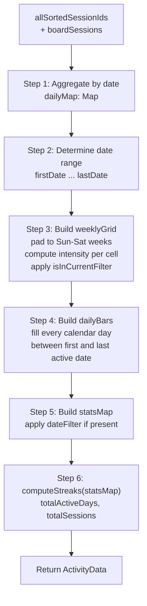
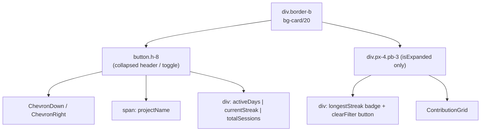
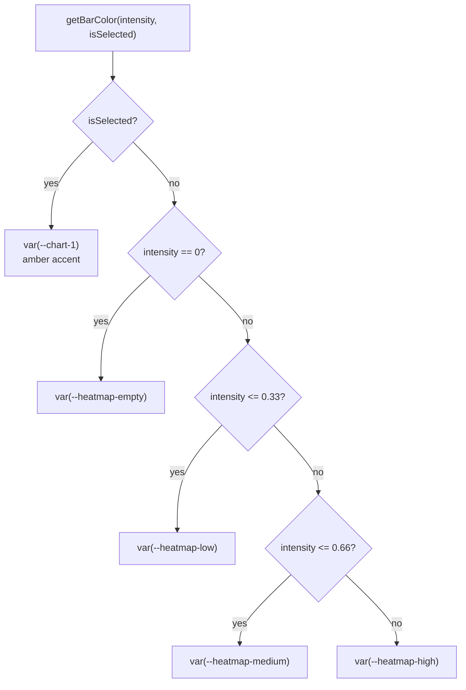
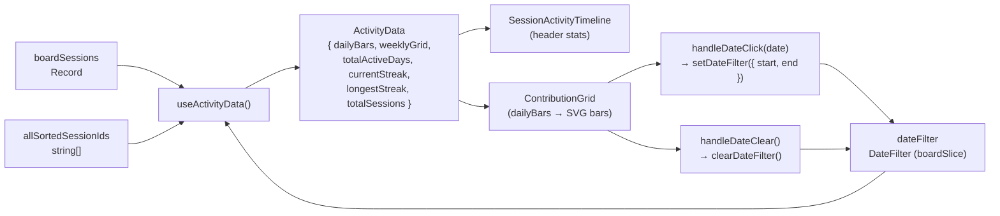

# Activity Timeline

<details>
<summary>Relevant source files</summary>

The following files were used as context for generating this wiki page:

- [src/components/AnalyticsDashboard/components/DailyTrendChart.tsx](src/components/AnalyticsDashboard/components/DailyTrendChart.tsx)
- [src/components/AnalyticsDashboard/components/TokenDistributionChart.tsx](src/components/AnalyticsDashboard/components/TokenDistributionChart.tsx)
- [src/components/SessionBoard/ContributionGrid.tsx](src/components/SessionBoard/ContributionGrid.tsx)
- [src/components/SessionBoard/SessionActivityTimeline.tsx](src/components/SessionBoard/SessionActivityTimeline.tsx)
- [src/components/SessionBoard/useActivityData.ts](src/components/SessionBoard/useActivityData.ts)
- [src/components/ui/chart-tooltip.tsx](src/components/ui/chart-tooltip.tsx)
- [src/test/useActivityData.test.ts](src/test/useActivityData.test.ts)

</details>


This page documents the Activity Timeline subsystem embedded in the Session Board, covering the `SessionActivityTimeline` component, the `ContributionGrid` SVG chart, and the `useActivityData` hook that computes all metrics. The timeline is concerned with per-project daily session activity visualized as an interactive bar chart.

For the broader Session Board context and how `SessionActivityTimeline` is mounted, see [3.2 Session Board](). For the `boardSlice` state that supplies `boardSessions` and `dateFilter`, see [4.2 State Slices]().

---

## Overview

The Activity Timeline is a collapsible strip displayed at the top of each session board column. It condenses all sessions for a project into daily buckets, renders them as a proportional bar chart, and lets users click individual bars to filter the visible sessions by date.

**Component map:**

| File | Export | Role |
|---|---|---|
| `src/components/SessionBoard/SessionActivityTimeline.tsx` | `SessionActivityTimeline` | Container: collapsible panel, summary stats, wires up callbacks |
| `src/components/SessionBoard/ContributionGrid.tsx` | `ContributionGrid` | SVG bar chart renderer with interactive bars |
| `src/components/SessionBoard/useActivityData.ts` | `useActivityData` | Pure computation hook: aggregation, grid, streaks |
| `src/components/SessionBoard/useActivityData.ts` | `toDateString`, `getFilterEndMs` | Shared date utilities |

---

## Component Hierarchy

**Diagram: Component tree for Activity Timeline**



Sources: [src/components/SessionBoard/SessionActivityTimeline.tsx:1-137](), [src/components/SessionBoard/ContributionGrid.tsx:1-282]()

---

## `useActivityData` Hook

This is the core data transformation layer. It accepts raw `BoardSessionData` records and a `DateFilter`, and returns a fully computed `ActivityData` object. All computation is wrapped in `useMemo` and only re-runs when `boardSessions`, `allSortedSessionIds`, or `dateFilter` changes.

### Inputs and Output Types

```typescript
useActivityData(
  boardSessions: Record<string, BoardSessionData>,
  allSortedSessionIds: string[],
  dateFilter: DateFilter
): ActivityData
```

| Type | Fields |
|---|---|
| `DateFilter` | `start: Date | null`, `end: Date | null` |
| `DailyBar` | `date: string`, `sessionCount: number`, `totalTokens: number` |
| `WeeklyGridCell` | `date`, `dayOfWeek`, `weekIndex`, `sessionCount`, `totalTokens`, `intensity`, `isInCurrentFilter` |
| `MonthLabel` | `label: string`, `weekIndex: number` |
| `ActivityData` | `weeklyGrid`, `monthLabels`, `dailyBars`, `totalActiveDays`, `currentStreak`, `longestStreak`, `totalSessions`, `maxSessionsPerDay` |

Sources: [src/components/SessionBoard/useActivityData.ts:1-35]()

### Computation Pipeline

**Diagram: useActivityData computation steps**



Sources: [src/components/SessionBoard/useActivityData.ts:149-317]()

### Step Details

**Step 1 — Daily aggregation**

Each session is bucketed by the local date of `session.last_message_time` (falling back to `session.last_modified`) [src/components/SessionBoard/useActivityData.ts:175-181](). Invalid timestamps are skipped. Sessions on the same day accumulate `sessionCount` and `totalTokens` in a `DailyBucket` [src/components/SessionBoard/useActivityData.ts:182-185]().

**Step 2 — Date range**

The sorted keys of `dailyMap` give `firstDate` and `lastDate`. These bound the displayed range [src/components/SessionBoard/useActivityData.ts:189-196]().

**Step 3 — Weekly grid**

The grid starts at the Sunday of the week containing `firstDate`, and extends to the Saturday of the week containing `lastDate` [src/components/SessionBoard/useActivityData.ts:199-201](). Each `WeeklyGridCell` carries:

- `intensity = sessionCount / maxCount` (0–1, where `maxCount` is the peak day across all data) [src/components/SessionBoard/useActivityData.ts:241]()
- `isInCurrentFilter`: whether the cell's midnight timestamp falls within the active `DateFilter` range (computed via `getFilterEndMs`) [src/components/SessionBoard/useActivityData.ts:242]()

Month labels are emitted for any Sunday that falls on or before the 7th of a new month [src/components/SessionBoard/useActivityData.ts:251-255]().

**Step 4 — Daily bars**

`dailyBars` is an array covering every contiguous calendar day from `firstDate` to `lastDate` [src/components/SessionBoard/useActivityData.ts:271-283](). Days with no sessions get `sessionCount: 0`, which `ContributionGrid` renders as a minimal 2px stub [src/components/SessionBoard/ContributionGrid.tsx:174](). This ensures the time axis is proportional even with gaps.

**Step 5 & 6 — Filtered stats**

When `dateFilter` is active, a separate `statsMap` is constructed containing only the daily buckets whose dates fall within the filter range [src/components/SessionBoard/useActivityData.ts:291-306](). Streak calculations and aggregate stats (`totalActiveDays`, `totalSessions`) operate on `statsMap` [src/components/SessionBoard/useActivityData.ts:312-316](). The `weeklyGrid` and `dailyBars` always reflect the full unfiltered dataset.

### Streak Calculation

Implemented in `computeStreaks` [src/components/SessionBoard/useActivityData.ts:95-147]():

- Sorts active dates ascending, counts consecutive-day runs.
- **Longest streak**: maximum consecutive-day run length [src/components/SessionBoard/useActivityData.ts:117]().
- **Current streak**: only active if the last recorded day is today or yesterday (local date). Counts backwards from the last date [src/components/SessionBoard/useActivityData.ts:128-144]().
- DST-safe: day differences are measured in milliseconds divided by `86_400_000`, then `Math.round()` [src/components/SessionBoard/useActivityData.ts:113]().

### Date Utility Functions

| Function | Behavior |
|---|---|
| `toDateString(date)` | Returns `YYYY-MM-DD` using local calendar fields (not UTC) [src/components/SessionBoard/useActivityData.ts:70-75]() |
| `getFilterEndMs(end)` | If `end` is exactly midnight local time, returns midnight of the *next* day (inclusive day semantics). Otherwise returns `end + 1ms` [src/components/SessionBoard/useActivityData.ts:56-68](). |

---

## `SessionActivityTimeline` Component

`SessionActivityTimeline` is the collapsible panel that hosts the chart. It is always mounted but conditionally expanded.

### Props

| Prop | Type | Description |
|---|---|---|
| `boardSessions` | `Record<string, BoardSessionData>` | All loaded board sessions for the project |
| `allSortedSessionIds` | `string[]` | Ordered session IDs (drives aggregation order) |
| `dateFilter` | `DateFilter` | Currently active date filter from `boardSlice` |
| `setDateFilter` | `(filter: DateFilter) => void` | Applies a new date filter |
| `clearDateFilter` | `() => void` | Clears the active date filter |
| `isExpanded` | `boolean` | Controls collapsed/expanded state |
| `onToggle` | `() => void` | Toggles expansion |
| `projectName` | `string?` | Shown in the collapsed header |

Sources: [src/components/SessionBoard/SessionActivityTimeline.tsx:8-17]()

### Layout

**Diagram: SessionActivityTimeline layout structure**



Sources: [src/components/SessionBoard/SessionActivityTimeline.tsx:61-133]()

### Date Filter Interaction

A click on a bar in `ContributionGrid` calls `handleDateClick(date)` [src/components/SessionBoard/SessionActivityTimeline.tsx:41-51](), which constructs a `DateFilter` spanning `00:00:00.000` to `23:59:59.999` for that local date and calls `setDateFilter`. Clicking the currently selected bar calls `clearDateFilter` [src/components/SessionBoard/SessionActivityTimeline.tsx:53-55]().

`selectedDate` is derived from `dateFilter`: if `start` and `end` convert to the same `YYYY-MM-DD` string, that string is the `selectedDate` passed to `ContributionGrid` [src/components/SessionBoard/SessionActivityTimeline.tsx:33-39]().

---

## `ContributionGrid` Component

A pure SVG bar chart. It does not own state — all selection logic is delegated to callbacks.

### Layout Constants

| Constant | Value | Purpose |
|---|---|---|
| `BAR_WIDTH` | `14px` | Pixel width of each bar |
| `BAR_GAP` | `3px` | Gap between bars |
| `SLOT_WIDTH` | `17px` | `BAR_WIDTH + BAR_GAP` |
| `CHART_HEIGHT` | `80px` | Height of the bar area |
| `AXIS_HEIGHT` | `18px` | Height reserved for date labels below |
| `GRID_LINES` | `4` | Number of horizontal reference lines |
| `MIN_LABEL_GAP_PX` | `44px` | Minimum pixel distance between axis label centres |

Sources: [src/components/SessionBoard/ContributionGrid.tsx:16-22]()

### Bar Rendering

Each bar is rendered as a `<foreignObject>` wrapping a `<div>` [src/components/SessionBoard/ContributionGrid.tsx:186-192](). This is necessary because the Radix UI `Tooltip`/`TooltipTrigger` system requires a DOM element, not an SVG element. The SVG coordinate system is still used for positioning.

Bar height is `max(3, round(intensity * (CHART_HEIGHT - 4)))` for non-zero days, or a fixed 2px stub for zero-session days [src/components/SessionBoard/ContributionGrid.tsx:171-174](). Zero-day stubs are not interactive (`role` and click handlers are omitted) and are rendered with specific colors [src/components/SessionBoard/ContributionGrid.tsx:28]().

**Diagram: Bar color selection (getBarColor)**



Sources: [src/components/SessionBoard/ContributionGrid.tsx:26-32]()

### Axis Label Selection

The `selectLabelIndices` function [src/components/SessionBoard/ContributionGrid.tsx:55-77]() uses a greedy left-to-right scan:

1. Always include index 0 [src/components/SessionBoard/ContributionGrid.tsx:60]().
2. For each subsequent index, include it only if it is at least `ceil(MIN_LABEL_GAP_PX / SLOT_WIDTH)` slots after the previous label [src/components/SessionBoard/ContributionGrid.tsx:64-66]().
3. Include the last index if it is at least `floor(minSlots * 0.55)` slots from the previous label [src/components/SessionBoard/ContributionGrid.tsx:72-74]().

Labels are rendered as SVG `<text>` elements with `textAnchor="middle"` and monospace font [src/components/SessionBoard/ContributionGrid.tsx:262-273](). The format is `M/D` (e.g. `2/8`) via `formatShortLabel` [src/components/SessionBoard/ContributionGrid.tsx:35-38]().

### Tooltip Content

Each bar shows a `ChartTooltip` [src/components/ui/chart-tooltip.tsx:20-61]() with:
- **title**: verbose date (`Mon, Feb 8`) via `formatDateLabel` [src/components/SessionBoard/ContributionGrid.tsx:41-48]()
- **rows**: `[{ label: "Sessions", value: bar.sessionCount }]` for non-zero days [src/components/SessionBoard/ContributionGrid.tsx:241-245]()
- **subtitle**: `"No activity"` (i18n key `analytics.timeline.noActivity`) for zero-day stubs [src/components/SessionBoard/ContributionGrid.tsx:238]()

---

## Data Flow Summary

**Diagram: End-to-end data flow for Activity Timeline**



Sources: [src/components/SessionBoard/SessionActivityTimeline.tsx:30-55](), [src/components/SessionBoard/useActivityData.ts:149-317](), [src/components/SessionBoard/ContributionGrid.tsx:108-115]()

---

## Key Design Decisions

- **Grid vs. stats separation**: The `weeklyGrid` and `dailyBars` always reflect the complete dataset regardless of `dateFilter`. Only aggregate stats like `totalActiveDays` and streaks are recomputed on the filtered `statsMap` [src/components/SessionBoard/useActivityData.ts:312-316]().
- **`foreignObject` for interactive bars**: SVG `<rect>` elements cannot host Radix UI `TooltipTrigger` because it needs a DOM node. Using `<foreignObject>` for each bar allows the existing Tooltip infrastructure to work inside an SVG coordinate space [src/components/SessionBoard/ContributionGrid.tsx:186-192]().
- **Inclusive day semantics for midnight `DateFilter.end`**: `getFilterEndMs` detects when `end` is exactly midnight and treats it as the entire day by advancing one local calendar day [src/components/SessionBoard/useActivityData.ts:56-68]().
- **Proportional time axis in `dailyBars`**: Gap days (no sessions) are included as zero-count entries so bars are evenly spaced across calendar time [src/components/SessionBoard/useActivityData.ts:271-283]().

---

## Testing

`useActivityData` has a comprehensive Vitest test suite at `src/test/useActivityData.test.ts`. Coverage includes:

| Test group | What is verified |
|---|---|
| Empty data | Returns all-zero `ActivityData`; invalid timestamps produce no output [src/test/useActivityData.test.ts:43-86]() |
| Daily aggregation | Multiple sessions same day sum correctly; different days separate correctly [src/test/useActivityData.test.ts:88-126]() |
| Streak calculations | Consecutive streaks, gap-broken streaks, current streak (today/yesterday), expired streaks [src/test/useActivityData.test.ts:128-204]() |
| Weekly grid | Sun-Sat padding, month transitions, intensity ratios [src/test/useActivityData.test.ts:10-11]() |
| Date filter highlighting | Single-day, range, end-with-time-component, no-filter cases [src/test/useActivityData.test.ts:7-11]() |
| DST boundaries | Spring-forward and fall-back treated as consecutive days [src/test/useActivityData.test.ts:5]() |
| Month labels | Labels placed at correct week indices, no duplicates [src/test/useActivityData.test.ts:6]() |
| `dailyBars` output | Sorted by date, zero-gap days included, token totals accumulated [src/test/useActivityData.test.ts:106-126]() |
| Filtered stats | `totalActiveDays`/`totalSessions`/streaks reflect filter; grid and bars remain unfiltered [src/test/useActivityData.test.ts:203-204]() |

Sources: [src/test/useActivityData.test.ts:1-204]()
