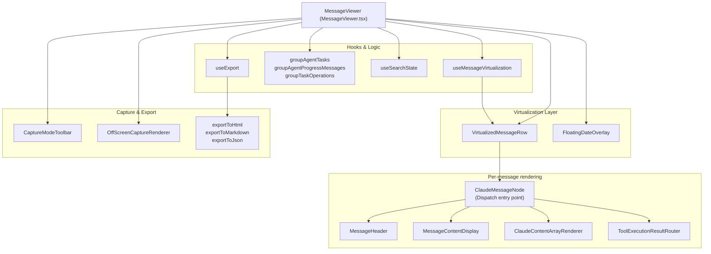
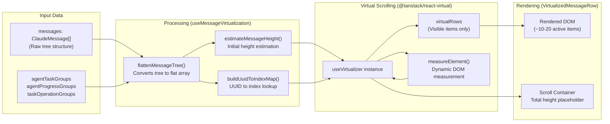

# Message Viewer

Relevant source files

The following files were used as context for generating this wiki page:

- [dev-mock-server.ts](dev-mock-server.ts)
- [docs/specs/ui-improvements-167-170.md](docs/specs/ui-improvements-167-170.md)
- [src-tauri/src/commands/project.rs](src-tauri/src/commands/project.rs)
- [src/components/MessageViewer/MessageViewer.tsx](src/components/MessageViewer/MessageViewer.tsx)
- [src/components/MessageViewer/components/CaptureModeToolbar.tsx](src/components/MessageViewer/components/CaptureModeToolbar.tsx)
- [src/components/MessageViewer/components/ClaudeMessageNode.tsx](src/components/MessageViewer/components/ClaudeMessageNode.tsx)
- [src/components/MessageViewer/components/DateDivider.tsx](src/components/MessageViewer/components/DateDivider.tsx)
- [src/components/MessageViewer/components/FilterToolbar.tsx](src/components/MessageViewer/components/FilterToolbar.tsx)
- [src/components/MessageViewer/components/FloatingDateOverlay.tsx](src/components/MessageViewer/components/FloatingDateOverlay.tsx)
- [src/components/MessageViewer/components/OffScreenCaptureRenderer.tsx](src/components/MessageViewer/components/OffScreenCaptureRenderer.tsx)
- [src/components/MessageViewer/components/VirtualizedMessageRow.tsx](src/components/MessageViewer/components/VirtualizedMessageRow.tsx)
- [src/components/MessageViewer/helpers/flattenMessageTree.ts](src/components/MessageViewer/helpers/flattenMessageTree.ts)
- [src/components/MessageViewer/helpers/heightEstimation.ts](src/components/MessageViewer/helpers/heightEstimation.ts)
- [src/components/MessageViewer/helpers/messageHelpers.ts](src/components/MessageViewer/helpers/messageHelpers.ts)
- [src/components/MessageViewer/types.ts](src/components/MessageViewer/types.ts)
- [src/components/common/Markdown.tsx](src/components/common/Markdown.tsx)
- [src/components/contentRenderer/CommandRenderer.tsx](src/components/contentRenderer/CommandRenderer.tsx)
- [src/components/messageRenderer/MessageContentDisplay.tsx](src/components/messageRenderer/MessageContentDisplay.tsx)
- [src/components/messageRenderer/SystemMessageRenderer.tsx](src/components/messageRenderer/SystemMessageRenderer.tsx)
- [src/components/toolResultRenderer/StringRenderer.tsx](src/components/toolResultRenderer/StringRenderer.tsx)
- [src/components/toolResultRenderer/WebSearchRenderer.tsx](src/components/toolResultRenderer/WebSearchRenderer.tsx)
- [src/hooks/useCapturePreview.ts](src/hooks/useCapturePreview.ts)
- [src/hooks/useCaptureScreenshot.ts](src/hooks/useCaptureScreenshot.ts)
- [src/hooks/useExport.ts](src/hooks/useExport.ts)
- [src/services/export/contentExtractor.ts](src/services/export/contentExtractor.ts)
- [src/services/export/htmlExporter.ts](src/services/export/htmlExporter.ts)
- [src/services/export/jsonExporter.ts](src/services/export/jsonExporter.ts)
- [src/services/export/markdownExporter.ts](src/services/export/markdownExporter.ts)
- [src/store/slices/captureModeSlice.ts](src/store/slices/captureModeSlice.ts)
- [src/store/slices/projectSlice.ts](src/store/slices/projectSlice.ts)
- [src/store/slices/types.ts](src/store/slices/types.ts)
- [src/test/export/contentExtractor.test.ts](src/test/export/contentExtractor.test.ts)
- [src/test/export/useExport.test.ts](src/test/export/useExport.test.ts)
- [tsconfig.app.json](tsconfig.app.json)
- [vite.config.ts](vite.config.ts)

## Purpose and Scope

The Message Viewer is the single-session detail view that displays conversation threads between the user and AI agents. It renders individual messages with full content, including text, tool uses, tool results, thinking blocks, and specialized content types. The component uses virtual scrolling via `@tanstack/react-virtual` to efficiently handle sessions with thousands of messages.

The Message Viewer also provides tools for interaction, including capture mode for screenshots, multi-format export (HTML/Markdown/JSON), and integrated search navigation.

**Sources**: [src/components/MessageViewer/MessageViewer.tsx:1-17](), [src/components/MessageViewer/types.ts:16-27]()

---

## Component Architecture

The Message Viewer is structured as a modular system with clear separation between display logic, virtualization, and content rendering.

### Component Hierarchy

**Component entry point**: `MessageViewer` [src/components/MessageViewer/MessageViewer.tsx:45]() renders a virtual list. Each visible item is passed to `VirtualizedMessageRow` [src/components/MessageViewer/components/VirtualizedMessageRow.tsx:39](), which wraps the `ClaudeMessageNode` [src/components/MessageViewer/components/ClaudeMessageNode.tsx:42](). The node acts as the message-type dispatch layer before delegating to content-specific renderers.

**Sources**: [src/components/MessageViewer/MessageViewer.tsx:45-134](), [src/components/MessageViewer/components/ClaudeMessageNode.tsx:42-60](), [src/components/MessageViewer/hooks/useMessageVirtualization.ts:55-75]()

---

## Virtual Scrolling System

The Message Viewer uses `@tanstack/react-virtual` to efficiently render large conversation threads by only mounting visible messages in the DOM.

### Virtualization Flow

### Key Functions

**`useMessageVirtualization`** [src/components/MessageViewer/hooks/useMessageVirtualization.ts:55]()
Returns a complete virtualization state including the core virtualizer instance, flattened messages, and programmatic scroll functions like `scrollToMessage(uuid)`.

**Configuration Constants**:
- `VIRTUALIZER_OVERSCAN = 5`: Number of extra items to render outside the viewport [src/components/MessageViewer/helpers/heightEstimation.ts:94]().
- `MIN_ROW_HEIGHT = 20`: Minimum measurement to prevent zero-height issues [src/components/MessageViewer/helpers/heightEstimation.ts:99]().

**Sources**: [src/components/MessageViewer/hooks/useMessageVirtualization.ts:55-197](), [src/components/MessageViewer/helpers/heightEstimation.ts:94-99]()

---

## Message Flattening and Grouping

Messages are stored as a tree structure (parent-child relationships) but rendered as a flat list for virtualization. The system also groups related agent messages for cleaner display.

### Flattening Process

`flattenMessageTree` [src/components/MessageViewer/helpers/flattenMessageTree.ts:113]() transforms the hierarchical structure:
1. **Deduplication**: Removes duplicate UUIDs [src/components/MessageViewer/helpers/flattenMessageTree.ts:130]().
2. **Command Merging**: `mergeCommandOutputMessages` combines slash commands (e.g., `/cost`) with their stdout results into a single entry [src/components/MessageViewer/helpers/flattenMessageTree.ts:55-106]().
3. **Traversal**: DFS traversal to preserve depth and chronological order [src/components/MessageViewer/helpers/flattenMessageTree.ts:184-208]().

### Agent Grouping Types

| Grouping Type | Purpose | Component |
|---------------|---------|-----------|
| **Agent Tasks** | Groups tool_use + tool_result pairs | `AgentTaskGroupRenderer` [src/components/MessageViewer/components/ClaudeMessageNode.tsx:181]() |
| **Agent Progress** | Groups consecutive progress updates | `AgentProgressGroupRenderer` [src/components/MessageViewer/components/ClaudeMessageNode.tsx:204]() |
| **Task Operations** | Groups consecutive tool operations | `TaskOperationGroupRenderer` [src/components/MessageViewer/components/ClaudeMessageNode.tsx:232]() |

**Sources**: [src/components/MessageViewer/helpers/flattenMessageTree.ts:55-208](), [src/components/MessageViewer/components/ClaudeMessageNode.tsx:166-235]()

---

## Content Rendering System

The Message Viewer routes different content types to specialized renderers through `ClaudeMessageNode`.

### Specialized Renderers

- **CommandRenderer**: Extracts and renders system command tags like `<command-name>`, `<command-args>`, and `<local-command-stdout>` [src/components/contentRenderer/CommandRenderer.tsx:74-161](). It supports ANSI color code rendering via `AnsiText` [src/components/contentRenderer/CommandRenderer.tsx:10]().
- **MessageContentDisplay**: The primary renderer for text content. It includes a line-limit logic for long messages with "Show More" functionality [src/components/messageRenderer/MessageContentDisplay.tsx:14-41]() and handles collapsible markdown tables [src/components/messageRenderer/MessageContentDisplay.tsx:44-109]().
- **FileHistorySnapshotRenderer**: Displays file snapshots and backups recorded during the session [src/components/MessageViewer/components/ClaudeMessageNode.tsx:257]().

**Sources**: [src/components/contentRenderer/CommandRenderer.tsx:74-161](), [src/components/messageRenderer/MessageContentDisplay.tsx:14-109](), [src/components/MessageViewer/components/ClaudeMessageNode.tsx:257]()

---

## Capture Mode and Export

The viewer includes a robust system for capturing conversation segments and exporting full histories.

### Capture Mode
Users can enter "Capture Mode" to select specific messages for a screenshot.
- **Selection**: `handleSelectionClick` allows range selection via Shift+Click [src/components/MessageViewer/components/ClaudeMessageNode.tsx:76-87]().
- **Hide/Show**: Individual messages can be hidden from the capture view [src/components/MessageViewer/components/ClaudeMessageNode.tsx:95-123]().
- **Off-Screen Rendering**: To capture high-resolution images, the `OffScreenCaptureRenderer` [src/components/MessageViewer/components/OffScreenCaptureRenderer.tsx:1]() renders the selected messages in a hidden DOM element before using `html-to-image`.

### Export System
The `useExport` hook [src/hooks/useExport.ts:1]() orchestrates conversion to various formats:
- **HTML**: `exportToHtml` generates a standalone file with inline CSS [src/services/export/htmlExporter.ts:128]().
- **Markdown**: `exportToMarkdown` creates a clean GFM-compatible file [src/services/export/markdownExporter.ts:42]().
- **JSON**: `exportToJson` exports the raw message objects [src/services/export/jsonExporter.ts:1]().

**Sources**: [src/components/MessageViewer/components/ClaudeMessageNode.tsx:76-123](), [src/services/export/htmlExporter.ts:128-152](), [src/services/export/markdownExporter.ts:42-98]()

---

## Navigation and Search

The Message Viewer integrates with global state for search and session navigation.

- **Search State**: `useSearchState` manages the search query and match indexing [src/components/MessageViewer/hooks/useSearchState.ts:1](). Matches are highlighted in the UI using `HighlightedText` [src/components/messageRenderer/MessageContentDisplay.tsx:9]().
- **Floating Date Overlay**: Tracks the first visible virtual row to display the current conversation date as a sticky-style header [src/components/MessageViewer/components/FloatingDateOverlay.tsx:52-124]().
- **Subagent Navigation**: Supports navigating into sub-sessions (agent-within-agent) and maintaining a navigation stack [src/components/MessageViewer/MessageViewer.tsx:82-86]().

**Sources**: [src/components/MessageViewer/hooks/useSearchState.ts:1-10](), [src/components/MessageViewer/components/FloatingDateOverlay.tsx:52-124](), [src/components/MessageViewer/MessageViewer.tsx:82-86]()
