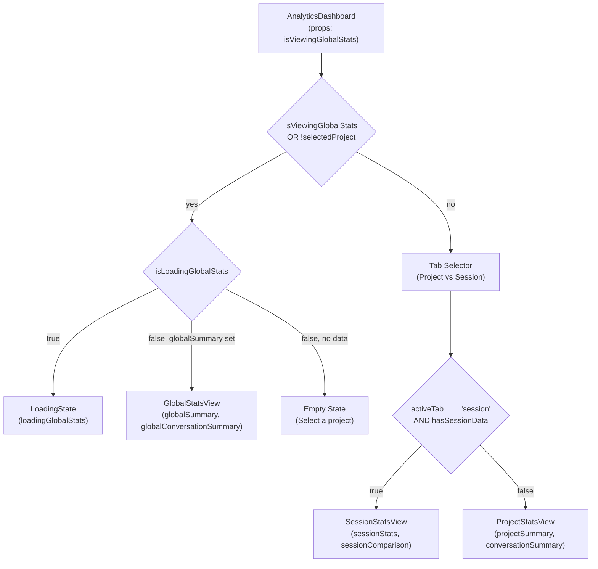
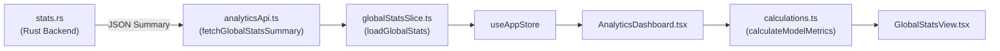

# Analytics Dashboard

<details>
<summary>Relevant source files</summary>

The following files were used as context for generating this wiki page:

- [src-tauri/benches/performance.rs](src-tauri/benches/performance.rs)
- [src-tauri/src/commands/stats.rs](src-tauri/src/commands/stats.rs)
- [src/components/AnalyticsDashboard/AnalyticsDashboard.tsx](src/components/AnalyticsDashboard/AnalyticsDashboard.tsx)
- [src/components/AnalyticsDashboard/components/ActivityHeatmap.tsx](src/components/AnalyticsDashboard/components/ActivityHeatmap.tsx)
- [src/components/AnalyticsDashboard/components/BillingBreakdownCard.tsx](src/components/AnalyticsDashboard/components/BillingBreakdownCard.tsx)
- [src/components/AnalyticsDashboard/utils/calculations.ts](src/components/AnalyticsDashboard/utils/calculations.ts)
- [src/components/AnalyticsDashboard/utils/projectCalculations.ts](src/components/AnalyticsDashboard/utils/projectCalculations.ts)
- [src/components/AnalyticsDashboard/views/GlobalStatsView.tsx](src/components/AnalyticsDashboard/views/GlobalStatsView.tsx)
- [src/components/AnalyticsDashboard/views/ProjectStatsView.tsx](src/components/AnalyticsDashboard/views/ProjectStatsView.tsx)
- [src/components/AnalyticsDashboard/views/SessionStatsView.tsx](src/components/AnalyticsDashboard/views/SessionStatsView.tsx)
- [src/hooks/useAnalytics.ts](src/hooks/useAnalytics.ts)
- [src/i18n/locales/en/analytics.json](src/i18n/locales/en/analytics.json)
- [src/i18n/locales/ja/analytics.json](src/i18n/locales/ja/analytics.json)
- [src/i18n/locales/ko/analytics.json](src/i18n/locales/ko/analytics.json)
- [src/i18n/locales/zh-CN/analytics.json](src/i18n/locales/zh-CN/analytics.json)
- [src/i18n/locales/zh-TW/analytics.json](src/i18n/locales/zh-TW/analytics.json)
- [src/services/analyticsApi.ts](src/services/analyticsApi.ts)
- [src/store/slices/globalStatsSlice.ts](src/store/slices/globalStatsSlice.ts)
- [src/store/slices/messageSlice.ts](src/store/slices/messageSlice.ts)
- [src/test/globalStatsSlice.test.ts](src/test/globalStatsSlice.test.ts)
- [src/test/projectCalculations.test.ts](src/test/projectCalculations.test.ts)

</details>


This page documents the `AnalyticsDashboard` component, the `useAnalytics` orchestration hook, and the shared calculation utilities that support them. It covers how the dashboard selects between the global, project, and session views, and how the `useAnalytics` hook manages data loading, view transitions, and reactivity to filter changes.

For the detailed implementation of the three sub-views (`GlobalStatsView`, `ProjectStatsView`, `SessionStatsView`) and the `BillingBreakdownCard`, see [Analytics Views](#3.4.1). For the Token Statistics viewer that shows per-session/per-project paginated token tables, see [Token Stats Viewer](#3.5). For the backend statistics computation, see [Statistics and Analytics](#5.2).

---

## Component Structure

The public entry point is the implementation at [src/components/AnalyticsDashboard/AnalyticsDashboard.tsx](). The component is organized into a module directory containing specialized views, shared UI components, and calculation utilities.

```
src/components/AnalyticsDashboard/
├── AnalyticsDashboard.tsx       ← main component
├── types.ts                     ← AnalyticsDashboardProps, shared types
├── views/                       ← [See 3.4.1 Analytics Views]
│   ├── GlobalStatsView.tsx
│   ├── ProjectStatsView.tsx
│   └── SessionStatsView.tsx
├── components/                  ← Shared Dashboard UI
│   ├── ActivityHeatmap.tsx      ← Calendar-style heatmap
│   ├── BillingBreakdownCard.tsx ← Cost/Token split card
│   ├── MetricCard.tsx
│   ├── SectionCard.tsx
│   └── ...
└── utils/                       ← Calculation Logic
    ├── calculations.ts          ← Model pricing & global costs
    ├── projectCalculations.ts   ← Trend data & project metrics
    └── ...
```

Sources: [src/components/AnalyticsDashboard/AnalyticsDashboard.tsx:1-187](), [src/components/AnalyticsDashboard/components/ActivityHeatmap.tsx:1-205]()

---

## View Routing

`AnalyticsDashboard` determines which view to render based on the application state and props:

| Prop | Type | Default | Description |
|------|------|---------|-------------|
| `isViewingGlobalStats` | `boolean` | `false` | When `true`, or when no project is selected, render the global view |

Internally, the component uses an `activeTab` state (`"project" | "session"`) to switch between `ProjectStatsView` and `SessionStatsView` [src/components/AnalyticsDashboard/AnalyticsDashboard.tsx:35](). The session tab is only enabled if `hasSessionData` is true—meaning a session is selected and its comparison/token stats are loaded [src/components/AnalyticsDashboard/AnalyticsDashboard.tsx:41-43]().

**View routing in AnalyticsDashboard**



Sources: [src/components/AnalyticsDashboard/AnalyticsDashboard.tsx:49-180]()

---

## `useAnalytics` Hook Orchestration

The `useAnalytics` hook [src/hooks/useAnalytics.ts:8]() acts as the controller for the dashboard, bridging the UI to the `analyticsSlice` and `globalStatsSlice`. It orchestrates the complex loading sequences required when switching views or applying filters.

### Data Loading and Synchronization
The hook manages the following flows:
1.  **Global Stats**: Calls `loadGlobalStats` which fetches both `billing_total` and `conversation_only` summaries from the backend [src/store/slices/globalStatsSlice.ts:59-137]().
2.  **Project Stats**: Triggers `loadProjectStatsSummary` when a project is selected [src/store/slices/messageSlice.ts:68-70]().
3.  **Session Comparison**: Fetches how a specific session compares to project averages via `loadSessionComparison` [src/store/slices/messageSlice.ts:71-74]().

### Filter Reactivity
The dashboard is reactive to the `dateFilter` [src/components/AnalyticsDashboard/AnalyticsDashboard.tsx:31](). When the filter changes in the `DatePickerHeader`, `useAnalytics` invalidates current requests and reloads the active view's data using the new date range [src/store/slices/globalStatsSlice.ts:69-76]().

Sources: [src/hooks/useAnalytics.ts:1-9](), [src/store/slices/globalStatsSlice.ts:59-137](), [src/store/slices/messageSlice.ts:62-80]()

---

## Shared UI Components

### Activity Heatmap
The `ActivityHeatmapComponent` [src/components/AnalyticsDashboard/components/ActivityHeatmap.tsx:205]() renders a GitHub-style contribution grid. It groups `DailyStats` by month [src/components/AnalyticsDashboard/components/ActivityHeatmap.tsx:33-46]() and calculates color intensity based on message counts [src/components/AnalyticsDashboard/components/ActivityHeatmap.tsx:157-158]().

### Daily Trend Chart
Used within `ProjectStatsView`, this chart displays message and token trends over time. It relies on `generateTrendData` to fill in gaps for days with zero activity, ensuring a continuous timeline for the charting library [src/components/AnalyticsDashboard/utils/projectCalculations.ts:23-127]().

Sources: [src/components/AnalyticsDashboard/components/ActivityHeatmap.tsx:8-201](), [src/components/AnalyticsDashboard/utils/projectCalculations.ts:23-127]()

---

## Calculation Utilities

The dashboard relies on specialized utilities to process raw backend data into display-ready metrics.

### Model Pricing and Cost Estimation
`calculations.ts` maintains the `MODEL_PRICING` table used to estimate costs across different providers and models [src/components/AnalyticsDashboard/utils/calculations.ts:34-52](). It handles complex pricing structures including:
*   Input/Output token rates.
*   **Cache Creation** and **Cache Read** rates for Claude models [src/components/AnalyticsDashboard/utils/calculations.ts:40-45]().

### Global Summary Aggregation
`calculateGlobalCostSummary` [src/components/AnalyticsDashboard/utils/calculations.ts:145-175]() iterates through model distributions to provide an overall "Estimated Cost" for the `GlobalStatsView` [src/components/AnalyticsDashboard/views/GlobalStatsView.tsx:54-59]().

**Analytics Data Flow: Backend to Dashboard**



Sources: [src-tauri/src/commands/stats.rs:207-241](), [src/components/AnalyticsDashboard/utils/calculations.ts:1-175](), [src/components/AnalyticsDashboard/views/GlobalStatsView.tsx:50-77]()
