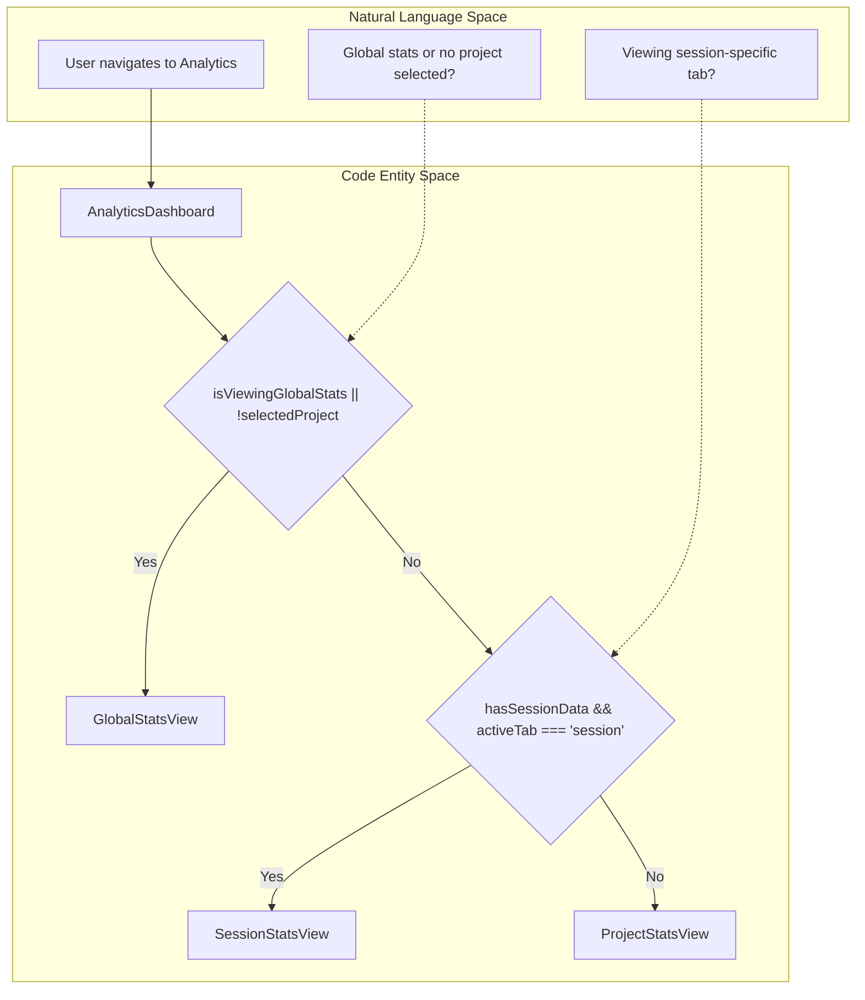
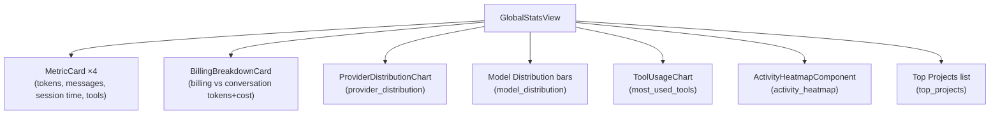
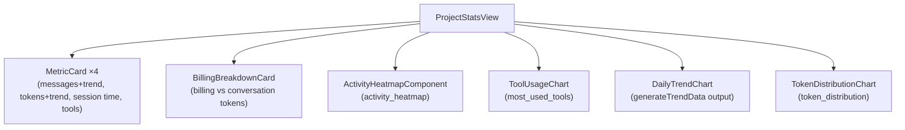
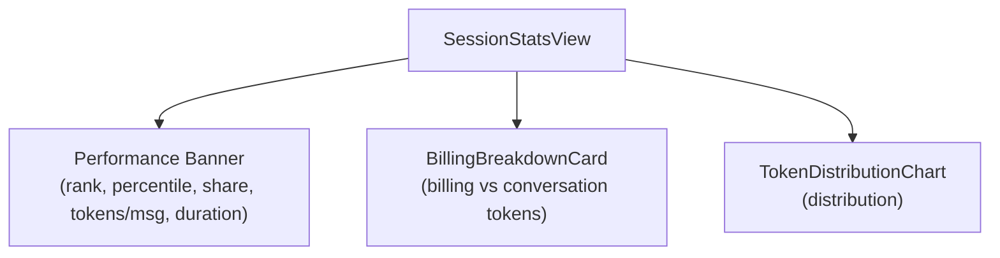
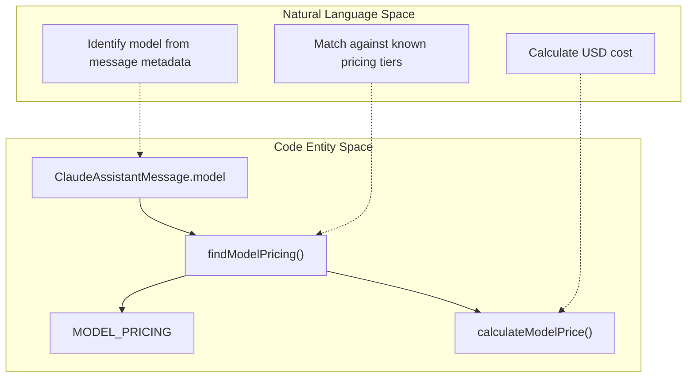

# Analytics Views

<details>
<summary>Relevant source files</summary>

The following files were used as context for generating this wiki page:

- [src-tauri/src/providers/mod.rs](src-tauri/src/providers/mod.rs)
- [src/components/AnalyticsDashboard/AnalyticsDashboard.tsx](src/components/AnalyticsDashboard/AnalyticsDashboard.tsx)
- [src/components/AnalyticsDashboard/components/ActivityHeatmap.tsx](src/components/AnalyticsDashboard/components/ActivityHeatmap.tsx)
- [src/components/AnalyticsDashboard/components/BillingBreakdownCard.tsx](src/components/AnalyticsDashboard/components/BillingBreakdownCard.tsx)
- [src/components/AnalyticsDashboard/components/ProviderDistributionChart.tsx](src/components/AnalyticsDashboard/components/ProviderDistributionChart.tsx)
- [src/components/AnalyticsDashboard/utils/calculations.ts](src/components/AnalyticsDashboard/utils/calculations.ts)
- [src/components/AnalyticsDashboard/views/GlobalStatsView.tsx](src/components/AnalyticsDashboard/views/GlobalStatsView.tsx)
- [src/components/AnalyticsDashboard/views/ProjectStatsView.tsx](src/components/AnalyticsDashboard/views/ProjectStatsView.tsx)
- [src/components/AnalyticsDashboard/views/SessionStatsView.tsx](src/components/AnalyticsDashboard/views/SessionStatsView.tsx)
- [src/components/MessageViewer/components/MessageHeader.tsx](src/components/MessageViewer/components/MessageHeader.tsx)
- [src/i18n/locales/en/analytics.json](src/i18n/locales/en/analytics.json)
- [src/i18n/locales/ja/analytics.json](src/i18n/locales/ja/analytics.json)
- [src/i18n/locales/ko/analytics.json](src/i18n/locales/ko/analytics.json)
- [src/i18n/locales/zh-CN/analytics.json](src/i18n/locales/zh-CN/analytics.json)
- [src/i18n/locales/zh-TW/analytics.json](src/i18n/locales/zh-TW/analytics.json)
- [src/utils/providers.ts](src/utils/providers.ts)

</details>


This page documents the three view components rendered by `AnalyticsDashboard` when the analytics panel is active: `GlobalStatsView`, `ProjectStatsView`, and `SessionStatsView`. It also covers the `BillingBreakdownCard` shared component, the `ProviderDistributionChart`, and the `MODEL_PRICING`-based cost calculation utilities.

For how `AnalyticsDashboard` decides which view to mount and orchestrates data loading, see [Analytics Dashboard](#3.4). For the token stats list view (paginated per-session table), see [Token Stats Viewer](#3.5). For the backend stats computation that produces the data these views consume, see [Statistics and Analytics](#5.2).

---

## View Routing

`AnalyticsDashboard` selects among the three views based on two conditions: whether a project is selected, and whether session data is fully loaded.

**View Routing Logic** (`AnalyticsDashboard.tsx`)



`hasSessionData` is `true` only when all three of `selectedSession`, `sessionTokenStats` (`SessionTokenStats`), and `sessionComparison` (`SessionComparison`) are non-null [src/components/AnalyticsDashboard/AnalyticsDashboard.tsx:41-42](). When `hasSessionData` is false, the tab bar is hidden entirely and `ProjectStatsView` renders unconditionally [src/components/AnalyticsDashboard/AnalyticsDashboard.tsx:165-171]().

Sources: [src/components/AnalyticsDashboard/AnalyticsDashboard.tsx:19-177]()

---

## Data Structures

Each view receives typed props derived from Zustand store slices.

| View | Primary Prop Type | Secondary Prop Type | Store Slice |
|---|---|---|---|
| `GlobalStatsView` | `GlobalStatsSummary` | `GlobalStatsSummary \| null` (conversation) | `globalStatsSlice` |
| `ProjectStatsView` | `ProjectStatsSummary \| null` | `ProjectStatsSummary \| null` (conversation) | `analyticsSlice` |
| `SessionStatsView` | `SessionTokenStats` | `SessionComparison` | `messageSlice`, `analyticsSlice` |

The "conversation" counterparts carry token counts computed using `StatsMode.ConversationOnly` (user/assistant turns only), while the primary props use `StatsMode.BillingTotal` (all billable traffic). Both are fetched in parallel by the store actions.

Sources: [src/components/AnalyticsDashboard/views/GlobalStatsView.tsx:41-44](), [src/components/AnalyticsDashboard/views/ProjectStatsView.tsx:25-30](), [src/components/AnalyticsDashboard/AnalyticsDashboard.tsx:23-34]()

---

## GlobalStatsView

**Component:** `GlobalStatsView` in [src/components/AnalyticsDashboard/views/GlobalStatsView.tsx]()

Renders when no project is selected or when `isViewingGlobalStats=true`.

**What it renders:**



**Cost computation** uses `calculateGlobalCostSummary(model_distribution, total_tokens)`, which iterates each `ModelStats` entry, calls `calculateModelPrice` for each model, and sums results into a `GlobalCostSummary` containing `totalEstimatedCost` and `coveragePercent` [src/components/AnalyticsDashboard/views/GlobalStatsView.tsx:52-69]().

The `conversationBreakdownCoverage` flag is computed via `calculateConversationBreakdownCoverage(provider_distribution)` to decide whether to show a provider-limit warning inside `BillingBreakdownCard` [src/components/AnalyticsDashboard/views/GlobalStatsView.tsx:73-77]().

**Top projects ranking** uses `getRankMedal(index)` to render medal emoji (🥇🥈🥉) for the top 3 entries [src/components/AnalyticsDashboard/views/GlobalStatsView.tsx:253-271]().

Sources: [src/components/AnalyticsDashboard/views/GlobalStatsView.tsx:46-314](), [src/components/AnalyticsDashboard/utils/calculations.ts:75-90]()

---

## ProjectStatsView

**Component:** `ProjectStatsView` in [src/components/AnalyticsDashboard/views/ProjectStatsView.tsx]()

Renders for a selected project when the "Project Overview" tab is active (or when no session is loaded).

**What it renders:**



**Trend data generation:** `generateTrendData(projectSummary.daily_stats)` converts sparse backend `DailyStats[]` into a contiguous date-range array with gaps filled as zeros [src/components/AnalyticsDashboard/views/ProjectStatsView.tsx:39-42]().

**Growth indicators** on `MetricCard` come from `extractProjectGrowth(projectSummary)`, which analyzes changes in tokens and messages over time [src/components/AnalyticsDashboard/views/ProjectStatsView.tsx:59-60]().

If `projectSummary` is `null`, the view renders a `LoadingState` spinner rather than empty content [src/components/AnalyticsDashboard/views/ProjectStatsView.tsx:45-56]().

Sources: [src/components/AnalyticsDashboard/views/ProjectStatsView.tsx:31-142]()

---

## SessionStatsView

**Component:** `SessionStatsView` in [src/components/AnalyticsDashboard/views/SessionStatsView.tsx]()

Renders when the "Session Details" tab is selected and all three of `sessionStats`, `conversationStats`, and `sessionComparison` are available.

**What it renders:**



**Derived metrics** are computed via two memoized calls:

- `calculateSessionMetrics(sessionStats)` → `{ avgTokensPerMessage, durationMinutes, distribution }` — extracts distribution from `SessionTokenStats` and computes average tokens per message [src/components/AnalyticsDashboard/views/SessionStatsView.tsx:38-41]().
- `calculateSessionComparisonMetrics(sessionComparison, totalProjectSessions)` → `{ isAboveAverage, statusColor, percentile }` — uses `rank_by_tokens` and `totalProjectSessions` to compute percentile and choose a status color [src/components/AnalyticsDashboard/views/SessionStatsView.tsx:43-47]().

**`SessionComparison` fields used:**

| Field | Displayed as |
|---|---|
| `rank_by_tokens` | Token rank badge [src/components/AnalyticsDashboard/views/SessionStatsView.tsx:82]() |
| `percentage_of_project_tokens` | "Project Share" stat [src/components/AnalyticsDashboard/views/SessionStatsView.tsx:97]() |
| `rank_by_duration` | Duration rank sub-label [src/components/AnalyticsDashboard/views/SessionStatsView.tsx:136]() |

Sources: [src/components/AnalyticsDashboard/views/SessionStatsView.tsx:28-228]()

---

## Shared Components

### BillingBreakdownCard

**Component:** `BillingBreakdownCard` in [src/components/AnalyticsDashboard/components/BillingBreakdownCard.tsx]()

Explains the split between `BillingTotal` and `ConversationOnly` token counts.

**Computed values** [src/components/AnalyticsDashboard/components/BillingBreakdownCard.tsx:27-37]():

```
nonConversationTokenValue = max(0, billingTokens - conversationTokens)
conversationTokenRatio    = (conversationTokens / billingTokens) * 100
nonConversationTokenRatio = (nonConversationTokenValue / billingTokens) * 100
```

The stacked progress bar visualizes these ratios using CSS `bg-metric-green` (conversation) and `bg-metric-amber` (non-conversation) [src/components/AnalyticsDashboard/components/BillingBreakdownCard.tsx:65-74]().

### ProviderDistributionChart

**Component:** `ProviderDistributionChart` in [src/components/AnalyticsDashboard/components/ProviderDistributionChart.tsx]()

Displays a horizontal bar chart of token usage per provider. It uses a `PROVIDER_COLORS` mapping to assign specific colors (e.g., `aider: var(--metric-red)`, `claude: var(--metric-amber)`) to each provider [src/components/AnalyticsDashboard/components/ProviderDistributionChart.tsx:12-20]().

Sources: [src/components/AnalyticsDashboard/components/BillingBreakdownCard.tsx:1-138](), [src/components/AnalyticsDashboard/components/ProviderDistributionChart.tsx:12-101]()

---

## MODEL_PRICING and Cost Calculations

All cost estimates are computed client-side in `src/components/AnalyticsDashboard/utils/calculations.ts`.

**Pricing Lookup Logic**



**Pricing table** (`MODEL_PRICING`, prices in USD per million tokens) [src/components/AnalyticsDashboard/utils/calculations.ts:34-52]():

| Model key (substring match) | Input | Output | Cache Write | Cache Read |
|---|---|---|---|---|
| `claude-opus-4` | 15 | 75 | 18.75 | 1.50 |
| `claude-3-5-sonnet` | 3 | 15 | 3.75 | 0.30 |
| `claude-3-5-haiku` | 1 | 5 | 1.25 | 0.10 |
| `gpt-4.1` | 2 | 8 | 0 | 0 |
| `gemini-2.5-pro` | 1.25 | 10 | 0 | 0 |

**Lookup strategy** (`findModelPricing`): entries are checked via `modelName.toLowerCase().includes(key)`. The longest matching key wins to prevent partial match collisions [src/components/AnalyticsDashboard/utils/calculations.ts:56-67]().

Sources: [src/components/AnalyticsDashboard/utils/calculations.ts:27-90](), [src/components/AnalyticsDashboard/views/GlobalStatsView.tsx:52-69]()
