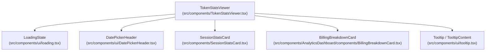
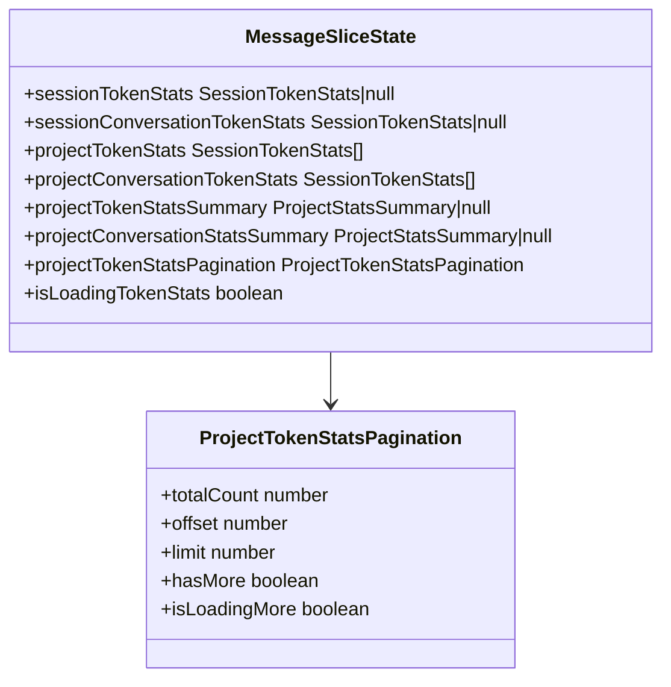
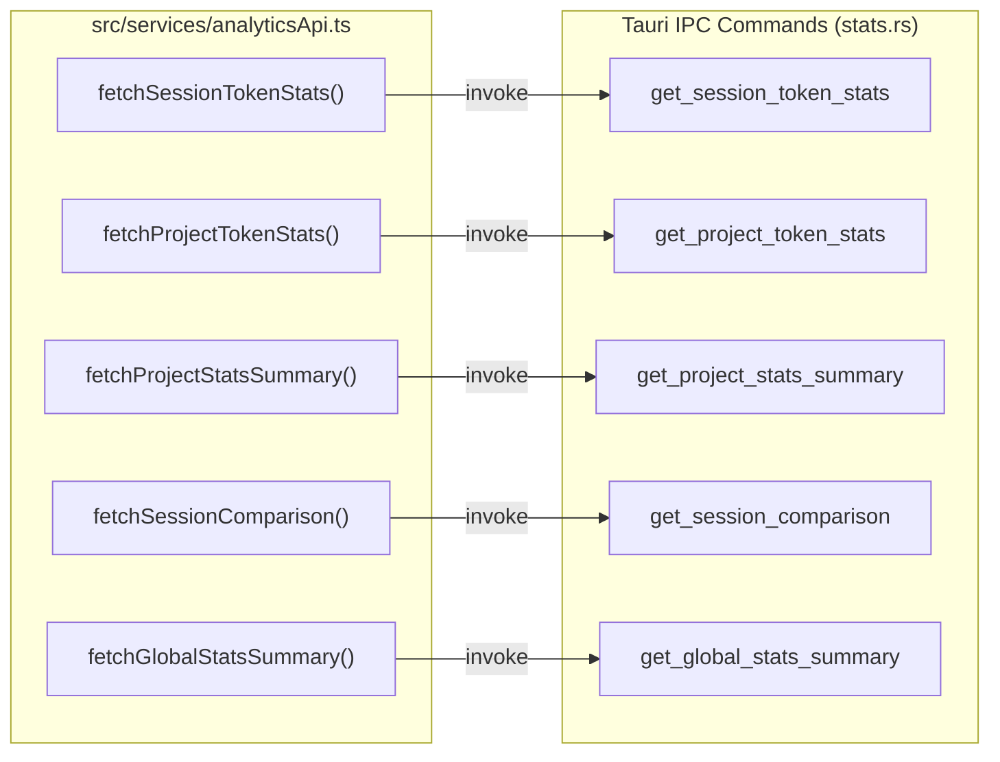
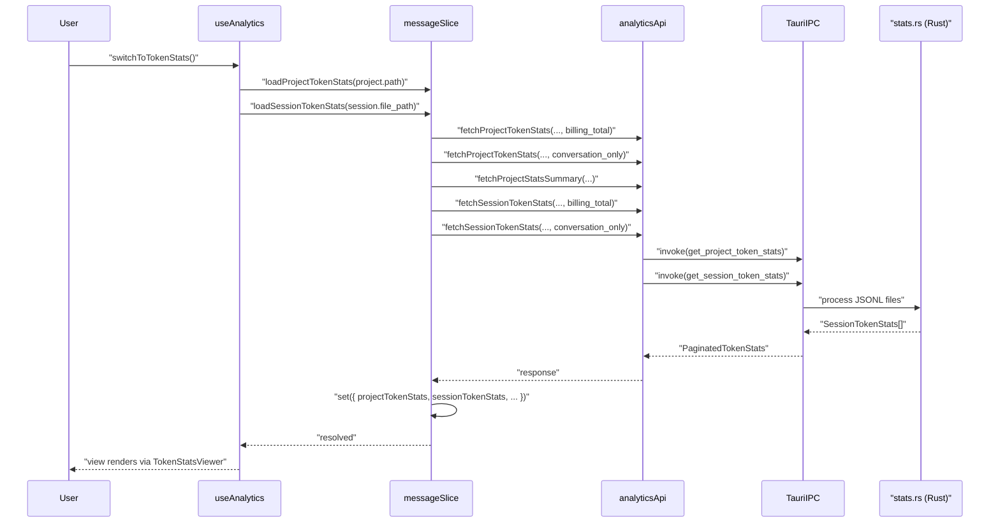
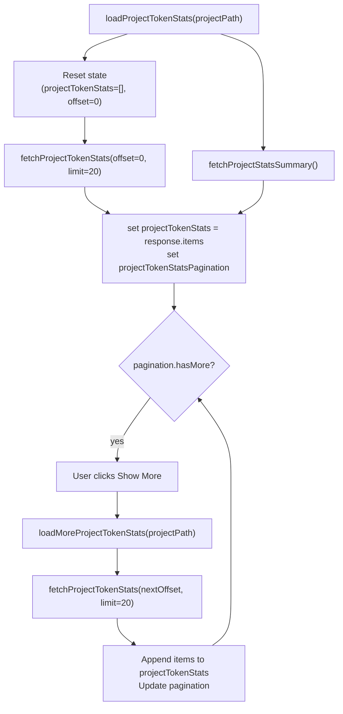

# Token Stats Viewer

<details>
<summary>Relevant source files</summary>

The following files were used as context for generating this wiki page:

- [src-tauri/benches/performance.rs](src-tauri/benches/performance.rs)
- [src-tauri/src/commands/stats.rs](src-tauri/src/commands/stats.rs)
- [src-tauri/src/models/stats.rs](src-tauri/src/models/stats.rs)
- [src/components/AnalyticsDashboard.tsx](src/components/AnalyticsDashboard.tsx)
- [src/components/AnalyticsDashboard/utils/projectCalculations.ts](src/components/AnalyticsDashboard/utils/projectCalculations.ts)
- [src/components/SessionStatsCard.tsx](src/components/SessionStatsCard.tsx)
- [src/components/TokenStatsViewer.tsx](src/components/TokenStatsViewer.tsx)
- [src/contexts/theme/ThemeProvider.tsx](src/contexts/theme/ThemeProvider.tsx)
- [src/contexts/theme/utils.ts](src/contexts/theme/utils.ts)
- [src/hooks/useAnalytics.ts](src/hooks/useAnalytics.ts)
- [src/services/analyticsApi.ts](src/services/analyticsApi.ts)
- [src/store/slices/analyticsSlice.ts](src/store/slices/analyticsSlice.ts)
- [src/store/slices/globalStatsSlice.ts](src/store/slices/globalStatsSlice.ts)
- [src/store/slices/messageSlice.ts](src/store/slices/messageSlice.ts)
- [src/store/useLanguageStore.ts](src/store/useLanguageStore.ts)
- [src/test/globalStatsSlice.test.ts](src/test/globalStatsSlice.test.ts)
- [src/test/messageSlice.tokenLoading.test.ts](src/test/messageSlice.tokenLoading.test.ts)
- [src/test/projectCalculations.test.ts](src/test/projectCalculations.test.ts)
- [src/types/stats.types.ts](src/types/stats.types.ts)
- [src/utils/time.ts](src/utils/time.ts)

</details>


This page documents the **Token Stats Viewer** subsystem: the `TokenStatsViewer` and `SessionStatsCard` UI components, the `analyticsApi` service layer that bridges the frontend to the backend, and the `messageSlice` state that manages all token statistics. The viewer is reached by switching to the `"tokenStats"` analytics view within a selected project.

For the broader analytics dashboard that hosts this view, see [Analytics Dashboard](3.4). For the backend commands that compute statistics, see [Statistics and Analytics](5.2). For the `BillingBreakdownCard` used inside this viewer, see [Analytics Views](3.4.1).

---

## Purpose

`TokenStatsViewer` provides a dedicated view for per-session and per-project token consumption. It shows:

- **Session-level stats** for the currently selected session.
- **Project-level stats** as a paginated list of `SessionStatsCard` tiles (20 per page, loaded on demand).
- A **billing vs conversation** comparison (`BillingBreakdownCard`) that distinguishes tokens counted for billing purposes from tokens exchanged in the conversation proper.
- **Date filtering** via a `DatePickerHeader` that restricts which messages are counted.

---

## Component Architecture

**TokenStatsViewer component hierarchy**



Sources: [src/components/TokenStatsViewer.tsx:1-93](), [src/components/SessionStatsCard.tsx:1-48]()

### `TokenStatsViewer`

The top-level component. It is a pure display component: it receives all data as props and delegates loading to the store via its parent.

| Prop | Type | Description |
|---|---|---|
| `sessionStats` | `SessionTokenStats \| null` | Billing-total stats for the current session |
| `sessionConversationStats` | `SessionTokenStats \| null` | Conversation-only stats for the current session |
| `projectStats` | `SessionTokenStats[]` | Current page of project session stats (billing) |
| `projectConversationStats` | `SessionTokenStats[]` | Current page (conversation-only) |
| `projectStatsSummary` | `ProjectStatsSummary \| null` | Aggregate totals across all sessions (billing) |
| `projectConversationStatsSummary` | `ProjectStatsSummary \| null` | Aggregate totals (conversation-only) |
| `pagination` | `ProjectTokenStatsPagination` | Offset/limit/hasMore for the session list |
| `onLoadMore` | `() => void` | Callback to load the next page |
| `dateFilter` | `{ start, end }` | Active date window |
| `setDateFilter` | setter | Called when user picks a new date range |
| `onSessionClick` | `(stats) => void` | Optional click handler per session card |
| `providerId` | `ProviderId` | Controls whether conversation breakdown is shown |

The component resolves display titles for each `SessionTokenStats` by cross-referencing `sessions` and `userMetadata.sessions` from the Zustand store via `useAppStore`, building a `sessionDisplayById` map. See [src/components/TokenStatsViewer.tsx:99-115]().

The project summary section aggregates totals either from `projectStatsSummary` (preferred, covers all pages) or by summing the loaded page when the summary is unavailable. See [src/components/TokenStatsViewer.tsx:155-185]().

The "Show More" button appears when `pagination.hasMore` is true and calls `onLoadMore`. It displays the count of remaining sessions. See [src/components/TokenStatsViewer.tsx:316-347]().

### `SessionStatsCard`

A compact, memoized tile for a single `SessionTokenStats` record.

| Prop | Type | Description |
|---|---|---|
| `stats` | `SessionTokenStats` | The session's token data |
| `showSessionId` | `boolean` | Renders the raw UUID in a `<code>` element |
| `compact` | `boolean` | Reduces padding |
| `summary` | `string` | Session description shown below the stats |
| `onClick` | `() => void` | Makes the card clickable |
| `hoverable` | `boolean` | Adds hover styling |

The card shows total tokens, message count, and duration (derived from `first_message_time` and `last_message_time`). Below that is a 2-column grid of non-zero token categories (input, output, cache creation, cache read) with their percentage of the total. See [src/components/SessionStatsCard.tsx:50-126]().

---

## State Management

All token statistics are held in `messageSlice` inside the Zustand store. See [State Slices](4.2) for the overall slice layout.

**State fields managed by `messageSlice` for token stats**



Sources: [src/store/slices/messageSlice.ts:42-60]()

The `isLoadingTokenStats` flag uses an internal reference-counting scheme (`tokenStatsInFlight`) so that concurrent session and project loads both keep the spinner active until **all** in-flight requests complete. See [src/store/slices/messageSlice.ts:131-154]().

### Key Actions

| Action | Signature | Description |
|---|---|---|
| `loadSessionTokenStats` | `(sessionPath: string) => Promise<void>` | Fetches billing and conversation stats for one session |
| `loadProjectTokenStats` | `(projectPath: string) => Promise<void>` | Resets and fetches the first page of project stats |
| `loadMoreProjectTokenStats` | `(projectPath: string) => Promise<void>` | Appends the next page to existing arrays |
| `clearTokenStats` | `() => void` | Resets all token stats and cancels in-flight requests |

`loadProjectTokenStats` also fetches `projectStatsSummary` in parallel, providing accurate totals that don't depend on how many pages have been loaded. See [src/store/slices/messageSlice.ts:253-271]().

`clearTokenStats` bumps both `"sessionTokenStats"` and `"projectTokenStats"` request IDs via `nextRequestId`, which causes any currently in-flight response handlers to detect stale state and discard their results. See [src/store/slices/messageSlice.ts:316-328]().

---

## The `analyticsApi` Service Layer

`src/services/analyticsApi.ts` is the single point of contact between the frontend and Tauri IPC for all statistics commands. It wraps `invoke` calls and adds in-flight deduplication via `dedupeInFlight`.

**analyticsApi function → Tauri command mapping**



Sources: [src/services/analyticsApi.ts:50-255]()

### Deduplication

`dedupeInFlight` builds a cache key from all arguments (path, offset, limit, dates, stats mode) and returns the existing `Promise` if an identical request is already in flight. This prevents redundant backend calls when multiple components or effects trigger simultaneous fetches with the same parameters. See [src/services/analyticsApi.ts:27-41]().

### `StatsMode`

Both session and project fetch functions accept a `stats_mode` parameter:

| Value | Meaning |
|---|---|
| `"billing_total"` | Includes sidechain messages; reflects what Anthropic bills |
| `"conversation_only"` | Excludes sidechain messages; reflects user-visible exchanges |

The Rust backend (`stats.rs`) maps these to the `StatsMode` enum: `BillingTotal` and `ConversationOnly`. See [src-tauri/src/commands/stats.rs:27-48]().

### `FetchProjectTokenStatsOptions`

```typescript
export interface FetchProjectTokenStatsOptions {
  offset?: number;
  limit?: number;
  start_date?: string;
  end_date?: string;
  stats_mode: StatsMode;
}
```

See [src/services/analyticsApi.ts:80-86]().

---

## Data Flow

**End-to-end flow for switching to token stats view**



Sources: [src/services/analyticsApi.ts:50-124](), [src/store/slices/messageSlice.ts:253-271]()

---

## Pagination

Project session stats are paginated server-side. The page size is fixed at `TOKENS_STATS_PAGE_SIZE = 20`. See [src/store/slices/messageSlice.ts:88-88]().



Sources: [src/services/analyticsApi.ts:91-124](), [src/components/TokenStatsViewer.tsx:127-137]()

The `canLoadMore` utility from `src/utils/pagination.ts` guards `loadMoreProjectTokenStats` so it is a no-op if no more pages exist or if a page load is already in progress. See [src/store/slices/messageSlice.ts:285-288]().

---

## Provider-Specific Behavior

Not all providers support sidechain metadata. `supportsConversationBreakdown(providerId)` determines at runtime whether a second `"conversation_only"` request should be made. See [src/components/TokenStatsViewer.tsx:97-97]().

| Provider | Conversation breakdown |
|---|---|
| `"claude"` | Yes — two requests per load |
| `"codex"` | No — billing stats reused as conversation stats |
| `"opencode"` | Yes |

When a provider doesn't support breakdown, `sessionConversationTokenStats` is set to the same value as `sessionTokenStats`. `TokenStatsViewer` detects this via the `showProviderLimitHelp` flag. See [src/store/slices/messageSlice.ts:156-159](), [src/components/TokenStatsViewer.tsx:97-97]().

---

## Date Filtering

The `dateFilter` state (a `{ start: Date | null, end: Date | null }` object) is passed to `analyticsApi`. In `globalStatsSlice`, the end date is expanded to `23:59:59.999` before being sent to the backend to ensure the full day is included. See [src/store/slices/globalStatsSlice.ts:71-76](), [src/test/globalStatsSlice.test.ts:146-177]().

The backend returns `daily_stats` spanning the filtered range. The trend charts in the dashboard utilize these values to render consumption over time. See [src-tauri/src/commands/stats.rs:10-14]().

---

## Request Cancellation

Both `loadSessionTokenStats` and `loadProjectTokenStats` utilize a request ID mechanism via `nextRequestId` and `getRequestId` to prevent stale updates. If a newer request is initiated or `clearTokenStats` is called, any previous in-flight responses are ignored. See [src/store/slices/messageSlice.ts:316-328](), [src/test/globalStatsSlice.test.ts:89-106]().
