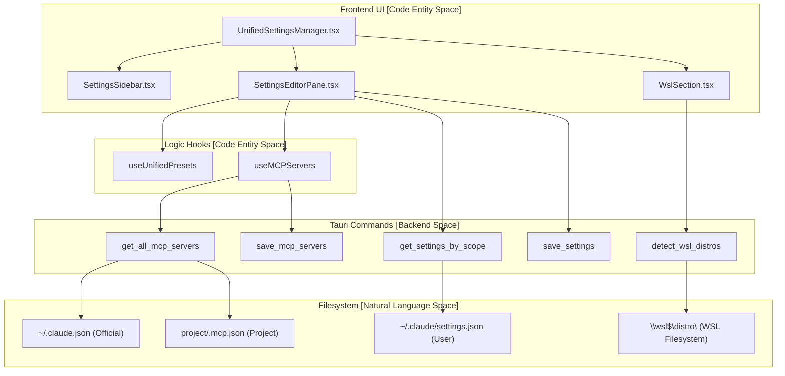
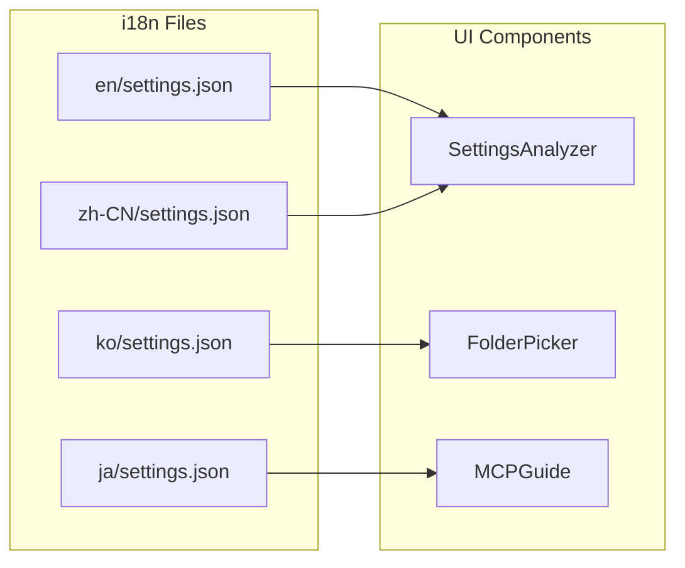

# Settings Manager

Relevant source files

The following files were used as context for generating this wiki page:

- [src-tauri/src/commands/claude_settings.rs](src-tauri/src/commands/claude_settings.rs)
- [src-tauri/src/commands/mcp_presets.rs](src-tauri/src/commands/mcp_presets.rs)
- [src-tauri/src/commands/settings.rs](src-tauri/src/commands/settings.rs)
- [src/components/SettingsManager/UnifiedSettingsManager.tsx](src/components/SettingsManager/UnifiedSettingsManager.tsx)
- [src/components/SettingsManager/components/EmptyState.tsx](src/components/SettingsManager/components/EmptyState.tsx)
- [src/components/SettingsManager/components/index.ts](src/components/SettingsManager/components/index.ts)
- [src/components/SettingsManager/editor/EditorFooter.tsx](src/components/SettingsManager/editor/EditorFooter.tsx)
- [src/components/SettingsManager/editor/EffectiveSummaryBanner.tsx](src/components/SettingsManager/editor/EffectiveSummaryBanner.tsx)
- [src/components/SettingsManager/editor/SettingsEditorPane.tsx](src/components/SettingsManager/editor/SettingsEditorPane.tsx)
- [src/components/SettingsManager/index.ts](src/components/SettingsManager/index.ts)
- [src/components/SettingsManager/sections/MCPServersSection.tsx](src/components/SettingsManager/sections/MCPServersSection.tsx)
- [src/components/SettingsManager/sections/WslSection.tsx](src/components/SettingsManager/sections/WslSection.tsx)
- [src/components/SettingsManager/sections/index.ts](src/components/SettingsManager/sections/index.ts)
- [src/components/modals/folderSelect/FolderSelector.tsx](src/components/modals/folderSelect/FolderSelector.tsx)
- [src/hooks/useMCPPresets.ts](src/hooks/useMCPPresets.ts)
- [src/hooks/useMCPServers.ts](src/hooks/useMCPServers.ts)
- [src/i18n/locales/en/settings.json](src/i18n/locales/en/settings.json)
- [src/i18n/locales/ja/settings.json](src/i18n/locales/ja/settings.json)
- [src/i18n/locales/ko/settings.json](src/i18n/locales/ko/settings.json)
- [src/i18n/locales/zh-CN/settings.json](src/i18n/locales/zh-CN/settings.json)
- [src/i18n/locales/zh-TW/settings.json](src/i18n/locales/zh-TW/settings.json)
- [src/i18n/types.generated.ts](src/i18n/types.generated.ts)
- [src/types/claudeSettings.ts](src/types/claudeSettings.ts)
- [src/types/mcpPreset.types.ts](src/types/mcpPreset.types.ts)

The Settings Manager provides a comprehensive configuration interface for viewing and editing Claude Code settings, managing Model Context Protocol (MCP) server configurations, and handling unified presets. It bridges the gap between Claude Code's native filesystem-based configuration and the viewer's UI, supporting multi-scope settings (user, project, local, managed).

## Overview

The Settings Manager consists of several functional areas:

1.  **Claude Code Settings**: Reading and writing `settings.json` and `settings.local.json` files across different scopes via `get_settings_by_scope` and `save_settings` [src-tauri/src/commands/claude_settings.rs:179-205]().
2.  **MCP Server Management**: A unified interface for managing MCP servers from multiple sources including the official `~/.claude.json`, legacy `.mcp.json`, and project-specific configs [src-tauri/src/commands/claude_settings.rs:21-40]().
3.  **Unified Presets**: Snapshots of both settings and MCP configurations that can be saved and reapplied via the `useUnifiedPresets` hook [src/hooks/useMCPPresets.ts:7-10]().
4.  **Platform Integrations**: Specialized support for WSL scanning on Windows and custom directory management [src/components/SettingsManager/sections/WslSection.tsx:5-7]().

Sources: [src/components/SettingsManager/UnifiedSettingsManager.tsx:1-9](), [src-tauri/src/commands/claude_settings.rs:1-5]()

## System Architecture

The following diagram illustrates the flow from the React frontend components through the specialized hooks to the Rust backend commands that interact with the filesystem.

### Settings Data Flow
Title: Settings Management Pipeline

Sources: [src/components/SettingsManager/UnifiedSettingsManager.tsx:11-31](), [src-tauri/src/commands/claude_settings.rs:179-205](), [src/components/SettingsManager/sections/WslSection.tsx:59-66]()

## Settings Scopes and File Locations

The system manages settings across four distinct scopes. The backend ensures atomic writes to prevent file corruption during updates [src-tauri/src/commands/claude_settings.rs:145-168]().

| Scope | File Path | Description |
| :--- | :--- | :--- |
| **User** | `~/.claude/settings.json` | Global user preferences [src-tauri/src/commands/claude_settings.rs:42-46](). |
| **Project** | `<project>/.claude/settings.json` | Project-specific overrides [src-tauri/src/commands/claude_settings.rs:120-124](). |
| **Local** | `<project>/.claude/settings.local.json` | Local machine overrides (git-ignored) [src-tauri/src/commands/claude_settings.rs:125-129](). |
| **Managed** | `/Library/.../managed-settings.json` | Read-only enterprise settings (macOS only) [src-tauri/src/commands/macos.rs:102-109](). |

Sources: [src-tauri/src/commands/claude_settings.rs:117-133]()

## MCP Server Configuration

The `useMCPServers` hook provides a unified interface for the "Multi-Source MCP Configuration Manager". It aggregates servers from five different potential locations to match Claude Code's priority logic.

### MCP Sources (AllMCPServers)
The `AllMCPServers` struct in the backend defines the hierarchy of MCP sources [src-tauri/src/commands/claude_settings.rs:29-40]():

*   **user_claude_json**: User-scoped MCP from `~/.claude.json` (Official).
*   **local_claude_json**: Project-scoped MCP from `~/.claude.json` → `projects.<path>.mcpServers`.
*   **user_settings**: User-level from `settings.json` `mcpServers` (Legacy).
*   **user_mcp_file**: User-level from `~/.claude/.mcp.json` (Legacy).
*   **project_mcp_file**: Project-level from `.mcp.json` (in project root).

Sources: [src-tauri/src/commands/claude_settings.rs:21-40](), [src/hooks/useMCPServers.ts:126-133]()

## Specialized Sections

### WSL Integration (`WslSection`)
For Windows users, the `WslSection` allows scanning Claude projects within Linux distributions. It uses the `detect_wsl_distros` command to list available environments and updates the `userMetadata` state to include or exclude specific distros [src/components/SettingsManager/sections/WslSection.tsx:59-66]().

### Custom Directories (`CustomDirectoriesSection`)
Allows users to add non-standard paths for Claude data scanning. This is integrated with the `FolderSelector` component, which validates if a path contains valid Claude data or a `projects/` subfolder before allowing it to be added as a custom directory [src/components/modals/folderSelect/FolderSelector.tsx:83-95]().

## Internationalization (i18n)

The Settings Manager uses a dedicated `settings` namespace for all UI strings, supporting English, Korean, Japanese, and Chinese (Simplified/Traditional).

### Settings Namespace Mapping
Title: Settings i18n Mapping

Sources: [src/i18n/types.generated.ts:20-20](), [src/i18n/locales/en/settings.json:1-70]()

## Implementation Details

### Atomic Write Pattern
The backend implements an atomic write in `write_settings_file` to prevent data loss:
1.  Validates JSON content [src-tauri/src/commands/claude_settings.rs:147-148]().
2.  Ensures parent directories exist [src-tauri/src/commands/claude_settings.rs:151-154]().
3.  Writes to a `.json.tmp` file [src-tauri/src/commands/claude_settings.rs:157-161]().
4.  Calls `sync_all()` to flush buffers [src-tauri/src/commands/claude_settings.rs:162-163]().
5.  Uses `atomic_rename` for the final replacement [src-tauri/src/commands/claude_settings.rs:165]().

### Dirty State Tracking
The `UnifiedSettingsManager` uses a `pendingSettings` state to track unsaved changes. It compares the stringified version of `pendingSettings` against the `currentSettings` loaded from the backend to determine if the "Save" action should be enabled [src/components/SettingsManager/UnifiedSettingsManager.tsx:190-193]().

Sources: [src/components/SettingsManager/UnifiedSettingsManager.tsx:104-123](), [src-tauri/src/commands/claude_settings.rs:145-168]()
