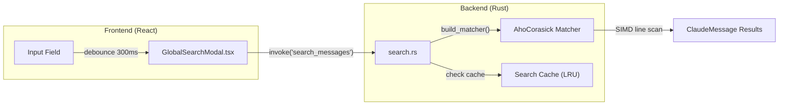
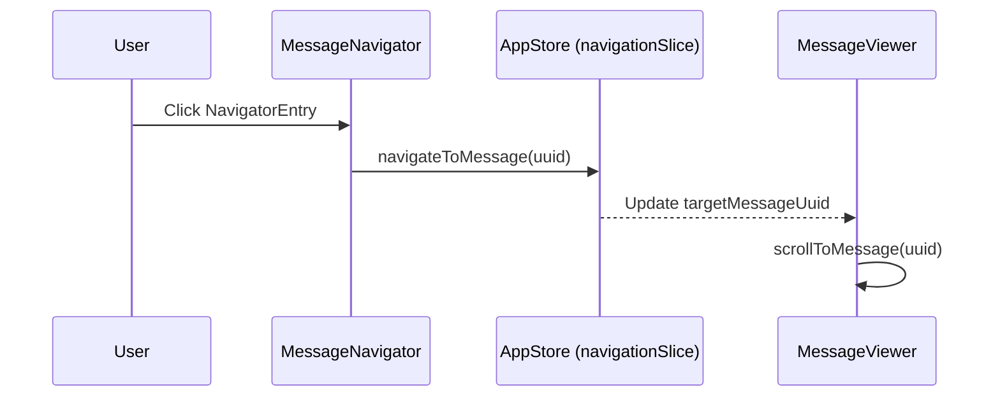
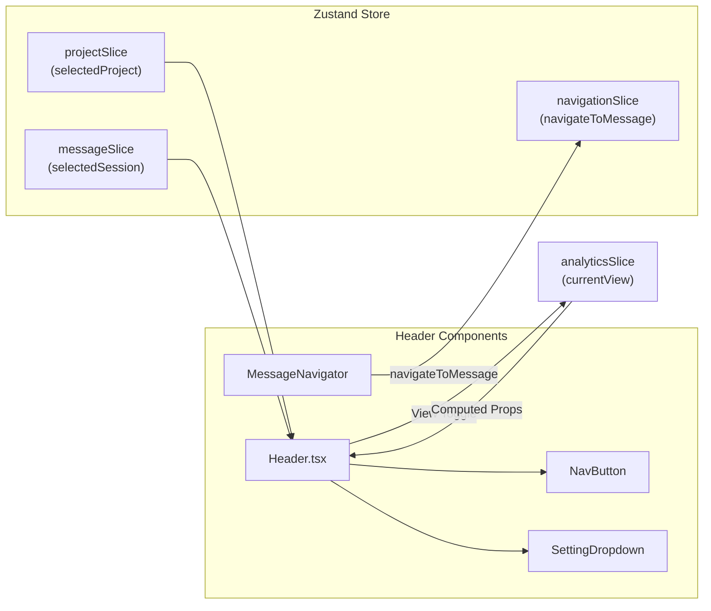

# Header and Navigation

<details>
<summary>Relevant source files</summary>

The following files were used as context for generating this wiki page:

- [src-tauri/src/commands/session/search.rs](src-tauri/src/commands/session/search.rs)
- [src/components/MessageNavigator/MessageNavigator.tsx](src/components/MessageNavigator/MessageNavigator.tsx)
- [src/components/modals/globalSearch/GlobalSearchModal.tsx](src/components/modals/globalSearch/GlobalSearchModal.tsx)
- [src/components/ui/switch.tsx](src/components/ui/switch.tsx)
- [src/i18n/locales/en/message.json](src/i18n/locales/en/message.json)
- [src/i18n/locales/ja/message.json](src/i18n/locales/ja/message.json)
- [src/i18n/locales/ko/message.json](src/i18n/locales/ko/message.json)
- [src/i18n/locales/zh-CN/message.json](src/i18n/locales/zh-CN/message.json)
- [src/i18n/locales/zh-TW/message.json](src/i18n/locales/zh-TW/message.json)
- [src/layouts/Header/Header.tsx](src/layouts/Header/Header.tsx)
- [src/layouts/Header/SettingDropdown/AccessibilityMenuGroup.tsx](src/layouts/Header/SettingDropdown/AccessibilityMenuGroup.tsx)
- [src/layouts/Header/SettingDropdown/FilterMenuGroup.tsx](src/layouts/Header/SettingDropdown/FilterMenuGroup.tsx)
- [src/layouts/Header/SettingDropdown/FontMenuGroup.tsx](src/layouts/Header/SettingDropdown/FontMenuGroup.tsx)
- [src/layouts/Header/SettingDropdown/LanguageMenuGroup.tsx](src/layouts/Header/SettingDropdown/LanguageMenuGroup.tsx)
- [src/layouts/Header/SettingDropdown/ThemeMenuGroup.tsx](src/layouts/Header/SettingDropdown/ThemeMenuGroup.tsx)
- [src/layouts/Header/SettingDropdown/index.tsx](src/layouts/Header/SettingDropdown/index.tsx)
- [src/store/slices/filterSlice.ts](src/store/slices/filterSlice.ts)
- [src/test/MessageNavigator.accessibility.test.tsx](src/test/MessageNavigator.accessibility.test.tsx)
- [src/types/analytics.ts](src/types/analytics.ts)

</details>


This page documents the `Header` component, the `NavButton` layout primitive, the `AnalyticsView` type system that drives view-switching, the `SettingDropdown` component, and the `MessageNavigator`. The Header is the primary navigation surface of the application — it lives at the top of every screen and controls which main panel is rendered in the content area.

For documentation on the content panels that the Header switches between, see the relevant component pages: [Message Viewer](3.3), [Analytics Dashboard](3.4), [Session Board](3.2), [Token Stats Viewer](3.5), [Settings Manager](3.6).

---

## Overview

The `Header` component is defined in [src/layouts/Header/Header.tsx:34]() and rendered at the top level of the application. It is a fixed-height (`h-12`) bar divided into three regions:

| Region | Content | Condition |
|---|---|---|
| Left | App icon, app name, project name, session summary | Always [src/layouts/Header/Header.tsx:93-128]() |
| Center | Session ID badge (Terminal icon + short ID) | `selectedSession` exists and `isMessagesView` is true [src/layouts/Header/Header.tsx:131-138]() |
| Right | Search button, `NavButton` group, `SettingDropdown` | Always; buttons are context-sensitive [src/layouts/Header/Header.tsx:141-250]() |

---

## AnalyticsView Type

The active main panel is tracked through the `AnalyticsView` union type defined in [src/types/analytics.ts:19]():

```typescript
export type AnalyticsView =
  | "messages"
  | "tokenStats"
  | "analytics"
  | "recentEdits"
  | "settings"
  | "board";
```

The `currentView` field of `AnalyticsState` holds the active value. The `useAnalytics` hook derives boolean computed flags from it, which are consumed by the Header to apply active styling.

**Computed flags derived from `AnalyticsView`** (from [src/types/analytics.ts:140-152]()):

| Computed Flag | `currentView` value |
|---|---|
| `isMessagesView` | `'messages'` |
| `isTokenStatsView` | `'tokenStats'` |
| `isAnalyticsView` | `'analytics'` |
| `isRecentEditsView` | `'recentEdits'` |
| `isSettingsView` | `'settings'` |
| `isBoardView` | `'board'` |

**AnalyticsView State Machine:**

The transition logic is implemented in the `useAnalytics` hook, which updates the `currentView` in the store via actions like `switchToBoard` or `switchToMessages`.

```mermaid
stateDiagram-v2
    [*] --> "messages"
    "messages" --> "analytics" : "switchToAnalytics()"
    "messages" --> "tokenStats" : "switchToTokenStats()"
    "messages" --> "recentEdits" : "switchToRecentEdits()"
    "messages" --> "board" : "switchToBoard()"
    "messages" --> "settings" : "switchToSettings()"
    "analytics" --> "messages" : "switchToMessages()"
    "tokenStats" --> "messages" : "switchToMessages()"
    "recentEdits" --> "messages" : "switchToMessages()"
    "board" --> "messages" : "switchToMessages()"
    "settings" --> "messages" : "switchToMessages()"
```

Sources: [src/types/analytics.ts:19-20](), [src/types/analytics.ts:126-137](), [src/layouts/Header/Header.tsx:172-180]()

---

## Global Search Integration

The Header provides access to the `GlobalSearchModal` [src/components/modals/globalSearch/GlobalSearchModal.tsx:37]() via a dedicated search button. 

- **Shortcut**: `⌘+K` on macOS or `Ctrl+K` on Windows/Linux [src/layouts/Header/Header.tsx:32]().
- **Functionality**: Triggers the `openModal("globalSearch")` action [src/layouts/Header/Header.tsx:144]().
- **Backend Bridge**: The search utilizes the `search_messages` or `search_all_providers` Tauri commands [src/components/modals/globalSearch/GlobalSearchModal.tsx:117-121]().

**Search Execution Logic:**



Sources: [src/components/modals/globalSearch/GlobalSearchModal.tsx:145-147](), [src-tauri/src/commands/session/search.rs:71-76](), [src-tauri/src/commands/session/search.rs:109-111]()

---

## SettingDropdown and Menus

The `SettingDropdown` [src/layouts/Header/SettingDropdown/index.tsx:28]() centralizes application configuration and accessibility options.

### Menu Groups
- **FilterMenuGroup**: Controls visibility of system messages and sidechains in the `filterSlice` [src/store/slices/filterSlice.ts]().
- **FontMenuGroup**: Adjusts `fontScale` between 90% and 130% [src/layouts/Header/SettingDropdown/FontMenuGroup.tsx:12-18]().
- **ThemeMenuGroup**: Switches between `light`, `dark`, and `system` themes using the `ThemeContext` [src/layouts/Header/SettingDropdown/ThemeMenuGroup.tsx:12-16]().
- **LanguageMenuGroup**: Updates the application locale via `useLanguageStore` [src/layouts/Header/SettingDropdown/LanguageMenuGroup.tsx:17-36]().
- **AccessibilityMenuGroup**: Manages accessibility features like high-contrast modes.

### Key Actions
- **Change Folder**: Opens the `folderSelector` modal to change the root `claudePath` [src/layouts/Header/SettingDropdown/index.tsx:53-57]().
- **Check for Updates**: Triggers a manual update check through the `updater` hook [src/layouts/Header/SettingDropdown/index.tsx:79-94]().

Sources: [src/layouts/Header/SettingDropdown/index.tsx:63-75](), [src/layouts/Header/SettingDropdown/FontMenuGroup.tsx:25-26](), [src/layouts/Header/SettingDropdown/ThemeMenuGroup.tsx:22-23]()

---

## MessageNavigator

The `MessageNavigator` [src/components/MessageNavigator/MessageNavigator.tsx:26]() is a sidebar component providing a high-level overview of the current session's conversation structure.

### Implementation Details
- **Virtualization**: Uses `@tanstack/react-virtual` to handle large conversations efficiently [src/components/MessageNavigator/MessageNavigator.tsx:81-86]().
- **Height Estimation**: Uses a heuristic based on preview text length and a `BASE_ENTRY_HEIGHT` (34px) [src/components/MessageNavigator/MessageNavigator.tsx:65-77]().
- **Filtering**: Supports a local `filterText` and a `userOnlyFilter` toggle from the `useAppStore` [src/components/MessageNavigator/MessageNavigator.tsx:48-62]().
- **Accessibility**: Implements full keyboard navigation (Arrow keys, Home, End, Enter) [src/components/MessageNavigator/MessageNavigator.tsx:125-155]().

### Data Flow for Navigation



Sources: [src/components/MessageNavigator/MessageNavigator.tsx:88-93](), [src/components/MessageNavigator/MessageNavigator.tsx:142-150](), [src/store/slices/navigationSlice.ts]()

---

## Data Flow Diagram: Header and Navigation

The Header acts as a bridge between the global `AppStore` and the specific view states.



Sources: [src/layouts/Header/Header.tsx:38-43](), [src/components/MessageNavigator/MessageNavigator.tsx:42](), [src/store/useAppStore.ts]()
