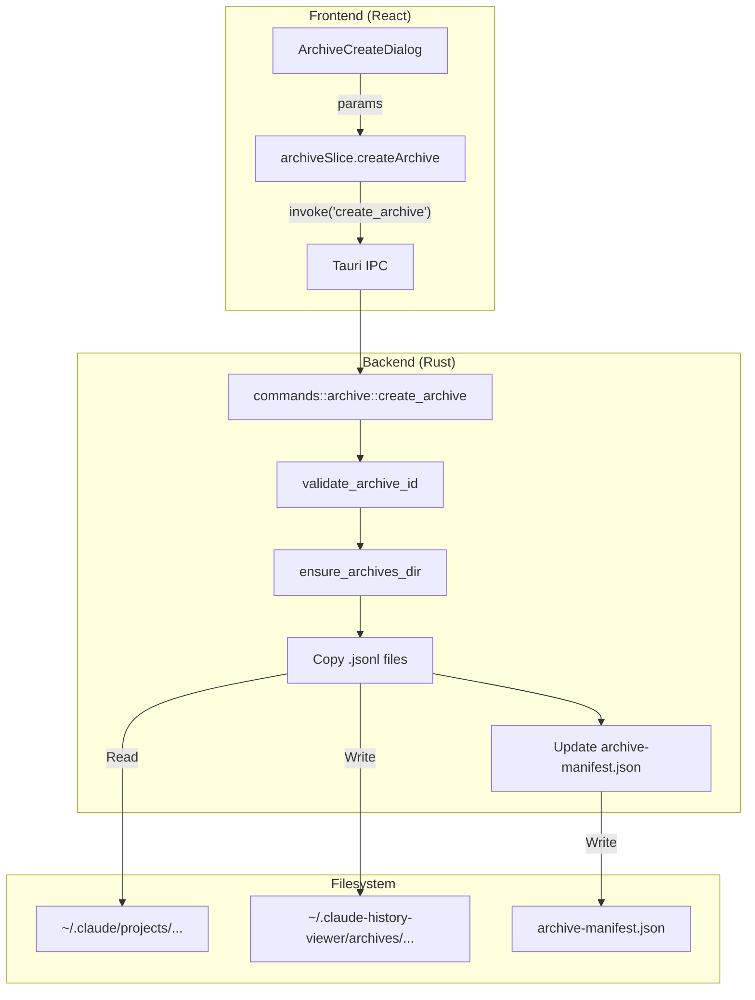
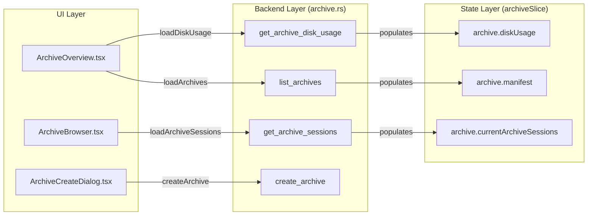

# Archive Manager

<details>
<summary>Relevant source files</summary>

The following files were used as context for generating this wiki page:

- [src-tauri/src/commands/archive.rs](src-tauri/src/commands/archive.rs)
- [src-tauri/src/commands/session/load.rs](src-tauri/src/commands/session/load.rs)
- [src-tauri/src/models/session.rs](src-tauri/src/models/session.rs)
- [src-tauri/src/models/snapshot_tests.rs](src-tauri/src/models/snapshot_tests.rs)
- [src-tauri/src/models/snapshots/claude_code_history_viewer_lib__models__snapshot_tests__session_snapshots__claude_session.snap](src-tauri/src/models/snapshots/claude_code_history_viewer_lib__models__snapshot_tests__session_snapshots__claude_session.snap)
- [src/components/ArchiveManager/ArchiveBrowser.tsx](src/components/ArchiveManager/ArchiveBrowser.tsx)
- [src/components/ArchiveManager/ArchiveOverview.tsx](src/components/ArchiveManager/ArchiveOverview.tsx)
- [src/hooks/useProjectSessions.ts](src/hooks/useProjectSessions.ts)
- [src/i18n/locales/en/archive.json](src/i18n/locales/en/archive.json)
- [src/i18n/locales/ja/archive.json](src/i18n/locales/ja/archive.json)
- [src/i18n/locales/ko/archive.json](src/i18n/locales/ko/archive.json)
- [src/i18n/locales/zh-CN/archive.json](src/i18n/locales/zh-CN/archive.json)
- [src/i18n/locales/zh-TW/archive.json](src/i18n/locales/zh-TW/archive.json)
- [src/store/slices/archiveSlice.ts](src/store/slices/archiveSlice.ts)
- [src/test/ArchiveBrowser.test.tsx](src/test/ArchiveBrowser.test.tsx)
- [src/test/archiveSlice.test.ts](src/test/archiveSlice.test.ts)
- [src/test/useProjectSessions.test.tsx](src/test/useProjectSessions.test.tsx)
- [src/types/archive.ts](src/types/archive.ts)
- [src/types/core/session.ts](src/types/core/session.ts)

</details>


The Archive Manager provides a comprehensive system for preserving, organizing, and browsing AI conversation histories. It is specifically designed to mitigate data loss caused by Claude Code's automatic cleanup policies (which typically delete sessions after 30 days) by allowing users to create permanent archives in a dedicated storage location.

## Overview

The Archive Manager consists of a Rust backend that handles filesystem operations and a React frontend for user interaction. Archives are stored in `~/.claude-history-viewer/archives/` [src-tauri/src/commands/archive.rs:135-138](), separate from the provider's native storage. Each archive contains copies of the session JSONL files and a global `archive-manifest.json` that tracks metadata across all archives [src-tauri/src/commands/archive.rs:158-160]().

### Key Features
- **Archive Creation**: Select specific sessions from any project to bundle into a named archive.
- **Expiration Tracking**: Identifies sessions nearing their deletion threshold (based on `cleanupPeriodDays` in Claude settings) [src/components/ArchiveManager/ArchiveOverview.tsx:101-112]().
- **Subagent Support**: Optionally includes subagent conversation logs when archiving a main session [src-tauri/src/commands/archive.rs:62-63]().
- **Disk Management**: Provides a breakdown of storage usage across all created archives [src-tauri/src/commands/archive.rs:92-99]().

---

## Data Models

The archive system uses structured manifests to maintain portability and performance.

### ArchiveManifest
The global manifest stored at the root of the archives directory.
| Field | Type | Description |
| :--- | :--- | :--- |
| `version` | `u32` | Schema version for migrations [src-tauri/src/commands/archive.rs:36](). |
| `archives` | `Vec<ArchiveEntry>` | List of all archives managed by the system [src-tauri/src/commands/archive.rs:37](). |

### ArchiveEntry
Metadata for a single archive folder.
| Field | Type | Description |
| :--- | :--- | :--- |
| `id` | `String` | Filesystem-safe unique identifier [src-tauri/src/commands/archive.rs:53](). |
| `name` | `String` | Human-readable name [src-tauri/src/commands/archive.rs:54](). |
| `source_project_path` | `String` | The original path the sessions were copied from [src-tauri/src/commands/archive.rs:58](). |
| `session_count` | `u32` | Number of sessions contained in the archive [src-tauri/src/commands/archive.rs:60](). |

### ArchiveSessionInfo
Metadata for an individual session file within an archive, allowing the UI to browse content without re-parsing the entire JSONL file [src-tauri/src/commands/archive.rs:68-80]().

**Sources:** [src-tauri/src/commands/archive.rs:32-80](), [src/types/archive.ts:6-36]()

---

## Backend Implementation

The backend logic is implemented in `src-tauri/src/commands/archive.rs`. It manages the physical movement of files and the integrity of the manifest.

### Archive Storage Structure
```text
~/.claude-history-viewer/archives/
├── archive-manifest.json
├── [archive_id_1]/
│   ├── sessions/
│   │   ├── session_1.jsonl
│   │   └── session_2.jsonl
│   └── subagents/
│       └── [session_1]/
│           └── subagent_a.jsonl
└── [archive_id_2]/
    └── ...
```

### Key Commands
- `create_archive`: Validates the archive ID, creates the directory structure, copies session files, and updates the manifest [src-tauri/src/commands/archive.rs:260-350]().
- `list_archives`: Reads and returns the `archive-manifest.json` [src-tauri/src/commands/archive.rs:434-445]().
- `get_archive_sessions`: Scans an archive directory and generates `ArchiveSessionInfo` for each file [src-tauri/src/commands/archive.rs:498-550]().
- `export_session`: Reads an archived JSONL file and returns its content as a string for frontend download [src-tauri/src/commands/archive.rs:720-740]().

### Archive Logic Flow
The following diagram illustrates the process of creating an archive from existing provider sessions.

**Archive Creation Data Flow**

**Sources:** [src-tauri/src/commands/archive.rs:260-350](), [src/store/slices/archiveSlice.ts:124-137](), [src/components/ArchiveManager/ArchiveCreateDialog.tsx]()

---

## Frontend Components

The Archive Manager UI is split into two primary views managed by `archive.activeTab` in the state [src/store/slices/archiveSlice.ts:33]().

### 1. ArchiveOverview
The landing page for the manager. It provides:
- **Disk Usage**: Visual cards showing total archives, sessions, and bytes used [src/components/ArchiveManager/ArchiveOverview.tsx:11-16]().
- **Expiring Sessions**: A list of sessions from the currently selected project that are within the `thresholdDays` of being deleted by Claude Code [src/components/ArchiveManager/ArchiveOverview.tsx:87-98]().
- **Settings**: Configuration for `cleanupPeriodDays` (synced with Claude settings) and `thresholdDays` (local preference) [src/components/ArchiveManager/ArchiveOverview.tsx:49-62]().

### 2. ArchiveBrowser
A file-explorer-like interface for managing existing archives:
- **Expansion**: Clicking an archive loads its session list via `loadArchiveSessions` [src/components/ArchiveManager/ArchiveBrowser.tsx:98-108]().
- **Management**: Actions to rename or delete archives. Renaming an archive also renames its physical directory on disk [src-tauri/src/commands/archive.rs:360-400]().
- **Export**: Individual sessions can be exported back to the filesystem as JSON files [src/components/ArchiveManager/ArchiveBrowser.tsx:142-178]().

### Component Association Map
This diagram bridges the UI components to the underlying state and backend commands.

**Archive Component-Command Map**

**Sources:** [src/store/slices/archiveSlice.ts:46-66](), [src/components/ArchiveManager/ArchiveBrowser.tsx:50-60](), [src/components/ArchiveManager/ArchiveOverview.tsx:30-41]()

---

## State Management (archiveSlice)

The `archiveSlice` manages the lifecycle of archive data and the status of asynchronous operations.

### State Shape
The slice tracks several loading states to provide granular UI feedback (e.g., `isCreatingArchive`, `isLoadingSessions`) [src/store/slices/archiveSlice.ts:34-41]().

### Key Actions
- `loadArchives()`: Fetches the manifest from the backend [src/store/slices/archiveSlice.ts:110-122]().
- `loadArchiveSessions(id)`: Fetches sessions for a specific archive. It uses a `requestId` counter to prevent race conditions if the user switches archives rapidly [src/store/slices/archiveSlice.ts:185-215]().
- `createArchive(params)`: Sends session paths to the backend and reloads the manifest upon success [src/store/slices/archiveSlice.ts:124-137]().

**Sources:** [src/store/slices/archiveSlice.ts:24-92]()
