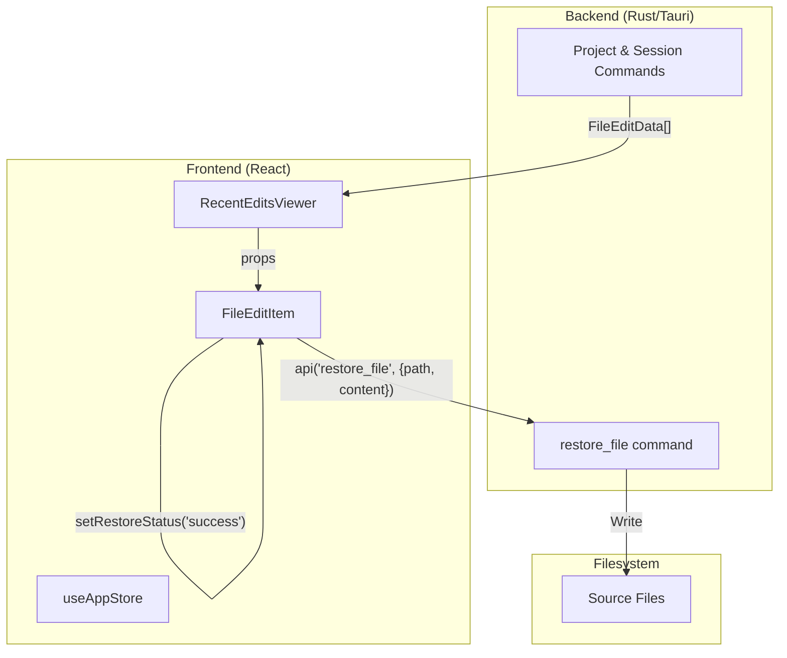
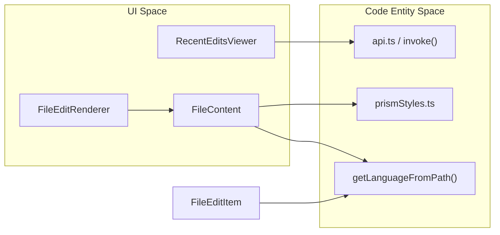

# Recent Edits Viewer

Relevant source files

The following files were used as context for generating this wiki page:

- [src/components/FileContent.tsx](src/components/FileContent.tsx)
- [src/components/RecentEditsViewer/FileEditItem.tsx](src/components/RecentEditsViewer/FileEditItem.tsx)
- [src/components/RecentEditsViewer/RecentEditsViewer.tsx](src/components/RecentEditsViewer/RecentEditsViewer.tsx)
- [src/components/SessionBoard/ExpandedCard.tsx](src/components/SessionBoard/ExpandedCard.tsx)
- [src/components/common/index.ts](src/components/common/index.ts)
- [src/components/contentRenderer/TaskNotificationRenderer.tsx](src/components/contentRenderer/TaskNotificationRenderer.tsx)
- [src/components/contentRenderer/WebFetchToolResultRenderer.tsx](src/components/contentRenderer/WebFetchToolResultRenderer.tsx)
- [src/components/messageRenderer/SummaryMessageRenderer.tsx](src/components/messageRenderer/SummaryMessageRenderer.tsx)
- [src/components/toolResultRenderer/ClaudeSessionHistoryRenderer.tsx](src/components/toolResultRenderer/ClaudeSessionHistoryRenderer.tsx)
- [src/components/toolResultRenderer/FileEditRenderer.tsx](src/components/toolResultRenderer/FileEditRenderer.tsx)
- [src/components/toolResultRenderer/StructuredPatchRenderer.tsx](src/components/toolResultRenderer/StructuredPatchRenderer.tsx)
- [src/test/ClaudeContentArrayRenderer.test.tsx](src/test/ClaudeContentArrayRenderer.test.tsx)
- [src/test/FileEditItem.test.tsx](src/test/FileEditItem.test.tsx)

The **Recent Edits Viewer** provides a specialized interface for tracking, reviewing, and reverting file modifications performed by AI agents across coding sessions. It aggregates edits into a unified view, allowing users to inspect code changes via syntax-highlighted previews and restore previous file versions through direct backend integration.

## Component Overview

The system is composed of two primary frontend components and a backend command bridge.

### RecentEditsViewer
The top-level container that manages the list of modifications, search state, and pagination logic. It supports real backend pagination to handle large volumes of session history without performance degradation [src/components/RecentEditsViewer/RecentEditsViewer.tsx:1-6]().

### FileEditItem
A granular component representing a single file modification. It handles local UI states for expansion, copying content to the clipboard, and triggering the file restoration workflow [src/components/RecentEditsViewer/FileEditItem.tsx:1-5]().

### Data Flow and Interaction
The following diagram illustrates how file edit data flows from the backend to the UI and how a restoration request is processed.

**File Edit and Restoration Flow**

Sources: [src/components/RecentEditsViewer/RecentEditsViewer.tsx:19-26](), [src/components/RecentEditsViewer/FileEditItem.tsx:64-85]()

## Technical Implementation

### File Edit Data Model
Edits are represented by the `FileEditData` structure, which includes the file path, the operation type (write vs edit), diff statistics, and the full content after the change.

| Field | Description |
| :--- | :--- |
| `file_path` | Absolute or relative path to the modified file. |
| `operation_type` | Categorized as `write` (new file) or `edit` (modification). |
| `lines_added` | Count of lines inserted. |
| `lines_removed` | Count of lines deleted. |
| `content_after_change`| The complete resulting file content. |

Sources: [src/test/FileEditItem.test.tsx:16-24](), [src/components/RecentEditsViewer/FileEditItem.tsx:152-163]()

### Content Rendering Logic
The `FileEditItem` dynamically selects a renderer based on the file extension to ensure optimal readability:
*   **Markdown Files**: Files ending in `.md` or `.markdown` are rendered using the `Markdown` component to show formatted prose, tables, and lists [src/components/RecentEditsViewer/FileEditItem.tsx:11-11](), [src/test/FileEditItem.test.tsx:70-88]().
*   **Code Files**: Other extensions use `Prism` via `prism-react-renderer` for syntax highlighting, incorporating custom styles for line numbers and tokens [src/components/RecentEditsViewer/FileEditItem.tsx:24-35](), [src/test/FileEditItem.test.tsx:57-68]().

### Restoration Workflow
The restoration process uses the `restore_file` backend command:
1.  **Confirmation**: The user triggers `handleRestoreClick`, which sets `showConfirmDialog` to true [src/components/RecentEditsViewer/FileEditItem.tsx:60-62]().
2.  **Execution**: Upon confirmation, `handleRestoreConfirm` invokes the backend `api` with the file path and the `content_after_change` [src/components/RecentEditsViewer/FileEditItem.tsx:64-72]().
3.  **State Management**: The component tracks a `RestoreStatus` (`idle` | `loading` | `success` | `error`) to provide visual feedback via the `RotateCcw` and `Loader2` icons [src/components/RecentEditsViewer/FileEditItem.tsx:42-44](), [src/components/RecentEditsViewer/FileEditItem.tsx:68-84]().

## Integration with Other Systems

The Recent Edits Viewer bridges several subsystems to provide a cohesive experience.

**System Entity Association**

Sources: [src/components/RecentEditsViewer/FileEditItem.tsx:46-46](), [src/components/FileContent.tsx:45-134](), [src/components/toolResultRenderer/FileEditRenderer.tsx:7-8]()

### Relationship to Message View
While the `RecentEditsViewer` provides a global history of edits, the `FileEditRenderer` is used within the `MessageViewer` to show specific edits as they occurred in the conversation flow [src/components/toolResultRenderer/FileEditRenderer.tsx:17-51](). Both components share logic for path formatting and diff visualization via `EnhancedDiffViewer` [src/components/toolResultRenderer/FileEditRenderer.tsx:120-126]().

### Pagination and Filtering
The viewer implements client-side filtering for currently loaded results while relying on the backend for fetching additional batches.
*   **Search**: Filters by both `file_path` and `content_after_change` [src/components/RecentEditsViewer/RecentEditsViewer.tsx:44-54]().
*   **Load More**: The `handleShowMore` callback triggers the `onLoadMore` prop, which communicates with the Rust backend to fetch the next set of edits based on the current `pagination` state [src/components/RecentEditsViewer/RecentEditsViewer.tsx:37-41]().

Sources: [src/components/RecentEditsViewer/RecentEditsViewer.tsx:9-17](), [src/components/RecentEditsViewer/FileEditItem.tsx:1-35](), [src/components/FileContent.tsx:1-21]()
