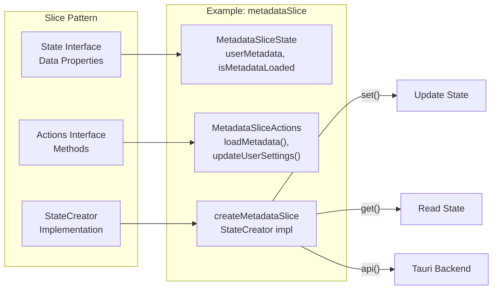

# State Management

<details>
<summary>Relevant source files</summary>

The following files were used as context for generating this wiki page:

- [src-tauri/src/commands/mod.rs](src-tauri/src/commands/mod.rs)
- [src-tauri/src/lib.rs](src-tauri/src/lib.rs)
- [src-tauri/src/models.rs](src-tauri/src/models.rs)
- [src/App.tsx](src/App.tsx)
- [src/components/MessageViewer.tsx](src/components/MessageViewer.tsx)
- [src/components/ProjectTree.tsx](src/components/ProjectTree.tsx)
- [src/components/SettingsManager/sections/CustomDirectoriesSection.tsx](src/components/SettingsManager/sections/CustomDirectoriesSection.tsx)
- [src/hooks/index.ts](src/hooks/index.ts)
- [src/store/slices/metadataSlice.ts](src/store/slices/metadataSlice.ts)
- [src/store/slices/providerSlice.ts](src/store/slices/providerSlice.ts)
- [src/store/slices/searchSlice.ts](src/store/slices/searchSlice.ts)
- [src/store/useAppStore.ts](src/store/useAppStore.ts)
- [src/test/ProjectTree.worktree.test.tsx](src/test/ProjectTree.worktree.test.tsx)
- [src/test/metadataSlice.test.ts](src/test/metadataSlice.test.ts)
- [src/types/core/project.ts](src/types/core/project.ts)
- [src/types/index.ts](src/types/index.ts)

</details>


This document describes the state management system used throughout the Claude Code History Viewer application. The system is built on Zustand and follows a modular slice pattern to manage application state across 15 specialized domain slices.

For backend data access and command execution, see [Backend Systems](#5). For component-level usage patterns, see [Core Components](#3).

---

## Architecture Overview

The application uses a **combined Zustand store** pattern where a single store is composed of multiple domain-specific slices. Each slice owns a distinct area of application state and exposes both state properties and action methods.

### Combined Store Pattern

```mermaid
graph TB
    useAppStore["useAppStore<br/>(Combined Store)"]
    
    subgraph "Domain Slices"
        ProjectSlice["projectSlice<br/>Projects & Sessions"]
        MessageSlice["messageSlice<br/>Messages & Pagination"]
        SearchSlice["searchSlice<br/>Search State"]
        AnalyticsSlice["analyticsSlice<br/>View Routing"]
        BoardSlice["boardSlice<br/>Board State"]
        MetadataSlice["metadataSlice<br/>User Preferences"]
        SettingsSlice["settingsSlice<br/>App Settings"]
        GlobalStatsSlice["globalStatsSlice<br/>Global Stats"]
        CaptureModeSlice["captureModeSlice<br/>Capture Mode"]
        FilterSlice["filterSlice<br/>Date Filters"]
        NavigationSlice["navigationSlice<br/>Nav History"]
        WatcherSlice["watcherSlice<br/>File Watcher"]
        NavigatorSlice["navigatorSlice<br/>TOC Panel"]
        ProviderSlice["providerSlice<br/>Multi-Provider"]
        ArchiveSlice["archiveSlice<br/>Archive Mgmt"]
    end
    
    subgraph "Components"
        App["App.tsx"]
        ProjectTree["ProjectTree"]
        SessionBoard["SessionBoard"]
        MessageViewer["MessageViewer"]
        Analytics["AnalyticsDashboard"]
    end
    
    ProjectSlice --> useAppStore
    MessageSlice --> useAppStore
    SearchSlice --> useAppStore
    AnalyticsSlice --> useAppStore
    BoardSlice --> useAppStore
    MetadataSlice --> useAppStore
    SettingsSlice --> useAppStore
    GlobalStatsSlice --> useAppStore
    CaptureModeSlice --> useAppStore
    FilterSlice --> useAppStore
    NavigationSlice --> useAppStore
    WatcherSlice --> useAppStore
    NavigatorSlice --> useAppStore
    ProviderSlice --> useAppStore
    ArchiveSlice --> useAppStore
    
    App --> useAppStore
    ProjectTree --> useAppStore
    SessionBoard --> useAppStore
    MessageViewer --> useAppStore
    Analytics --> useAppStore
```



**Sources:** [src/store/useAppStore.ts:1-118](), [src/App.tsx:23-68]()

The combined store is created by merging all slices in [src/store/useAppStore.ts:101-117]():

```typescript
export const useAppStore = create<AppStore>()((...args) => ({
  ...createProjectSlice(...args),
  ...createMessageSlice(...args),
  ...createSearchSlice(...args),
  // ... 12 more slices
}));
```

Each component accesses only the state and actions it needs through selector functions, minimizing unnecessary re-renders. For details on how these slices are composed, see [Store Architecture](#4.1).

---

## Slice Architecture

Each slice follows a consistent pattern with three main parts: **State Interface**, **Actions Interface**, and **Slice Creator**.

### Slice Pattern Structure



**Sources:** [src/store/slices/metadataSlice.ts:25-86]()

### State Interface Pattern

Each slice defines its state shape with TypeScript interfaces. For example, the metadata slice defines user preferences [src/store/slices/metadataSlice.ts:25-34]():

```typescript
export interface MetadataSliceState {
  userMetadata: UserMetadata;
  isMetadataLoaded: boolean;
  isMetadataLoading: boolean;
  metadataError: string | null;
}
```

### Actions Interface Pattern

Actions are methods that modify state or trigger side effects [src/store/slices/metadataSlice.ts:40-84]():

```typescript
export interface MetadataSliceActions {
  loadMetadata: () => Promise<void>;
  updateSessionMetadata: (sessionId: string, update: Partial<SessionMetadata>) => Promise<void>;
  updateUserSettings: (update: Partial<UserSettings>) => Promise<void>;
  // ...
}
```

### Slice Creator Pattern

The slice creator uses Zustand's `StateCreator` type and receives `set` and `get` functions [src/store/slices/metadataSlice.ts:103-108]():

```typescript
export const createMetadataSlice: StateCreator<
  FullAppStore,
  [],
  [],
  MetadataSlice
> = (set, get) => ({
  ...initialMetadataState,
  // ... action implementations
});
```

For a full list of all 15 slices and their responsibilities, see [State Slices](#4.2).

---

## State Slices Overview

### Project and Provider Management
The system handles multiple AI providers (Claude Code, Aider, Cline, etc.) by aggregating their data into a unified project tree.
- **Project Slice**: Manages the hierarchy of projects and sessions [src/store/useAppStore.ts:10-12]().
- **Provider Slice**: Tracks which providers are active and detected on the system [src/store/useAppStore.ts:62-64]().

### Content and Search
- **Message Slice**: Handles the loading and pagination of conversation messages [src/store/useAppStore.ts:14-16]().
- **Search Slice**: Manages global and session-level search state [src/store/useAppStore.ts:18-20]().

### Metadata and Settings
- **Metadata Slice**: Manages user-defined data like session names, stars, and hidden projects [src/store/slices/metadataSlice.ts:1-7]().
- **Settings Slice**: Interacts with the backend to manage provider-specific configuration files [src/store/useAppStore.ts:26-28]().

For detailed documentation on each slice, see [State Slices](#4.2).

---

## State Access Patterns

### Direct Access Pattern

Components destructure needed state and actions from the store [src/App.tsx:24-68]():

```typescript
const {
  projects,
  sessions,
  selectedProject,
  updateUserSettings,
  getEffectiveGroupingMode,
  // ... more destructured items
} = useAppStore();
```

### Computed Properties

Some slices expose computed properties through logic in action methods or dedicated getter functions [src/store/slices/metadataSlice.ts:57-63]():

```typescript
// Example usage in App.tsx
const groupingMode = getEffectiveGroupingMode();
const { groups: worktreeGroups } = getGroupedProjects();
```

**Sources:** [src/App.tsx:163-165](), [src/store/slices/metadataSlice.ts:209-216]()

---

## Backend Integration

State slices integrate with the Rust backend through Tauri's IPC mechanism.

### Command Invocation Flow

```mermaid
sequenceDiagram
    participant Component
    participant Store["useAppStore<br/>(Zustand)"]
    participant Action["Slice Action<br/>(e.g., loadMetadata)"]
    participant API["api.ts"]
    participant Backend["Rust Backend<br/>(commands)"]
    participant FileSystem["File System"]
    
    Component->>Store: "useAppStore()"
    Store-->>Component: "{ loadMetadata, ... }"
    Component->>Action: "loadMetadata()"
    Action->>Action: "set({ isMetadataLoading: true })"
    Action->>API: "api('load_user_metadata')"
    API->>Backend: "IPC: load_user_metadata"
    Backend->>FileSystem: "Read user-data.json"
    FileSystem-->>Backend: "JSON Data"
    Backend-->>API: "UserMetadata"
    API-->>Action: "UserMetadata object"
    Action->>Action: "set({ userMetadata, isMetadataLoaded: true })"
    Action-->>Component: "State updated"
```

**Sources:** [src/store/slices/metadataSlice.ts:111-130](), [src-tauri/src/lib.rs:141-146]()

### Common Backend Commands

| Slice | Action | Tauri Command | Backend File |
|-------|--------|---------------|--------------|
| metadataSlice | `loadMetadata()` | `load_user_metadata` | [src-tauri/src/lib.rs:142]() |
| projectSlice | `scanProjects()` | `scan_all_projects` | [src-tauri/src/lib.rs:186]() |
| messageSlice | `selectSession()` | `load_provider_messages` | [src-tauri/src/lib.rs:188]() |
| settingsSlice | `loadSettings()` | `get_all_settings` | [src-tauri/src/lib.rs:167]() |

---

## Data Models

The state management system relies on a set of unified data models that bridge the gap between the Rust backend and the TypeScript frontend.

- **Frontend Types**: Located in `src/types/`, these define the structure of state properties [src/types/index.ts:1-271]().
- **Backend Models**: Located in `src-tauri/src/models/`, these define the serializable structures used in Rust [src-tauri/src/models.rs:1-20]().

For a full breakdown of these structures, see [Data Models](#4.3).
