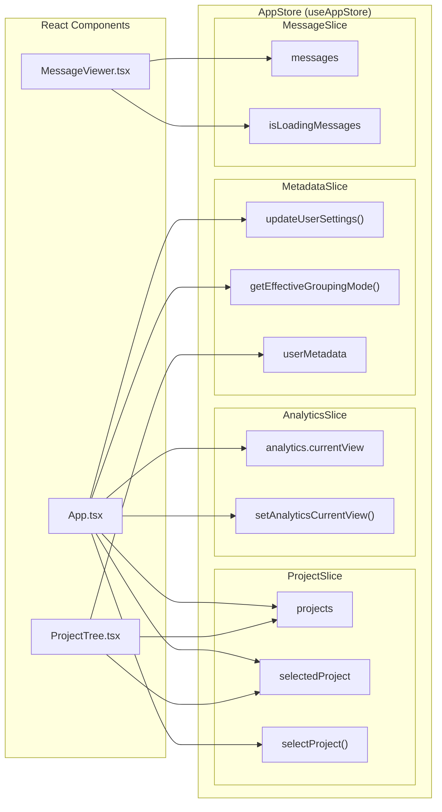

# Store Architecture

<details>
<summary>Relevant source files</summary>

The following files were used as context for generating this wiki page:

- [src-tauri/src/commands/mod.rs](src-tauri/src/commands/mod.rs)
- [src-tauri/src/lib.rs](src-tauri/src/lib.rs)
- [src-tauri/src/models.rs](src-tauri/src/models.rs)
- [src/App.tsx](src/App.tsx)
- [src/components/MessageViewer.tsx](src/components/MessageViewer.tsx)
- [src/components/ProjectTree.tsx](src/components/ProjectTree.tsx)
- [src/components/SettingsManager/sections/CustomDirectoriesSection.tsx](src/components/SettingsManager/sections/CustomDirectoriesSection.tsx)
- [src/hooks/index.ts](src/hooks/index.ts)
- [src/store/slices/metadataSlice.ts](src/store/slices/metadataSlice.ts)
- [src/store/slices/providerSlice.ts](src/store/slices/providerSlice.ts)
- [src/store/slices/searchSlice.ts](src/store/slices/searchSlice.ts)
- [src/store/useAppStore.ts](src/store/useAppStore.ts)
- [src/test/ProjectTree.worktree.test.tsx](src/test/ProjectTree.worktree.test.tsx)
- [src/test/metadataSlice.test.ts](src/test/metadataSlice.test.ts)
- [src/types/core/project.ts](src/types/core/project.ts)
- [src/types/index.ts](src/types/index.ts)

</details>


This page describes how `useAppStore` is constructed from composable slice modules, the type contracts each slice must satisfy, and the access patterns components use to read and write state.

---

## Overview

All frontend application state is held in a single Zustand store exported as `useAppStore` from [src/store/useAppStore.ts:101-117](). The store is assembled by spreading fifteen independent *slice creators* into one object at creation time. Each slice owns a distinct domain of state and declares both a state shape and a set of action functions.

Slices are not separate stores — they share one Zustand atom, so any slice action can read or mutate state from any other slice via the shared `get()` and `set()` closures provided by the `StateCreator` pattern.

Sources: [src/store/useAppStore.ts:1-6](), [src/store/useAppStore.ts:101-117]()

---

## Combined Store Type

The exported `AppStore` type is a flat intersection of all slice types:

[src/store/useAppStore.ts:81-95]()

```typescript
export type AppStore = ProjectSlice &
  MessageSlice &
  SearchSlice &
  AnalyticsSlice &
  SettingsSlice &
  GlobalStatsSlice &
  MetadataSlice &
  CaptureModeSlice &
  BoardSlice &
  FilterSlice &
  NavigationSlice &
  WatcherSlice &
  NavigatorSlice &
  ProviderSlice &
  ArchiveSlice;
```

Each `*Slice` type is typically the intersection of a state interface (e.g., `MetadataSliceState`) and an actions interface (e.g., `MetadataSliceActions`) defined within the respective slice file.

Sources: [src/store/useAppStore.ts:81-95](), [src/store/slices/metadataSlice.ts:25-86]()

---

## Slice Inventory

The table below lists every slice in the order they are spread during store creation:

| Slice Type | Creator Function | Source File |
|---|---|---|
| `ProjectSlice` | `createProjectSlice` | `src/store/slices/projectSlice.ts` |
| `MessageSlice` | `createMessageSlice` | `src/store/slices/messageSlice.ts` |
| `SearchSlice` | `createSearchSlice` | `src/store/slices/searchSlice.ts` |
| `AnalyticsSlice` | `createAnalyticsSlice` | `src/store/slices/analyticsSlice.ts` |
| `SettingsSlice` | `createSettingsSlice` | `src/store/slices/settingsSlice.ts` |
| `GlobalStatsSlice` | `createGlobalStatsSlice` | `src/store/slices/globalStatsSlice.ts` |
| `MetadataSlice` | `createMetadataSlice` | `src/store/slices/metadataSlice.ts` |
| `CaptureModeSlice` | `createCaptureModeSlice` | `src/store/slices/captureModeSlice.ts` |
| `BoardSlice` | `createBoardSlice` | `src/store/slices/boardSlice.ts` |
| `FilterSlice` | `createFilterSlice` | `src/store/slices/filterSlice.ts` |
| `NavigationSlice` | `createNavigationSlice` | `src/store/slices/navigationSlice.ts` |
| `WatcherSlice` | `createWatcherSlice` | `src/store/slices/watcherSlice.ts` |
| `NavigatorSlice` | `createNavigatorSlice` | `src/store/slices/navigatorSlice.ts` |
| `ProviderSlice` | `createProviderSlice` | `src/store/slices/providerSlice.ts` |
| `ArchiveSlice` | `createArchiveSlice` | `src/store/slices/archiveSlice.ts` |

Sources: [src/store/useAppStore.ts:10-68](), [src/store/useAppStore.ts:101-117]()

---

## Store Composition Diagram

The diagram below shows how the store is assembled at the module level from individual code entities.

**Store composition: slice creators → AppStore**

```mermaid
graph TD
  subgraph "useAppStore.ts"
    AS["useAppStore (Zustand)"]
  end

  subgraph "Slice creators (store/slices/)"
    S1["createProjectSlice"]
    S2["createMessageSlice"]
    S3["createSearchSlice"]
    S4["createAnalyticsSlice"]
    S5["createSettingsSlice"]
    S6["createGlobalStatsSlice"]
    S7["createMetadataSlice"]
    S8["createCaptureModeSlice"]
    S9["createBoardSlice"]
    S10["createFilterSlice"]
    S11["createNavigationSlice"]
    S12["createWatcherSlice"]
    S13["createNavigatorSlice"]
    S14["createProviderSlice"]
    S15["createArchiveSlice"]
  end

  S1 --> AS
  S2 --> AS
  S3 --> AS
  S4 --> AS
  S5 --> AS
  S6 --> AS
  S7 --> AS
  S8 --> AS
  S9 --> AS
  S10 --> AS
  S11 --> AS
  S12 --> AS
  S13 --> AS
  S14 --> AS
  S15 --> AS
```



Sources: [src/store/useAppStore.ts:101-117]()

---

## Slice Internal Structure

Each slice file follows a consistent internal layout where state and actions are merged. The `FullAppStore` type (often imported from `./slices/types`) allows each slice to access the entire store state via the `get()` parameter in the creator.

**Slice structure pattern (e.g., MetadataSlice)**

```mermaid
classDiagram
  class "MetadataSliceState" {
    +userMetadata: UserMetadata
    +isMetadataLoaded: boolean
    +isMetadataLoading: boolean
    +metadataError: string | null
  }
  class "MetadataSliceActions" {
    +loadMetadata() Promise~void~
    +saveMetadata() Promise~void~
    +updateSessionMetadata(sessionId, update) Promise~void~
    +updateUserSettings(update) Promise~void~
  }
  class "MetadataSlice" {
  }
  class "createMetadataSlice" {
    <<StateCreator>>
    +set: SetState~FullAppStore~
    +get: GetState~FullAppStore~
  }

  "MetadataSliceState" <|-- "MetadataSlice"
  "MetadataSliceActions" <|-- "MetadataSlice"
  "createMetadataSlice" ..> "MetadataSlice" : returns
```

Sources: [src/store/slices/metadataSlice.ts:25-86](), [src/store/slices/metadataSlice.ts:103-108]()

---

## Store Access Patterns in Components

Components access the store using the `useAppStore` hook.

### 1. Destructured hook (Full state read)

The main `App.tsx` component typically destructures a large number of state variables and actions directly from the hook to drive the layout and initialization logic.

[src/App.tsx:24-68]()

```typescript
const {
  projects,
  sessions,
  selectedProject,
  selectedSession,
  selectProject,
  selectSession,
  updateUserSettings,
  getEffectiveGroupingMode,
  // ...
} = useAppStore();
```

### 2. Direct state access (Outside React)

`useAppStore.getState()` is used for imperative reads, such as inside event handlers or when comparing current state during an async operation to avoid closure staleness.

[src/App.tsx:185](), [src/App.tsx:220](), [src/App.tsx:227]()

```typescript
const currentProject = useAppStore.getState().selectedProject;
const activeView = useAppStore.getState().analytics.currentView;
```

---

## Component–Store Wiring Diagram

The diagram below maps major UI components to the store fields and actions they consume, bridging the UI space to the store's code entities.

**Components and their store access**



Sources: [src/App.tsx:24-68](), [src/App.tsx:163-177](), [src/App.tsx:185-199](), [src/test/ProjectTree.worktree.test.tsx:17-37]()

---

## Re-exported Types

`useAppStore.ts` re-exports common search-related types from the slice definitions for convenience to avoid deep imports:

[src/store/useAppStore.ts:71-75]()

```typescript
export type {
  SearchMatch,
  SearchFilterType,
  SearchState,
} from "./slices/types";
```

Sources: [src/store/useAppStore.ts:71-75]()
