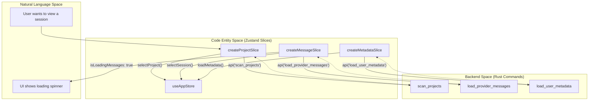
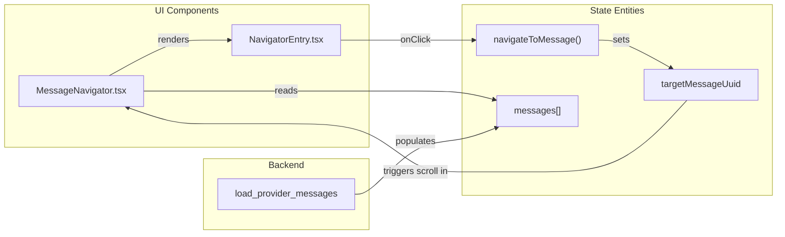

# State Slices

Relevant source files

The following files were used as context for generating this wiki page:

- [src-tauri/benches/performance.rs](src-tauri/benches/performance.rs)
- [src-tauri/src/commands/project.rs](src-tauri/src/commands/project.rs)
- [src-tauri/src/commands/stats.rs](src-tauri/src/commands/stats.rs)
- [src/components/AnalyticsDashboard/utils/projectCalculations.ts](src/components/AnalyticsDashboard/utils/projectCalculations.ts)
- [src/components/ArchiveManager/ArchiveBrowser.tsx](src/components/ArchiveManager/ArchiveBrowser.tsx)
- [src/components/ArchiveManager/ArchiveOverview.tsx](src/components/ArchiveManager/ArchiveOverview.tsx)
- [src/components/MessageNavigator/MessageNavigator.tsx](src/components/MessageNavigator/MessageNavigator.tsx)
- [src/components/MessageViewer/MessageViewer.tsx](src/components/MessageViewer/MessageViewer.tsx)
- [src/components/SettingsManager/sections/CustomDirectoriesSection.tsx](src/components/SettingsManager/sections/CustomDirectoriesSection.tsx)
- [src/hooks/useAnalytics.ts](src/hooks/useAnalytics.ts)
- [src/hooks/useProjectSessions.ts](src/hooks/useProjectSessions.ts)
- [src/i18n/locales/en/message.json](src/i18n/locales/en/message.json)
- [src/i18n/locales/ja/message.json](src/i18n/locales/ja/message.json)
- [src/i18n/locales/ko/message.json](src/i18n/locales/ko/message.json)
- [src/i18n/locales/zh-CN/message.json](src/i18n/locales/zh-CN/message.json)
- [src/i18n/locales/zh-TW/message.json](src/i18n/locales/zh-TW/message.json)
- [src/services/analyticsApi.ts](src/services/analyticsApi.ts)
- [src/store/slices/archiveSlice.ts](src/store/slices/archiveSlice.ts)
- [src/store/slices/filterSlice.ts](src/store/slices/filterSlice.ts)
- [src/store/slices/globalStatsSlice.ts](src/store/slices/globalStatsSlice.ts)
- [src/store/slices/messageSlice.ts](src/store/slices/messageSlice.ts)
- [src/store/slices/metadataSlice.ts](src/store/slices/metadataSlice.ts)
- [src/store/slices/projectSlice.ts](src/store/slices/projectSlice.ts)
- [src/store/slices/providerSlice.ts](src/store/slices/providerSlice.ts)
- [src/store/slices/searchSlice.ts](src/store/slices/searchSlice.ts)
- [src/store/slices/types.ts](src/store/slices/types.ts)
- [src/test/ArchiveBrowser.test.tsx](src/test/ArchiveBrowser.test.tsx)
- [src/test/MessageNavigator.accessibility.test.tsx](src/test/MessageNavigator.accessibility.test.tsx)
- [src/test/archiveSlice.test.ts](src/test/archiveSlice.test.ts)
- [src/test/globalStatsSlice.test.ts](src/test/globalStatsSlice.test.ts)
- [src/test/metadataSlice.test.ts](src/test/metadataSlice.test.ts)
- [src/test/projectCalculations.test.ts](src/test/projectCalculations.test.ts)
- [src/test/useProjectSessions.test.tsx](src/test/useProjectSessions.test.tsx)

This page documents the individual domain slices that compose the application's Zustand store. Each slice manages a specific domain of application state with dedicated state properties and actions. For information about the overall store architecture and slice pattern, see [4.1 Store Architecture]().

---

## Overview

The application uses a **slice pattern** to organize state management. Each slice is a self-contained module that defines state properties, exposes actions to modify that state, and handles communication with Tauri backend commands via the `api` service.

All slices are combined into a single store using Zustand's composition pattern at `useAppStore.ts`.

**Sources:** [src/store/slices/types.ts:95-188](), [src/store/slices/projectSlice.ts:112-117]()

---

## Slice Architecture Pattern

The following diagram bridges the Natural Language concepts of "App State" to the specific Code Entities used in the Zustand store.

Title: State Slice Composition and Data Flow

**Pattern Details:**
Each slice follows a strict structure to ensure type safety and prevent circular dependencies:
1.  **State Interface**: Defines typed state properties.
2.  **Actions Interface**: Defines async/sync action methods.
3.  **Combined Type**: Union of state and actions (e.g., `ProjectSlice = ProjectSliceState & ProjectSliceActions`).
4.  **Creator Function**: A `StateCreator<FullAppStore, ...>` that returns initial state and action implementations [src/store/slices/projectSlice.ts:112-117]().

**Sources:** [src/store/slices/projectSlice.ts:28-54](), [src/store/slices/messageSlice.ts:45-82](), [src/store/slices/types.ts:63-69]()

---

## Core Data Slices

### ProjectSlice
Manages project discovery and folder scanning across multiple providers.

**State Shape:**
| Property | Type | Purpose |
|----------|------|---------|
| `claudePath` | `string` | Base path for provider data [src/store/slices/projectSlice.ts:29]() |
| `projects` | `ClaudeProject[]` | List of all scanned projects [src/store/slices/projectSlice.ts:30]() |
| `selectedProject` | `ClaudeProject \| null` | Currently active project [src/store/slices/projectSlice.ts:31]() |
| `sessions` | `ClaudeSession[]` | Sessions belonging to the selected project [src/store/slices/projectSlice.ts:32]() |

**Key Actions:**
*   `scanProjects()`: Triggers backend scanning for all available providers. It intentionally loads all providers' projects to allow instant client-side tab switching [src/store/slices/projectSlice.ts:190-201]().
*   `selectProject(project)`: Updates the selected project and triggers session loading via `load_project_sessions` [src/store/slices/projectSlice.ts:221-233]().
*   `getGroupedProjects()`: Utilizes `detectWorktreeGroupsHybrid` to organize projects by Git worktree [src/store/slices/projectSlice.ts:49]().

**Sources:** [src/store/slices/projectSlice.ts:28-54](), [src/store/slices/projectSlice.ts:190-233]()

### MessageSlice
Handles message loading, pagination, and session-level token analytics.

**State Shape:**
| Property | Type | Purpose |
|----------|------|---------|
| `messages` | `ClaudeMessage[]` | Messages for the selected session [src/store/slices/messageSlice.ts:46]() |
| `isLoadingMessages` | `boolean` | Message fetch state [src/store/slices/messageSlice.ts:48]() |
| `sessionTokenStats` | `SessionTokenStats \| null` | Token usage for the current session [src/store/slices/messageSlice.ts:50]() |
| `parentSessionStack` | `ClaudeSession[]` | Stack for SubAgent navigation [src/store/slices/messageSlice.ts:59]() |

**Key Actions:**
*   `selectSession(session)`: Fetches messages via `load_provider_messages`, applies sidechain/system filters, and clears the search index [src/store/slices/messageSlice.ts:164-200]().
*   `navigateToSubagent(subagent)`: Pushes current session to `parentSessionStack` and loads the subagent's conversation [src/store/slices/messageSlice.ts:78]().

**Sources:** [src/store/slices/messageSlice.ts:45-82](), [src/store/slices/messageSlice.ts:164-200]()

---

## Utility and Navigation Slices

### SearchSlice & FilterSlice
Manage the "KakaoTalk-style" search and message visibility.
*   **SearchSlice**: Tracks `sessionSearch` including `matches` (UUID and index) and `currentMatchIndex` [src/store/slices/types.ts:49-57]().
*   **FilterSlice**: Manages `messageFilter` for roles (user/assistant) and content types (text/thinking/toolCalls/commands) [src/components/MessageViewer/MessageViewer.tsx:89-92]().

### MetadataSlice
Manages user-defined metadata (renames, hidden projects) stored in `user-data.json`.
*   **Actions**: `updateSessionMetadata` allows custom renaming of sessions, which is persisted via the backend `update_session_metadata` command [src/store/slices/metadataSlice.ts:143-164]().
*   **Custom Paths**: Manages `customClaudePaths` for users who store history in non-standard directories [src/store/slices/metadataSlice.ts:72-77]().

### GlobalStatsSlice
Aggregates token usage and activity across all projects.
*   **State**: `globalSummary` (billing total) and `globalConversationSummary` (conversation only) [src/store/slices/globalStatsSlice.ts:21-22]().
*   **Logic**: Unlike `scanProjects`, `loadGlobalStats` filters by `activeProviders` on the server side because aggregation is expensive [src/store/slices/globalStatsSlice.ts:55-58]().

**Sources:** [src/store/slices/globalStatsSlice.ts:20-31](), [src/store/slices/metadataSlice.ts:40-84]()

---

## State Mapping: Message Navigation
This diagram maps the interaction between the `MessageNavigator` UI and the `MessageSlice` / `NavigationSlice` state.

Title: Message Navigator Code Entity Mapping

**Sources:** [src/components/MessageNavigator/MessageNavigator.tsx:42-45](), [src/store/slices/types.ts:177-198]()

---

## Backend Command Mapping
Mapping of Zustand slice actions to their corresponding Rust backend entities.

| Slice Action | Rust Command / Entity | Implementation Reference |
|--------------|-----------------------|--------------------------|
| `scanProjects` | `scan_projects` | [src-tauri/src/commands/project.rs:159]() |
| `loadGlobalStats` | `stats.rs` logic | [src-tauri/src/commands/stats.rs:208-241]() |
| `selectSession` | `load_provider_messages` | [src/store/slices/messageSlice.ts:192]() |
| `saveMetadata` | `save_user_metadata` | [src/store/slices/metadataSlice.ts:132]() |
| `getGitLog` | `get_git_log` | [src-tauri/src/commands/project.rs:12]() |

**Sources:** [src/store/slices/projectSlice.ts:190](), [src/store/slices/messageSlice.ts:192](), [src/store/slices/metadataSlice.ts:132](), [src-tauri/src/commands/stats.rs:208-241]()
