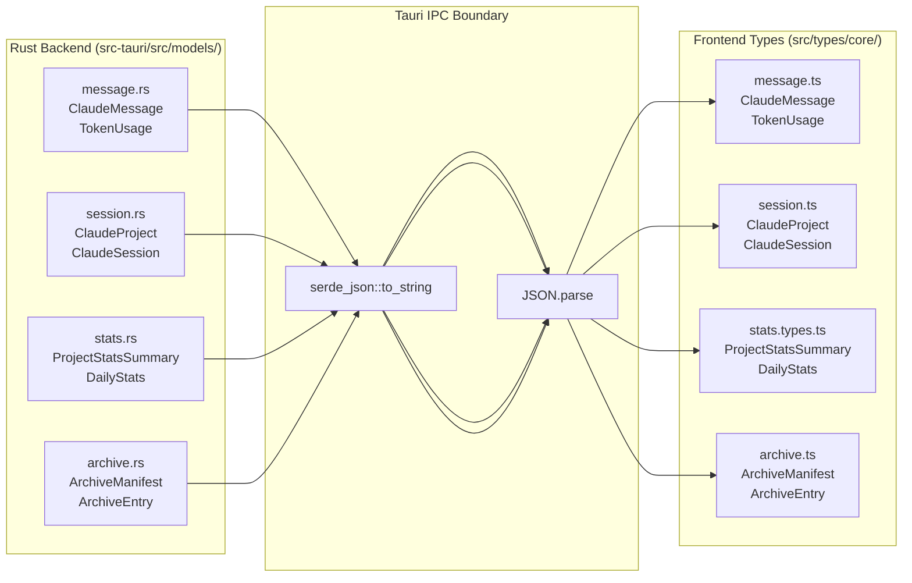
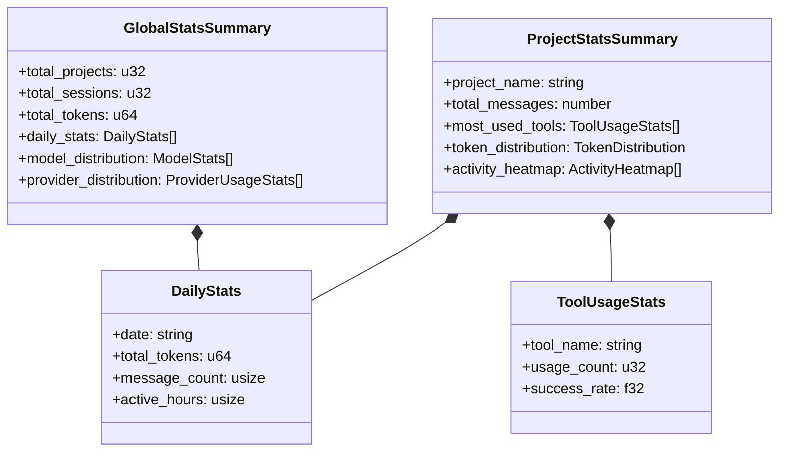

# Data Models

Relevant source files

The following files were used as context for generating this wiki page:

- [src-tauri/src/commands/archive.rs](src-tauri/src/commands/archive.rs)
- [src-tauri/src/commands/session/load.rs](src-tauri/src/commands/session/load.rs)
- [src-tauri/src/models/metadata.rs](src-tauri/src/models/metadata.rs)
- [src-tauri/src/models/session.rs](src-tauri/src/models/session.rs)
- [src-tauri/src/models/snapshot_tests.rs](src-tauri/src/models/snapshot_tests.rs)
- [src-tauri/src/models/snapshots/claude_code_history_viewer_lib__models__snapshot_tests__session_snapshots__claude_session.snap](src-tauri/src/models/snapshots/claude_code_history_viewer_lib__models__snapshot_tests__session_snapshots__claude_session.snap)
- [src-tauri/src/models/stats.rs](src-tauri/src/models/stats.rs)
- [src/components/MessageViewer/helpers/agentTaskHelpers.ts](src/components/MessageViewer/helpers/agentTaskHelpers.ts)
- [src/components/contentRenderer/ContainerUploadRenderer.tsx](src/components/contentRenderer/ContainerUploadRenderer.tsx)
- [src/components/contentRenderer/index.ts](src/components/contentRenderer/index.ts)
- [src/store/slices/analyticsSlice.ts](src/store/slices/analyticsSlice.ts)
- [src/types/content.types.ts](src/types/content.types.ts)
- [src/types/core/content.ts](src/types/core/content.ts)
- [src/types/core/session.ts](src/types/core/session.ts)
- [src/types/core/tool.ts](src/types/core/tool.ts)
- [src/types/message.types.ts](src/types/message.types.ts)
- [src/types/stats.types.ts](src/types/stats.types.ts)
- [src/types/tool.types.ts](src/types/tool.types.ts)
- [src/utils/contentTypeGuards.ts](src/utils/contentTypeGuards.ts)

This page documents the core data models used throughout the Claude Code History Viewer. These models define the structure of data as it flows from provider file systems through the Rust backend to the React frontend.

For how these models move through the application, see page 2.4 (Data Flow). For the state slices that hold them at runtime, see page 4.2 (State Slices).

## Overview

The application supports multiple providers (Claude Code, Codex CLI, OpenCode, Gemini CLI, Cline, Cursor, Aider). All providers normalize their data into a shared set of Rust structs, which are serialized across the Tauri IPC boundary into equivalent TypeScript types on the frontend.

Model layers:

1.  **Provider-specific raw data** — JSONL lines, SQLite databases, or JSON files on disk, varying by provider.
2.  **Core Rust structs** — `ClaudeProject`, `ClaudeSession`, `ClaudeMessage`, `TokenUsage`, `GitInfo` — defined in `src-tauri/src/models/`.
3.  **Frontend TypeScript types** — mirroring the Rust structs, defined in `src/types/core/`.
4.  **UI-augmented types** — `MessageNode`, `BoardSessionData`, and analytics views built on top of core types.
5.  **Statistics models** — `SessionTokenStats`, `ProjectStatsSummary`, etc.
6.  **Archive models** — `ArchiveManifest`, `ArchiveEntry` — for long-term session storage.

**Rust model module layout:**

The `src-tauri/src/models/` directory contains the source of truth for backend data structures.

| Submodule | Contents |
| :--- | :--- |
| `models/message.rs` | `ClaudeMessage`, `TokenUsage`, `RawLogEntry`, `MessageContent` |
| `models/session.rs` | `ClaudeSession`, `ClaudeProject`, `GitInfo`, `GitCommit`, `GitWorktreeType` |
| `models/metadata.rs` | `UserMetadata`, `SessionMetadata`, `ProjectMetadata`, `UserSettings` |
| `models/stats.rs` | `SessionTokenStats`, `ProjectStatsSummary`, `DailyStats`, `ToolUsageStats`, `GlobalStatsSummary` |

Sources: [src-tauri/src/models/session.rs:1-81](), [src-tauri/src/models/stats.rs:1-131](), [src-tauri/src/models/metadata.rs:1-32]()

**Rust-to-TypeScript model mapping:**

Title: Model Serialization Bridge

Sources: [src-tauri/src/models/session.rs:26-72](), [src/types/core/session.ts:45-83](), [src-tauri/src/commands/archive.rs:32-63]()

## Core Data Models

### `ClaudeProject`

Represents a project directory containing one or more sessions. It abstracts the differences between local Claude Code directories and virtual provider paths.

| Field | Type (Rust/TS) | Description |
| :--- | :--- | :--- |
| `name` | `String` / `string` | Display name of the project. |
| `path` | `String` / `string` | Internal storage path (e.g., `codex://path` or `~/.claude/projects/...`). |
| `actual_path` | `String` / `string` | Decoded real filesystem path. |
| `session_count` | `usize` / `number` | Total sessions found. |
| `message_count` | `usize` / `number` | Total messages (often estimated for performance). |
| `git_info` | `Option<GitInfo>` | Git worktree metadata. |
| `provider` | `Option<String>` | `claude`, `codex`, `opencode`, `aider`, `cline`, `cursor`, `gemini`. |
| `custom_directory_label`| `Option<String>` | Label for custom Claude directory sources. |

Sources: [src-tauri/src/models/session.rs:27-48](), [src/types/core/session.ts:45-62]()

### `ClaudeSession`

Represents a single conversation session.

| Field | Type (Rust/TS) | Description |
| :--- | :--- | :--- |
| `session_id` | `String` / `string` | Unique ID usually derived from the file path. |
| `actual_session_id` | `String` / `string` | The UUID found inside the conversation data. |
| `file_path` | `String` / `string` | Full path to the source file (JSONL/JSON/SQLite). |
| `has_tool_use` | `bool` / `boolean` | Flag indicating if tools were executed. |
| `summary` | `Option<String>` | AI-generated or derived session title. |
| `is_renamed` | `bool` / `boolean` | Whether the session was renamed via `/rename` command. |

Sources: [src-tauri/src/models/session.rs:51-72](), [src/types/core/session.ts:64-83]()

### `ClaudeMessage`

The primary unit of conversation. It supports multiple content types including text, tool calls, and tool results.

| Field | Type (Rust/TS) | Description |
| :--- | :--- | :--- |
| `uuid` | `String` / `string` | Unique message ID. |
| `parent_uuid` | `Option<String>` | Reference for conversation threading. |
| `message_type` | `String` / `string` | `user`, `assistant`, `system`, `summary`, `progress`, `file-history-snapshot`. |
| `content` | `Option<Value>` | Message body (string or `ContentItem[]`). |
| `usage` | `Option<TokenUsage>` | Token consumption metrics. |
| `cost_usd` | `Option<f64>` | Estimated cost in USD (2025 metrics). |
| `duration_ms` | `Option<u64>` | Performance metric for the turn. |

Sources: [src-tauri/src/models/snapshot_tests.rs:18-51](), [src/types/message.types.ts:157-240]()

### `TokenUsage`

Detailed breakdown of token consumption.

| Field | Type (Rust/TS) | Description |
| :--- | :--- | :--- |
| `input_tokens` | `u32` / `number` | Standard input tokens. |
| `output_tokens` | `u32` / `number` | Generated output tokens. |
| `cache_creation_input_tokens` | `u32` / `number` | Tokens written to prompt cache. |
| `cache_read_input_tokens` | `u32` / `number` | Tokens read from prompt cache. |

Sources: [src-tauri/src/models/snapshot_tests.rs:169-175](), [src/types/message.types.ts:104-110]()

## Analytics and Statistics Models

The `stats.rs` module defines structures for aggregated data.

Title: Analytics Data Hierarchy

Sources: [src-tauri/src/models/stats.rs:48-131](), [src/types/stats.types.ts:100-171]()

## User Metadata Models

The application stores user-specific customizations in `~/.claude-history-viewer/user-data.json`.

*   **`UserMetadata`**: Root structure containing maps for `sessions`, `projects`, and global `settings`. [src-tauri/src/models/metadata.rs:14-32]()
*   **`SessionMetadata`**: Stores `custom_name`, `starred` status, `tags`, and `notes`. [src-tauri/src/models/metadata.rs:143-161]()
*   **`ProjectMetadata`**: Stores `hidden` flag, `alias`, and `parent_project` for worktree grouping. [src-tauri/src/models/metadata.rs:174-188]()
*   **`UserSettings`**: Global preferences like `theme`, `language`, `hidden_patterns`, and `mcp_presets`. [src-tauri/src/models/metadata.rs:218-235]()

Sources: [src-tauri/src/models/metadata.rs:1-240]()

## Archive Models

Managed via the `archive.rs` command module, these models handle session preservation.

*   **`ArchiveManifest`**: The global list of all archives stored on disk. [src-tauri/src/commands/archive.rs:33-38]()
*   **`ArchiveEntry`**: Metadata for a single archive (source project, session count, total size). [src-tauri/src/commands/archive.rs:50-63]()
*   **`ArchiveSessionInfo`**: Detailed metadata for a session file within an archive, including subagent information. [src-tauri/src/commands/archive.rs:66-80]()

Sources: [src-tauri/src/commands/archive.rs:32-109]()

## Git Integration Models

The application detects git worktrees to group projects accurately.

*   **`GitWorktreeType`**: Enum representing `Main`, `Linked`, or `NotGit`. [src-tauri/src/models/session.rs:6-13]()
*   **`GitInfo`**: Contains the worktree type and the path to the main repository if it is a linked worktree. [src-tauri/src/models/session.rs:17-24]()
*   **`GitCommit`**: Structure for git log entries including `hash`, `author`, `date`, and `message`. [src-tauri/src/models/session.rs:75-81]()

## UI and Frontend Specific Models

### `AgentTask` and `AgentTaskGroupResult`
Used for grouping asynchronous agent operations (like `bash` or `mcp` calls) that span multiple messages.
*   **`AgentTask`**: Contains `agentId`, `description`, `status` (`completed`|`error`|`async_launched`), and `prompt`. [src/components/MessageViewer/helpers/agentTaskHelpers.ts:74-86]()
*   **`AgentTaskGroupResult`**: A collection of tasks and a `Set` of message UUIDs that belong to a specific temporal group (usually within a 2-second window). [src/components/MessageViewer/helpers/agentTaskHelpers.ts:92-95]()

### Cache Models
To speed up session loading, the backend uses a JSON-based cache (`.session_cache.json`) within each project directory.
*   **`CachedSessionMetadata`**: Stores file modification time, size, last processed offset, and a serialized `ClaudeSession` to avoid re-parsing JSONL files unless they change. [src-tauri/src/commands/session/load.rs:18-45]()
*   **`SessionMetadataCache`**: A versioned map of file paths to metadata entries. [src-tauri/src/commands/session/load.rs:48-54]()

Sources: [src-tauri/src/commands/session/load.rs:1-54](), [src/components/MessageViewer/helpers/agentTaskHelpers.ts:1-140]()
