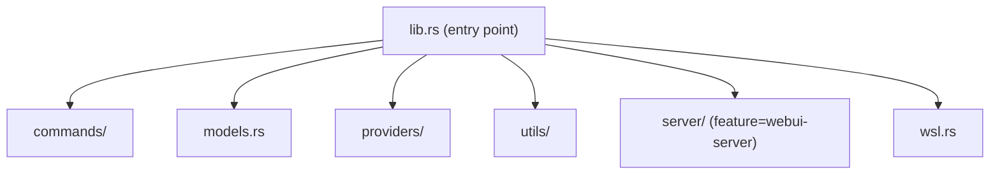
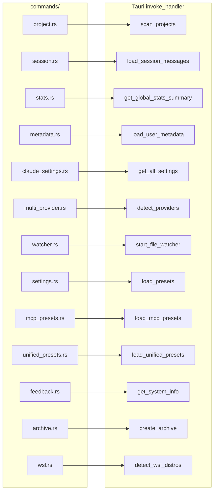
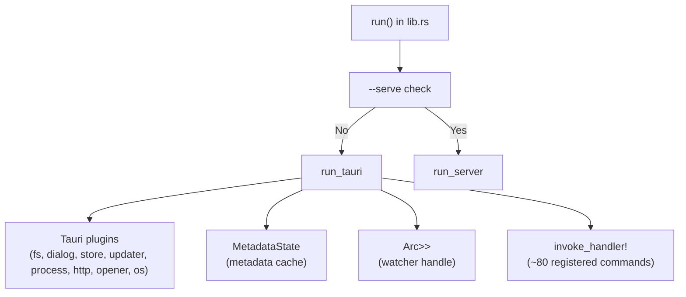
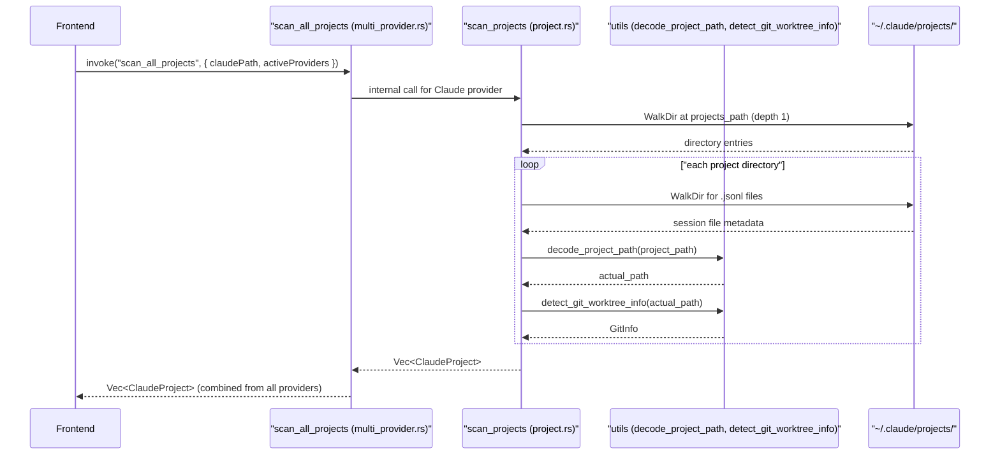

# Backend Systems

Relevant source files

The following files were used as context for generating this wiki page:

- [src-tauri/src/commands/mod.rs](src-tauri/src/commands/mod.rs)
- [src-tauri/src/lib.rs](src-tauri/src/lib.rs)
- [src-tauri/src/main.rs](src-tauri/src/main.rs)
- [src-tauri/src/models.rs](src-tauri/src/models.rs)
- [src/App.tsx](src/App.tsx)
- [src/components/MessageViewer.tsx](src/components/MessageViewer.tsx)
- [src/components/ProjectTree.tsx](src/components/ProjectTree.tsx)
- [src/hooks/index.ts](src/hooks/index.ts)
- [src/store/useAppStore.ts](src/store/useAppStore.ts)
- [src/test/ProjectTree.worktree.test.tsx](src/test/ProjectTree.worktree.test.tsx)
- [src/types/core/project.ts](src/types/core/project.ts)
- [src/types/index.ts](src/types/index.ts)

This page provides an overview of the Rust backend that powers Claude Code History Viewer. It covers the overall module structure, the Tauri command registration surface, the managed application state, and how commands are organized by domain. It also introduces the headless WebUI server mode.

For detailed documentation of specific subsystems, see:
- [Project and Session Commands](#5.1)
- [Statistics and Analytics](#5.2)
- [Settings Management](#5.3)
- [File Watcher](#5.4)
- [Provider Implementations](#5.5)
- [WebUI Server Mode](#5.6)
- [WSL Support](#5.7)
- For the IPC boundary and end-to-end data flow, see [Data Flow](#2.4)
- For the frontend store that consumes command results, see [State Management](#4)

---

## Module Structure

The backend lives entirely inside `src-tauri/src/`. It is divided into several top-level Rust modules.

| Module | Path | Purpose |
|---|---|---|
| `commands` | `src-tauri/src/commands/` | All `#[tauri::command]` handler functions |
| `models` | `src-tauri/src/models.rs` | Serializable data structs shared with the frontend |
| `providers` | `src-tauri/src/providers/` | Provider-specific scanning and loading logic |
| `utils` | `src-tauri/src/utils/` | Path decoding, git detection, parsing helpers |
| `server` | `src-tauri/src/server/` | Axum HTTP server for headless mode (optional feature) |
| `wsl` | `src-tauri/src/wsl.rs` | Windows Subsystem for Linux detection and interop |

Sources: [src-tauri/src/lib.rs:1-9](), [src-tauri/src/commands/mod.rs:1-14]()

---

**Top-level module layout**

Sources: [src-tauri/src/lib.rs:1-9]()

---

## Commands Module

The `commands` module is subdivided by domain. Each submodule owns the `#[tauri::command]` functions for one feature area.

| Submodule | File | Key Commands |
|---|---|---|
| `project` | `commands/project.rs` | `scan_projects`, `get_claude_folder_path`, `validate_claude_folder`, `get_git_log` |
| `session` | `commands/session.rs` | `load_project_sessions`, `load_session_messages`, `load_session_messages_paginated`, `search_messages`, `get_recent_edits`, `restore_file`, `rename_session_native`, `reset_session_native_name`, `rename_opencode_session_title` |
| `stats` | `commands/stats.rs` | `get_session_token_stats`, `get_project_token_stats`, `get_project_stats_summary`, `get_session_comparison`, `get_global_stats_summary` |
| `metadata` | `commands/metadata.rs` | `load_user_metadata`, `save_user_metadata`, `update_session_metadata`, `update_project_metadata`, `update_user_settings`, `is_project_hidden`, `get_session_display_name` |
| `claude_settings` | `commands/claude_settings.rs` | `get_settings_by_scope`, `save_settings`, `get_all_settings`, `get_mcp_servers`, `get_all_mcp_servers`, `save_mcp_servers`, `get_claude_json_config`, `read_text_file`, `write_text_file` |
| `multi_provider` | `commands/multi_provider.rs` | `detect_providers`, `scan_all_projects`, `load_provider_sessions`, `load_provider_messages`, `search_all_providers` |
| `watcher` | `commands/watcher.rs` | `start_file_watcher`, `stop_file_watcher` |
| `settings` | `commands/settings.rs` | `save_preset`, `load_presets`, `get_preset`, `delete_preset` |
| `mcp_presets` | `commands/mcp_presets.rs` | `save_mcp_preset`, `load_mcp_presets`, `get_mcp_preset`, `delete_mcp_preset` |
| `unified_presets` | `commands/unified_presets.rs` | `save_unified_preset`, `load_unified_presets`, `get_unified_preset`, `delete_unified_preset` |
| `feedback` | `commands/feedback.rs` | `get_system_info`, `open_github_issues`, `send_feedback` |
| `archive` | `commands/archive.rs` | `create_archive`, `list_archives`, `get_archive_sessions`, `export_session` |
| `wsl` | `commands/wsl.rs` | `detect_wsl_distros`, `is_wsl_available` |

Sources: [src-tauri/src/lib.rs:13-55](), [src-tauri/src/commands/mod.rs:1-14]()

---

**Command module to Tauri command mapping**

Sources: [src-tauri/src/lib.rs:117-193](), [src-tauri/src/commands/mod.rs:1-14]()

---

## Application Entry Point and Managed State

`lib.rs` contains the `run()` function that constructs the Tauri application. It registers Tauri plugins and two pieces of global managed state.

| Managed Type | Usage |
|---|---|
| `MetadataState` | Cached user metadata (custom session names, hidden projects, settings). Defined in `commands/metadata.rs`. |
| `Arc<Mutex<Option<Debouncer<RecommendedWatcher>>>>` | Live handle to the file watcher. Held as `None` until `start_file_watcher` is called. |

Sources: [src-tauri/src/lib.rs:58-116]()

---

## Models Module

`models.rs` aggregates five submodules into a flat public namespace via `pub use`.

| Submodule | Exports |
|---|---|
| `session` | `ClaudeProject`, `ClaudeSession`, `GitInfo`, `GitWorktreeType`, `ProviderInfo` |
| `message` | `ClaudeMessage`, `RawClaudeMessage`, `ContentItem`, tool result types |
| `stats` | `SessionTokenStats`, `ProjectStatsSummary`, `GlobalStatsSummary`, `StatsMode` |
| `metadata` | `UserMetadata`, `UserSettings`, `SessionMetadata`, `ProjectMetadata` |
| `edit` | `RecentFileEdit`, `RecentEditsResult` |

All these types derive `serde::Serialize` / `serde::Deserialize` and are transmitted across the IPC boundary (Tauri) or HTTP API (Server) as JSON.

Sources: [src-tauri/src/models.rs:1-20]()

---

## Project Scanning Flow

`scan_projects` in `commands/project.rs` is a primary entry point for discovering Claude Code conversation data on disk. For multi-provider support, `scan_all_projects` in `commands/multi_provider.rs` coordinates across available providers.

Sources: [src-tauri/src/commands/project.rs:35-38](), [src-tauri/src/commands/multi_provider.rs:31-33](), [src-tauri/src/lib.rs:31-38]()

Key behaviors:
- Directories with zero `.jsonl` files are skipped entirely during Claude project scanning.
- Message counts are estimated from file size to keep scanning fast.
- `decode_project_path` converts encoded directory names (e.g. `-Users-jack-myproject`) back to real filesystem paths.
- `detect_git_worktree_info` determines whether the project is a main git repo or a linked worktree.

Sources: [src-tauri/src/commands/project.rs:35-38](), [src-tauri/src/lib.rs:31-38]()

---

## Headless Server Mode

When compiled with the `webui-server` feature, the application can run as a headless REST API server. This is triggered by passing the `--serve` flag.

- **Engine**: Axum HTTP server.
- **Endpoints**: Mirror the Tauri commands (e.g., `POST /api/scan_projects`).
- **Real-time**: Server-Sent Events (SSE) for file watcher updates.
- **Auth**: Bearer token authentication.

For details, see [WebUI Server Mode](#5.6).

Sources: [src-tauri/src/lib.rs:7-9](), [src-tauri/src/lib.rs:60-67]()

---

## Tauri Plugins Registered

The `run_tauri()` function loads the following Tauri plugins before building the app:

| Plugin | Crate | Purpose |
|---|---|---|
| `tauri_plugin_fs` | `tauri-plugin-fs` | Filesystem access from frontend JS |
| `tauri_plugin_dialog` | `tauri-plugin-dialog` | Native file/folder dialogs |
| `tauri_plugin_store` | `tauri-plugin-store` | Persistent key-value store |
| `tauri_plugin_updater` | `tauri-plugin-updater` | In-app update checking |
| `tauri_plugin_process` | `tauri-plugin-process` | Process management (restart, exit) |
| `tauri_plugin_http` | `tauri-plugin-http` | HTTP client for feedback/updates |
| `tauri_plugin_opener` | `tauri-plugin-opener` | Open URLs and files externally |
| `tauri_plugin_os` | `tauri-plugin-os` | OS detection for system info |

Sources: [src-tauri/src/lib.rs:102-109]()
