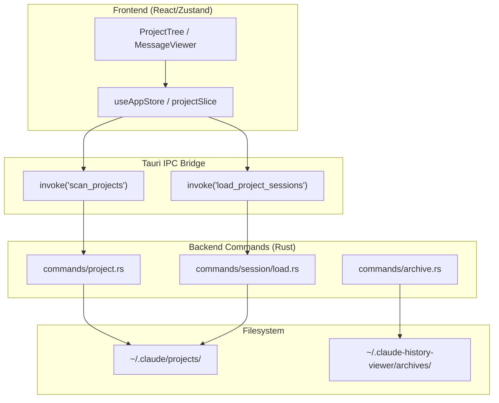
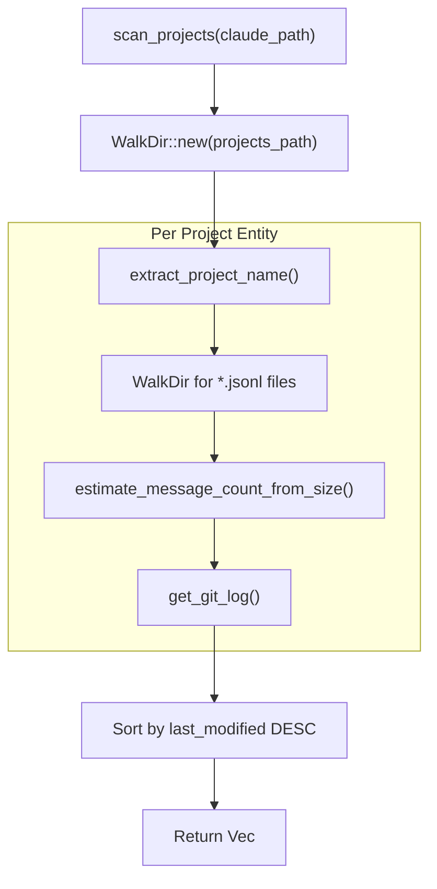

# Project and Session Commands

<details>
<summary>Relevant source files</summary>

The following files were used as context for generating this wiki page:

- [.spec-placeholder](.spec-placeholder)
- [docs/specs/issue-80-session-sorting-search.md](docs/specs/issue-80-session-sorting-search.md)
- [src-tauri/src/commands/archive.rs](src-tauri/src/commands/archive.rs)
- [src-tauri/src/commands/project.rs](src-tauri/src/commands/project.rs)
- [src-tauri/src/commands/session/delete.rs](src-tauri/src/commands/session/delete.rs)
- [src-tauri/src/commands/session/load.rs](src-tauri/src/commands/session/load.rs)
- [src-tauri/src/commands/session/rename.rs](src-tauri/src/commands/session/rename.rs)
- [src-tauri/src/models/session.rs](src-tauri/src/models/session.rs)
- [src-tauri/src/models/snapshot_tests.rs](src-tauri/src/models/snapshot_tests.rs)
- [src-tauri/src/models/snapshots/claude_code_history_viewer_lib__models__snapshot_tests__session_snapshots__claude_session.snap](src-tauri/src/models/snapshots/claude_code_history_viewer_lib__models__snapshot_tests__session_snapshots__claude_session.snap)
- [src/components/MessageViewer/MessageViewer.tsx](src/components/MessageViewer/MessageViewer.tsx)
- [src/components/NativeRenameDialog.tsx](src/components/NativeRenameDialog.tsx)
- [src/components/ProjectTree/components/SessionList.tsx](src/components/ProjectTree/components/SessionList.tsx)
- [src/components/ProjectTree/components/__tests__/SessionList.test.tsx](src/components/ProjectTree/components/__tests__/SessionList.test.tsx)
- [src/components/contentRenderer/UnifiedToolExecutionRenderer.tsx](src/components/contentRenderer/UnifiedToolExecutionRenderer.tsx)
- [src/components/contentRenderer/unifiedCards/AgentCard.tsx](src/components/contentRenderer/unifiedCards/AgentCard.tsx)
- [src/components/contentRenderer/unifiedCards/BashCard.tsx](src/components/contentRenderer/unifiedCards/BashCard.tsx)
- [src/components/contentRenderer/unifiedCards/DefaultCard.tsx](src/components/contentRenderer/unifiedCards/DefaultCard.tsx)
- [src/components/contentRenderer/unifiedCards/EditCard.tsx](src/components/contentRenderer/unifiedCards/EditCard.tsx)
- [src/components/contentRenderer/unifiedCards/GlobCard.tsx](src/components/contentRenderer/unifiedCards/GlobCard.tsx)
- [src/components/contentRenderer/unifiedCards/GrepCard.tsx](src/components/contentRenderer/unifiedCards/GrepCard.tsx)
- [src/components/contentRenderer/unifiedCards/ReadCard.tsx](src/components/contentRenderer/unifiedCards/ReadCard.tsx)
- [src/components/contentRenderer/unifiedCards/ResultBlock.tsx](src/components/contentRenderer/unifiedCards/ResultBlock.tsx)
- [src/components/contentRenderer/unifiedCards/StatusBadge.tsx](src/components/contentRenderer/unifiedCards/StatusBadge.tsx)
- [src/components/contentRenderer/unifiedCards/shared.ts](src/components/contentRenderer/unifiedCards/shared.ts)
- [src/hooks/useNativeRename.ts](src/hooks/useNativeRename.ts)
- [src/store/slices/projectSlice.ts](src/store/slices/projectSlice.ts)
- [src/store/slices/types.ts](src/store/slices/types.ts)
- [src/types/core/session.ts](src/types/core/session.ts)
- [src/types/metadata.types.ts](src/types/metadata.types.ts)

</details>


## Purpose and Scope

This document covers the Rust backend Tauri commands responsible for:

- **Project discovery**: Locating, validating, and scanning conversation history sources for Claude Code, Codex CLI, OpenCode, and other supported providers.
- **Session loading**: Enumerating JSONL session files per project, with incremental caching and parallel parsing via `rayon`.
- **Message pagination**: Reading individual message pages from session JSONL files with SIMD-accelerated line detection.
- **Session management**: Renaming session titles at the file level and deleting sessions by moving them to the system trash.
- **Archive management**: Creating, listing, and managing persistent session archives in the user's home directory.

Sources: [src-tauri/src/commands/project.rs:1-10](), [src-tauri/src/commands/session/load.rs:1-15](), [src-tauri/src/commands/session/rename.rs:1-15](), [src-tauri/src/commands/session/delete.rs:1-11](), [src-tauri/src/commands/archive.rs:1-15]()

---

## Command Architecture

The project and session commands follow Tauri's IPC bridge pattern. Frontend TypeScript components invoke backend Rust functions through the `invoke()` API, which are then routed to the appropriate command modules.

### System Data Flow: Provider to UI



Sources: [src-tauri/src/commands/project.rs:159-160](), [src/store/slices/projectSlice.ts:190-205](), [src-tauri/src/commands/archive.rs:135-138]()

---

## Project Discovery Commands

### scan_projects

Recursively scans the provided `claude_path` (usually `~/.claude`) to discover projects. It estimates message counts and detects Git information for each project found.

**Function Signature:** [src-tauri/src/commands/project.rs:159-160]()

```rust
#[tauri::command]
pub async fn scan_projects(claude_path: String) -> Result<Vec<ClaudeProject>, String>
```

**Scanning Pipeline**



**Performance Optimizations:**
- **File Size Estimation:** Uses `estimate_message_count_from_size()` to avoid reading file contents during initial scan [src-tauri/src/commands/project.rs:200-201]().
- **WalkDir:** Uses `WalkDir` with `min_depth(1)` and `max_depth(1)` to efficiently list project directories [src-tauri/src/commands/project.rs:170-172]().

Sources: [src-tauri/src/commands/project.rs:159-215](), [src-tauri/src/utils.rs:66-70]()

---

## Session Loading and Caching

### load_project_sessions

Loads session metadata for a specific project. To maintain high performance with thousands of sessions, it utilizes a local JSON cache (`.session_cache.json`) and parallel processing.

**Caching Mechanism:**
- **Cache Structure**: Stores `modified_time`, `file_size`, and `last_byte_offset` to detect changes [src-tauri/src/commands/session/load.rs:18-45]().
- **Incremental Parsing**: If a file size has increased but the `mtime` is recent, it resumes parsing from the `last_byte_offset` [src-tauri/src/commands/session/load.rs:113-141]().
- **Parallelism**: Uses `rayon`'s `par_iter()` to parse multiple session files concurrently [src-tauri/src/commands/session/load.rs:773-775]().

### Message Pagination (`get_message_page`)

For large sessions, messages are loaded in pages. The backend uses memory mapping (`Mmap`) and SIMD-optimized line detection to quickly locate message boundaries without loading the entire file into memory.

Sources: [src-tauri/src/commands/session/load.rs:18-96](), [src-tauri/src/commands/session/load.rs:703-850](), [src-tauri/src/utils.rs:16-34]()

---

## Session Management

### Session Deletion (`delete_session`)

Moves a session's `.jsonl` file and its associated directory (containing subagent logs or tool results) to the system trash.

**Safety Checks:** [src-tauri/src/commands/session/delete.rs:14-43]()
1. Validates that the path is absolute.
2. Ensures the extension is exactly `.jsonl`.
3. Checks that the file is not a symlink to prevent accidental deletion of external data.

### Session Renaming (`rename_session_native`)

Supports renaming for Claude and OpenCode providers. For Claude Code, this involves injecting a `[Title]` prefix into the first user message within the `.jsonl` file.

Sources: [src-tauri/src/commands/session/delete.rs:11-58](), [src-tauri/src/commands/session/rename.rs:93-195]()

---

## Archive Commands

The archive system allows users to move sessions into a managed storage area at `~/.claude-history-viewer/archives/`.

### Data Models
- **ArchiveManifest**: A global list of all archives [src-tauri/src/commands/archive.rs:33-38]().
- **ArchiveEntry**: Metadata for a single archive, including source provider and session count [src-tauri/src/commands/archive.rs:50-63]().

### Key Archive Operations
| Command | Purpose |
|---------|---------|
| `create_archive` | Copies session files and subagent logs into a new archive directory [src-tauri/src/commands/archive.rs:360-365]() |
| `list_archives` | Reads the `archive-manifest.json` to list available archives [src-tauri/src/commands/archive.rs:253-257]() |
| `get_archive_sessions` | Lists session metadata stored within a specific archive [src-tauri/src/commands/archive.rs:641-645]() |
| `delete_archive` | Removes an archive directory and updates the manifest [src-tauri/src/commands/archive.rs:604-608]() |

Sources: [src-tauri/src/commands/archive.rs:33-119](), [src-tauri/src/commands/archive.rs:253-645]()

---

## Git Integration

The backend provides commands to fetch Git history for projects, which is used in the UI to correlate AI sessions with code commits.

### get_git_log

Executes the `git log` command in the project's `actual_path` to retrieve a list of recent commits.

**Logic:** [src-tauri/src/commands/project.rs:12-61]()
1. Validates the directory path.
2. Runs `git log -n {limit} --pretty=format:%H|%an|%at|%s`.
3. Parses the output into a `Vec<GitCommit>` structure.

Sources: [src-tauri/src/commands/project.rs:12-61](), [src-tauri/src/models/session.rs:75-81]()
