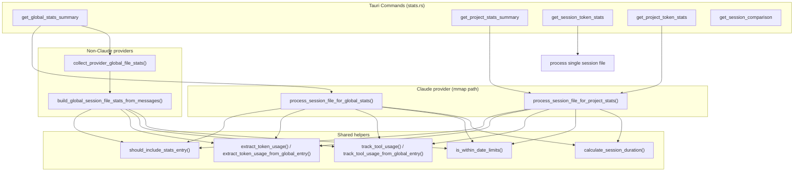
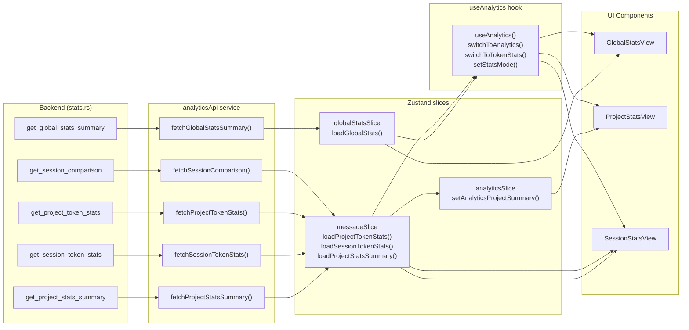

# Statistics and Analytics

<details>
<summary>Relevant source files</summary>

The following files were used as context for generating this wiki page:

- [src-tauri/benches/performance.rs](src-tauri/benches/performance.rs)
- [src-tauri/src/commands/stats.rs](src-tauri/src/commands/stats.rs)
- [src-tauri/src/models/stats.rs](src-tauri/src/models/stats.rs)
- [src/components/AnalyticsDashboard/utils/projectCalculations.ts](src/components/AnalyticsDashboard/utils/projectCalculations.ts)
- [src/hooks/useAnalytics.ts](src/hooks/useAnalytics.ts)
- [src/services/analyticsApi.ts](src/services/analyticsApi.ts)
- [src/store/slices/analyticsSlice.ts](src/store/slices/analyticsSlice.ts)
- [src/store/slices/globalStatsSlice.ts](src/store/slices/globalStatsSlice.ts)
- [src/store/slices/messageSlice.ts](src/store/slices/messageSlice.ts)
- [src/test/globalStatsSlice.test.ts](src/test/globalStatsSlice.test.ts)
- [src/test/projectCalculations.test.ts](src/test/projectCalculations.test.ts)
- [src/types/stats.types.ts](src/types/stats.types.ts)

</details>


This page documents the Rust backend logic in `src-tauri/src/commands/stats.rs` that computes token usage, tool usage, activity heatmaps, and session duration metrics at three scopes: per-session, per-project, and global (all projects across providers). It also covers how the frontend Zustand slices and the `useAnalytics` hook consume those results.

For the UI components that render these results, see [Analytics Dashboard (3.4)]() and [Analytics Views (3.4.1)](). For the per-session token statistics list UI, see [Token Stats Viewer (3.5)](). For multi-provider scanning that feeds the statistics pipeline, see [Multi-Provider System (2.5)]() and [Provider Implementations (5.5)]().

---

## StatsMode and Message Filtering

Every statistics computation is parameterized by a `StatsMode`, which controls which log entries contribute to the totals.

[src-tauri/src/commands/stats.rs:27-48]()

| `StatsMode` variant | String key | `include_sidechain()` | Included message types |
|---|---|---|---|
| `BillingTotal` (default) | `"billing_total"` | `true` | `user`, `assistant`, `system`, any noise type with usage data |
| `ConversationOnly` | `"conversation_only"` | `false` | `user`, `assistant` only |

`parse_stats_mode` converts the optional string parameter from the frontend into the enum; unknown strings fall back to `BillingTotal` with a warning. [src-tauri/src/commands/stats.rs:39-48]()

The entry-point gate is `should_include_stats_entry`:

[src-tauri/src/commands/stats.rs:95-122]()

```rust
should_include_stats_entry(message_type, is_sidechain, has_usage, mode)
```

Rules applied in order:
1. Always skip `"summary"` type entries. [src-tauri/src/commands/stats.rs:101-103]()
2. In `ConversationOnly` mode, skip sidechain messages (`isSidechain == true`). [src-tauri/src/commands/stats.rs:105-107]()
3. In `ConversationOnly` mode, only pass `user` / `assistant`. [src-tauri/src/commands/stats.rs:109-111]()
4. In `BillingTotal` mode, always pass core types (`user`, `assistant`, `system`). [src-tauri/src/commands/stats.rs:113-115]()
5. For noise types (`progress`, `queue-operation`, `file-history-snapshot`): only include if the entry has at least one token field set. [src-tauri/src/commands/stats.rs:117-119]()

Sources: [src-tauri/src/commands/stats.rs:27-122]()

---

## Provider Scoping

The stats module has its own internal `StatsProvider` enum (distinct from the broader provider system), used to tag which data source each result came from.

[src-tauri/src/commands/stats.rs:19-56]()

| `StatsProvider` | String ID | Detection |
|---|---|---|
| `Claude` | `"claude"` | Default; path does not match other prefixes [src-tauri/src/commands/stats.rs:163-171]() |
| `Codex` | `"codex"` | File path is `rollout-*.jsonl` or project path starts with `"codex://"` [src-tauri/src/commands/stats.rs:178-193]() |
| `OpenCode` | `"opencode"` | Session or project path starts with `"opencode://"` [src-tauri/src/commands/stats.rs:173-176]() |

`detect_project_provider` and `detect_session_provider` perform this classification at runtime. [src-tauri/src/commands/stats.rs:163-193]()

`parse_active_stats_providers` converts the frontend's `active_providers: Vec<String>` parameter into a `HashSet<StatsProvider>`. When `active_providers` is `None`, all three providers are included. [src-tauri/src/commands/stats.rs:134-161]()

Sources: [src-tauri/src/commands/stats.rs:19-193]()

---

## Intermediate Data Structures

**Diagram: Internal structs used during parallel processing**

```mermaid
classDiagram
    class "SessionFileStats"["SessionFileStats"] {
        +u32 total_messages
        +u64 total_tokens
        +TokenDistribution token_distribution
        +HashMap tool_usage
        +HashMap daily_stats
        +HashMap activity_data
        +HashMap model_usage
        +u64 session_duration_minutes
        +Option first_message
        +Option last_message
        +String project_name
        +StatsProvider provider
    }
    class "ProjectSessionFileStats"["ProjectSessionFileStats"] {
        +u32 total_messages
        +TokenDistribution token_distribution
        +HashMap tool_usage
        +HashMap daily_stats
        +HashMap activity_data
        +u32 session_duration_minutes
        +HashSet session_dates
        +Vec timestamps
    }
    class "GlobalStatsLogEntry"["GlobalStatsLogEntry"] {
        +String message_type
        +Option timestamp
        +Option is_sidechain
        +Option message
        +Option tool_use
        +Option tool_use_result
    }
    class "GlobalStatsMessageContent"["GlobalStatsMessageContent"] {
        +String role
        +Option content
        +Option model
        +Option usage
    }
    class "TokenDistribution"["TokenDistribution"] {
        +u64 input
        +u64 output
        +u64 cache_creation
        +u64 cache_read
    }
    "SessionFileStats" --> "TokenDistribution"
    "ProjectSessionFileStats" --> "TokenDistribution"
    "GlobalStatsLogEntry" --> "GlobalStatsMessageContent"
```

`SessionFileStats` is used for global-scope aggregation. `ProjectSessionFileStats` is used for project-scope aggregation. Both are collected in parallel across session files using Rayon.

`GlobalStatsLogEntry` is a **lightweight** deserialization target that skips expensive fields (snapshots, hook infos, full content arrays) present in `RawLogEntry`. This is an intentional performance optimization: global stats only need timestamps, usage counts, model names, and tool names. [src-tauri/src/commands/stats.rs:207-241]()

Sources: [src-tauri/src/commands/stats.rs:207-241](), [src-tauri/src/commands/stats.rs:383-397](), [src-tauri/src/commands/stats.rs:763-773]()

---

## Processing Pipeline

**Diagram: Stats computation call graph**



Sources: [src-tauri/src/commands/stats.rs:402-534](), [src-tauri/src/commands/stats.rs:570-760](), [src-tauri/src/commands/stats.rs:777-895]()

### Per-Session File Processing (Claude / global scope)

`process_session_file_for_global_stats` reads a `.jsonl` session file using memory-mapped I/O (`memmap2::Mmap`) and SIMD-accelerated JSON parsing (`simd_json`). The `find_line_ranges` utility locates newline boundaries without allocating per-line strings. [src-tauri/src/commands/stats.rs:402-425]()

Steps per line:
1. Parse into `GlobalStatsLogEntry` via `parse_global_stats_entry_simd`. [src-tauri/src/commands/stats.rs:444]()
2. Extract `TokenUsage` via `extract_token_usage_from_global_entry`. [src-tauri/src/commands/stats.rs:457]()
3. Check `should_include_stats_entry`. [src-tauri/src/commands/stats.rs:462]()
4. Apply date-range filter via `is_within_date_limits`. [src-tauri/src/commands/stats.rs:467]()
5. Accumulate: `total_messages`, `total_tokens`, `token_distribution`, `model_usage`, `activity_data` (hour × day), `daily_stats`. [src-tauri/src/commands/stats.rs:475-508]()
6. Track tool names via `track_tool_usage_from_global_entry`. [src-tauri/src/commands/stats.rs:510-513]()

### Per-Session File Processing (non-Claude providers)

For Codex and OpenCode, `collect_provider_global_file_stats` uses the provider-specific `load_messages` function to get `Vec<ClaudeMessage>`, then calls `build_global_session_file_stats_from_messages`. This is necessary because these providers store data in formats that require their own deserialization logic rather than raw JSONL line parsing. [src-tauri/src/commands/stats.rs:698-760]()

### Per-Session File Processing (project scope)

`process_session_file_for_project_stats` uses the full `RawLogEntry` → `ClaudeMessage` path (not the lightweight `GlobalStatsLogEntry`) because the project stats command also needs complete message content for certain fields. [src-tauri/src/commands/stats.rs:777-895]()

### Parallelism

Both global and project-scoped processing use `rayon::prelude::*` to process session files in parallel. [src-tauri/src/commands/stats.rs:738-757]()

---

## Token Extraction

`extract_token_usage` (for full `ClaudeMessage`) and `extract_token_usage_from_global_entry` (for `GlobalStatsLogEntry`) both implement a fallback chain:

1. `message.usage` field (most common for assistant messages). [src-tauri/src/commands/stats.rs:288]()
2. `message.content.usage` object (some providers embed usage inside content). [src-tauri/src/commands/stats.rs:305]()
3. `tool_use_result.usage` object. [src-tauri/src/commands/stats.rs:314]()
4. `tool_use_result.totalTokens` scalar fallback (assigned as `output_tokens` for assistant, `input_tokens` otherwise). [src-tauri/src/commands/stats.rs:324]()

`token_usage_totals` extracts the five values: `(input, output, cache_creation, cache_read, total)` with `unwrap_or(0)` on each `Option<u32>`. [src-tauri/src/commands/stats.rs:80-93]()

Sources: [src-tauri/src/commands/stats.rs:73-93](), [src-tauri/src/commands/stats.rs:943-988](), [src-tauri/src/commands/stats.rs:282-335]()

---

## Session Duration Calculation

`calculate_session_duration` implements an active-minutes algorithm with a 120-minute idle threshold (`SESSION_BREAK_THRESHOLD_MINUTES = 120`). [src-tauri/src/commands/stats.rs:537-568]()

**Algorithm:**
1. Sort all message timestamps.
2. Walk consecutive pairs. If the gap exceeds 120 minutes, close the current activity period and start a new one. [src-tauri/src/commands/stats.rs:555-558]()
3. Each period contributes `max(period_duration_minutes, 1)` to the total. [src-tauri/src/commands/stats.rs:563]()
4. A session with exactly one message contributes 1 minute. [src-tauri/src/commands/stats.rs:548]()

This prevents idle time between separate work sessions from inflating the reported duration. The same logic appears in three places and is extracted into the standalone `calculate_session_active_minutes` helper for direct session-scoped queries. [src-tauri/src/commands/stats.rs:1025-1055]()

---

## Tool Usage Tracking

`track_tool_usage` (for `ClaudeMessage`) and `track_tool_usage_from_global_entry` (for `GlobalStatsLogEntry`) both scan two locations for tool invocations:

1. The `assistant` message's `content` array — items where `type == "tool_use"`. [src-tauri/src/commands/stats.rs:905-917]()
2. The explicit `tool_use` field on the log entry, cross-referenced with `tool_use_result.is_error`. [src-tauri/src/commands/stats.rs:920-928]()

The accumulator is `HashMap<String, (u32, u32)>` where the tuple is `(usage_count, success_count)`. [src-tauri/src/commands/stats.rs:898]()

`build_tool_usage_stats` converts this map into a `Vec<ToolUsageStats>` sorted descending by `usage_count`, computing `success_rate = (success / usage) * 100.0`. [src-tauri/src/commands/stats.rs:1057-1074]()

---

## Date Filtering

Date filtering is applied at the individual message level, not the session level, so partial-session data within a date range is captured accurately. [src-tauri/src/commands/stats.rs:990-1023]()

| Function | Purpose |
|---|---|
| `parse_date_limit` | Parses an RFC3339 string from the frontend into `Option<DateTime<Utc>>` |
| `parse_timestamp_utc` | Parses a message's `timestamp` field |
| `is_within_date_limits` | Returns `true` if timestamp falls in `[s_limit, e_limit]`; passes all messages if both limits are `None` |

When `has_date_filter` is true but a message has no parseable timestamp, that message is excluded from date-filtered results. Without date filtering, messages with no timestamp still contribute to aggregates for tool usage and token counts. [src-tauri/src/commands/stats.rs:1008-1022]()

---

## Frontend Integration

**Diagram: Data flow from Tauri commands to UI**



Sources: [src/store/slices/globalStatsSlice.ts:59-137](), [src/store/slices/messageSlice.ts:328-647](), [src/hooks/useAnalytics.ts:1-9]()

### `globalStatsSlice`

`loadGlobalStats` in `globalStatsSlice` calls `fetchGlobalStatsSummary` twice in parallel — once with `"billing_total"` and once with `"conversation_only"` — then stores the results in `globalSummary` and `globalConversationSummary`. [src/store/slices/globalStatsSlice.ts:84-113]()

- Parallelism guard: a request ID (`nextRequestId("globalStats")`) is checked after the `await`; stale responses are discarded. [src/store/slices/globalStatsSlice.ts:114-116]()
- The `"conversation_only"` fetch is skipped entirely when `hasAnyConversationBreakdownProvider(activeProviders)` returns `false`. [src/store/slices/globalStatsSlice.ts:81-83]()
- `activeProviders` from the project tree tabs is forwarded directly to the backend as the provider scope. [src/store/slices/globalStatsSlice.ts:88-90]()

### `messageSlice`

Provides four stats-related actions:

| Action | Backend command | Description |
|---|---|---|
| `loadSessionTokenStats` | `get_session_token_stats` | Single session; fetches both billing and conversation variants [src/store/slices/messageSlice.ts:328-390]() |
| `loadProjectTokenStats` | `get_project_token_stats` | Paginated list (page size 20); resets pagination on new project [src/store/slices/messageSlice.ts:392-454]() |
| `loadMoreProjectTokenStats` | `get_project_token_stats` | Appends next page to existing list [src/store/slices/messageSlice.ts:456-521]() |
| `loadProjectStatsSummary` | `get_project_stats_summary` | Summary totals for a project [src/store/slices/messageSlice.ts:523-605]() |

### `useAnalytics` hook

`useAnalytics` orchestrates view transitions and data loading. It manages the `currentView` (e.g., `messages`, `tokenStats`, `analytics`) and provides computed properties like `isLoadingAnalytics`. [src/hooks/useAnalytics.ts:1-9]()

---

## Performance Benchmarking

The codebase includes a performance benchmark suite in `src-tauri/benches/performance.rs` to measure the efficiency of session processing and stats calculation.

[src-tauri/benches/performance.rs:1-146]()

The benchmark generates realistic sample data:
- `generate_sample_jsonl`: Creates JSONL files with alternating user and assistant messages, including realistic token usage and tool use entries. [src-tauri/benches/performance.rs:16-81]()
- `generate_project_structure`: Creates a hierarchy of projects and sessions to test multi-file scanning performance. [src-tauri/benches/performance.rs:84-146]()

These benchmarks are used to validate optimizations such as the memory-mapped I/O and SIMD parsing used in the global stats pipeline.

---

## Output Data Types

The following types are produced by the stats backend and consumed by the frontend:

| Type | Description |
|---|---|
| `GlobalStatsSummary` | Total tokens/messages/sessions, date range, daily stats, heatmap, top projects, model and provider distribution, tool usage [src-tauri/src/models/stats.rs:117-131]() |
| `ProjectStatsSummary` | Same as global but scoped to one project; adds `avg_session_duration`, `total_session_duration` [src-tauri/src/models/stats.rs:48-61]() |
| `SessionTokenStats` | Per-session totals: `total_tokens`, `message_count`, `first_message_time`, `last_message_time`, `summary`, `most_used_tools` [src-tauri/src/models/stats.rs:4-18]() |
| `SessionComparison` | Ranks the session within its project: `rank_by_tokens`, `rank_by_duration`, `percentage_of_project_tokens` [src-tauri/src/models/stats.rs:72-79]() |
| `TokenDistribution` | Breakdown into `input`, `output`, `cache_creation`, `cache_read` token counts [src-tauri/src/models/stats.rs:64-69]() |
| `DailyStats` | Per-day totals: `date` (YYYY-MM-DD), `total_tokens`, `input_tokens`, `output_tokens`, `message_count`, `session_count`, `active_hours` [src-tauri/src/models/stats.rs:21-29]() |
| `ActivityHeatmap` | `(hour, day)` grid entries with activity count and token count [src-tauri/src/models/stats.rs:40-45]() |
| `ToolUsageStats` | `tool_name`, `usage_count`, `success_rate`, `avg_execution_time` [src-tauri/src/models/stats.rs:32-37]() |
| `ModelStats` | `model_name`, `token_count`, `input_tokens`, `output_tokens`, `cache_creation_tokens`, `cache_read_tokens` [src-tauri/src/models/stats.rs:89-97]() |
| `ProviderUsageStats` | `provider_id`, `projects`, `sessions`, `messages`, `tokens` [src-tauri/src/models/stats.rs:108-114]() |
| `ProjectRanking` | `project_name`, `sessions`, `messages`, `tokens` [src-tauri/src/models/stats.rs:100-105]() |

Sources: [src-tauri/src/models/stats.rs:1-131](), [src/types/stats.types.ts:1-171]()
