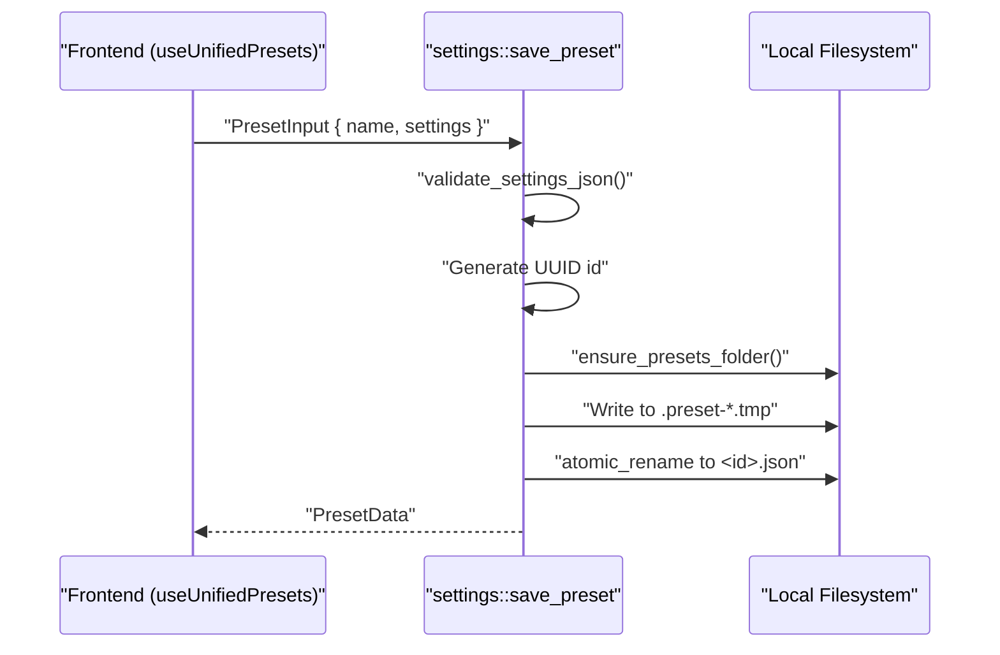
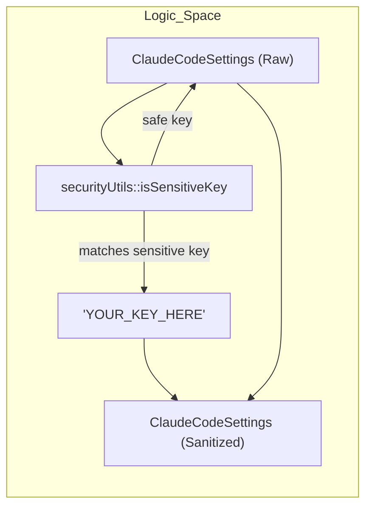

# Settings Management

<details>
<summary>Relevant source files</summary>

The following files were used as context for generating this wiki page:

- [src-tauri/src/commands/claude_settings.rs](src-tauri/src/commands/claude_settings.rs)
- [src-tauri/src/commands/mcp_presets.rs](src-tauri/src/commands/mcp_presets.rs)
- [src-tauri/src/commands/metadata.rs](src-tauri/src/commands/metadata.rs)
- [src-tauri/src/commands/settings.rs](src-tauri/src/commands/settings.rs)
- [src-tauri/src/commands/watcher.rs](src-tauri/src/commands/watcher.rs)
- [src/components/SettingsManager/components/EmptyState.tsx](src/components/SettingsManager/components/EmptyState.tsx)
- [src/components/SettingsManager/components/ExportImport.tsx](src/components/SettingsManager/components/ExportImport.tsx)
- [src/components/SettingsManager/components/index.ts](src/components/SettingsManager/components/index.ts)
- [src/components/SettingsManager/index.ts](src/components/SettingsManager/index.ts)
- [src/hooks/__tests__/useFileWatcher.test.ts](src/hooks/__tests__/useFileWatcher.test.ts)
- [src/hooks/useFileWatcher.ts](src/hooks/useFileWatcher.ts)
- [src/hooks/useMCPPresets.ts](src/hooks/useMCPPresets.ts)
- [src/hooks/useMCPServers.ts](src/hooks/useMCPServers.ts)
- [src/main.tsx](src/main.tsx)
- [src/services/api.ts](src/services/api.ts)
- [src/types/claudeSettings.ts](src/types/claudeSettings.ts)
- [src/types/mcpPreset.types.ts](src/types/mcpPreset.types.ts)

</details>


This page documents the Rust backend commands responsible for reading and writing Claude Code settings files, MCP server configurations, unified presets, and user metadata. It covers the full backend surface: file locations, scope resolution, safety mechanisms, and the persistence system.

For documentation of the frontend `SettingsManager` component that drives these commands from the UI, see [3.6](). For metadata commands that handle the viewer's own application state (session names, grouping preferences, hidden projects), see the metadata subsystem described at the end of this page.

---

## Settings Scopes and File Locations

Claude Code organizes settings across four scope levels. The backend maps each scope name to a concrete file path on disk.

**Settings scope → file path mapping**

| Scope | File Path | Writable |
|---|---|---|
| `user` | `~/.claude/settings.json` | ✓ |
| `project` | `<project>/.claude/settings.json` | ✓ |
| `local` | `<project>/.claude/settings.local.json` | ✓ |
| `managed` | `/Library/Application Support/ClaudeCode/managed-settings.json` (macOS only) | ✗ |

The `managed` scope is always read-only. Attempting to write to it via `save_settings` returns an error [src-tauri/src/commands/claude_settings.rs:207-209]().

**Scope priority** (higher value takes precedence when Claude Code merges scopes):

| Scope | Priority |
|---|---|
| `managed` | 100 |
| `local` | 30 |
| `project` | 20 |
| `user` | 10 |

This priority table is defined in `SCOPE_PRIORITY` in [src/types/claudeSettings.ts:399-404]().

---

## MCP Server Sources

MCP (Model Context Protocol) servers can be configured from five distinct file locations, divided into *official* and *legacy* sources.

| Source Key | File Location | Scope |
|---|---|---|
| `user_claude_json` | `~/.claude.json` → `mcpServers` | User, cross-project (official) [src-tauri/src/commands/claude_settings.rs:36-37]() |
| `local_claude_json` | `~/.claude.json` → `projects.<path>.mcpServers` | Project-specific (official) [src-tauri/src/commands/claude_settings.rs:38-39]() |
| `user_settings` | `~/.claude/settings.json` → `mcpServers` | User (legacy) [src-tauri/src/commands/claude_settings.rs:30-31]() |
| `user_mcp_file` | `~/.claude/.mcp.json` | User (legacy) [src-tauri/src/commands/claude_settings.rs:32-33]() |
| `project_mcp_file` | `<project>/.mcp.json` | Project-specific [src-tauri/src/commands/claude_settings.rs:34-35]() |

Sources: [src-tauri/src/commands/claude_settings.rs:28-40](), [src/hooks/useMCPServers.ts:67-83]()

---

## Backend Command Architecture

The following diagram maps the Tauri command names to their source modules and the files they operate on.

**Settings Management Command Architecture**

```mermaid
graph TD
    subgraph "Frontend_Space"
        FE1["\"get_settings_by_scope\""]
        FE2["\"save_settings\""]
        FE3["\"get_all_settings\""]
        FE4["\"get_mcp_servers\""]
        FE5["\"get_all_mcp_servers\""]
        FE6["\"save_mcp_servers\""]
        FE7["\"save_preset\""]
        FE8["\"load_presets\""]
        FE9["\"load_user_metadata\""]
        FE10["\"save_user_metadata\""]
    end

    subgraph "Rust_Command_Layer"
        CS1["claude_settings::get_settings_by_scope"]
        CS2["claude_settings::save_settings"]
        CS3["claude_settings::get_all_settings"]
        CS4["claude_settings::get_mcp_servers"]
        CS5["claude_settings::get_all_mcp_servers"]
        CS6["claude_settings::save_mcp_servers"]
        SR1["settings::save_preset"]
        SR2["settings::load_presets"]
        MR1["metadata::load_user_metadata"]
        MR2["metadata::save_user_metadata"]
    end

    subgraph "Filesystem_Entities"
        F1["~/.claude/settings.json"]
        F2["~/.claude.json"]
        F3["project/.mcp.json"]
        F4["~/.claude-history-viewer/presets/*.json"]
        F5["~/.claude-history-viewer/user-data.json"]
    end

    FE1 --> CS1
    FE2 --> CS2
    FE3 --> CS3
    FE4 --> CS4
    FE5 --> CS5
    FE6 --> CS6
    FE7 --> SR1
    FE8 --> SR2
    FE9 --> MR1
    FE10 --> MR2

    CS1 & CS2 & CS3 --> F1
    CS4 & CS5 & CS6 --> F2
    CS5 & CS6 --> F3
    SR1 & SR2 --> F4
    MR1 & MR2 --> F5
```



Sources: [src-tauri/src/commands/claude_settings.rs:178-500](), [src-tauri/src/commands/settings.rs:93-200](), [src-tauri/src/commands/metadata.rs:92-163](), [src/services/api.ts:31-39]()

---

## `claude_settings.rs` — Claude Code Settings Commands

All commands live in `src-tauri/src/commands/claude_settings.rs` and provide raw access to Claude's configuration files.

### Path Resolution Helpers

Private helper functions resolve concrete file paths from scope names:

| Helper | Resolves to |
|---|---|
| `get_user_settings_path()` | `~/.claude/settings.json` [src-tauri/src/commands/claude_settings.rs:43-46]() |
| `get_user_mcp_path()` | `~/.claude/.mcp.json` [src-tauri/src/commands/claude_settings.rs:49-52]() |
| `get_claude_json_path()` | `~/.claude.json` [src-tauri/src/commands/claude_settings.rs:55-58]() |
| `get_managed_settings_path()` | `/Library/Application Support/ClaudeCode/managed-settings.json` (macOS) [src-tauri/src/commands/claude_settings.rs:105-109]() |
| `get_project_mcp_path(project_path)` | `<project>/.mcp.json` [src-tauri/src/commands/claude_settings.rs:97-100]() |

All project-path arguments pass through `validate_project_path()`, which enforces absolute paths and prevents `..` traversal [src-tauri/src/commands/claude_settings.rs:72-94]().

### Atomic Write Pattern

All file writes use an atomic write pattern to prevent data corruption. The `write_settings_file` function [src-tauri/src/commands/claude_settings.rs:145-168]() performs the following:
1. Validates JSON content [src-tauri/src/commands/claude_settings.rs:147-148]().
2. Creates a temporary file with `.json.tmp` extension [src-tauri/src/commands/claude_settings.rs:157]().
3. Syncs the file to physical storage (`sync_all`) [src-tauri/src/commands/claude_settings.rs:162-163]().
4. Uses `atomic_rename` to replace the original file [src-tauri/src/commands/claude_settings.rs:165]().

### Settings Commands

**`get_settings_by_scope(scope, project_path)`** [src-tauri/src/commands/claude_settings.rs:178-189]()
Reads one scope's settings JSON. Returns `"{}"` if the file does not exist [src-tauri/src/commands/claude_settings.rs:137-139]().

**`save_settings(scope, content, project_path)`** [src-tauri/src/commands/claude_settings.rs:201-213]()
Validates JSON, rejects `"managed"` scope, and writes atomically.

**`get_all_settings(project_path)`** [src-tauri/src/commands/claude_settings.rs:224-235]()
Returns an `AllSettings` struct [src-tauri/src/commands/claude_settings.rs:12-18]() containing `Option<String>` for each of the four scopes.

---

## `settings.rs` — Settings Preset Commands

Presets allow users to save and restore named groups of Claude Code settings. They are stored as JSON files in `~/.claude-history-viewer/presets/` [src-tauri/src/commands/settings.rs:40-44]().

**Preset Data Model**
The `PresetData` struct defines the schema for stored presets:
```rust
pub struct PresetData {
    pub id: String,
    pub name: String,
    pub description: Option<String>,
    pub settings: String,   // JSON string of UserSettings
    pub created_at: String, // ISO 8601 timestamp
    pub updated_at: String,
}
```
[src-tauri/src/commands/settings.rs:18-26]()

**Preset Lifecycle Management**



Sources: [src-tauri/src/commands/settings.rs:93-168](), [src-tauri/src/commands/settings.rs:172-208](), [src/hooks/useMCPPresets.ts:7-10]()

---

## User Metadata Management

The viewer app maintains its own metadata file `user-data.json` [src-tauri/src/commands/metadata.rs:65-67]() to track per-session display names and project grouping preferences.

**Metadata State Management**
The backend uses a `MetadataState` struct with a `Mutex<Option<UserMetadata>>` [src-tauri/src/commands/metadata.rs:45-48]() to cache metadata in memory for quick access.

| Command | Role |
|---|---|
| `load_user_metadata` | Reads from disk or creates default `UserMetadata` [src-tauri/src/commands/metadata.rs:93-117]() |
| `save_user_metadata` | Persists full metadata object atomically [src-tauri/src/commands/metadata.rs:144-163]() |
| `update_session_metadata` | Mutates specific session keys (e.g. rename) and saves [src-tauri/src/commands/metadata.rs:167-198]() |
| `update_project_metadata` | Mutates project keys after validation [src-tauri/src/commands/metadata.rs:201-213]() |

Sources: [src-tauri/src/commands/metadata.rs:1-213]()

---

## Frontend Hooks and Integration

### `useMCPServers` Hook
The `useMCPServers` hook provides a unified interface for managing MCP servers across all sources [src/hooks/useMCPServers.ts:112](). It uses the `api` service [src/services/api.ts:31]() to call `get_all_mcp_servers` [src/hooks/useMCPServers.ts:138]() and `save_mcp_servers` [src/hooks/useMCPServers.ts:179]().

### `ExportImport` Logic
The `ExportImport` component [src/components/SettingsManager/components/ExportImport.tsx:48]() handles the serialization of settings for backup. It includes a sanitization step `sanitizeSettings` [src/components/SettingsManager/components/ExportImport.tsx:80-116]() that identifies sensitive keys (API keys, tokens) and replaces them with placeholders before export.

**Sensitive Data Sanitization**


Sources: [src/components/SettingsManager/components/ExportImport.tsx:80-116](), [src/hooks/useMCPServers.ts:133-198](), [src/services/api.ts:31-56]()
