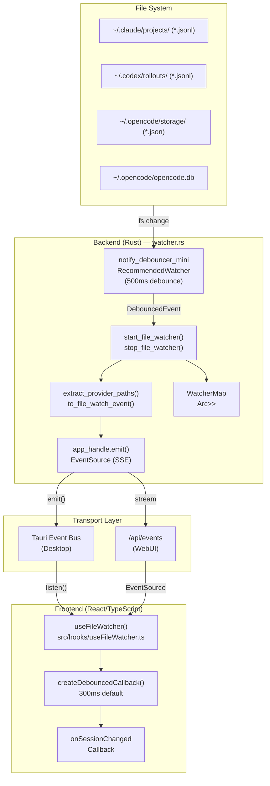
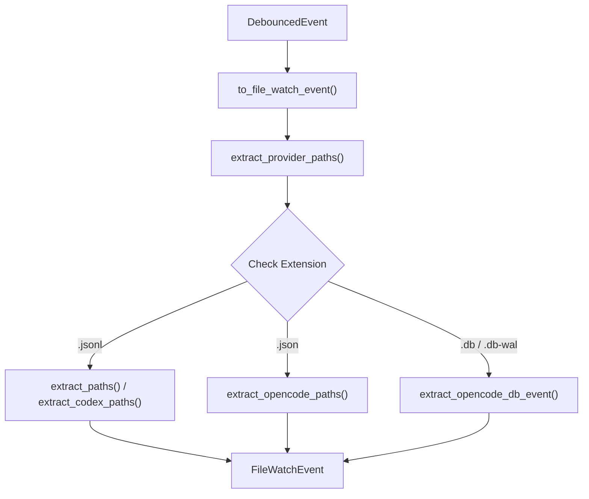

# File Watcher

Relevant source files

The following files were used as context for generating this wiki page:

- [.dockerignore](.dockerignore)
- [Dockerfile](Dockerfile)
- [contrib/cchv.service](contrib/cchv.service)
- [docker-compose.yml](docker-compose.yml)
- [src-tauri/src/commands/metadata.rs](src-tauri/src/commands/metadata.rs)
- [src-tauri/src/commands/watcher.rs](src-tauri/src/commands/watcher.rs)
- [src-tauri/src/server/handlers.rs](src-tauri/src/server/handlers.rs)
- [src-tauri/src/server/mod.rs](src-tauri/src/server/mod.rs)
- [src/components/SettingsManager/components/ExportImport.tsx](src/components/SettingsManager/components/ExportImport.tsx)
- [src/hooks/__tests__/useFileWatcher.test.ts](src/hooks/__tests__/useFileWatcher.test.ts)
- [src/hooks/useFileWatcher.ts](src/hooks/useFileWatcher.ts)
- [src/main.tsx](src/main.tsx)
- [src/services/api.ts](src/services/api.ts)
- [src/utils/fileDialog.ts](src/utils/fileDialog.ts)

The File Watcher system provides real-time monitoring of session files, automatically detecting when data files are created, modified, or deleted across multiple providers (Claude Code, Codex, and OpenCode). This enables the application to keep displayed data synchronized with the file system without requiring manual refreshes. The system uses a debounced file watcher on the backend that emits events to the frontend through Tauri's event system or Server-Sent Events (SSE) in WebUI mode.

---

## System Architecture

The File Watcher operates as a bridge between the file system and the application UI, supporting both the Tauri desktop environment and the WebUI environment.

**Description:** The architecture shows how file system changes flow from the `notify` library through the Rust backend. The `extract_provider_paths` function handles the logic for different providers (Claude, Codex, OpenCode). Events are dispatched via Tauri's native event bus in desktop mode or via SSE in WebUI mode. The `useFileWatcher` hook abstracts these two transport layers for the frontend.

**Sources:** [src-tauri/src/commands/watcher.rs:2-166](), [src/hooks/useFileWatcher.ts:130-203]()

---

## Backend Implementation

### File Watcher Lifecycle

The backend manages the lifecycle of the `notify` debouncer using Tauri state. In server mode, while the file watcher logic exists, the communication is shifted to an SSE stream managed by Axum.

| Command | Function | File Reference |
|---------|----------|----------------|
| `start_file_watcher` | Initializes monitoring for the Claude projects directory. Performs symlink and traversal security checks. | [src-tauri/src/commands/watcher.rs:27-120]() |
| `stop_file_watcher` | Stops monitoring by dropping the debouncer stored in `WatcherMap`. | [src-tauri/src/commands/watcher.rs:124-135]() |

### Provider Path Extraction

The watcher identifies which project and session changed based on the file extension and path structure.

**Description:** `extract_provider_paths` is the central dispatcher for identifying changes. 
- **Claude/Codex:** Monitors `.jsonl` files in `projects/` or `rollouts/` directories [src-tauri/src/commands/watcher.rs:166-174]().
- **OpenCode:** Monitors `.json` storage files [src-tauri/src/commands/watcher.rs:176-176]().
- **OpenCode DB:** Monitors SQLite database changes (`.db`, `.db-wal`) to trigger broad refreshes [src-tauri/src/commands/watcher.rs:178-178]().

**Sources:** [src-tauri/src/commands/watcher.rs:142-181]()

---

## Server Mode and SSE

In headless server mode (`cchv-server`), the file watcher events are exposed via a Server-Sent Events (SSE) endpoint.

- **Endpoint:** `/api/events` [src-tauri/src/server/mod.rs:66-66]()
- **Implementation:** The `sse_handler` (invoked via `get(sse_handler)`) converts internal broadcast events into an SSE stream [src-tauri/src/server/mod.rs:21-30]().
- **Authentication:** In WebUI mode, the `EventSource` connection includes the auth token as a query parameter since standard `EventSource` does not support custom headers [src/hooks/useFileWatcher.ts:163-165]().

**Sources:** [src-tauri/src/server/mod.rs:64-66](), [src/hooks/useFileWatcher.ts:158-182]()

---

## Frontend Integration

### useFileWatcher Hook

The `useFileWatcher` hook provides a unified interface for both Tauri and Web environments.

| Feature | Implementation | File Reference |
|---------|----------------|----------------|
| **Environment Detection** | Uses `isTauri()` to switch between `listen()` and `EventSource`. | [src/hooks/useFileWatcher.ts:136-167]() |
| **Debouncing** | `createDebouncedCallback` batches rapid changes (default 300ms) using a `Map` of timers keyed by `eventType-sessionPath`. | [src/hooks/useFileWatcher.ts:77-96]() |
| **Cleanup** | `stopWatching` clears all timers and closes SSE connections or unlistens Tauri events. | [src/hooks/useFileWatcher.ts:101-122]() |
| **Cancellation** | `watchVersionRef` prevents stale async `startWatching` calls from registering listeners after a `stopWatching` call. | [src/hooks/useFileWatcher.ts:72-146]() |

**Sources:** [src/hooks/useFileWatcher.ts:60-204]()

---

## Data Models

### FileWatchEvent (Rust/TypeScript)

The event payload sent from the backend to the frontend.

| Field | Type | Description |
|-------|------|-------------|
| `projectPath` | `string` | The unique identifier or filesystem path for the project. |
| `sessionPath` | `string` | The specific file path of the session that changed. |
| `eventType` | `string` | Currently defaults to `"session-file-changed"`. |

**Sources:** [src-tauri/src/commands/watcher.rs:11-17](), [src/hooks/useFileWatcher.ts:10-14]()

---

## Security and Safety

The watcher implements several checks to ensure it only monitors intended directories and handles files safely.

1.  **Symlink Rejection:** `start_file_watcher` rejects paths that are symlinks to prevent symlink-based directory traversal attacks [src-tauri/src/commands/watcher.rs:35-46]().
2.  **Canonicalization:** Paths are canonicalized before watching to resolve relative segments and verify they stay within the allowed base directory [src-tauri/src/commands/watcher.rs:49-56]().
3.  **Storage ID Validation:** When processing OpenCode events, IDs are checked via `is_safe_storage_id` to prevent malicious path injection [src-tauri/src/commands/watcher.rs:1-1]().

**Sources:** [src-tauri/src/commands/watcher.rs:32-64](), [src-tauri/src/commands/watcher.rs:1-1]()

---

## Testing

The file watcher system is verified through Vitest frontend tests.

- **Initial State:** Ensures listeners are not set up if `enabled is false` [src/hooks/__tests__/useFileWatcher.test.ts:51-58]().
- **Cleanup:** Verifies that unmounting the hook calls the Tauri `unlisten` function [src/hooks/__tests__/useFileWatcher.test.ts:97-111]().
- **Debouncing:** Uses `vi.useFakeTimers()` to confirm that multiple rapid file events result in only a single callback execution [src/hooks/__tests__/useFileWatcher.test.ts:152-201]().
- **Manual Control:** Validates that `startWatching` and `stopWatching` correctly toggle the `isWatching` state [src/hooks/__tests__/useFileWatcher.test.ts:205-230]().

**Sources:** [src/hooks/__tests__/useFileWatcher.test.ts:1-230]()
