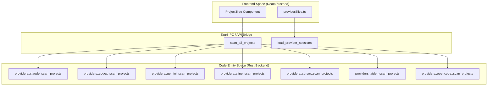
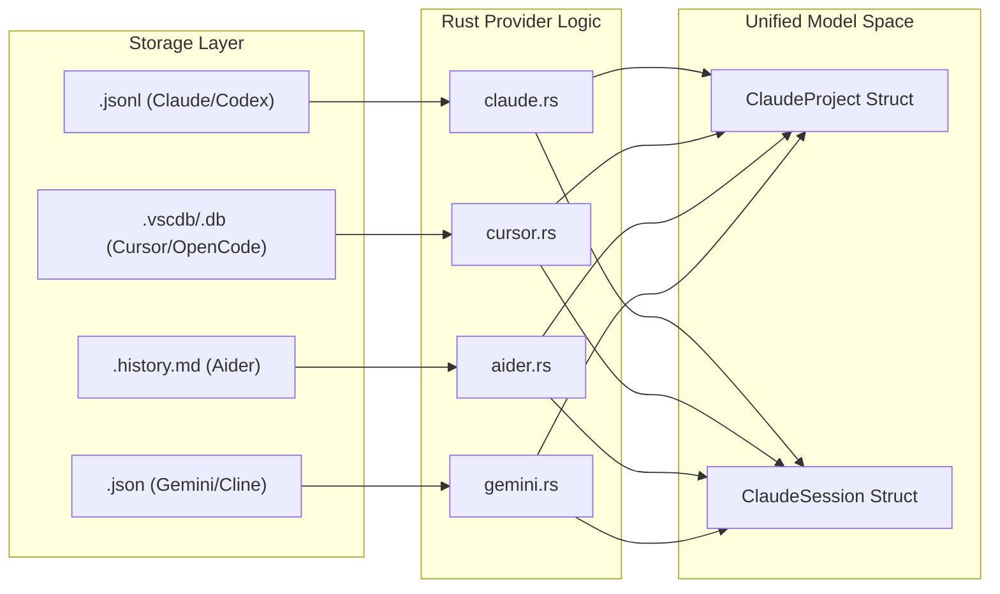

# Provider Implementations

Relevant source files

The following files were used as context for generating this wiki page:

- [docs/superpowers/specs/2026-03-28-wsl-support-design.md](docs/superpowers/specs/2026-03-28-wsl-support-design.md)
- [src-tauri/src/commands/multi_provider.rs](src-tauri/src/commands/multi_provider.rs)
- [src-tauri/src/providers/aider.rs](src-tauri/src/providers/aider.rs)
- [src-tauri/src/providers/cline.rs](src-tauri/src/providers/cline.rs)
- [src-tauri/src/providers/codex.rs](src-tauri/src/providers/codex.rs)
- [src-tauri/src/providers/cursor.rs](src-tauri/src/providers/cursor.rs)
- [src-tauri/src/providers/gemini.rs](src-tauri/src/providers/gemini.rs)
- [src-tauri/src/providers/opencode.rs](src-tauri/src/providers/opencode.rs)
- [src-tauri/src/utils.rs](src-tauri/src/utils.rs)
- [src/components/MessageViewer/helpers/agentProgressHelpers.ts](src/components/MessageViewer/helpers/agentProgressHelpers.ts)
- [src/components/SimpleUpdateManager.tsx](src/components/SimpleUpdateManager.tsx)
- [src/components/contentRenderer/toolUseRenderers/ApplyPatchToolRenderer.tsx](src/components/contentRenderer/toolUseRenderers/ApplyPatchToolRenderer.tsx)
- [src/components/contentRenderer/toolUseRenderers/TaskToolRenderer.tsx](src/components/contentRenderer/toolUseRenderers/TaskToolRenderer.tsx)
- [src/components/contentRenderer/toolUseRenderers/UpdatePlanToolRenderer.tsx](src/components/contentRenderer/toolUseRenderers/UpdatePlanToolRenderer.tsx)
- [src/test/updateSettings.test.ts](src/test/updateSettings.test.ts)
- [src/types/updateSettings.ts](src/types/updateSettings.ts)
- [src/utils/updateSettings.ts](src/utils/updateSettings.ts)

This page documents the backend Rust implementations for all seven supported AI assistant providers: **Claude Code**, **Codex CLI**, **OpenCode**, **Gemini CLI**, **Cline**, **Cursor**, and **Aider**. It covers each provider's filesystem layout, data format, and the scanning/loading logic in their respective modules.

---

## Provider Interface

Each provider module exposes a common set of public functions. There is no Rust trait enforcing this interface; it is a convention maintained across the `src-tauri/src/providers/` directory.

### Provider Discovery
The `detect_providers` command orchestrates the discovery of all supported tools on the user's system [src-tauri/src/commands/multi_provider.rs:17-20]().

**`ProviderInfo` fields:**
| Field | Type | Description |
|---|---|---|
| `id` | `String` | Machine identifier (e.g., `"claude"`, `"aider"`, `"cursor"`) |
| `display_name` | `String` | Human-readable name for UI display |
| `base_path` | `String` | Resolved root path on the local disk |
| `is_available` | `bool` | Whether the required files/directories exist |

Sources: [src-tauri/src/providers/codex.rs:14-26](), [src-tauri/src/providers/opencode.rs:23-34](), [src-tauri/src/providers/gemini.rs:9-19](), [src-tauri/src/providers/cursor.rs:10-21]()

---

## Provider-Specific Details

### 1. Claude Code
The primary provider. It reads the standard `.claude` directory.
- **Layout:** `~/.claude/projects/{url-encoded-path}/{uuid}.jsonl` [src-tauri/src/commands/project.rs:108-206]().
- **Decoding:** The `decode_project_path` utility uses `sessions-index.json` or filesystem existence checks to reverse URL-encoded directory names [src-tauri/src/utils.rs:181-192]().
- **WSL Support:** Claude is currently the only provider with explicit WSL scanning support via `resolve_active_wsl_distros` [src-tauri/src/commands/multi_provider.rs:153-182]().

### 2. Codex CLI
Reads rollout files from OpenAI's Codex CLI.
- **Layout:** `~/.codex/sessions/rollout-*.jsonl` [src-tauri/src/providers/codex.rs:16-24]().
- **Grouping:** Codex lacks a native project concept; sessions are grouped into virtual projects based on their `cwd` (Current Working Directory) field [src-tauri/src/providers/codex.rs:145-162]().
- **Security:** `validate_session_path` ensures requested files are within the canonicalized `.codex` directories [src-tauri/src/providers/codex.rs:75-106]().

### 3. OpenCode
Supports both legacy JSON storage and modern SQLite database storage.
- **Layout:** `~/.local/share/opencode/opencode.db` or `storage/` [src-tauri/src/providers/opencode.rs:24-33]().
- **Normalization:** Converts epoch milliseconds to RFC 3339 via `epoch_ms_to_rfc3339` [src-tauri/src/providers/opencode.rs:12-20]().
- **Scanning:** Prefers SQLite (`scan_projects_from_db`) and merges with JSON fallback [src-tauri/src/providers/opencode.rs:82-111]().

### 4. Gemini CLI
Reads chat JSON files from the Gemini CLI tool.
- **Layout:** `~/.gemini/tmp/{project_name}/chats/*.json` [src-tauri/src/providers/gemini.rs:10-18]().
- **Filtering:** Explicitly skips `subagent` files during scanning to prevent noise in the project list [src-tauri/src/providers/gemini.rs:86-88]().
- **Validation:** Uses `validate_gemini_path` to restrict file access to the Gemini data root [src-tauri/src/providers/gemini.rs:135-136]().

### 5. Cline (and Roo Code)
Supports the VS Code extension "Cline" and its fork "Roo Code".
- **Layout:** `~/Library/Application Support/Code/User/globalStorage/saoudrizwan.claude-dev/` [src-tauri/src/providers/cline.rs:12-15]().
- **Mechanism:** Parses `ui_messages.json` for each task ID found in the global task history [src-tauri/src/providers/cline.rs:166-181]().
- **Estimation:** Since reading all JSON files is slow, it uses token counts as a proxy for message counts during initial scan [src-tauri/src/providers/cline.rs:126-132]().

### 6. Cursor
Reads from the internal SQLite databases used by the Cursor editor.
- **Layout:** `workspaceStorage/{hash}/state.vscdb` [src-tauri/src/providers/cursor.rs:44-50]().
- **Mechanism:** Queries the `workbench.panel.composer.model.composerData` key from the VS Code state database [src-tauri/src/providers/cursor.rs:204-206]().
- **Virtualization:** Uses `cursor://` URI schemes to reference internal database rows as files [src-tauri/src/providers/cursor.rs:167-169]().

### 7. Aider
Parses Markdown-based chat histories.
- **Layout:** `.aider.chat.history.md` located in the root of git repositories [src-tauri/src/providers/aider.rs:7-8]().
- **Parsing:** Uses `split_sessions` to segment a single Markdown file into multiple sessions based on the `# aider chat started at` header [src-tauri/src/providers/aider.rs:129-132]().
- **Shallow Scan:** To maintain performance, `detect()` only performs a depth-1 check of common directories [src-tauri/src/providers/aider.rs:12-26]().

---

## Architecture and Data Flow

The following diagrams illustrate how the system bridges raw provider data into the unified application state.

**Diagram: Provider Command Mapping**
This diagram maps system names to the specific Rust functions that execute logic in the "Code Entity Space".

Sources: [src-tauri/src/commands/multi_provider.rs:24-149](), [src-tauri/src/providers/aider.rs:40-45](), [src-tauri/src/providers/cursor.rs:44-48]()

**Diagram: Provider Storage to Model Mapping**
Associates provider-specific storage types with the unified `ClaudeProject` and `ClaudeSession` entities.

Sources: [src-tauri/src/models/mod.rs:1-10](), [src-tauri/src/providers/opencode.rs:184-195](), [src-tauri/src/providers/aider.rs:81-92]()

---

## Tool Name Normalization

A critical task of the provider backend is normalizing disparate tool names into a unified format for the frontend renderers.

- **Codex/OpenCode:** Often emit tool calls and results as separate messages. The `merge_tool_execution_messages` function in `multi_provider.rs` iterates through messages to pair `assistant` tool requests with subsequent `user` results [src-tauri/src/commands/multi_provider.rs:228-284]().
- **Cline:** Heavy use of custom tool names (e.g., `execute_command`, `read_file`). These are mapped to `ClaudeMessage` content blocks during conversion in `convert_cline_message` [src-tauri/src/providers/cline.rs:186-189]().
- **Aider:** Uses Markdown blockquotes (`> `) to represent tool interactions, which are detected via `has_tool_use` flags [src-tauri/src/providers/aider.rs:145-145]().

Sources: [src-tauri/src/commands/multi_provider.rs:228-284](), [src-tauri/src/providers/cline.rs:186-192](), [src-tauri/src/providers/aider.rs:145-145]()
