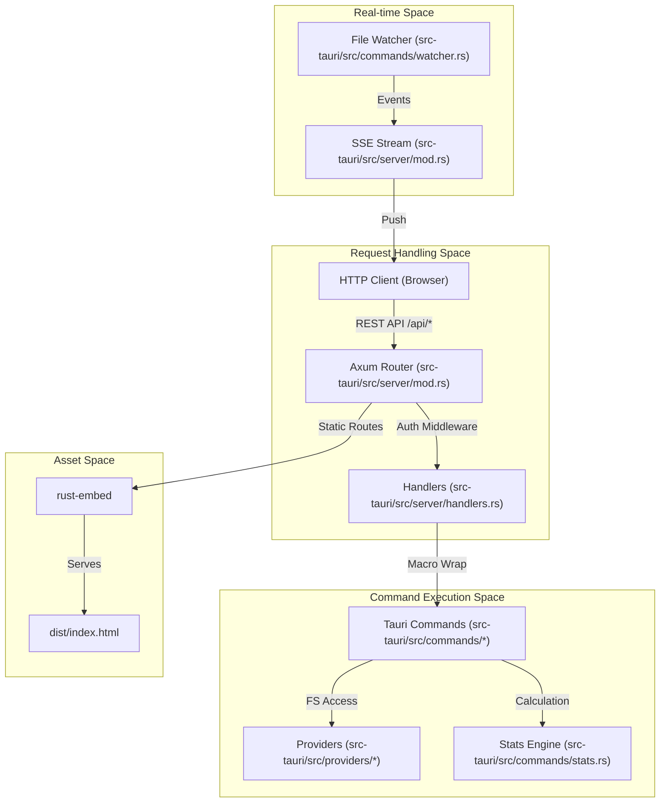
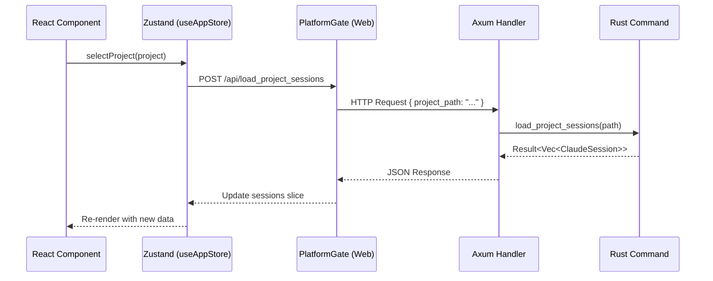

# WebUI Server Mode

<details>
<summary>Relevant source files</summary>

The following files were used as context for generating this wiki page:

- [.dockerignore](.dockerignore)
- [.github/workflows/server-release.yml](.github/workflows/server-release.yml)
- [Dockerfile](Dockerfile)
- [contrib/cchv.service](contrib/cchv.service)
- [docker-compose.yml](docker-compose.yml)
- [docs/server-guide.ko.md](docs/server-guide.ko.md)
- [docs/server-guide.md](docs/server-guide.md)
- [index.html](index.html)
- [install-server.sh](install-server.sh)
- [src-tauri/src/commands/mod.rs](src-tauri/src/commands/mod.rs)
- [src-tauri/src/lib.rs](src-tauri/src/lib.rs)
- [src-tauri/src/models.rs](src-tauri/src/models.rs)
- [src-tauri/src/server/handlers.rs](src-tauri/src/server/handlers.rs)
- [src-tauri/src/server/mod.rs](src-tauri/src/server/mod.rs)
- [src/App.tsx](src/App.tsx)
- [src/components/MessageViewer.tsx](src/components/MessageViewer.tsx)
- [src/components/ProjectTree.tsx](src/components/ProjectTree.tsx)
- [src/hooks/index.ts](src/hooks/index.ts)
- [src/store/useAppStore.ts](src/store/useAppStore.ts)
- [src/test/ProjectTree.worktree.test.tsx](src/test/ProjectTree.worktree.test.tsx)
- [src/types/core/project.ts](src/types/core/project.ts)
- [src/types/index.ts](src/types/index.ts)
- [src/utils/fileDialog.ts](src/utils/fileDialog.ts)

</details>


WebUI Server Mode is a headless execution mode for the Claude Code History Viewer (CCHV) that allows the application to run as a persistent background service on a remote server or VPS. In this mode, the application serves a web interface over HTTP, mirroring the functionality of the desktop application without requiring a local graphical environment.

## Overview

The server mode is powered by a dedicated binary, `cchv-server`, which includes an embedded version of the React frontend and a REST API backend built with the Axum web framework [src-tauri/src/lib.rs:7-8](). It provides a multi-user-capable environment with Bearer token authentication and real-time updates via Server-Sent Events (SSE).

### Key Components
| Component | Technology | Role |
| :--- | :--- | :--- |
| **HTTP Server** | Axum (Rust) | Handles routing, middleware, and request/response cycles [src-tauri/src/server/mod.rs](). |
| **REST API** | Rust Macros | Wraps existing Tauri commands into HTTP endpoints [src-tauri/src/server/handlers.rs:37-61](). |
| **Real-time Events** | SSE | Pushes file system changes and status updates to the browser [src-tauri/src/server/mod.rs](). |
| **Frontend** | React / Vite | Embedded directly into the binary using `rust-embed` [Dockerfile:29-31](). |
| **Auth** | Bearer Token | Simple token-based security for remote access [src-tauri/src/server/mod.rs](). |

## System Architecture

The server architecture bridges the gap between the desktop-oriented Tauri commands and a standard web environment. It reuses the core logic from the `commands` module while replacing the Tauri IPC bridge with an Axum HTTP layer.

### Server Entity Mapping
The following diagram illustrates how server-side entities map to the codebase.

**Title: WebUI Server Entity Mapping**

Sources: [src-tauri/src/server/mod.rs](), [src-tauri/src/server/handlers.rs](), [src-tauri/src/lib.rs:117-193]()

## REST API and Command Mirroring

The server exposes endpoints that correspond directly to the Tauri `invoke` handlers used in the desktop app. This is achieved through Rust macros that minimize boilerplate when wrapping async command functions.

### Implementation Pattern
Handlers are defined using `handler_json!` or `handler_no_params!` macros [src-tauri/src/server/handlers.rs:39-61](). These macros:
1. Deserialize the incoming JSON body into a specific parameter struct (e.g., `ProjectTokenStatsParams`) [src-tauri/src/server/handlers.rs:170-182]().
2. Call the underlying command function from `crate::commands` [src-tauri/src/server/handlers.rs:55]().
3. Serialize the command's `Result` back into a JSON response [src-tauri/src/server/handlers.rs:56]().

### Endpoint Examples
| Endpoint | Tauri Command | Description |
| :--- | :--- | :--- |
| `POST /api/scan_projects` | `scan_projects` | Scans directories for Claude projects [src-tauri/src/lib.rs:122](). |
| `POST /api/load_session_messages` | `load_session_messages` | Retrieves messages for a specific session [src-tauri/src/lib.rs:125](). |
| `POST /api/get_global_stats_summary` | `get_global_stats_summary` | Aggregates token usage across all providers [src-tauri/src/lib.rs:136](). |

Sources: [src-tauri/src/server/handlers.rs](), [src-tauri/src/lib.rs:117-193]()

## Deployment and Setup

### Docker Deployment
The project provides a multi-stage `Dockerfile` to build a minimal runtime image (~100MB).
1. **Stage 1 (Frontend):** Builds the React assets using `pnpm build` [Dockerfile:5-15]().
2. **Stage 2 (Backend):** Compiles the Rust binary with the `webui-server` feature enabled, embedding the `dist/` folder [Dockerfile:17-31]().
3. **Stage 3 (Runtime):** Uses a `debian:bookworm-slim` base with necessary GTK dependencies (required for shared Tauri logic) [Dockerfile:34-43]().

### install-server.sh
For Linux users, the `install-server.sh` script automates:
- Downloading the latest `cchv-server` binary from GitHub Releases [.github/workflows/server-release.yml:96-103]().
- Generating a random secure access token.
- Creating a systemd service file (`cchv.service`) for process management [contrib/cchv.service]().

### Systemd Configuration
The service is typically configured to run on port `3727` and bind to `0.0.0.0` or `127.0.0.1` if behind a reverse proxy [Dockerfile:55-56]().

```ini
[Service]
ExecStart=/usr/local/bin/cchv-server --serve --port 3727 --token YOUR_SECRET_TOKEN
Restart=always
User=cchv
```
Sources: [Dockerfile](), [install-server.sh](), [contrib/cchv.service](), [.github/workflows/server-release.yml]()

## Data Flow: WebUI vs Desktop

The frontend uses a `PlatformProvider` to abstract the communication layer. In WebUI mode, the `useAppStore` actions route through an HTTP client instead of `window.__TAURI__.invoke`.

**Title: WebUI Request-Response Data Flow**

Sources: [src/App.tsx:180-199](), [src/store/useAppStore.ts:101-117](), [src-tauri/src/server/handlers.rs:98-102]()
