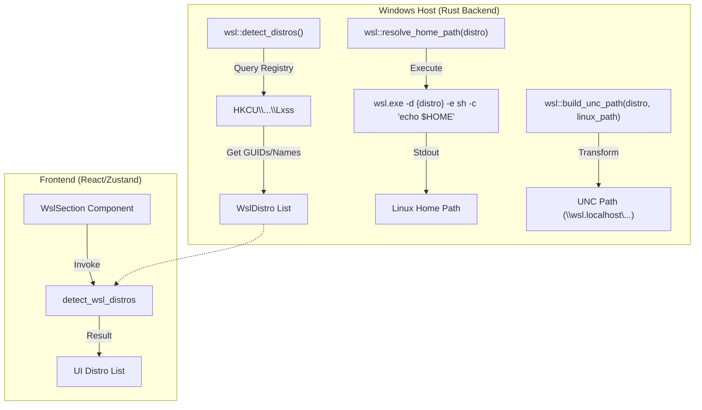
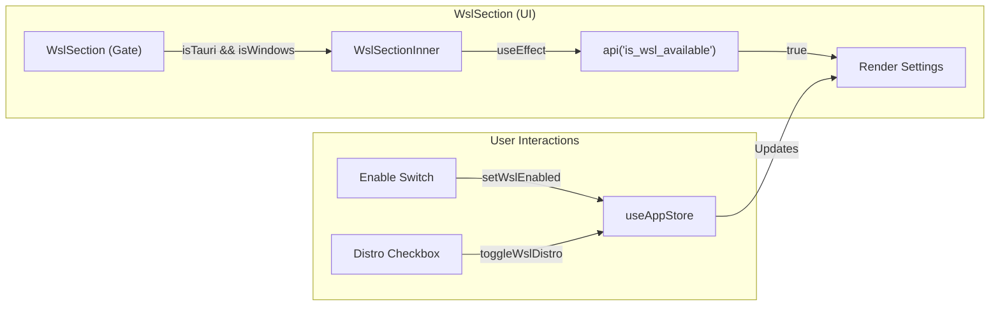

# WSL Support

Relevant source files

The following files were used as context for generating this wiki page:

- [src-tauri/src/commands/wsl.rs](src-tauri/src/commands/wsl.rs)
- [src-tauri/src/wsl.rs](src-tauri/src/wsl.rs)
- [src/components/SettingsManager/sections/WslSection.tsx](src/components/SettingsManager/sections/WslSection.tsx)
- [src/components/modals/folderSelect/FolderSelector.tsx](src/components/modals/folderSelect/FolderSelector.tsx)
- [src/i18n/locales/en/settings.json](src/i18n/locales/en/settings.json)
- [src/i18n/locales/ja/settings.json](src/i18n/locales/ja/settings.json)
- [src/i18n/locales/ko/settings.json](src/i18n/locales/ko/settings.json)
- [src/i18n/locales/zh-CN/settings.json](src/i18n/locales/zh-CN/settings.json)
- [src/i18n/locales/zh-TW/settings.json](src/i18n/locales/zh-TW/settings.json)
- [src/i18n/types.generated.ts](src/i18n/types.generated.ts)

The Claude Code History Viewer provides specialized integration for **Windows Subsystem for Linux (WSL)**, allowing Windows users to browse and analyze AI coding histories stored within Linux distributions. This integration includes automated distribution detection, filesystem path translation between Windows and Linux, and a dedicated configuration interface.

## Overview of WSL Integration

The WSL support is designed to bridge the gap between the Windows-based Tauri host and the Linux guest filesystems where tools like Claude Code or Aider might be running. The system detects installed distributions via the Windows Registry and interacts with them using the `wsl.exe` command-line utility [src-tauri/src/wsl.rs:25-32]().

### Key Capabilities
*   **Distribution Detection**: Automatically identifies installed WSL distros (e.g., Ubuntu, Debian) and identifies the default distribution [src-tauri/src/wsl.rs:40-73]().
*   **Path Translation**: Converts Linux absolute paths (e.g., `/home/user/.claude`) into Windows UNC paths (e.g., `\\wsl.localhost\Ubuntu\home\user\.claude`) for cross-system file access [src-tauri/src/wsl.rs:11-23]().
*   **Home Directory Resolution**: Dynamically resolves the `$HOME` path for specific distributions to locate configuration files [src-tauri/src/wsl.rs:81-112]().
*   **Selective Scanning**: Users can enable or disable WSL scanning globally or for specific distributions [src/components/SettingsManager/sections/WslSection.tsx:39-44]().

---

## System Architecture and Data Flow

The WSL integration spans the Rust backend for OS-level interactions and the React frontend for user configuration.

### WSL Logic Flow
The following diagram illustrates how the system detects distributions and resolves paths.

**Diagram: WSL Distribution and Path Resolution**

Sources: `[src-tauri/src/wsl.rs:40-73]()`, `[src-tauri/src/wsl.rs:81-112]()`, `[src-tauri/src/commands/wsl.rs:3-6]()`, `[src/components/SettingsManager/sections/WslSection.tsx:59-66]()`

---

## Backend Implementation

The backend logic is contained within `wsl.rs`, which provides the core utilities for interacting with the Windows subsystem.

### Distribution Detection
The function `detect_distros` reads the Windows Registry key `HKEY_CURRENT_USER\SOFTWARE\Microsoft\Windows\CurrentVersion\Lxss` to find all registered distributions [src-tauri/src/wsl.rs:40-48](). It extracts the `DistributionName` and compares the GUID against `DefaultDistribution` to flag the default distro [src-tauri/src/wsl.rs:50-65]().

### Path Mapping
To access files inside WSL from the Windows application, the backend translates paths using two formats:
1.  **Primary**: `\\wsl.localhost\{distro}\{path}` [src-tauri/src/wsl.rs:12-16]()
2.  **Fallback**: `\\wsl$\{distro}\{path}` [src-tauri/src/wsl.rs:19-23]()

The `resolve_wsl_provider_path` function attempts the primary UNC path first and falls back to the legacy `wsl$` format if the primary does not exist on the filesystem [src-tauri/src/wsl.rs:138-148]().

### Command Interface
The following Tauri commands expose WSL functionality to the frontend:

| Command | Return Type | Description |
| :--- | :--- | :--- |
| `detect_wsl_distros` | `Result<Vec<WslDistro>, String>` | Returns a list of all installed WSL distributions [src-tauri/src/commands/wsl.rs:4-6](). |
| `is_wsl_available` | `Result<bool, String>` | Checks if the WSL registry keys exist on the host system [src-tauri/src/commands/wsl.rs:9-11](). |

Sources: `[src-tauri/src/wsl.rs:1-148]()`, `[src-tauri/src/commands/wsl.rs:1-12]()`

---

## Frontend Integration: WslSection

The `WslSection` component in the Settings Manager provides the interface for managing WSL integration. It is protected by a "Gate" that ensures it only renders when the application is running on Windows via Tauri [src/components/SettingsManager/sections/WslSection.tsx:194-203]().

### Implementation Details
*   **Availability Check**: On mount, the component calls `is_wsl_available` to determine if the UI should be shown [src/components/SettingsManager/sections/WslSection.tsx:206-209]().
*   **State Management**: It utilizes the `useAppStore` to access `userMetadata.settings.wsl`, which tracks the `enabled` status and the `excludedDistros` list [src/components/SettingsManager/sections/WslSection.tsx:39-44]().
*   **Dynamic Loading**: When enabled, it triggers `detect_wsl_distros` to populate the list of available distributions for the user to toggle [src/components/SettingsManager/sections/WslSection.tsx:59-66]().

**Diagram: WslSection Component Logic**

Sources: `[src/components/SettingsManager/sections/WslSection.tsx:37-188]()`, `[src/components/SettingsManager/sections/WslSection.tsx:194-210]()`

### Localization
WSL-related strings are managed via the i18n system under the `settings.wsl` namespace, providing translations for titles, descriptions, scanning statuses, and warnings about potential performance impacts when scanning many distributions [src/i18n/types.generated.ts:20-28]().

Sources: `[src/components/SettingsManager/sections/WslSection.tsx:110-178]()`, `[src/i18n/locales/en/settings.json]()` (via namespace reference).
