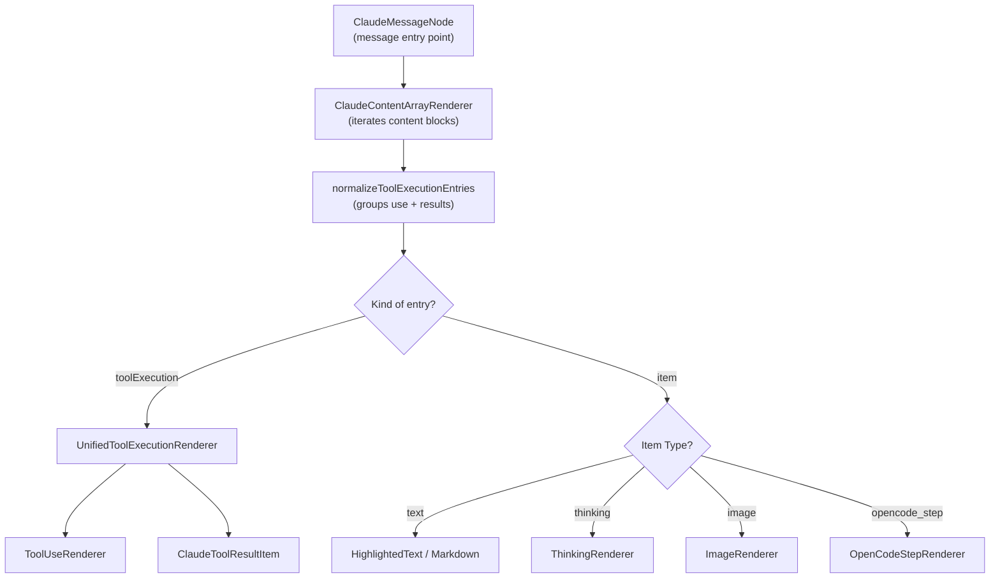
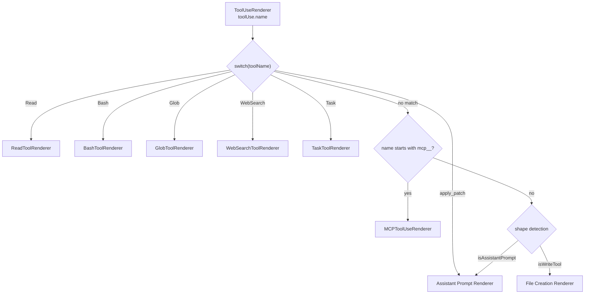

# Content Rendering

Relevant source files

The following files were used as context for generating this wiki page:

- [src/components/ErrorBoundary.tsx](src/components/ErrorBoundary.tsx)
- [src/components/contentRenderer/ClaudeContentArrayRenderer.tsx](src/components/contentRenderer/ClaudeContentArrayRenderer.tsx)
- [src/components/contentRenderer/OpenCodeStepRenderer.tsx](src/components/contentRenderer/OpenCodeStepRenderer.tsx)
- [src/components/contentRenderer/ToolUseRenderer.tsx](src/components/contentRenderer/ToolUseRenderer.tsx)
- [src/components/messageRenderer/ClaudeToolUseDisplay.tsx](src/components/messageRenderer/ClaudeToolUseDisplay.tsx)
- [src/components/messageRenderer/CommandOutputDisplay.tsx](src/components/messageRenderer/CommandOutputDisplay.tsx)
- [src/components/toolResultRenderer/ClaudeToolResultItem.tsx](src/components/toolResultRenderer/ClaudeToolResultItem.tsx)
- [src/components/toolResultRenderer/FallbackRenderer.tsx](src/components/toolResultRenderer/FallbackRenderer.tsx)
- [src/i18n/locales/en/renderers.json](src/i18n/locales/en/renderers.json)
- [src/i18n/locales/ja/renderers.json](src/i18n/locales/ja/renderers.json)
- [src/i18n/locales/ko/renderers.json](src/i18n/locales/ko/renderers.json)
- [src/i18n/locales/zh-CN/renderers.json](src/i18n/locales/zh-CN/renderers.json)
- [src/i18n/locales/zh-TW/renderers.json](src/i18n/locales/zh-TW/renderers.json)

This page provides an overview of the content rendering system: the pipeline that converts raw Claude message data into formatted UI components. The rendering system covers message text display, tool invocation cards, and tool execution result panels visible in the Message Viewer.

For details on the Message Viewer that hosts these renderers, see [Message Viewer](#3.3). For ANSI terminal output rendering specifically, see [ANSI and Terminal Rendering](#6.4). For tool icon styling and variant mappings, see [Tool Icons and Display](#6.3). For the brushing/filtering system on the Session Board, see [Brushing System](#6.2).

---

## System Overview

The rendering system is organized into two parallel pipelines based on the kind of content block being displayed. A key entry point is `ClaudeContentArrayRenderer`, which now performs a normalization step to group `tool_use` calls with their corresponding `tool_results` into unified execution blocks [src/components/contentRenderer/ClaudeContentArrayRenderer.tsx:88-136]().

- **Tool-use pipeline**: Renders Claude's *invocation* of a tool (what Claude asked the tool to do), dispatched by `ToolUseRenderer`.
- **Tool-result pipeline**: Renders the *response* from a tool execution, dispatched by `ClaudeToolResultItem` or specialized sub-renderers.
- **Unified pipeline**: The `UnifiedToolExecutionRenderer` combines both use and result into a single visual card for improved context [src/components/contentRenderer/ClaudeContentArrayRenderer.tsx:164-174]().

**Rendering pipeline — high level**

Sources: [src/components/contentRenderer/ClaudeContentArrayRenderer.tsx:88-136](), [src/components/contentRenderer/ClaudeContentArrayRenderer.tsx:164-216]()

---

## Message Content Display

`ClaudeContentArrayRenderer` handles raw text and specialized metadata blocks. For text, it supports both standard Markdown and search-highlighted text [src/components/contentRenderer/ClaudeContentArrayRenderer.tsx:188-211]().

**Key specialized renderers:**

| Component | File | Role |
|---|---|---|
| `ThinkingRenderer` | `src/components/contentRenderer/ThinkingRenderer.tsx` | Displays AI reasoning/thought blocks [src/components/contentRenderer/ClaudeContentArrayRenderer.tsx:15](). |
| `OpenCodeStepRenderer` | `src/components/contentRenderer/OpenCodeStepRenderer.tsx` | Displays OpenCode-specific steps including snapshots, cost, and token breakdown (input, output, reasoning, cache) [src/components/contentRenderer/OpenCodeStepRenderer.tsx:20-69](). |
| `ImageRenderer` | `src/components/contentRenderer/ImageRenderer.tsx` | Renders base64 or URL-based images [src/components/contentRenderer/ClaudeContentArrayRenderer.tsx:18](). |

Sources: [src/components/contentRenderer/ClaudeContentArrayRenderer.tsx:188-211](), [src/components/contentRenderer/OpenCodeStepRenderer.tsx:7-18]()

---

## Tool-Use Rendering

`ToolUseRenderer` dispatches based on the `name` field of the tool-use content block. It maps tool names to specific UI components and applies visual variants (e.g., `success`, `info`, `warning`) via `getToolVariant` [src/components/contentRenderer/ToolUseRenderer.tsx:91-92]().

**Tool-use dispatch diagram**

Sources: [src/components/contentRenderer/ToolUseRenderer.tsx:111-178](), [src/components/contentRenderer/ToolUseRenderer.tsx:180-213]()

---

## Tool-Result Rendering

Tool results are rendered primarily by `ClaudeToolResultItem`, which handles various data formats returned by the environment. It supports specific layouts for file contents, search results, and error states [src/components/toolResultRenderer/ClaudeToolResultItem.tsx:43-56]().

**Specialized Result Handling:**
- **Numbered File Content**: Automatically detects and extracts code from strings with line numbers, providing syntax highlighting and copy buttons [src/components/toolResultRenderer/ClaudeToolResultItem.tsx:150-192]().
- **File Search Results**: Renders a list of file paths with directory/filename separation [src/components/toolResultRenderer/ClaudeToolResultItem.tsx:105-147]().
- **System Reminders**: Parses and displays warnings or system messages embedded in tool outputs [src/components/toolResultRenderer/ClaudeToolResultItem.tsx:79-102]().
- **Fallback**: Generic JSON highlighting for unknown object structures via `FallbackRenderer` [src/components/toolResultRenderer/FallbackRenderer.tsx:13-62]().

Sources: [src/components/toolResultRenderer/ClaudeToolResultItem.tsx:150-192](), [src/components/toolResultRenderer/FallbackRenderer.tsx:25-30]()

---

## Command Output Display

`CommandOutputDisplay` is used for rendering terminal output (`stdout`). It uses heuristic detection to categorize the output for better visual context [src/components/messageRenderer/CommandOutputDisplay.tsx:35-52]().

| Output Category | Detection Condition | Component / Style |
|---|---|---|
| **Test Results** | `Test Suites:`, `jest`, `coverage` | `TestTube` icon, `success` variant [src/components/messageRenderer/CommandOutputDisplay.tsx:118-143](). |
| **Build Output** | `webpack`, `build`, `compile` | `Hammer` icon, `terminal` variant [src/components/messageRenderer/CommandOutputDisplay.tsx:146-173](). |
| **Package Management** | `npm`, `yarn`, `pnpm` | `Package` icon, `terminal` variant [src/components/messageRenderer/CommandOutputDisplay.tsx:176-203](). |
| **JSON Output** | Starts with `{`, ends with `}` | `prism-react-renderer` JSON block [src/components/messageRenderer/CommandOutputDisplay.tsx:60-111](). |
| **Table Output** | Contains `\|` and `-` | `BarChart3` icon [src/components/messageRenderer/CommandOutputDisplay.tsx:206-230](). |

All terminal-like outputs are passed through `AnsiText` to preserve color formatting [src/components/messageRenderer/CommandOutputDisplay.tsx:139]().

Sources: [src/components/messageRenderer/CommandOutputDisplay.tsx:35-52](), [src/components/messageRenderer/CommandOutputDisplay.tsx:22-23]()

---

## Shared Infrastructure

### Design Tokens and Layout
The system relies on a central `layout` object and `getVariantStyles` to ensure consistent padding, icons, and colors across different renderers [src/components/renderers/index.ts](). Renderers use `Renderer` (from `src/shared/RendererHeader`) as a wrapper to provide standardized headers and content areas [src/components/toolResultRenderer/ClaudeToolResultItem.tsx:155-171]().

### Syntax Highlighting
Syntax highlighting is powered by `prism-react-renderer`. Theme-aware styles are applied using `getPreStyles`, `getLineStyles`, and `getTokenStyles` utilities to ensure readability in both light and dark modes [src/components/messageRenderer/ClaudeToolUseDisplay.tsx:43-65]().

### Localization
All labels and titles are localized using `i18next` namespaces, specifically `renderers.json` and `tools.json`.
Sources: [src/i18n/locales/en/renderers.json:1-139](), [src/components/contentRenderer/OpenCodeStepRenderer.tsx:50-65]()

---

## Renderer Component Map

| Component | File | Handles |
|---|---|---|
| `ClaudeContentArrayRenderer` | `src/components/contentRenderer/ClaudeContentArrayRenderer.tsx` | Main entry point; normalization of use/results. |
| `UnifiedToolExecutionRenderer` | `src/components/contentRenderer/UnifiedToolExecutionRenderer.tsx` | Container for grouped tool calls and results. |
| `ToolUseRenderer` | `src/components/contentRenderer/ToolUseRenderer.tsx` | Dispatcher for all `tool_use` blocks. |
| `ClaudeToolResultItem` | `src/components/toolResultRenderer/ClaudeToolResultItem.tsx` | Primary renderer for `tool_result` content. |
| `OpenCodeStepRenderer` | `src/components/contentRenderer/OpenCodeStepRenderer.tsx` | Metadata for OpenCode execution steps. |
| `CommandOutputDisplay` | `src/components/messageRenderer/CommandOutputDisplay.tsx` | Intelligent terminal output formatting. |
| `ClaudeToolUseDisplay` | `src/components/messageRenderer/ClaudeToolUseDisplay.tsx` | Generic JSON-based tool input display. |

Sources: [src/components/contentRenderer/ClaudeContentArrayRenderer.tsx:13-33](), [src/components/contentRenderer/ToolUseRenderer.tsx:41-56]()
