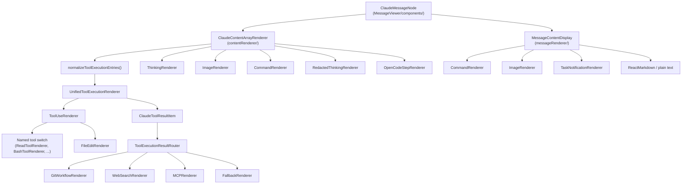
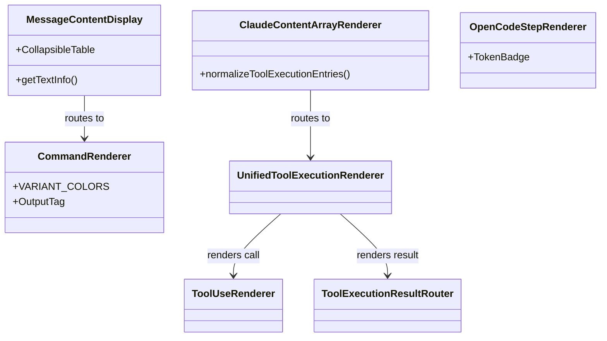

# Content Renderers

Relevant source files

The following files were used as context for generating this wiki page:

- [src-tauri/src/commands/session/delete.rs](src-tauri/src/commands/session/delete.rs)
- [src/App.css](src/App.css)
- [src/components/AdvancedTextDiff.tsx](src/components/AdvancedTextDiff.tsx)
- [src/components/EnhancedDiffViewer.tsx](src/components/EnhancedDiffViewer.tsx)
- [src/components/MessageViewer/components/ClaudeMessageNode.tsx](src/components/MessageViewer/components/ClaudeMessageNode.tsx)
- [src/components/MessageViewer/helpers/messageHelpers.ts](src/components/MessageViewer/helpers/messageHelpers.ts)
- [src/components/common/Markdown.tsx](src/components/common/Markdown.tsx)
- [src/components/contentRenderer/ClaudeContentArrayRenderer.tsx](src/components/contentRenderer/ClaudeContentArrayRenderer.tsx)
- [src/components/contentRenderer/CommandRenderer.tsx](src/components/contentRenderer/CommandRenderer.tsx)
- [src/components/contentRenderer/OpenCodeStepRenderer.tsx](src/components/contentRenderer/OpenCodeStepRenderer.tsx)
- [src/components/contentRenderer/UnifiedToolExecutionRenderer.tsx](src/components/contentRenderer/UnifiedToolExecutionRenderer.tsx)
- [src/components/contentRenderer/unifiedCards/AgentCard.tsx](src/components/contentRenderer/unifiedCards/AgentCard.tsx)
- [src/components/contentRenderer/unifiedCards/BashCard.tsx](src/components/contentRenderer/unifiedCards/BashCard.tsx)
- [src/components/contentRenderer/unifiedCards/DefaultCard.tsx](src/components/contentRenderer/unifiedCards/DefaultCard.tsx)
- [src/components/contentRenderer/unifiedCards/EditCard.tsx](src/components/contentRenderer/unifiedCards/EditCard.tsx)
- [src/components/contentRenderer/unifiedCards/GlobCard.tsx](src/components/contentRenderer/unifiedCards/GlobCard.tsx)
- [src/components/contentRenderer/unifiedCards/GrepCard.tsx](src/components/contentRenderer/unifiedCards/GrepCard.tsx)
- [src/components/contentRenderer/unifiedCards/ReadCard.tsx](src/components/contentRenderer/unifiedCards/ReadCard.tsx)
- [src/components/contentRenderer/unifiedCards/ResultBlock.tsx](src/components/contentRenderer/unifiedCards/ResultBlock.tsx)
- [src/components/contentRenderer/unifiedCards/StatusBadge.tsx](src/components/contentRenderer/unifiedCards/StatusBadge.tsx)
- [src/components/contentRenderer/unifiedCards/shared.ts](src/components/contentRenderer/unifiedCards/shared.ts)
- [src/components/messageRenderer/MessageContentDisplay.tsx](src/components/messageRenderer/MessageContentDisplay.tsx)
- [src/components/messageRenderer/SystemMessageRenderer.tsx](src/components/messageRenderer/SystemMessageRenderer.tsx)
- [src/components/messageRenderer/ToolExecutionResultRouter.tsx](src/components/messageRenderer/ToolExecutionResultRouter.tsx)
- [src/components/toolResultRenderer/CodebaseContextRenderer.tsx](src/components/toolResultRenderer/CodebaseContextRenderer.tsx)
- [src/components/toolResultRenderer/ContentArrayRenderer.tsx](src/components/toolResultRenderer/ContentArrayRenderer.tsx)
- [src/components/toolResultRenderer/ErrorRenderer.tsx](src/components/toolResultRenderer/ErrorRenderer.tsx)
- [src/components/toolResultRenderer/FileListRenderer.tsx](src/components/toolResultRenderer/FileListRenderer.tsx)
- [src/components/toolResultRenderer/GitWorkflowRenderer.tsx](src/components/toolResultRenderer/GitWorkflowRenderer.tsx)
- [src/components/toolResultRenderer/MCPRenderer.tsx](src/components/toolResultRenderer/MCPRenderer.tsx)
- [src/components/toolResultRenderer/StringRenderer.tsx](src/components/toolResultRenderer/StringRenderer.tsx)
- [src/components/toolResultRenderer/TodoUpdateRenderer.tsx](src/components/toolResultRenderer/TodoUpdateRenderer.tsx)
- [src/components/toolResultRenderer/WebSearchRenderer.tsx](src/components/toolResultRenderer/WebSearchRenderer.tsx)
- [src/i18n/locales/en/renderers.json](src/i18n/locales/en/renderers.json)
- [src/i18n/locales/ja/renderers.json](src/i18n/locales/ja/renderers.json)
- [src/i18n/locales/ko/renderers.json](src/i18n/locales/ko/renderers.json)
- [src/i18n/locales/zh-CN/renderers.json](src/i18n/locales/zh-CN/renderers.json)
- [src/i18n/locales/zh-TW/renderers.json](src/i18n/locales/zh-TW/renderers.json)

This page documents the content rendering pipeline used in the Message Viewer to display Claude API messages, tool invocations, and tool execution results. It covers the entry-point components, dispatch logic, and the suite of specialized sub-renderers.

For the outer message scroll and virtual row management that calls into this pipeline, see the Message Viewer ([3.3]()). For tool icon styling and variant classification, see Tool Icons and Display ([6.3]()). For ANSI terminal output rendering, see ANSI and Terminal Rendering ([6.4]()).

---

## Pipeline Overview

The rendering pipeline has two parallel entry points that converge on a shared set of specialized leaf renderers. The `ClaudeContentArrayRenderer` handles structured array content (standard for Claude API), while `MessageContentDisplay` handles legacy or flat string content by detecting embedded tags.

**Pipeline: Message Viewer to Leaf Renderers**

Sources: [src/components/MessageViewer/components/ClaudeMessageNode.tsx:14-25](), [src/components/contentRenderer/ClaudeContentArrayRenderer.tsx:13-33](), [src/components/messageRenderer/MessageContentDisplay.tsx:1-12]()

---

## `ClaudeContentArrayRenderer`

**File:** `src/components/contentRenderer/ClaudeContentArrayRenderer.tsx`

This is the primary entry point for modern Claude messages. It receives a `content: unknown[]` array and renders each item. [src/components/contentRenderer/ClaudeContentArrayRenderer.tsx:138-150]()

### Normalization Step

Before rendering, `normalizeToolExecutionEntries()` [src/components/contentRenderer/ClaudeContentArrayRenderer.tsx:88-136]() scans the array and pairs each `tool_use` item with any subsequent `tool_result` items sharing the same `tool_use_id`. This allows the UI to render a tool call and its result inside a single unified card.

| `kind` | Meaning |
|---|---|
| `"toolExecution"` | A `tool_use` item bundled with zero or more matching `tool_result` items |
| `"item"` | Any other content item rendered individually |

### Content Type Dispatch

Each `item` entry is dispatched via a `switch` on `item.type`. [src/components/contentRenderer/ClaudeContentArrayRenderer.tsx:187-320]()

| `item.type` | Renderer component |
|---|---|
| `"text"` | Inline `HighlightedText` or `Markdown` [src/components/contentRenderer/ClaudeContentArrayRenderer.tsx:188-211]() |
| `"image"` | `ImageRenderer` [src/components/contentRenderer/ClaudeContentArrayRenderer.tsx:215-224]() |
| `"thinking"` | `ThinkingRenderer` [src/components/contentRenderer/ClaudeContentArrayRenderer.tsx:227-236]() |
| `"redacted_thinking"` | `RedactedThinkingRenderer` [src/components/contentRenderer/ClaudeContentArrayRenderer.tsx:238-246]() |
| `"command"` | `CommandRenderer` [src/components/contentRenderer/ClaudeContentArrayRenderer.tsx:268-276]() |
| `"opencode_step"` | `OpenCodeStepRenderer` [src/components/contentRenderer/ClaudeContentArrayRenderer.tsx:288-293]() |

Sources: [src/components/contentRenderer/ClaudeContentArrayRenderer.tsx:88-320]()

---

## `MessageContentDisplay`

**File:** `src/components/messageRenderer/MessageContentDisplay.tsx`

Handles flat string `content`. It is particularly important for rendering embedded XML-like tags that some providers use instead of structured content arrays. [src/components/messageRenderer/MessageContentDisplay.tsx:119-125]()

**Dispatch sequence** (in priority order):

1. **Task Notifications**: If `hasTaskNotification(content)` → `TaskNotificationRenderer`. [src/components/messageRenderer/MessageContentDisplay.tsx:148-150]()
2. **Commands**: If XML command tags are present (e.g. `<command-name>`) → `CommandRenderer`. [src/components/messageRenderer/MessageContentDisplay.tsx:152-162]()
3. **Images**: If content matches an image URL or base64 data URI → `ImageRenderer`. [src/components/messageRenderer/MessageContentDisplay.tsx:164-166]()
4. **Markdown**: Standard `ReactMarkdown` with `remark-gfm` and custom `CollapsibleTable` support. [src/components/messageRenderer/MessageContentDisplay.tsx:238-285]()

Sources: [src/components/messageRenderer/MessageContentDisplay.tsx:141-285]()

---

## Specialized Sub-Renderers

### `CommandRenderer`
**File:** `src/components/contentRenderer/CommandRenderer.tsx`

Handles user and system messages containing XML-tagged command records (e.g., from Claude Code or Gemini CLI).
* **Extraction**: Uses regex to pull `<command-name>`, `<command-args>`, and `<command-message>`. [src/components/contentRenderer/CommandRenderer.tsx:74-92]()
* **Output Handling**: Specifically captures `<stdout>`, `<stderr>`, and `<local-command-stdout>` tags for terminal-style display. [src/components/contentRenderer/CommandRenderer.tsx:108-161]()
* **Variants**: Supports `"accent"` (blue) for assistant context and `"system"` (amber) for system notifications. [src/components/contentRenderer/CommandRenderer.tsx:38-53]()

### `OpenCodeStepRenderer`
**File:** `src/components/contentRenderer/OpenCodeStepRenderer.tsx`

Specialized renderer for the OpenCode provider's execution steps.
* **Metadata**: Displays the reasoning, snapshot hash, and step cost. [src/components/contentRenderer/OpenCodeStepRenderer.tsx:21-47]()
* **Token Badges**: Shows granular token usage (input, output, reasoning, cache) using `TokenBadge` components. [src/components/contentRenderer/OpenCodeStepRenderer.tsx:53-67]()

### `UnifiedToolExecutionRenderer`
**File:** `src/components/contentRenderer/UnifiedToolExecutionRenderer.tsx`

The modern "card" renderer that groups a tool invocation and its results. It routes to specific cards based on tool names:
* **File Operations**: `ReadCard`, `EditCard`, `GlobCard`.
* **System**: `BashCard`, `GrepCard`.
* **Fallback**: `DefaultCard` for unknown tools.

Sources: [src/components/contentRenderer/CommandRenderer.tsx:38-161](), [src/components/contentRenderer/OpenCodeStepRenderer.tsx:20-83](), [src/components/contentRenderer/ClaudeContentArrayRenderer.tsx:163-174]()

---

## Shared Components and Data Flow

Renderers rely on shared utilities for consistent UI/UX across different providers.

**Entity Mapping: Rendering Logic to Code Entities**

* **Expansion State**: Managed via `useCaptureExpandState` to persist whether a code block or command output is open. [src/components/contentRenderer/CommandRenderer.tsx:63](), [src/components/messageRenderer/MessageContentDisplay.tsx:127]()
* **Highlighting**: `HighlightedText` is used throughout to show search matches within rendered content. [src/components/contentRenderer/ClaudeContentArrayRenderer.tsx:198-203](), [src/components/contentRenderer/CommandRenderer.tsx:9]()
* **I18n**: All renderers use the `renderers` namespace for localized labels (e.g., `advancedTextDiff.added`, `commandRenderer.command`). [src/i18n/locales/en/renderers.json:1-150]()

Sources: [src/components/contentRenderer/ClaudeContentArrayRenderer.tsx:198-203](), [src/components/contentRenderer/CommandRenderer.tsx:63](), [src/components/messageRenderer/MessageContentDisplay.tsx:127](), [src/i18n/locales/en/renderers.json:1-150]()
