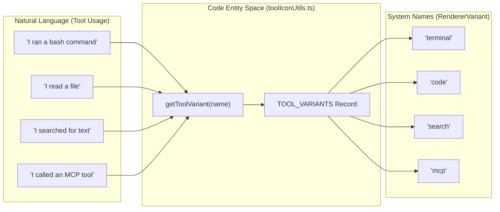
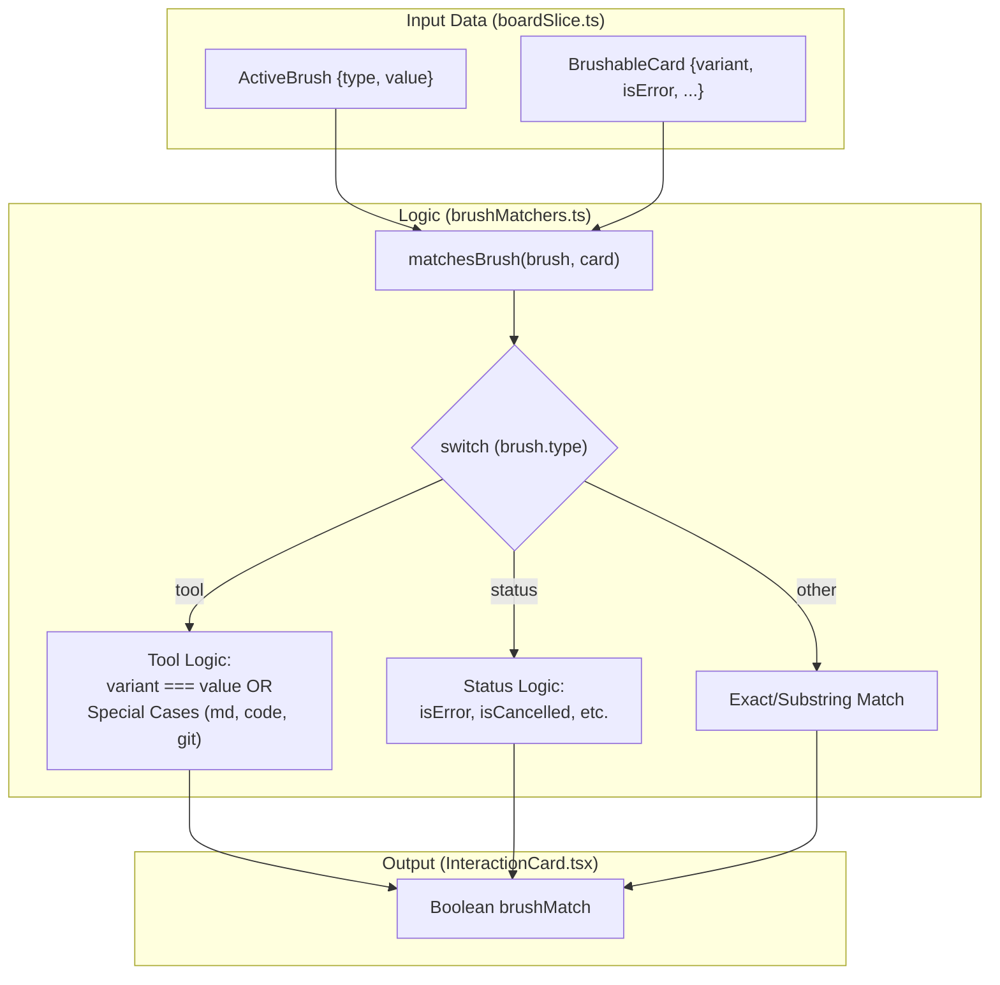

# Brushing System

<details>
<summary>Relevant source files</summary>

The following files were used as context for generating this wiki page:

- [docs/BRUSHING_SPEC.md](docs/BRUSHING_SPEC.md)
- [src/components/SessionBoard/BoardControls.tsx](src/components/SessionBoard/BoardControls.tsx)
- [src/components/SessionBoard/InteractionCard.tsx](src/components/SessionBoard/InteractionCard.tsx)
- [src/components/SessionBoard/SessionBoard.tsx](src/components/SessionBoard/SessionBoard.tsx)
- [src/components/SessionBoard/SessionLane.tsx](src/components/SessionBoard/SessionLane.tsx)
- [src/components/SessionItem.tsx](src/components/SessionItem.tsx)
- [src/components/SmartJsonDisplay.tsx](src/components/SmartJsonDisplay.tsx)
- [src/components/ToolIcon.tsx](src/components/ToolIcon.tsx)
- [src/components/renderers/index.ts](src/components/renderers/index.ts)
- [src/components/renderers/types.ts](src/components/renderers/types.ts)
- [src/store/slices/boardSlice.ts](src/store/slices/boardSlice.ts)
- [src/test/SessionItem.test.tsx](src/test/SessionItem.test.tsx)
- [src/types/board.types.ts](src/types/board.types.ts)
- [src/utils/brushMatchers.ts](src/utils/brushMatchers.ts)
- [src/utils/sessionAnalytics.ts](src/utils/sessionAnalytics.ts)
- [src/utils/toolIconUtils.ts](src/utils/toolIconUtils.ts)
- [src/utils/toolSummaries.ts](src/utils/toolSummaries.ts)

</details>


The Brushing System provides interactive filtering across the `SessionBoard` view, allowing users to highlight related interactions across multiple sessions simultaneously. When a brush is active, matching cards are emphasized while non-matching cards are dimmed, enabling pattern recognition across the timeline (e.g., "which sessions touched this file?", "where did errors cluster?", "what was the tool mix?").

For information about the SessionBoard component itself, see [Session Board](#3.2). For rendering individual message cards, see [Content Renderers](#6.1).

---

## Core Concepts

**Brushing** is an information visualization technique where selecting or hovering over an attribute in one view highlights all items with that attribute across all views. In this application, activating a brush (e.g., "terminal" tool type) causes all terminal-related interactions across all visible session lanes to be highlighted, while unrelated interactions are dimmed.

The system supports two interaction modes:
- **Transient brush** (hover): Activating a filter temporarily until the mouse leaves.
- **Sticky brush** (click): Locking the filter until explicitly cleared (Escape key or clicking again).

Brushing operates at the card level within session lanes, filtering on semantic attributes extracted from each `ClaudeMessage`. The SessionBoard remains a timeline view—brushing does not reorder or group sessions, only emphasizes/de-emphasizes cards within the existing layout.

**Sources:** [docs/BRUSHING_SPEC.md:1-7](), [src/utils/brushMatchers.ts:4-55](), [src/components/SessionBoard/SessionBoard.tsx:43-52]()

---

## Brush Dimensions

The system supports several brush dimensions, each mapping to semantic attributes extracted from message content:

| Dimension | Type | Values | Description |
|-----------|------|--------|-------------|
| `tool` | `string` | `terminal`, `file`, `code`, `search`, `web`, `git`, `document`, `mcp`, `task` | Tool variant categories from `getToolVariant()` |
| `file` | `string` | File paths | Specific files edited or referenced |
| `command` | `string` | Shell commands | Terminal commands executed (filtered by frecency) |
| `mcp` | `string` | Server names | MCP server identifiers or "all" |
| `model` | `string` | Model names | Claude model used (e.g., "sonnet", "opus", "haiku") |
| `status` | `string` | `error`, `cancelled`, `commit` | Execution status indicators |

### Tool Categories

Tool variants are normalized via the `TOOL_VARIANTS` mapping in `src/components/renderers/types.ts` [src/components/renderers/types.ts:1-128](). The `getToolVariant` utility [src/utils/toolIconUtils.ts:8-54]() handles the mapping, including fuzzy fallback for unknown or MCP tools.

**Natural Language to Code Entity Mapping (Tools):**



**Special matching rules** implemented in `matchesBrush` [src/utils/brushMatchers.ts:12-30]():
- **`document` brush**: Matches `variant === "document"` OR any edited file ending in `.md` or `.markdown`.
- **`code` brush**: Matches `variant === "code"` OR `isFileEdit === true` (this captures `create_file` which has a `file` variant but is semantically a code edit).
- **`git` brush**: Matches `variant === "git"` OR `isGit === true` (generic git command detection).

**Sources:** [src/utils/brushMatchers.ts:1-56](), [src/utils/toolIconUtils.ts:8-54](), [docs/BRUSHING_SPEC.md:9-30]()

---

## Type Definitions

### ActiveBrush

The `ActiveBrush` interface represents the currently active filter applied to the board:

```typescript
export interface ActiveBrush {
    type: "model" | "status" | "tool" | "file" | "hook" | "command" | "mcp";
    value: string; // for mcp type, can be "all" or "server_name"
}
```

**Sources:** [src/types/board.types.ts:57-60]()

### BrushableCard

The `BrushableCard` interface defines the properties required by the matching engine to evaluate if a card should be highlighted:

```typescript
export interface BrushableCard {
    role: string;
    model?: string;
    variant: RendererVariant;
    isError: boolean;
    isCancelled: boolean;
    isCommit: boolean;
    isGit: boolean;
    isShell: boolean;
    isFileEdit: boolean;
    editedFiles: string[];
    hasHook: boolean;
    shellCommands: string[];
    mcpServers: string[];
}
```

**Sources:** [src/types/board.types.ts:62-76](), [docs/BRUSHING_SPEC.md:73-86]()

---

## Matching Logic

### Match Predicate

The core matching function `matchesBrush` [src/utils/brushMatchers.ts:4-55]() implements the logic for every brush dimension:

| Brush Type | Matching Logic | Code Reference |
|:---|:---|:---|
| `model` | Substring match against `card.model` | [src/utils/brushMatchers.ts:8-9]() |
| `tool` | Specialized variant matching (code, document, git) | [src/utils/brushMatchers.ts:10-30]() |
| `status` | Boolean flag check (`isError`, `isCancelled`, `isCommit`) | [src/utils/brushMatchers.ts:31-37]() |
| `file` | Exact match or suffix match on `card.editedFiles` | [src/utils/brushMatchers.ts:38-40]() |
| `command` | Exact match against `card.shellCommands` | [src/utils/brushMatchers.ts:43-45]() |
| `mcp` | Checks `card.mcpServers` list; "all" matches any server | [src/utils/brushMatchers.ts:46-51]() |

### Match Computation Flow



**Sources:** [src/utils/brushMatchers.ts:4-55](), [src/components/SessionBoard/InteractionCard.tsx:108-117]()

---

## Visual Interaction Model

### Hover vs. Sticky

The system differentiates between transient interest (hover) and persistent filtering (sticky).

1.  **Hover Brush**: When a user hovers over a tool icon or status badge in a `SessionLane`, `onHover` is called which triggers `setActiveBrush` in the store [src/components/SessionBoard/SessionLane.tsx:45]().
2.  **Sticky Brush**: Clicking an attribute "locks" the brush by setting `stickyBrush` to true [src/store/slices/boardSlice.ts:25](). Controls in `BoardControls` allow manual selection of sticky brushes [src/components/SessionBoard/BoardControls.tsx:103-160]().
3.  **Clearing**: Pressing `Escape` or clicking the active brush again clears the state [src/components/SessionBoard/SessionBoard.tsx:43-52]().

### Visual Treatment per Zoom Level

Brushing effects vary by zoom level to maintain readability:

-   **Pixel View (Zoom 0)**: Matching cards retain their semantic background color; non-matching cards are dimmed. The `SessionLane` calculates a `matchStats` ratio to show the density of brush matches in the lane header [src/components/SessionBoard/SessionLane.tsx:118-141]().
-   **Skim/Read View (Zoom 1-2)**: Matching cards receive a prominent blue ring (`!ring-4 !ring-blue-500`) and an increased z-index [src/components/SessionBoard/InteractionCard.tsx:142]().

**Sources:** [src/components/SessionBoard/InteractionCard.tsx:137-149](), [src/components/SessionBoard/SessionLane.tsx:118-141](), [docs/BRUSHING_SPEC.md:163-237]()

---

## Implementation Details

### Card Semantics Extraction

To avoid expensive re-calculations during hover-induced re-renders, `InteractionCard` extracts semantic data into a `semantics` object via `getCardSemantics` [src/components/SessionBoard/InteractionCard.tsx:108-117](). This object includes:
-   `variant`: Derived from `getToolVariant` [src/utils/toolIconUtils.ts:8]().
-   `isShell`: Specifically identifies terminal commands that are not git commits [docs/BRUSHING_SPEC.md:112-117]().
-   `isFileEdit`: Detects file modification tools.
-   `brushMatch`: The result of `matchesBrush(activeBrush, semantics)`.

### Brush Option Discovery

The `SessionBoard` component dynamically discovers available brushing options (tools, files, MCP servers, commands) by scanning the messages of all visible sessions [src/components/SessionBoard/SessionBoard.tsx:81-155]().
-   **Frecency Scoring**: Commands are ranked by "frecency" (frequency + recency) to show the most relevant shell activity in the brush dropdown [src/components/SessionBoard/SessionBoard.tsx:158-164]().

**Sources:** [src/components/SessionBoard/SessionBoard.tsx:81-164](), [src/components/SessionBoard/InteractionCard.tsx:108-117](), [src/utils/brushMatchers.ts:10-30]()
