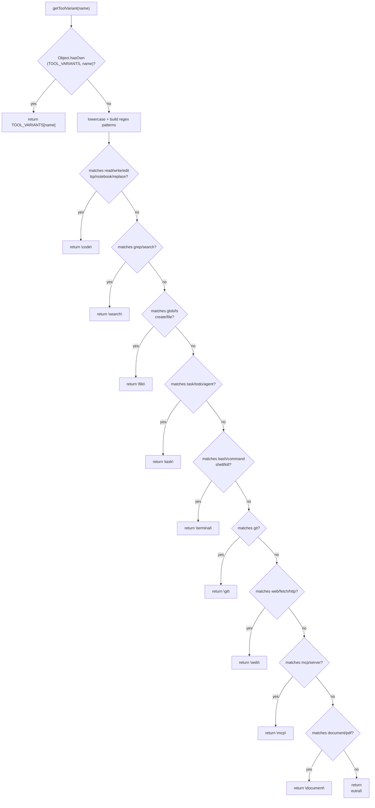
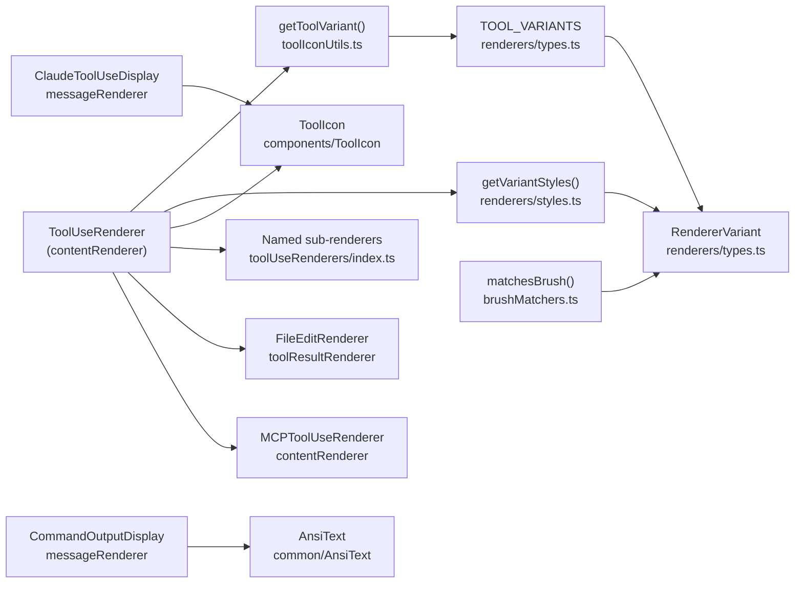

# Tool Icons and Display

<details>
<summary>Relevant source files</summary>

The following files were used as context for generating this wiki page:

- [docs/BRUSHING_SPEC.md](docs/BRUSHING_SPEC.md)
- [src/components/ErrorBoundary.tsx](src/components/ErrorBoundary.tsx)
- [src/components/SessionItem.tsx](src/components/SessionItem.tsx)
- [src/components/contentRenderer/ToolUseRenderer.tsx](src/components/contentRenderer/ToolUseRenderer.tsx)
- [src/components/messageRenderer/ClaudeToolUseDisplay.tsx](src/components/messageRenderer/ClaudeToolUseDisplay.tsx)
- [src/components/messageRenderer/CommandOutputDisplay.tsx](src/components/messageRenderer/CommandOutputDisplay.tsx)
- [src/components/renderers/index.ts](src/components/renderers/index.ts)
- [src/components/renderers/types.ts](src/components/renderers/types.ts)
- [src/components/toolResultRenderer/ClaudeToolResultItem.tsx](src/components/toolResultRenderer/ClaudeToolResultItem.tsx)
- [src/components/toolResultRenderer/FallbackRenderer.tsx](src/components/toolResultRenderer/FallbackRenderer.tsx)
- [src/test/SessionItem.test.tsx](src/test/SessionItem.test.tsx)
- [src/utils/brushMatchers.ts](src/utils/brushMatchers.ts)
- [src/utils/toolIconUtils.ts](src/utils/toolIconUtils.ts)

</details>


This page documents how tool types are identified, classified into visual categories, and rendered in the message viewer. It covers the `RendererVariant` type, the `TOOL_VARIANTS` map, the `getToolVariant` function, and the `ToolUseRenderer` component dispatch logic.

For the broader rendering pipeline that routes content to `ToolUseRenderer`, see [Content Renderers (6.1)](). For how `RendererVariant` values drive the brushing / filtering system on the session board, see [Brushing System (6.2)]().

---

## RendererVariant: Semantic Style Categories

Every tool is mapped to exactly one `RendererVariant` string. This type is the single source of truth for both visual styling (border colors, background tints, icons) and brush filtering on the session board.

Defined in [src/components/renderers/types.ts:68-84]().

| Variant | Intended Tools | CSS Token |
|---|---|---|
| `code` | Read, Write, Edit, MultiEdit, NotebookEdit, LSP | `--tool-code` |
| `file` | Glob, LS | `--tool-file` |
| `search` | Grep | `--tool-search` |
| `task` | Task, TodoWrite, TodoRead | `--tool-task` |
| `terminal` | Bash, KillShell | `--tool-terminal` |
| `git` | git | `--tool-git` |
| `web` | WebSearch, WebFetch, web_search | `--tool-web` |
| `mcp` | MCP server tools | `--tool-mcp` |
| `document` | PDF, markdown documents | _(teal)_ |
| `thinking` | Thinking/reasoning blocks | _(gold)_ |
| `success` | Successful operation results | _(green)_ |
| `error` | Failed results | _(red)_ |
| `warning` | System reminders | _(amber)_ |
| `info` | Generic tool use, task descriptions | _(blue-grey)_ |
| `neutral` | Unknown/unclassified tools | _(grey)_ |

> **Note:** The `system` variant name was used in an earlier version of the codebase for `Bash`/`KillShell`. It has been superseded by `terminal`. See [src/components/renderers/types.ts:117-118]() for the current mapping.

Sources: [src/components/renderers/types.ts:68-128]()

---

## TOOL_VARIANTS: Canonical Name-to-Variant Map

`TOOL_VARIANTS` is a plain `Record<string, RendererVariant>` object exported from the types module. It is the canonical, exact-match registry for all known Claude Code tool names.

```typescript
export const TOOL_VARIANTS: Record<string, RendererVariant> = {
  Read: "code",
  Write: "code",
  Edit: "code",
  MultiEdit: "code",
  NotebookEdit: "code",
  LSP: "code",
  Glob: "file",
  LS: "file",
  Grep: "search",
  WebSearch: "web",
  WebFetch: "web",
  web_search: "web",
  Task: "task",
  TodoWrite: "task",
  TodoRead: "task",
  Bash: "terminal",
  KillShell: "terminal",
  git: "git",
  mcp: "mcp",
  default: "info",
}
```

Sources: [src/components/renderers/types.ts:90-128]()

---

## getToolVariant: Name Resolution

`getToolVariant(name: string): RendererVariant` is defined in [src/utils/toolIconUtils.ts:8]() and is the single entry point for resolving a raw tool name string to a `RendererVariant`.

**Resolution order:**

1. **Canonical exact match** — checks `Object.hasOwn(TOOL_VARIANTS, name)` [src/utils/toolIconUtils.ts:10](). If found, returns immediately.
2. **Fuzzy fallback** — for unknown/MCP/custom tools, applies `RegExp` pattern matching against the tool name (case-insensitive, handles `underscore_case` and `PascalCase` word boundaries) [src/utils/toolIconUtils.ts:14-52]().
3. **Default** — returns `"neutral"` if no pattern matches [src/utils/toolIconUtils.ts:53]().

**Fuzzy keyword rules** (applied only when exact match fails):

| Matched keywords | Returns |
|---|---|
| `read`, `write`, `edit`, `lsp`, `notebook`, `replace` | `"code"` |
| `grep`, `search` | `"search"` |
| `glob`, `ls`, `create`, `file` | `"file"` |
| `task`, `todo`, `agent` | `"task"` |
| `bash`, `command`, `shell`, `kill` | `"terminal"` |
| `git` | `"git"` |
| `web`, `fetch`, `http` | `"web"` |
| `mcp`, `server` | `"mcp"` |
| `document`, `pdf` | `"document"` |
| _(no match)_ | `"neutral"` |

Sources: [src/utils/toolIconUtils.ts:1-54]()

---

**Variant Resolution Flow**

Title: getToolVariant Logic Flow


Sources: [src/utils/toolIconUtils.ts:8-54]()

---

## ToolUseRenderer: Dispatch Logic

`ToolUseRenderer` is a `memo`-wrapped React component in [src/components/contentRenderer/ToolUseRenderer.tsx:62](). It receives a raw `toolUse: Record<string, unknown>` object and dispatches to the appropriate renderer.

**Dispatch order:**

Title: ToolUseRenderer Component Dispatch
```mermaid
flowchart TD
    A["ToolUseRenderer\n(toolUse)"] --> B["getToolVariant(toolName)\n→ variant + styles"]
    B --> C{"toolName in named\nswitch statement?"}
    C -- "Read/Bash/Glob/Grep\nWebFetch/WebSearch\nMultiEdit/TodoWrite\nNotebookEdit/Task*\napply_patch/update_plan" --> D["Named sub-renderer\n(e.g. BashToolRenderer)"]
    C -- "no" --> E{"starts with \"mcp__\"?"}
    E -- "yes" --> F["parseMcpTool()\n→ MCPToolUseRenderer"]
    E -- "no" --> G{"isWriteTool?\n(file_path + content)"}
    G -- "yes" --> H["Inline Write renderer\nwith FilePlus icon\nprism-react-renderer code block"]
    G -- "no" --> I{"isEditTool?\n(file_path + old_string\n+ new_string)"}
    I -- "yes" --> J["FileEditRenderer"]
    I -- "no" --> K{"isAssistantPrompt?\n(description + prompt)"}
    K -- "yes" --> L["Inline prompt renderer\nwith MessageSquare icon"]
    K -- "no" --> M["Default renderer\nToolIcon + JSON code block"]
```

Sources: [src/components/contentRenderer/ToolUseRenderer.tsx:62-404]()

### Named Tool Sub-Renderers

The first `switch` block in `ToolUseRenderer` delegates to dedicated renderer components for well-known tool names [src/components/contentRenderer/ToolUseRenderer.tsx:111-142]().

| `toolName` | Component |
|---|---|
| `Read` | `ReadToolRenderer` |
| `Bash` | `BashToolRenderer` |
| `Glob` | `GlobToolRenderer` |
| `Grep` | `GrepToolRenderer` |
| `WebFetch` | `WebFetchToolRenderer` |
| `WebSearch` | `WebSearchToolRenderer` |
| `MultiEdit` | `MultiEditToolRenderer` |
| `TodoWrite` | `TodoWriteToolRenderer` |
| `NotebookEdit` | `NotebookEditToolRenderer` |
| `TaskCreate` | `TaskCreateToolRenderer` |
| `TaskUpdate` | `TaskUpdateToolRenderer` |
| `TaskOutput` | `TaskOutputToolRenderer` |
| `Task` | `TaskToolRenderer` |
| `apply_patch` | `ApplyPatchToolRenderer` |
| `update_plan` | `UpdatePlanToolRenderer` |

Sources: [src/components/contentRenderer/ToolUseRenderer.tsx:111-142]()

### MCP Tool Parsing

When `toolName` starts with `"mcp__"`, `parseMcpTool()` splits the remainder on the first `__` separator to extract `serverName` and `toolName`, then passes them to `MCPToolUseRenderer` [src/components/contentRenderer/ToolUseRenderer.tsx:75-88]().

Example: `"mcp__my_server__do_thing"` → `{ serverName: "my_server", toolName: "do_thing" }`.

### Input-Shape Fallback Detection

For tools not matched by name or MCP prefix, `ToolUseRenderer` inspects `toolInput` structure [src/components/contentRenderer/ToolUseRenderer.tsx:160-178]():

- **Write tool**: `file_path` + `content` fields present → inline syntax-highlighted file creation view using `prism-react-renderer` with `FilePlus` icon [src/components/contentRenderer/ToolUseRenderer.tsx:180-264]().
- **Edit tool**: `file_path` + `old_string` + `new_string` fields present → delegates to `FileEditRenderer` [src/components/contentRenderer/ToolUseRenderer.tsx:266-271]().
- **Assistant prompt**: `description` + `prompt` string fields → two-section prompt display with `MessageSquare` icon [src/components/contentRenderer/ToolUseRenderer.tsx:273-337]().

---

## ToolIcon Component

`ToolIcon` is a presentational component in [src/components/ToolIcon.tsx:133](). It accepts `toolName` and `className` and renders the appropriate Lucide icon for the tool category based on an internal `getIcon` mapping [src/components/ToolIcon.tsx:60-131]().

Key logic in `ToolIcon`:
- Calls `getIcon(toolName)` to select a Lucide icon component (e.g., `Terminal`, `Edit`, `Search`) [src/components/ToolIcon.tsx:134]().
- Calls `getToolVariant(toolName)` to determine the semantic color [src/components/ToolIcon.tsx:135]().
- Applies Tailwind color classes via `VARIANT_COLORS` mapping if the `colored` prop is true [src/components/ToolIcon.tsx:31-48]().

Sources: [src/components/ToolIcon.tsx:1-145]()

---

## Command Output Display

The `CommandOutputDisplay` component handles the rendering of stdout/stderr from tool executions like `Bash`. It intelligently formats content based on detection logic:

- **JSON Output**: Detected via curly braces; rendered with syntax highlighting [src/components/messageRenderer/CommandOutputDisplay.tsx:47-115]().
- **Test Results**: Detected via keywords like `Test Suites:` or `jest`; rendered with `TestTube` icon and ANSI color support [src/components/messageRenderer/CommandOutputDisplay.tsx:35-143]().
- **Build Output**: Detected via keywords like `webpack` or `compile`; rendered with `Hammer` icon [src/components/messageRenderer/CommandOutputDisplay.tsx:39-174]().
- **ANSI Support**: All terminal-like outputs (tests, build, package management) wrap the raw text in the `AnsiText` component to process terminal color codes [src/components/messageRenderer/CommandOutputDisplay.tsx:139](), [src/components/messageRenderer/CommandOutputDisplay.tsx:168]().

Sources: [src/components/messageRenderer/CommandOutputDisplay.tsx:1-227]()

---

## Component and Data Dependency Map

Title: Tool Display Dependency Graph


Sources: [src/components/contentRenderer/ToolUseRenderer.tsx:1-57](), [src/utils/toolIconUtils.ts:1-2](), [src/components/renderers/types.ts:68-128](), [src/components/messageRenderer/ClaudeToolUseDisplay.tsx:4-5](), [src/utils/brushMatchers.ts:1-2](), [src/components/messageRenderer/CommandOutputDisplay.tsx:22]()
