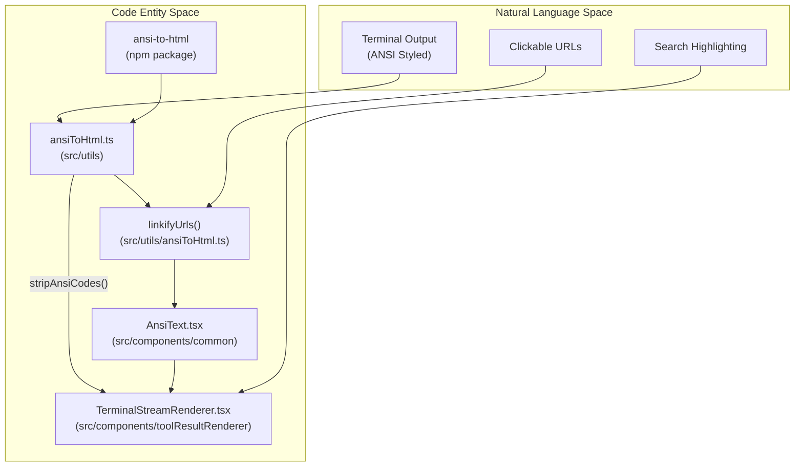
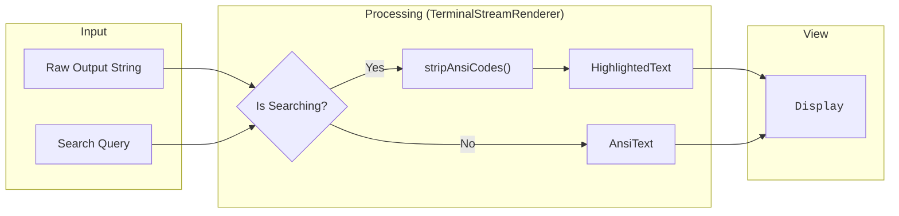

# ANSI and Terminal Rendering

Relevant source files

The following files were used as context for generating this wiki page:

- [.gitignore](.gitignore)
- [docs/specs/issue-109-ansi-rendering.md](docs/specs/issue-109-ansi-rendering.md)
- [src/components/common/AnsiText.tsx](src/components/common/AnsiText.tsx)
- [src/components/toolResultRenderer/TerminalStreamRenderer.tsx](src/components/toolResultRenderer/TerminalStreamRenderer.tsx)
- [src/test/AnsiText.test.tsx](src/test/AnsiText.test.tsx)
- [src/test/ansiToHtml.test.ts](src/test/ansiToHtml.test.ts)
- [src/types/ansi-to-html.d.ts](src/types/ansi-to-html.d.ts)
- [src/utils/ansiToHtml.ts](src/utils/ansiToHtml.ts)

This page documents the ANSI escape code rendering system used to display styled terminal output within the history viewer. It covers the `ansiToHtml` utility, the `AnsiText` component, XSS safety via `escapeXML`, URL linkification, and integration into components like `TerminalStreamRenderer`.

---

## Background

Claude Code commands such as `/context` or `/cost` produce terminal output containing ANSI SGR (Select Graphic Rendition) escape sequences — for example, `\x1b[38;2;136;136;136m` for RGB gray [docs/specs/issue-109-ansi-rendering.md:11-15](). Without processing, these appear as raw control characters in the UI, making output unreadable.

The system converts these sequences into styled HTML `` elements while simultaneously identifying and linkifying URLs, ensuring a rich terminal-like experience within the web interface [src/utils/ansiToHtml.ts:138-149]().

---

## Architecture

The rendering pipeline bridges raw terminal data into React components through a set of utility functions and specialized renderers.

**Component and Utility Relationships**

Sources: [src/utils/ansiToHtml.ts:1-149](), [src/components/common/AnsiText.tsx:1-27](), [src/components/toolResultRenderer/TerminalStreamRenderer.tsx:1-103](), [src/types/ansi-to-html.d.ts:1-15]()

---

## The `ansiToHtml` Utility

**File:** [src/utils/ansiToHtml.ts]()

A module-level singleton `Convert` instance is created at import time and reused for all conversions. It is configured to respect the application theme using CSS variables [src/utils/ansiToHtml.ts:3-8]().

| Function | Signature | Purpose |
|---|---|---|
| `hasAnsiCodes` | `(text: string) => boolean` | Tests whether a string contains SGR escape sequences [src/utils/ansiToHtml.ts:25-27]() |
| `stripAnsiCodes` | `(text: string) => string` | Removes all SGR escape sequences, returning plain text [src/utils/ansiToHtml.ts:33-35]() |
| `linkifyUrls` | `(html: string) => string` | Wraps URLs in `<a>` tags while skipping URLs found inside HTML attributes [src/utils/ansiToHtml.ts:110-136]() |
| `ansiToHtml` | `(text: string) => string` | The main entry point: converts ANSI to HTML spans, then linkifies the result [src/utils/ansiToHtml.ts:146-149]() |

### ANSI_REGEX Scope
The regex `ANSI_REGEX = /\x1b\[[\d;]*m/` matches only SGR sequences (codes ending with `m`). It deliberately ignores cursor movement or screen clearing sequences, which are not relevant for static history viewing [src/utils/ansiToHtml.ts:11-20]().

### URL Linkification Logic
The `linkifyUrls` function uses `URL_OR_TAG_REGEX` to differentiate between URLs in text and URLs inside HTML tags (like ``). It includes sophisticated handling for:
*   **Balanced Parentheses**: Preserves Wikipedia-style URLs like `https://wiki/Rust_(lang)` while stripping trailing parens from prose like `(see https://example.com)` [src/utils/ansiToHtml.ts:84-100]().
*   **HTML Entities**: Truncates URLs at characters that were escaped into entities like `&lt;` or `&quot;` to prevent the URL from "bleeding" into surrounding HTML [src/utils/ansiToHtml.ts:68-72]().

---

## The `AnsiText` Component

**File:** [src/components/common/AnsiText.tsx]()

`AnsiText` is the primary React component for rendering ANSI-colored text. It memoizes the conversion result to optimize performance [src/components/common/AnsiText.tsx:18-20]().

**XSS Safety Mechanism**
`dangerouslySetInnerHTML` is used, but it is safe because the underlying `ansi-to-html` converter is initialized with `escapeXML: true` [src/utils/ansiToHtml.ts:6](). This ensures that:
1.  All user-provided HTML tags are escaped before the string is processed [src/components/common/AnsiText.tsx:9-17]().
2.  The only "dangerous" HTML present is the `` and `<a>` tags explicitly generated by the utility [src/utils/ansiToHtml.ts:132]().

---

## Integration in `TerminalStreamRenderer`

**File:** [src/components/toolResultRenderer/TerminalStreamRenderer.tsx]()

This component handles the output of bash commands and terminal streams. It implements a conditional rendering strategy based on whether a search is active.

**Terminal Rendering Data Flow**

[src/components/toolResultRenderer/TerminalStreamRenderer.tsx:87-98]()

**Rationale**: When a user searches, ANSI escape sequences would interfere with the text matching logic. Therefore, the system strips ANSI codes to provide a clean search experience, while preserving colors in the default view [src/components/toolResultRenderer/TerminalStreamRenderer.tsx:88-91]().

---

## Testing and Verification

The system is backed by comprehensive tests covering utility logic, component rendering, and XSS safety.

| Test File | Focus Area | Key Validations |
|---|---|---|
| `src/test/ansiToHtml.test.ts` | Utilities | Validates `linkifyUrls` boundary detection, balanced parens, and SGR detection [src/test/ansiToHtml.test.ts:1-166](). |
| `src/test/AnsiText.test.tsx` | Component | Ensures that `<script>` tags are escaped even when mixed with ANSI codes [src/test/AnsiText.test.tsx:48-60](). |

Sources: [src/utils/ansiToHtml.ts:1-149](), [src/components/common/AnsiText.tsx:1-27](), [src/components/toolResultRenderer/TerminalStreamRenderer.tsx:1-103](), [src/test/ansiToHtml.test.ts:1-166](), [src/test/AnsiText.test.tsx:1-191]()
