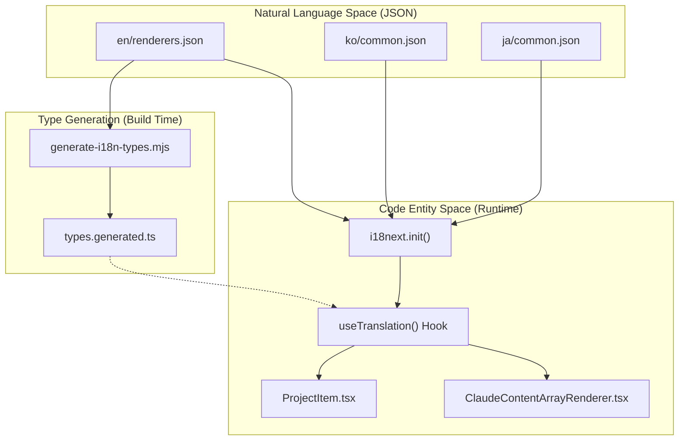
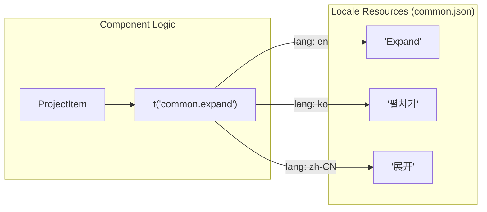

# Internationalization

Relevant source files

The following files were used as context for generating this wiki page:

- [src/components/ProjectTree/components/ProjectItem.tsx](src/components/ProjectTree/components/ProjectItem.tsx)
- [src/components/ProjectTree/index.tsx](src/components/ProjectTree/index.tsx)
- [src/components/contentRenderer/ClaudeContentArrayRenderer.tsx](src/components/contentRenderer/ClaudeContentArrayRenderer.tsx)
- [src/components/contentRenderer/OpenCodeStepRenderer.tsx](src/components/contentRenderer/OpenCodeStepRenderer.tsx)
- [src/i18n/locales/en/common.json](src/i18n/locales/en/common.json)
- [src/i18n/locales/en/renderers.json](src/i18n/locales/en/renderers.json)
- [src/i18n/locales/ja/common.json](src/i18n/locales/ja/common.json)
- [src/i18n/locales/ja/renderers.json](src/i18n/locales/ja/renderers.json)
- [src/i18n/locales/ko/common.json](src/i18n/locales/ko/common.json)
- [src/i18n/locales/ko/renderers.json](src/i18n/locales/ko/renderers.json)
- [src/i18n/locales/zh-CN/common.json](src/i18n/locales/zh-CN/common.json)
- [src/i18n/locales/zh-CN/renderers.json](src/i18n/locales/zh-CN/renderers.json)
- [src/i18n/locales/zh-TW/common.json](src/i18n/locales/zh-TW/common.json)
- [src/i18n/locales/zh-TW/renderers.json](src/i18n/locales/zh-TW/renderers.json)

This document provides a high-level overview of the internationalization (i18n) system in the Claude Code History Viewer. The system is designed to provide a localized experience for English, Korean, Japanese, Simplified Chinese, and Traditional Chinese users by decoupling UI strings from component logic.

## Purpose and Scope

The i18n system ensures that all user-facing text—including error messages, tool descriptions, analytics labels, and settings—is externalized into locale-specific JSON files. This allows the application to:
- Support global users in their native languages [src/i18n/locales/en/common.json:1-159]().
- Dynamically switch languages at runtime without restarting the application via the `common.settings.language.title` interface [src/i18n/locales/ko/common.json:83-85]().
- Maintain type safety for translation keys across various UI namespaces like `renderers`, `common`, and `analytics`.

## Supported Locales

The application currently supports five major locales across multiple namespaces:

| Locale Code | Language | Source File (Common) | Source File (Renderers) |
|:---|:---|:---|:---|
| `en` | English | [src/i18n/locales/en/common.json:1-159]() | [src/i18n/locales/en/renderers.json:1-138]() |
| `ko` | Korean | [src/i18n/locales/ko/common.json:1-159]() | [src/i18n/locales/ko/renderers.json:1-138]() |
| `ja` | Japanese | [src/i18n/locales/ja/common.json:1-159]() | [src/i18n/locales/ja/renderers.json:1-156]() |
| `zh-CN` | Simplified Chinese | [src/i18n/locales/zh-CN/common.json:1-159]() | [src/i18n/locales/zh-CN/renderers.json:1-161]() |
| `zh-TW` | Traditional Chinese | [src/i18n/locales/zh-TW/common.json:1-159]() | [src/i18n/locales/zh-TW/renderers.json:1-164]() |

## System Architecture

The i18n system bridges the "Natural Language Space" (JSON resource files) with the "Code Entity Space" (React components and TypeScript types).

### i18n Data Flow Diagram

This diagram illustrates how a raw translation string in a JSON file reaches a UI component like `ProjectItem` or `ClaudeContentArrayRenderer`.

Sources: [src/components/ProjectTree/components/ProjectItem.tsx:4-21](), [src/components/contentRenderer/ClaudeContentArrayRenderer.tsx:36-151]()

### Component Integration

Components consume translations using the `useTranslation` hook from `react-i18next`. For example, the `ProjectItem` component uses the `t` function to localize provider labels and expand/collapse actions [src/components/ProjectTree/components/ProjectItem.tsx:21-79]().

Sources: [src/components/ProjectTree/components/ProjectItem.tsx:79-89](), [src/i18n/locales/en/common.json:34-34](), [src/i18n/locales/ko/common.json:34-34](), [src/i18n/locales/zh-CN/common.json:34-34]()

## Key Subsystems

The i18n implementation is divided into two primary areas:

### 7.1 Translation System
The application uses a namespace-based organization (e.g., `common`, `analytics`, `session`, `settings`, `tools`, `renderers`) to manage hundreds of translation keys. This organization prevents key collisions and allows for logical separation of UI strings. The system supports complex features like pluralization (e.g., `{{count}} messages`) and dynamic interpolation [src/i18n/locales/en/renderers.json:38-38]().

For details, see [Translation System](#7.1).

### 7.2 Type Generation
To prevent runtime errors caused by missing or misspelled translation keys, the project employs a suite of scripts including `generate-i18n-types.mjs`. This script parses the locale files and produces `types.generated.ts`, ensuring that developers receive IDE autocompletion and compile-time checks when using the `t()` function. Other scripts like `sync-i18n-keys.mjs` ensure consistency across all supported languages.

For details, see [Type Generation](#7.2).

## Common Translation Patterns

The following table highlights how common UI elements are mapped across the i18n system:

| Feature | Key Example | Usage in Code |
|:---|:---|:---|
| **Status** | `status.scanning` | Displayed during project discovery [src/i18n/locales/en/common.json:144-144]() |
| **Time** | `common.time.daysAgo` | Formats relative timestamps [src/i18n/locales/en/common.json:94-94]() |
| **Providers** | `common.provider.claude` | Labels the AI source (Claude Code) [src/i18n/locales/en/common.json:119-119]() |
| **Rendering** | `advancedTextDiff.added` | Labels additions in the diff viewer [src/i18n/locales/en/renderers.json:2-2]() |
| **Errors** | `common.error.unexpected` | Generic error boundary messages [src/i18n/locales/en/common.json:29-29]() |

Sources: [src/i18n/locales/en/common.json:1-159](), [src/i18n/locales/en/renderers.json:1-138](), [src/components/ProjectTree/components/ProjectItem.tsx:35-41]()
