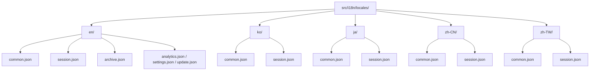
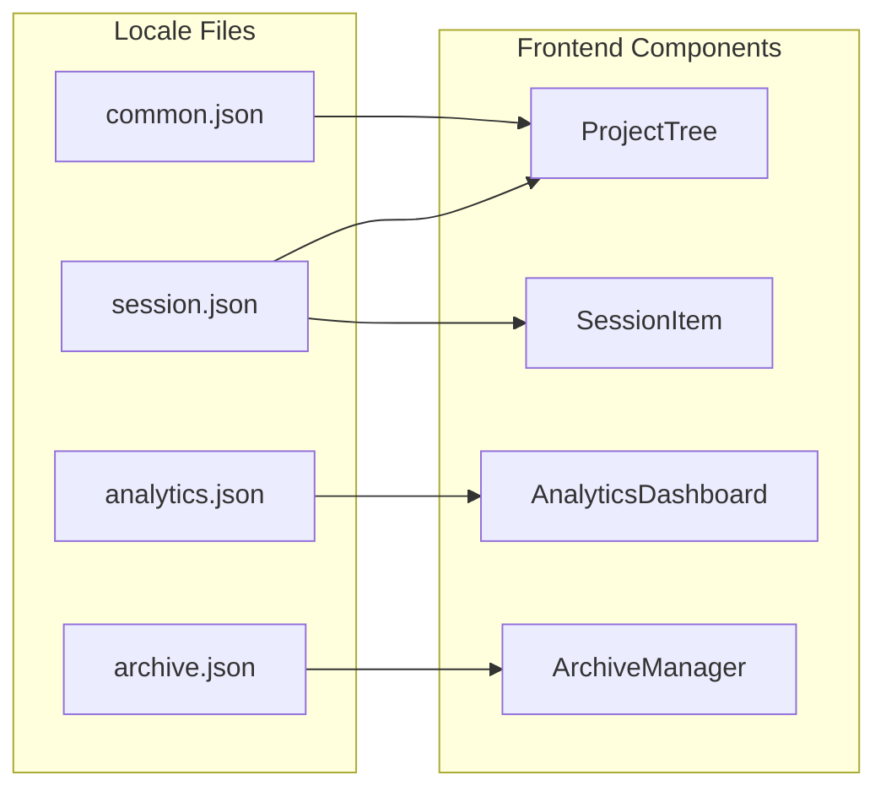
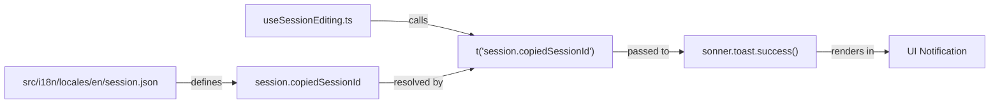

# Translation System

<details>
<summary>Relevant source files</summary>

The following files were used as context for generating this wiki page:

- [src/components/AnalyticsDashboard/components/ActivityHeatmap.tsx](src/components/AnalyticsDashboard/components/ActivityHeatmap.tsx)
- [src/components/AnalyticsDashboard/views/ProjectStatsView.tsx](src/components/AnalyticsDashboard/views/ProjectStatsView.tsx)
- [src/components/ProjectTree/components/ProjectItem.tsx](src/components/ProjectTree/components/ProjectItem.tsx)
- [src/components/ProjectTree/index.tsx](src/components/ProjectTree/index.tsx)
- [src/components/SessionItem/SessionItem.tsx](src/components/SessionItem/SessionItem.tsx)
- [src/components/SessionItem/components/SessionContextMenu.tsx](src/components/SessionItem/components/SessionContextMenu.tsx)
- [src/components/SessionItem/components/SessionNameEditor.tsx](src/components/SessionItem/components/SessionNameEditor.tsx)
- [src/components/SessionItem/hooks/useSessionEditing.ts](src/components/SessionItem/hooks/useSessionEditing.ts)
- [src/components/SessionItem/types.ts](src/components/SessionItem/types.ts)
- [src/i18n/locales/en/analytics.json](src/i18n/locales/en/analytics.json)
- [src/i18n/locales/en/archive.json](src/i18n/locales/en/archive.json)
- [src/i18n/locales/en/common.json](src/i18n/locales/en/common.json)
- [src/i18n/locales/en/session.json](src/i18n/locales/en/session.json)
- [src/i18n/locales/en/update.json](src/i18n/locales/en/update.json)
- [src/i18n/locales/ja/analytics.json](src/i18n/locales/ja/analytics.json)
- [src/i18n/locales/ja/archive.json](src/i18n/locales/ja/archive.json)
- [src/i18n/locales/ja/common.json](src/i18n/locales/ja/common.json)
- [src/i18n/locales/ja/session.json](src/i18n/locales/ja/session.json)
- [src/i18n/locales/ja/update.json](src/i18n/locales/ja/update.json)
- [src/i18n/locales/ko/analytics.json](src/i18n/locales/ko/analytics.json)
- [src/i18n/locales/ko/archive.json](src/i18n/locales/ko/archive.json)
- [src/i18n/locales/ko/common.json](src/i18n/locales/ko/common.json)
- [src/i18n/locales/ko/session.json](src/i18n/locales/ko/session.json)
- [src/i18n/locales/ko/update.json](src/i18n/locales/ko/update.json)
- [src/i18n/locales/zh-CN/analytics.json](src/i18n/locales/zh-CN/analytics.json)
- [src/i18n/locales/zh-CN/archive.json](src/i18n/locales/zh-CN/archive.json)
- [src/i18n/locales/zh-CN/common.json](src/i18n/locales/zh-CN/common.json)
- [src/i18n/locales/zh-CN/session.json](src/i18n/locales/zh-CN/session.json)
- [src/i18n/locales/zh-CN/update.json](src/i18n/locales/zh-CN/update.json)
- [src/i18n/locales/zh-TW/analytics.json](src/i18n/locales/zh-TW/analytics.json)
- [src/i18n/locales/zh-TW/archive.json](src/i18n/locales/zh-TW/archive.json)
- [src/i18n/locales/zh-TW/common.json](src/i18n/locales/zh-TW/common.json)
- [src/i18n/locales/zh-TW/session.json](src/i18n/locales/zh-TW/session.json)
- [src/i18n/locales/zh-TW/update.json](src/i18n/locales/zh-TW/update.json)
- [src/types/archive.ts](src/types/archive.ts)

</details>


This page documents the internationalization (i18n) infrastructure: the namespace layout, locale file organization, key naming conventions, and how `react-i18next` is wired into UI components. For the auto-generated TypeScript types derived from the locale files, see [Type Generation](7.2).

---

## Overview

The application supports five locales across multiple translation namespaces. All translations live under `src/i18n/locales/` and are loaded at runtime by `react-i18next`. TypeScript type safety is provided by auto-generated files derived from these JSON definitions.

---

## Supported Locales

| Code | Language | Source |
|------|----------|--------|
| `en` | English (base) | [src/i18n/locales/en/common.json:1-159]() |
| `ko` | Korean | [src/i18n/locales/ko/common.json:1-159]() |
| `ja` | Japanese | [src/i18n/locales/ja/common.json:1-159]() |
| `zh-CN` | Simplified Chinese | [src/i18n/locales/zh-CN/common.json:1-159]() |
| `zh-TW` | Traditional Chinese | [src/i18n/locales/zh-TW/common.json:1-159]() |

---

## Namespace Structure

The i18n system is divided into logical namespaces to keep translation files manageable and scoped.

| Namespace | Purpose |
|-----------|---------|
| `common` | Shared UI labels: buttons (Add, Cancel), status messages (Scanning, Loading), time formatting, provider names (Claude Code, Cursor, etc.), and watcher states. |
| `session` | Project tree management, session list controls, session board analysis, and session item context menus. |
| `analytics` | Analytics dashboard: charts, token counts, cost breakdowns, and activity heatmaps. |
| `renderers` | Content renderer components: diff viewer, git workflow, web search, MCP results, and terminal stream output. |
| `message` | Message viewer UI, headers, and specific message role labels. |
| `archive` | Archive manager UI: creating archives, browsing archived sessions, and manifest labels. |
| `update` | Auto-updater UI: release notes, download status, and version comparison. |
| `error` | Detailed error messaging and troubleshooting guides. |
| `feedback` | Feedback submission form and status messages. |

Sources: [src/i18n/locales/en/common.json:1-159](), [src/i18n/locales/en/session.json:1-133](), [src/i18n/locales/en/archive.json:1-40](), [src/i18n/locales/en/update.json:1-20]()

---

## File Organization

Every namespace has one JSON file per locale. The path pattern is `src/i18n/locales/{locale}/{namespace}.json`.

**Directory layout diagram:**



Sources: [src/i18n/locales/en/common.json:1-159](), [src/i18n/locales/ko/common.json:1-159](), [src/i18n/locales/ja/common.json:1-159](), [src/i18n/locales/zh-CN/common.json:1-159](), [src/i18n/locales/zh-TW/common.json:1-159]()

---

## Key Naming Conventions

### Structure
Keys use **flat dot-notation strings** stored as top-level JSON properties.

```json
// Example from src/i18n/locales/en/common.json
{
  "common.add": "Add",
  "status.scanning": "Scanning projects...",
  "time.today": "Today"
}
```

### Grouping Pattern
Within a namespace file, keys are prefixed with a group name that mirrors the namespace or a specific sub-feature:

| Prefix | Namespace File | Scope |
|--------|----------------|-------|
| `common.*` | `common.json` | Global labels (Add, Cancel, Save) [src/i18n/locales/en/common.json:2-138]() |
| `status.*` | `common.json` | App-wide loading states [src/i18n/locales/en/common.json:139-146]() |
| `project.*` | `session.json` | Sidebar project explorer labels [src/i18n/locales/en/session.json:2-35]() |
| `session.*` | `session.json` | Session board and list items [src/i18n/locales/en/session.json:36-133]() |
| `archive.*` | `archive.json` | Archive manager and browser [src/i18n/locales/en/archive.json:2-40]() |

---

## Interpolation and Pluralization

### Variable Interpolation
Values use the `{{variable}}` syntax.
- `common.time.daysAgo`: `"{{count}} day ago"` [src/i18n/locales/en/common.json:94]()
- `common.update.current`: `"Current version: {{current}} → {{latest}}"` [src/i18n/locales/en/common.json:110]()

### Pluralization
The codebase uses `i18next` pluralization logic. For English, the `_plural` suffix is used:
- `common.update.deadline`: `"Update deadline: {{days}} day left"` [src/i18n/locales/en/common.json:111]()
- `common.update.deadline_plural`: `"Update deadline: {{days}} days left"` [src/i18n/locales/en/common.json:112]()

Sources: [src/i18n/locales/en/common.json:94-112]()

---

## react-i18next Integration

Components consume translations via the `useTranslation` hook.

### Component Implementation
In `ProjectTree/index.tsx`, the hook is initialized to provide the `t` function and `i18n` instance for language-specific logic like retrieving the current locale for time formatting.

[src/components/ProjectTree/index.tsx:69-69]()

```tsx
const { t, i18n } = useTranslation();
```

### Namespace-to-Component Mapping
The diagram below associates namespaces with the UI subsystems that consume them:



Sources: [src/components/ProjectTree/index.tsx:69-69](), [src/components/SessionItem/hooks/useSessionEditing.ts:40-40](), [src/components/AnalyticsDashboard/views/ProjectStatsView.tsx:1-20]()

---

## Translation Data Flow

This diagram traces the flow from a JSON definition to a rendered UI element, using the `SessionItem` renaming feature as an example.



Sources: [src/i18n/locales/en/session.json:94-94](), [src/components/SessionItem/hooks/useSessionEditing.ts:170-178]()
