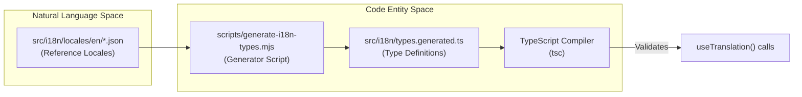
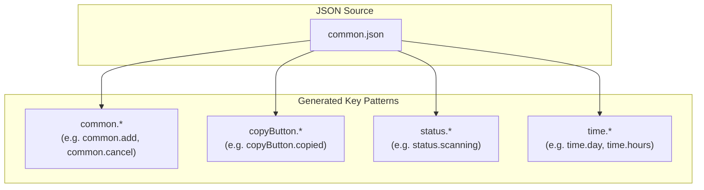
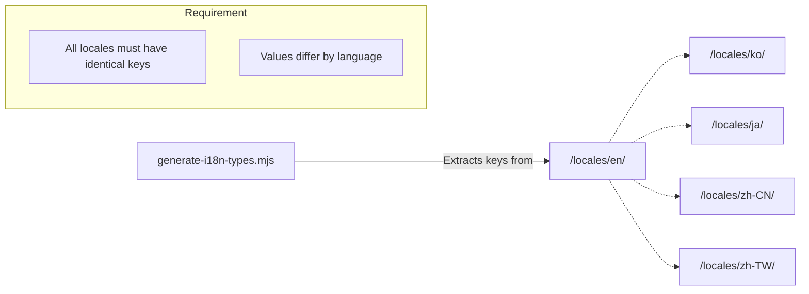

# Type Generation

<details>
<summary>Relevant source files</summary>

The following files were used as context for generating this wiki page:

- [src/components/SettingsManager/sections/WslSection.tsx](src/components/SettingsManager/sections/WslSection.tsx)
- [src/components/modals/folderSelect/FolderSelector.tsx](src/components/modals/folderSelect/FolderSelector.tsx)
- [src/i18n/locales/en/settings.json](src/i18n/locales/en/settings.json)
- [src/i18n/locales/ja/settings.json](src/i18n/locales/ja/settings.json)
- [src/i18n/locales/ko/settings.json](src/i18n/locales/ko/settings.json)
- [src/i18n/locales/zh-CN/settings.json](src/i18n/locales/zh-CN/settings.json)
- [src/i18n/locales/zh-TW/settings.json](src/i18n/locales/zh-TW/settings.json)
- [src/i18n/types.generated.ts](src/i18n/types.generated.ts)

</details>


This page covers the auto-generated TypeScript type definitions for the i18n system, specifically the `types.generated.ts` file and the suite of scripts that manage translation keys and type safety.

---

## Purpose

`src/i18n/types.generated.ts` provides compile-time TypeScript types for every translation key in every namespace. These types enable editors and the TypeScript compiler to catch misspelled or missing translation keys before runtime. The file is never edited by hand; it is regenerated whenever locale JSON files change.

---

## How Generation Works

The generation process is driven by a Node.js script that parses the source of truth—the English locale files—and maps their structure into TypeScript union types.

**Generation pipeline diagram**



Sources: [src/i18n/types.generated.ts:1-11](), [src/i18n/types.generated.ts:44-45]()

The script reads the English locale files as the authoritative source of keys. For each namespace JSON file it finds under `src/i18n/locales/en/`, it collects all JSON keys and emits a TypeScript union type. The output file header records metadata about the generation run:

| Metadata field | Current Value (Example) |
|---|---|
| Generator script | `scripts/generate-i18n-types.mjs` |
| Run command | `pnpm run generate:i18n-types` |
| Total keys | 1722 |
| Namespace count | 11 |

Sources: [src/i18n/types.generated.ts:1-11]()

---

## Output Structure

The generated file exports two categories of types:

1.  **`I18nNamespace`**: A union of all valid namespace string literals used by `react-i18next`.
2.  **Per-namespace key types**: Individual union types (e.g., `CommonKeys`, `AnalyticsKeys`) containing every dotted key path found in that namespace.

**Type export map**

```mermaid
classDiagram
    class "types.generated.ts" {
        +I18nNamespace
        +CommonKeys
        +AnalyticsKeys
        +SessionKeys
        +SettingsKeys
        +ToolsKeys
        +ErrorKeys
        +MessageKeys
        +RenderersKeys
        +UpdateKeys
        +FeedbackKeys
        +RecentEditsKeys
    }
    
    class "Namespace Definitions" {
        <<type>>
        common
        analytics
        session
        settings
        tools
        error
        message
        renderers
        update
        feedback
        recentEdits
    }

    "types.generated.ts" ..> "Namespace Definitions" : defines
```

Sources: [src/i18n/types.generated.ts:29-40]()

### `I18nNamespace`

The `I18nNamespace` type ensures that whenever a component requests a translation namespace, it uses a valid identifier recognized by the system.

```ts
export type I18nNamespace =
  | 'common'
  | 'analytics'
  | 'session'
  | 'settings'
  | 'tools'
  | 'error'
  | 'message'
  | 'renderers'
  | 'update'
  | 'feedback'
  | 'recentEdits';
```

Sources: [src/i18n/types.generated.ts:29-40]()

### Per-namespace key types

Each namespace has a corresponding exported union type. The keys are the full dotted paths as they appear in the JSON files.

| Type name | Source file | Key count |
|---|---|---|
| `CommonKeys` | `locales/{lang}/common.json` | 156 |
| `AnalyticsKeys` | `locales/{lang}/analytics.json` | 179 |
| `SessionKeys` | `locales/{lang}/session.json` | ~116 |
| `SettingsKeys` | `locales/{lang}/settings.json` | ~501 |
| `ToolsKeys` | `locales/{lang}/tools.json` | ~69 |
| `ErrorKeys` | `locales/{lang}/error.json` | ~37 |
| `MessageKeys` | `locales/{lang}/message.json` | ~66 |
| `RenderersKeys` | `locales/{lang}/renderers.json` | ~255 |
| `UpdateKeys` | `locales/{lang}/update.json` | ~65 |
| `FeedbackKeys` | `locales/{lang}/feedback.json` | ~32 |
| `RecentEditsKeys` | `locales/{lang}/recentEdits.json` | ~20 |

Sources: [src/i18n/types.generated.ts:13-28](), [src/i18n/types.generated.ts:43-46](), [src/i18n/types.generated.ts:205-208]()

---

## Key Naming Convention

Keys in the JSON files, and therefore in the generated types, follow a dotted path that usually—but not always—starts with the namespace name. 

### Common Namespace Exceptions
The `common` namespace hosts multiple top-level prefixes used across the entire application for shared UI elements and statuses.

**Key prefix patterns in `CommonKeys`**



Sources: [src/i18n/types.generated.ts:46-202]()

### Standard Namespace Patterns
For other namespaces, the prefix strictly matches the namespace name to maintain isolation. For example, every key in `AnalyticsKeys` starts with `analytics.`:

```ts
export type AnalyticsKeys =
  | 'analytics.Analytics Dashboard'
  | 'analytics.Avg Session Time'
  | 'analytics.billingBreakdown'
  // ...
```

Sources: [src/i18n/types.generated.ts:208-233]()

---

## Relationship to Locale JSON Files

The generator treats the English locale (`/locales/en/`) as the source of truth for key names. While the application supports English, Korean, Japanese, Simplified Chinese, and Traditional Chinese, the type system only generates keys based on the English files.

**Locale file synchronization**



Sources: [src/i18n/types.generated.ts:44-45](), [src/i18n/types.generated.ts:206-207]()

---

## Supporting i18n Scripts

In addition to `generate-i18n-types.mjs`, several other maintenance scripts are used to manage the i18n lifecycle:

*   **`flatten-i18n.mjs`**: Converts nested JSON translation files into a flat structure (e.g., `{"a": {"b": "c"}}` becomes `{"a.b": "c"}`). This is required before type generation.
*   **`split-i18n-namespaces.mjs`**: Splits large translation files into the 11 manageable namespaces listed in `I18nNamespace`. This ensures LLMs can process individual translation files without hitting context limits.
*   **`sync-i18n-keys.mjs`**: Synchronizes keys across all languages. It ensures that if a key is added to `en/settings.json`, it is also added to `ko/settings.json`, `ja/settings.json`, etc.
*   **`validate-i18n.mjs`**: Validates that all locale files have the exact same set of keys as the English source of truth and checks for empty values or syntax errors.

Sources: [src/i18n/types.generated.ts:1-11](), [src/i18n/types.generated.ts:16-28]()

---

## Regenerating the Types

When a translation key is added, removed, or renamed in any locale JSON file, the generated types must be updated to maintain type safety.

### Generation Command
The following command invokes the generation script:

```sh
pnpm run generate:i18n-types
```

This command executes `node scripts/generate-i18n-types.mjs`, which overwrites `src/i18n/types.generated.ts`.

### Maintenance Rules
1.  **Do not edit `types.generated.ts` by hand**: The file header explicitly warns `직접 수정하지 마세요` ("Do not modify directly"). Any manual changes will be lost on the next generation run.
2.  **Commit after generation**: Always commit the updated `types.generated.ts` alongside the locale JSON changes to prevent CI build failures or type mismatches in other developers' environments.

Sources: [src/i18n/types.generated.ts:1-11]()
