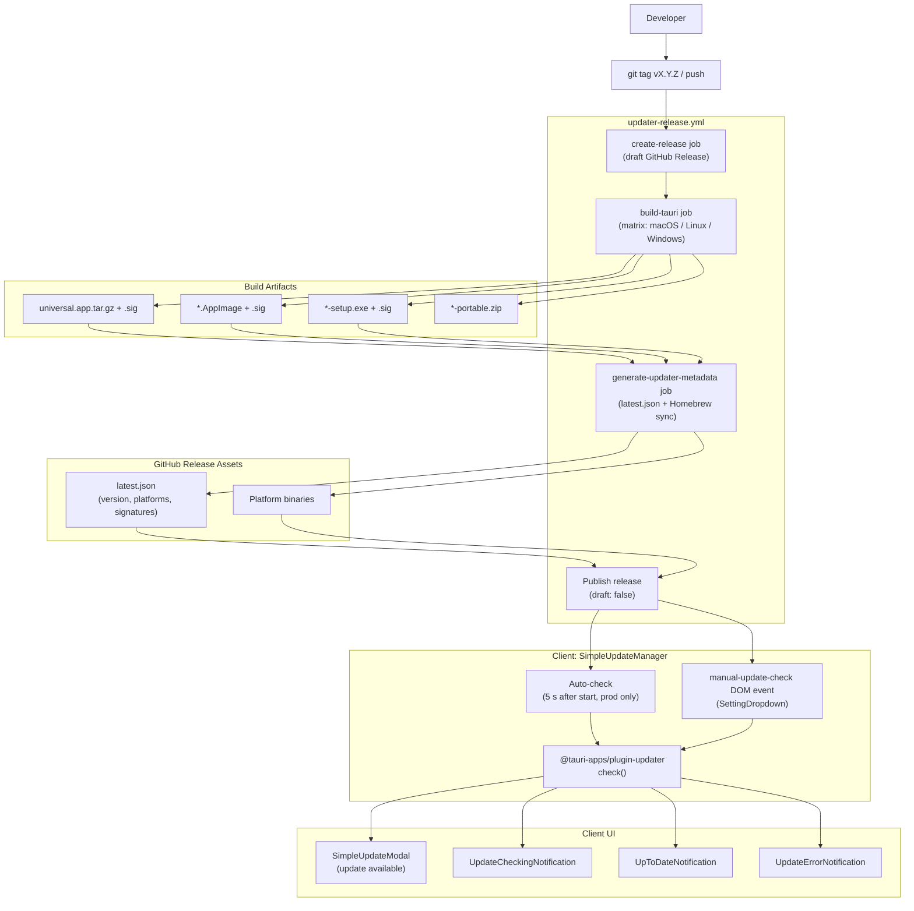
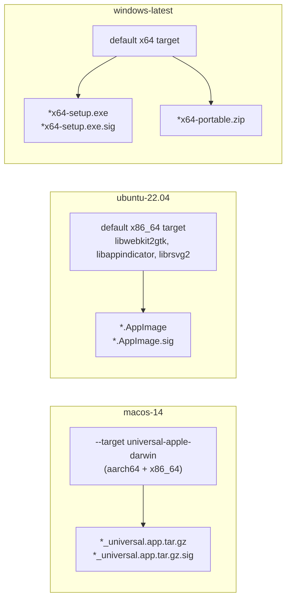

# Update System

<details>
<summary>Relevant source files</summary>

The following files were used as context for generating this wiki page:

- [.github/workflows/updater-release.yml](.github/workflows/updater-release.yml)
- [justfile](justfile)
- [pnpm-lock.yaml](pnpm-lock.yaml)
- [src-tauri/.cargo/config.toml](src-tauri/.cargo/config.toml)
- [src-tauri/capabilities/default.json](src-tauri/capabilities/default.json)
- [src-tauri/tests/capabilities.test.ts](src-tauri/tests/capabilities.test.ts)
- [src/components/SimpleUpdateModal.tsx](src/components/SimpleUpdateModal.tsx)
- [src/hooks/useUpdater.test.ts](src/hooks/useUpdater.test.ts)
- [src/hooks/useUpdater.ts](src/hooks/useUpdater.ts)
- [src/index.css](src/index.css)
- [src/test/SimpleUpdateManager.test.tsx](src/test/SimpleUpdateManager.test.tsx)
- [src/test/SimpleUpdateModal.test.tsx](src/test/SimpleUpdateModal.test.tsx)
- [src/test/updateDiagnostics.test.ts](src/test/updateDiagnostics.test.ts)
- [src/utils/updateDiagnostics.ts](src/utils/updateDiagnostics.ts)
- [src/utils/updateError.ts](src/utils/updateError.ts)
- [tailwind.config.js](tailwind.config.js)

</details>


The Update System delivers and installs application updates automatically. It has two main components: the **Release Workflow** (GitHub Actions) that builds platform-specific binaries, signs them, and generates update metadata; and the **Auto-Updater** client that checks for updates on a configurable schedule and presents them through custom UI components.

For information about the development build process, see [Build System](#9.1). For information about manual testing procedures, see [Testing](#9.2). The release workflow (`updater-release.yml`) and the in-app updater (`SimpleUpdateManager`, `useUpdater`) are detailed in pages 8.1 and 8.2 respectively.

## Overview

The Update System enables automatic updates for desktop users across Windows, macOS, and Linux platforms. When a new version is tagged in the git repository, GitHub Actions automatically builds binaries for all platforms, signs them with cryptographic signatures, generates an update manifest (`latest.json`), and publishes the release. Client applications periodically check this manifest and can download and install updates without requiring manual intervention from users.

### Update Flow Architecture

**End-to-end update pipeline: from tag push to in-app notification**



Sources: [.github/workflows/updater-release.yml:1-394](), [src/test/SimpleUpdateManager.test.tsx:108-131]()

### Version Management

Version information is maintained in three synchronized files, with `package.json` serving as the single source of truth. The `sync-version` script in the `justfile` ensures these stay in lockstep.

| File | Field | Purpose |
|------|-------|---------|
| `package.json` | `version` | Single source of truth |
| `src-tauri/Cargo.toml` | `package.version` | Rust backend version |
| `src-tauri/tauri.conf.json` | `version` | Tauri bundle version |

Sources: [package.json:4](), [justfile:79-80]()

## Platform-Specific Build Targets

The `build-tauri` job in `updater-release.yml` uses a matrix strategy to build for three platforms simultaneously:

**Build matrix definition: runner, Rust target, and output artifact per platform**



- **macOS Universal Binary:** Targets `universal-apple-darwin` [.github/workflows/updater-release.yml:61](), producing a single binary that runs natively on both Apple Silicon and Intel.
- **Linux AppImage:** Includes a post-processing step to fix EGL crashes on rolling-release distros (like Arch Linux) by removing bundled GPU-driver-dependent libs [.github/workflows/updater-release.yml:186-210]().
- **Windows:** Produces standard NSIS setup executables and a standalone "portable" zip [.github/workflows/updater-release.yml:132-164]().

Sources: [.github/workflows/updater-release.yml:53-140]()

## Cryptographic Signing

All updater artifacts are cryptographically signed using Tauri's minisign-based signing mechanism.

### Signature Generation

The `tauri-action` in the workflow signs artifacts using keys provided via secrets [.github/workflows/updater-release.yml:112-124]().

| Secret | Purpose |
|--------|---------|
| `TAURI_SIGNING_PRIVATE_KEY` | Base64-encoded minisign private key |
| `TAURI_SIGNING_PRIVATE_KEY_PASSWORD` | Password protecting the private key |

Sources: [.github/workflows/updater-release.yml:116-117]()

### Signature Verification

The `@tauri-apps/plugin-updater` [pnpm-lock.yaml:76-78]() verifies the `.sig` signature against the public key embedded in the app bundle configuration before installation.

## Client-Side Update Flow

**Sequence of events from app start through update installation**

```mermaid
sequenceDiagram
    participant SM["SimpleUpdateManager"]
    participant Hook["useUpdater hook"]
    participant Plugin["@tauri-apps/plugin-updater"]
    participant UI["SimpleUpdateModal"]
    participant User

    SM->>Hook: checkForUpdates()
    Hook->>Plugin: check()
    Plugin-->>Hook: UpdateInfo
    Hook-->>SM: state.hasUpdate = true
    SM->>UI: Render Modal (isVisible=true)
    
    User->>UI: Click "Download & Install"
    UI->>Hook: downloadAndInstall()
    Hook->>Plugin: download(onDownloadEvent)
    Plugin-->>Hook: 'progress' events
    Hook-->>UI: state.downloadProgress
    
    Hook->>Plugin: install()
    Plugin->>Plugin: Relaunch Application
```

### `useUpdater` hook state machine

The `useUpdater` hook manages the complex lifecycle of an update, including progress tracking and error handling [src/hooks/useUpdater.ts:77-156](). It includes a race condition between the update check and a 20-second timeout [src/hooks/useUpdater.ts:7]().

| State Field | Type | Description |
|-------------|------|-------------|
| `isChecking` | `boolean` | Currently querying update server |
| `hasUpdate` | `boolean` | New version is available |
| `isDownloading` | `boolean` | Payload is being transferred |
| `isInstalling` | `boolean` | Binary is being written to disk |
| `downloadProgress` | `number` | 0-100 percentage of download [src/hooks/useUpdater.ts:201-205]() |
| `error` | `string \| null` | Error message from any stage |

Sources: [src/hooks/useUpdater.ts:35-47](), [src/hooks/useUpdater.test.ts:207-220]()

### `SimpleUpdateModal` UI

The `SimpleUpdateModal` provides a detailed interface for the update process, including:
- **Release Notes:** Displays `body` or `notes` extracted from the update metadata [src/components/SimpleUpdateModal.tsx:44-54]().
- **Progress Tracking:** Shows a progress bar during download [src/components/SimpleUpdateModal.tsx:204-215]().
- **Issue Reporting:** One-click reporting for failed updates, pre-filling diagnostics into the feedback modal [src/components/SimpleUpdateModal.tsx:103-128]().

Sources: [src/components/SimpleUpdateModal.tsx:1-260]()

## Permission Configuration

The updater requires explicit permissions in the Tauri capability system:
- `updater:default`
- `updater:allow-check`
- `process:allow-restart`

Sources: [src-tauri/capabilities/default.json:14-16]()

## Child Pages

For deep technical implementation details, refer to:
- [Release Workflow](#8.1) — Detailed breakdown of the GitHub Actions logic and metadata generation.
- [Auto-Updater](#8.2) — Deep dive into the frontend state management and orchestration of the update lifecycle.
