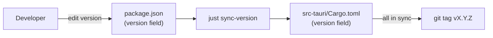
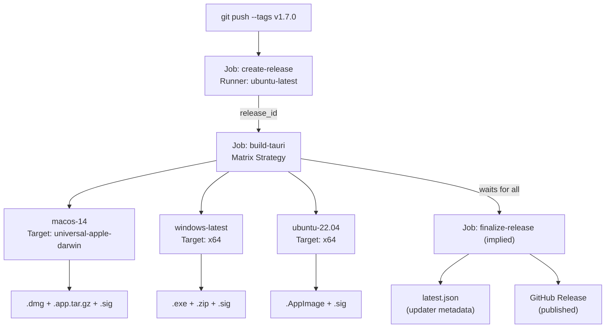
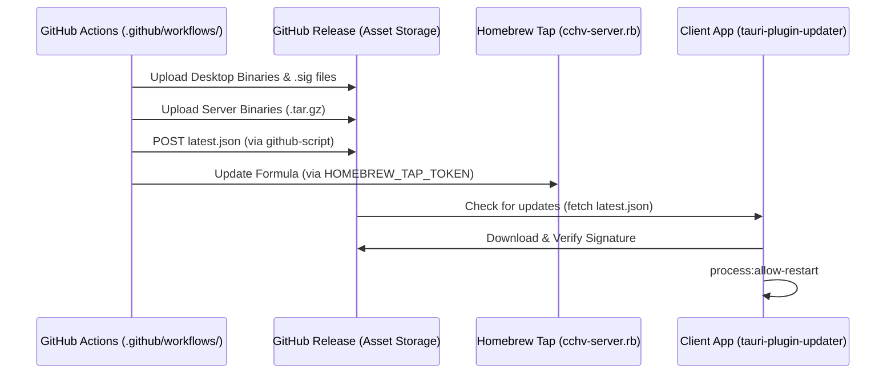

# Release Workflow

<details>
<summary>Relevant source files</summary>

The following files were used as context for generating this wiki page:

- [.github/workflows/server-release.yml](.github/workflows/server-release.yml)
- [.github/workflows/updater-release-retry.yml](.github/workflows/updater-release-retry.yml)
- [.github/workflows/updater-release.yml](.github/workflows/updater-release.yml)
- [docs/server-guide.ko.md](docs/server-guide.ko.md)
- [docs/server-guide.md](docs/server-guide.md)
- [index.html](index.html)
- [install-server.sh](install-server.sh)
- [justfile](justfile)
- [pnpm-lock.yaml](pnpm-lock.yaml)
- [src-tauri/.cargo/config.toml](src-tauri/.cargo/config.toml)
- [src-tauri/capabilities/default.json](src-tauri/capabilities/default.json)
- [src/index.css](src/index.css)
- [tailwind.config.js](tailwind.config.js)

</details>


## Purpose and Scope

This document describes the automated CI/CD pipeline that builds platform-specific binaries, generates cryptographic signatures, creates updater metadata, and publishes releases to GitHub. The system automates the delivery of both the Tauri desktop application and the standalone WebUI server binary.

| Workflow File | Trigger | Purpose |
|------|---------|---------|
| [.github/workflows/updater-release.yml]() | `push` on `v*` tags | Desktop release: Multi-platform build, signing, and `latest.json` generation. |
| [.github/workflows/server-release.yml]() | `push` on `v*` tags | Server release: Headless binary build, Homebrew tap sync for `cchv-server`. |
| [.github/workflows/updater-release-retry.yml]() | Manual `workflow_dispatch` | Re-finalize a desktop release from an existing `release_id`. |

**Sources:** [.github/workflows/updater-release.yml:1-10](), [.github/workflows/server-release.yml:1-12](), [.github/workflows/updater-release-retry.yml:1-10]()

---

## Trigger Mechanism

The release workflows activate exclusively through **git tag pushes** matching the pattern `v*` (e.g., `v1.7.0`).

```yaml
on:
  push:
    tags:
      - "v*"
```

The tag name is used to determine the version. In [package.json:4](), the version is manually bumped before tagging to ensure consistency across the manifest files.

**Sources:** [.github/workflows/updater-release.yml:4-7](), [.github/workflows/server-release.yml:8-11](), [package.json:4]()

---

## Version Management: Single Source of Truth

The application follows a **single source of truth** pattern where [package.json]() defines the authoritative version number. This version must be synchronized across manifest files using the `sync-version` script.

| File | Field | Location |
|------|-------|----------|
| [package.json]() | `"version"` | [package.json:4]() |
| [src-tauri/Cargo.toml]() | `version` | [src-tauri/Cargo.toml:3]() |

**Version synchronization flow:**

"Natural Language Space" to "Code Entity Space" - Versioning:


The `just sync-version` recipe [justfile:79-80]() executes `node scripts/sync-version.cjs` to propagate the version from the root `package.json` to the Rust backend manifest.

**Sources:** [package.json:4](), [src-tauri/Cargo.toml:3](), [justfile:79-80]()

---

## Desktop Release Pipeline (Tauri)

The desktop pipeline uses a matrix strategy to build for macOS (Universal), Windows (x64), and Linux (AppImage).

### Build Pipeline Architecture



**Sources:** [.github/workflows/updater-release.yml:12-130]()

### Specialized Platform Processing
- **Windows Portable:** The workflow creates a portable ZIP archive of the `.exe` binary [windows-latest] in addition to the standard installer [.github/workflows/updater-release.yml:132-175]().
- **Linux AppImage Fix:** To prevent EGL crashes on Arch Linux and other rolling-release distros, the workflow post-processes the AppImage by removing incompatible Ubuntu-compiled libraries (e.g., `libEGL.so*`, `libwayland-client.so*`) [.github/workflows/updater-release.yml:186-214]().

---

## Server Release Pipeline (Headless)

The server release workflow [.github/workflows/server-release.yml]() builds a standalone Rust binary with the frontend assets embedded.

### Server Build Matrix
The server is built for four targets to support remote VPS and server environments [.github/workflows/server-release.yml:21-34]():
- `x86_64-unknown-linux-gnu` (Linux x64)
- `aarch64-unknown-linux-gnu` (Linux ARM64 - Cross-compiled via `gcc-aarch64-linux-gnu`)
- `aarch64-apple-darwin` (macOS ARM64)
- `x86_64-apple-darwin` (macOS x64)

The build process uses the `webui-server` feature flag [justfile:112-113]() which triggers the `rust-embed` logic to bundle the `dist/` directory into the binary.

### Homebrew Tap Synchronization
The `update-homebrew` job [.github/workflows/server-release.yml:129-214]() automates the update of the `cchv-server` formula in the `jhlee0409/homebrew-tap` repository.
1. It downloads the newly built server assets and computes SHA256 checksums [.github/workflows/server-release.yml:137-147]().
2. It generates a `CHECKSUMS.sha256` manifest [.github/workflows/server-release.yml:140-152]().
3. It uses a Python script to update the `cchv-server.rb` Ruby formula with new version and platform-specific hashes [.github/workflows/server-release.yml:175-214]().

**Sources:** [.github/workflows/server-release.yml:17-35](), [.github/workflows/server-release.yml:129-214](), [justfile:112-113]()

---

## Security and Signing

### Tauri Cryptographic Signatures
Desktop artifacts are signed using an Ed25519 private key [.github/workflows/updater-release.yml:116-117](). The public key is used by the client app to verify update integrity.

### Apple Code Signing
macOS builds are signed and notarized using Apple Developer certificates [.github/workflows/updater-release.yml:118-123](). This ensures the `.dmg` and `.app` bundles pass Gatekeeper checks.

### Server Checksums
For server binaries, the workflow generates a `CHECKSUMS.sha256` file and uploads it to the release [.github/workflows/server-release.yml:140-152](). The `install-server.sh` script verifies these checksums during installation [.install-server.sh:87-108]().

**Sources:** [.github/workflows/updater-release.yml:116-123](), [.github/workflows/server-release.yml:140-152](), [install-server.sh:87-108]()

---

## Release Finalization and Updates

### Updater Metadata (latest.json)
The `finalize-release` job (or the standalone `updater-release-retry.yml` workflow) constructs the `latest.json` manifest. This manifest maps platform identifiers (e.g., `darwin-aarch64`, `windows-x86_64`) to their respective download URLs and cryptographic signatures [.github/workflows/updater-release-retry.yml:60-88]().

### Deployment Sequence

"Natural Language Space" to "Code Entity Space" - Deployment:


The client application relies on the `updater:allow-check` and `process:allow-restart` permissions defined in the capabilities configuration [src-tauri/capabilities/default.json:14-16]() to perform these updates.

**Sources:** [.github/workflows/updater-release-retry.yml:15-108](), [.github/workflows/server-release.yml:154-214](), [src-tauri/capabilities/default.json:14-16]()
