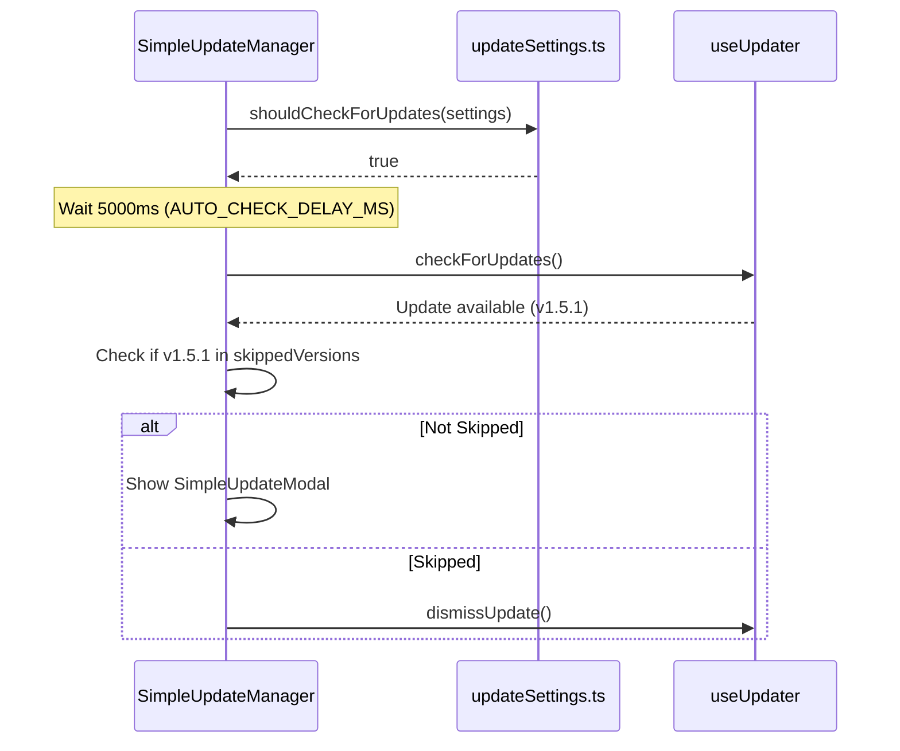

# Auto-Updater

<details>
<summary>Relevant source files</summary>

The following files were used as context for generating this wiki page:

- [docs/superpowers/specs/2026-03-28-wsl-support-design.md](docs/superpowers/specs/2026-03-28-wsl-support-design.md)
- [src-tauri/src/commands/multi_provider.rs](src-tauri/src/commands/multi_provider.rs)
- [src-tauri/tests/capabilities.test.ts](src-tauri/tests/capabilities.test.ts)
- [src/components/MessageViewer/helpers/agentProgressHelpers.ts](src/components/MessageViewer/helpers/agentProgressHelpers.ts)
- [src/components/SimpleUpdateManager.tsx](src/components/SimpleUpdateManager.tsx)
- [src/components/SimpleUpdateModal.tsx](src/components/SimpleUpdateModal.tsx)
- [src/components/contentRenderer/toolUseRenderers/ApplyPatchToolRenderer.tsx](src/components/contentRenderer/toolUseRenderers/ApplyPatchToolRenderer.tsx)
- [src/components/contentRenderer/toolUseRenderers/TaskToolRenderer.tsx](src/components/contentRenderer/toolUseRenderers/TaskToolRenderer.tsx)
- [src/components/contentRenderer/toolUseRenderers/UpdatePlanToolRenderer.tsx](src/components/contentRenderer/toolUseRenderers/UpdatePlanToolRenderer.tsx)
- [src/hooks/useUpdater.test.ts](src/hooks/useUpdater.test.ts)
- [src/hooks/useUpdater.ts](src/hooks/useUpdater.ts)
- [src/test/SimpleUpdateManager.test.tsx](src/test/SimpleUpdateManager.test.tsx)
- [src/test/SimpleUpdateModal.test.tsx](src/test/SimpleUpdateModal.test.tsx)
- [src/test/updateDiagnostics.test.ts](src/test/updateDiagnostics.test.ts)
- [src/test/updateSettings.test.ts](src/test/updateSettings.test.ts)
- [src/types/updateSettings.ts](src/types/updateSettings.ts)
- [src/utils/updateDiagnostics.ts](src/utils/updateDiagnostics.ts)
- [src/utils/updateError.ts](src/utils/updateError.ts)
- [src/utils/updateSettings.ts](src/utils/updateSettings.ts)

</details>


This page documents the client-side auto-updater system in Claude Code History Viewer. The application utilizes the `@tauri-apps/plugin-updater` to manage the lifecycle of software updates, including discovery, secure download, and automated installation.

## Overview

The update system is orchestrated through a state machine in the frontend that interfaces with the Tauri Rust backend. It supports both automatic background checks and manual user-initiated checks, with logic to handle version skipping and postponement.

```mermaid
graph TB
    subgraph "Frontend (React/TypeScript)"
        SUM["SimpleUpdateManager.tsx<br/>Orchestrator"]
        Hook["useUpdater.ts<br/>State Machine"]
        Store["useAppStore (Zustand)<br/>Persistence"]
        Modal["SimpleUpdateModal.tsx<br/>UI & Release Notes"]
    end
    
    subgraph "Tauri Layer (Rust/JS Bridge)"
        TauriPlugin["@tauri-apps/plugin-updater"]
        Process["@tauri-apps/plugin-process<br/>relaunch()"]
    end
    
    subgraph "External (GitHub)"
        Manifest["latest.json<br/>Update Metadata"]
        Binary["Platform Binary<br/>.dmg / .exe / .AppImage"]
    end

    SUM --> Hook
    SUM --> Store
    Hook -->|check()| TauriPlugin
    TauriPlugin -->|Fetch| Manifest
    Hook -->|downloadAndInstall()| TauriPlugin
    TauriPlugin -->|Download| Binary
    TauriPlugin -->|Verify & Install| Process
    SUM --> Modal
```

Sources: [src/components/SimpleUpdateManager.tsx:1-10](), [src/hooks/useUpdater.ts:31-54](), [src/utils/updateSettings.ts:6-24]()

## State Management and Persistence

Update settings and state are split between volatile React state (for the current session's download progress) and persistent `localStorage` (for user preferences like skipped versions).

### UpdateSettings (Zustand/LocalStorage)
The application persists update preferences in `localStorage` under the key `update_settings` [src/utils/updateSettings.ts:6-7](). These are managed via the `updateSettings` slice in the global store [src/components/SimpleUpdateManager.tsx:20-24]().

| Setting | Type | Description |
|---------|------|-------------|
| `autoCheck` | `boolean` | Whether to check for updates automatically [src/utils/updateSettings.ts:35-37]() |
| `checkInterval` | `string` | Frequency: `startup`, `daily`, `weekly`, or `never` [src/utils/updateSettings.ts:10]() |
| `skippedVersions` | `string[]` | Versions the user has chosen to ignore [src/utils/updateSettings.ts:42-45]() |
| `lastCheckedAt` | `number` | Timestamp of the last successful check [src/utils/updateSettings.ts:49-51]() |
| `lastPostponedAt` | `number` | Timestamp when user clicked "Remind Me Later" [src/utils/updateSettings.ts:46-48]() |

### useUpdater State Machine
The `useUpdater` hook manages the transient state of an active update process [src/hooks/useUpdater.ts:35-47](). It uses a state object to track the lifecycle from checking to restarting.

```typescript
export interface UpdateState {
  isChecking: boolean;
  hasUpdate: boolean;
  isDownloading: boolean;
  isInstalling: boolean;
  isRestarting: boolean;
  requiresManualRestart: boolean;
  downloadProgress: number;
  error: string | null;
  updateInfo: Update | null;
  currentVersion: string;
  newVersion: string | null;
}
```
Sources: [src/hooks/useUpdater.ts:35-47](), [src/utils/updateSettings.ts:29-66](), [src/hooks/useUpdater.ts:80-92]()

## Implementation Detail: SimpleUpdateManager

`SimpleUpdateManager` is the top-level headless component that coordinates the `useUpdater` hook with the application's persistent settings.

### Auto-Check Logic
The manager performs an automatic check 5 seconds after the app starts (`AUTO_CHECK_DELAY_MS`), provided the environment is production and settings allow it [src/components/SimpleUpdateManager.tsx:12-121]().



### Manual Checks
Manual checks are triggered via a custom window event `manual-update-check` [src/components/SimpleUpdateManager.tsx:178-194](). This sets `isManualCheck` to true, which ensures results are displayed (e.g., "Up to date" notification) even if no update is found [src/components/SimpleUpdateManager.tsx:132-144]().

Sources: [src/components/SimpleUpdateManager.tsx:107-121](), [src/components/SimpleUpdateManager.tsx:147-175](), [src/utils/updateSettings.ts:92-129]()

## Update UI Components

### SimpleUpdateModal
This component handles the "Read" phase of the update. It parses release notes and names from the raw JSON returned by the update server [src/components/SimpleUpdateModal.tsx:33-54]().

- **Release Notes Parsing**: It attempts to find notes in `body`, `rawJson.notes`, `rawJson.releaseNotes`, or `rawJson.changelog` [src/components/SimpleUpdateModal.tsx:44-54]().
- **Primary Action**: Triggers `updater.downloadAndInstall()` which transitions the state machine into the downloading phase [src/components/SimpleUpdateModal.tsx:73-75]().
- **Restart Handling**: If `requiresManualRestart` is true, it provides specific guidance to the user [src/components/SimpleUpdateModal.tsx:100-101]().

### Notifications
The system uses several specialized notification components to provide non-modal feedback:
- `UpdateCheckingNotification`: Shown during manual checks [src/components/SimpleUpdateManager.tsx:124-130]().
- `UpToDateNotification`: Briefly shown if no update is found after a manual check [src/components/SimpleUpdateManager.tsx:138-140]().
- `UpdateErrorNotification`: Displays localized error messages [src/components/SimpleUpdateManager.tsx:135-137]().

Sources: [src/components/SimpleUpdateModal.tsx:56-138](), [src/components/SimpleUpdateManager.tsx:223-260]()

## Error Handling and Diagnostics

Updates can fail due to network issues, signature mismatches, or permission errors.

### Error Resolution
The utility `resolveUpdateErrorMessage` maps internal error codes to localized strings. A critical code is `update.download_complete_restart`, which indicates the update is ready but the app requires a manual restart [src/components/SimpleUpdateModal.tsx:97-99]().

### Diagnostics Reporting
When an update fails, the `SimpleUpdateModal` provides a "Report Issue" button [src/components/SimpleUpdateModal.tsx:103-127](). This uses `buildUpdateDiagnostics` to generate a technical summary including:
- Current and target versions
- Download progress at time of failure
- State flags (`isInstalling`, `isRestarting`)
- Error message

This diagnostic block is pre-filled into the feedback modal [src/components/SimpleUpdateModal.tsx:117-124]().

Sources: [src/utils/updateError.ts:1-13](), [src/utils/updateDiagnostics.ts:1-44](), [src/components/SimpleUpdateModal.tsx:103-127]()

## Technical Specifications

| Feature | Implementation |
|---------|----------------|
| **Version Comparison** | Handled by Tauri via SemVer [src/hooks/useUpdater.ts:125-128]() |
| **Timeout** | 20 seconds for manifest check (`CHECK_TIMEOUT_MS`) [src/hooks/useUpdater.ts:7]() |
| **Download Tracking** | Listens for `started`, `progress`, and `finished` events from the Tauri plugin [src/hooks/useUpdater.ts:177-217]() |
| **Restart Mechanism** | Calls `@tauri-apps/plugin-process` `relaunch()` after successful installation [src/hooks/useUpdater.ts:245-249]() |

Sources: [src/hooks/useUpdater.ts:7-250](), [src/hooks/useUpdater.ts:158-260]()
