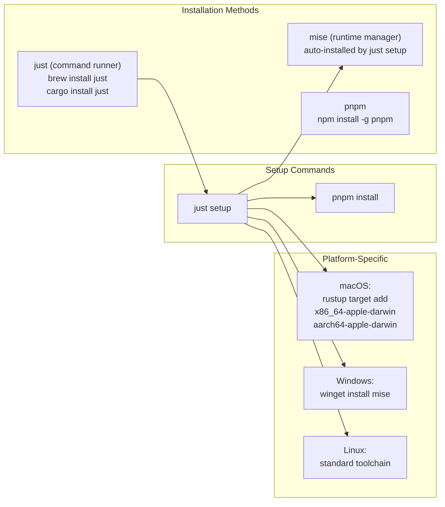
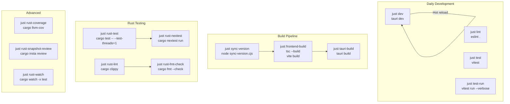
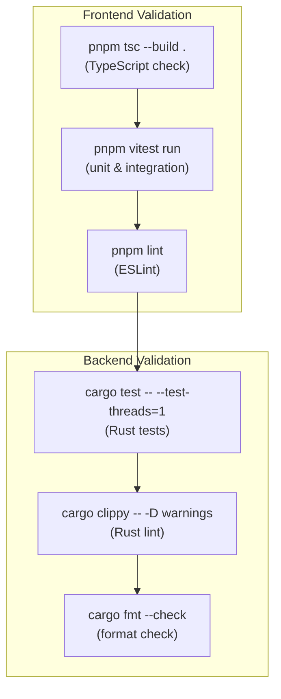
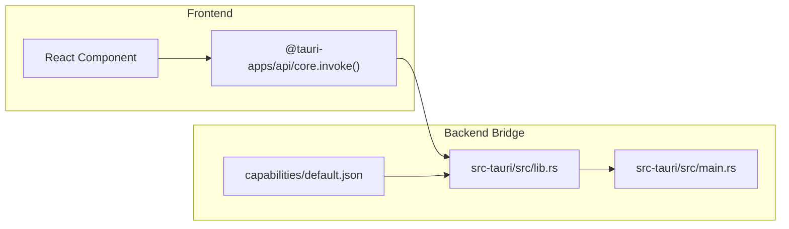
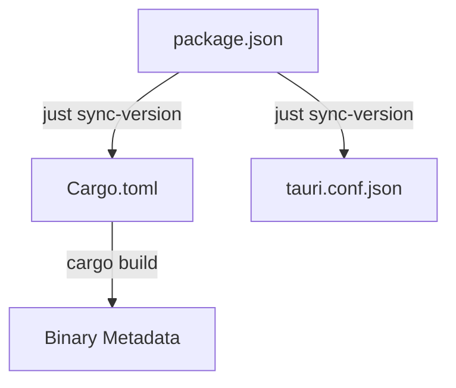

# Development Guide

Relevant source files

The following files were used as context for generating this wiki page:

- [.github/workflows/updater-release.yml](.github/workflows/updater-release.yml)
- [.prettierrc](.prettierrc)
- [eslint.config.js](eslint.config.js)
- [justfile](justfile)
- [pnpm-lock.yaml](pnpm-lock.yaml)
- [pnpm-workspace.yaml](pnpm-workspace.yaml)
- [postcss.config.js](postcss.config.js)
- [src-tauri/.cargo/config.toml](src-tauri/.cargo/config.toml)
- [src-tauri/.gitignore](src-tauri/.gitignore)
- [src-tauri/build.rs](src-tauri/build.rs)
- [src-tauri/capabilities/default.json](src-tauri/capabilities/default.json)
- [src/index.css](src/index.css)
- [tailwind.config.js](tailwind.config.js)
- [tsconfig.json](tsconfig.json)

This document provides comprehensive guidance for developers working on the Claude Code History Viewer codebase. It covers environment setup, development workflows, code quality standards, architectural patterns, and release procedures.

**Scope:** This page focuses on the practical aspects of contributing to the project, including toolchain setup, development commands, and coding standards. For detailed information about specific subsystems:
- Build system configuration and toolchain details: see [Build System](#9.1)
- Test suites and testing strategies: see [Testing](#9.2)  
- Shared utility functions and helpers: see [Utility Functions](#9.3)

---

## Environment Setup

### Prerequisites

The application requires three core technologies:

| Tool | Version | Purpose |
|------|---------|---------|
| **Node.js** | 20+ | Frontend build and package management |
| **pnpm** | Latest | Fast, disk-efficient package manager |
| **Rust** | Latest stable | Backend compilation via Tauri |

### Toolchain Installation

The project uses `just` as a command runner and `mise` for runtime management.

**Sources:** [justfile:16-42](), [pnpm-lock.yaml:127-129](), [.github/workflows/updater-release.yml:76-87]()

The `justfile` provides critical environment configuration:
- [justfile:5]() adds `node_modules/.bin` and `.mise/shims` to `PATH`.
- [justfile:19]() runs `mise install` to ensure the correct Node.js and tool versions are present.

**Platform-Specific Setup:**
- **macOS:** [justfile:38-41]() automatically adds universal binary targets (`x86_64-apple-darwin`, `aarch64-apple-darwin`).
- **Windows:** [justfile:26-27]() installs mise via `winget`.
- **Linux:** Requires system dependencies like `libwebkit2gtk-4.1-dev` and `libappindicator3-dev` for Tauri [.github/workflows/updater-release.yml:89-93]().

---

## Development Workflow

### Command Reference

The project uses `just` to unify frontend (Vite/Vitest) and backend (Cargo) tasks:

**Sources:** [justfile:13-197](), [eslint.config.js:1-31](), [src-tauri/.cargo/config.toml:23-37]()

### Key Commands

| Command | Description | Implementation |
|---------|-------------|----------------|
| `just dev` | Run Tauri + Vite with hot reload | [justfile:44-45]() |
| `just test` | Run Vitest in watch mode | [justfile:86-87]() |
| `just rust-test` | Run Rust tests (single-threaded) | [justfile:131-132]() |
| `just sync-version` | Sync version from package.json to Cargo.toml | [justfile:79-80]() |
| `just serve-dev` | Run backend as a web server (WebUI mode) | [justfile:124-125]() |

**Critical Note:** [justfile:131-132]() runs `cargo test -- --test-threads=1` because several backend tests use environment variables or process-global state which can cause race conditions in parallel execution. For faster parallel testing where safe, `just rust-nextest` [justfile:135-136]() is available.

---

## Code Quality Standards

### Quality Gates

The project enforces strict validation before any release. The CI pipeline mirrors these local checks.

**Sources:** [justfile:170-172](), [eslint.config.js:12-23](), [src-tauri/.cargo/config.toml:29-30]()

### Testing Integration

The codebase uses `Vitest` for frontend testing [pnpm-lock.yaml:188-190]() and `cargo nextest` for backend testing [src-tauri/.cargo/config.toml:25-26](). Snapshot testing is supported in Rust via `cargo insta` [justfile:186-187]().

---

## Architecture Patterns

### Command Execution Pattern

Backend logic is exposed to the React frontend via Tauri commands. The entry point for the application logic is the Tauri builder which registers commands and plugins.

**Sources:** [src-tauri/src/main.rs:1-3](), [src-tauri/capabilities/default.json:8-23](), [pnpm-lock.yaml:58-60]()

### Design System

The application uses a custom "Command Center" design system implemented via Tailwind CSS and OKLCH color spaces.

| Entity | Code Reference | Role |
|--------|----------------|------|
| **Design Tokens** | `src/index.css` | Defines OKLCH variables for "Industrial Luxury" aesthetic [src/index.css:24-187]() |
| **Tailwind Config** | `tailwind.config.js` | Maps CSS variables to Tailwind utility classes [tailwind.config.js:33-132]() |
| **Fonts** | `IBM Plex Sans` | Primary UI typography [tailwind.config.js:9]() |

---

## Version Management

### Single Source of Truth

**`package.json`** is the authoritative version source. The `sync-version` script propagates this to `Cargo.toml` and other configuration files.

**Sources:** [justfile:79-80](), [.github/workflows/updater-release.yml:19-20]()

### Release Process

1. **Quality Gate**: Pass all frontend and backend tests via `just rust-check-all` [justfile:171]().
2. **Version Bump**: Update `package.json` and run `just sync-version` [justfile:79-80]().
3. **Tag**: Create a git tag starting with `v` to trigger the release workflow [.github/workflows/updater-release.yml:4-7]().
4. **Automation**: GitHub Actions builds multi-platform binaries (macOS Universal, Ubuntu, Windows) and handles code signing [.github/workflows/updater-release.yml:53-130]().

---

## Related Documentation

For deeper dives into specific development topics:

- **Build System Details:** Configuration of justfile, available recipes, and platform-specific build targets → [Build System](#9.1)
- **Testing Strategies:** Unit tests, integration tests, Rust property-based tests, and coverage reporting → [Testing](#9.2)
- **Utility Functions:** Shared helpers for path decoding, git worktree detection, and frontend search → [Utility Functions](#9.3)
