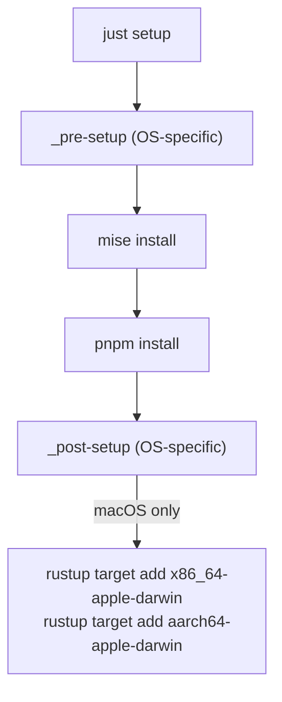
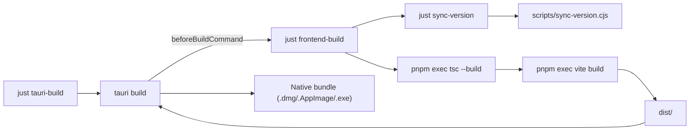
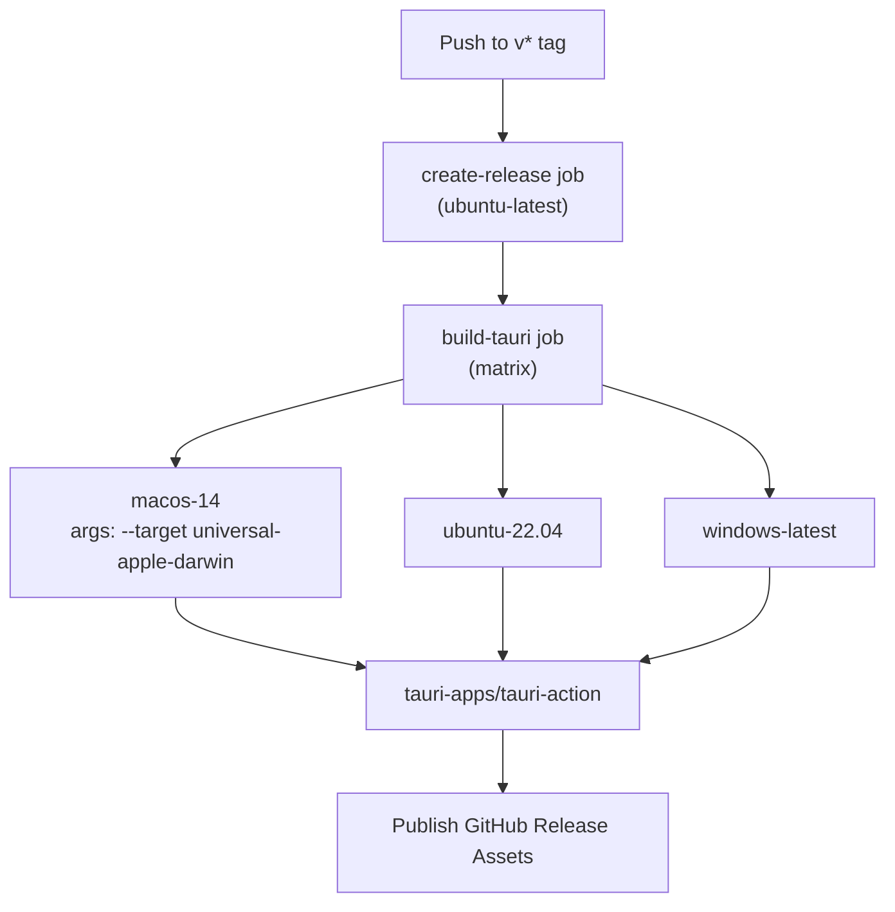

# Build System

<details>
<summary>Relevant source files</summary>

The following files were used as context for generating this wiki page:

- [.github/workflows/updater-release.yml](.github/workflows/updater-release.yml)
- [.prettierrc](.prettierrc)
- [eslint.config.js](eslint.config.js)
- [justfile](justfile)
- [mise.toml](mise.toml)
- [pnpm-lock.yaml](pnpm-lock.yaml)
- [pnpm-workspace.yaml](pnpm-workspace.yaml)
- [postcss.config.js](postcss.config.js)
- [src-tauri/.cargo/config.toml](src-tauri/.cargo/config.toml)
- [src-tauri/.gitignore](src-tauri/.gitignore)
- [src-tauri/build.rs](src-tauri/build.rs)
- [src-tauri/capabilities/default.json](src-tauri/capabilities/default.json)
- [src-tauri/tests/configImport.test.ts](src-tauri/tests/configImport.test.ts)
- [src-tauri/tests/tauriConfig.test.ts](src-tauri/tests/tauriConfig.test.ts)
- [src/index.css](src/index.css)
- [src/test/setup.ts](src/test/setup.ts)
- [tailwind.config.js](tailwind.config.js)
- [tsconfig.json](tsconfig.json)

</details>


This page documents the local development build system, available `just` recipes, the Vite frontend build pipeline, and the Tauri desktop build targets. For information about the CI/CD release pipeline and automated GitHub Actions workflows, see [Release Workflow](#8.1). For the testing subsystem, see [Testing](#9.2).

---

## Overview

The project uses [just](https://just.systems/) as its command runner, coordinating three underlying toolchains:

| Toolchain | Role |
|---|---|
| **pnpm** | Frontend dependency management and script runner [package.json:108-108]() |
| **Vite** | TypeScript compilation and frontend bundling [package.json:7-8]() |
| **Tauri CLI** | Rust compilation and desktop app packaging [package.json:9-10]() |

All developer-facing commands are centralized in `justfile` at the repository root. Running `just` with no arguments lists all available recipes.

Sources: [justfile:1-14](), [package.json:1-19]()

---

## Justfile Configuration

The justfile uses two global settings:

```just
set dotenv-load
set windows-powershell := true
```

- `dotenv-load` automatically sources a `.env` file if present [justfile:1-1]().
- `windows-powershell` ensures PowerShell is used for shell commands on Windows [justfile:2-2]().

The `PATH` is extended at the top of the file to include local `node_modules/.bin` and `.mise/shims`, making all project-local binaries (`vite`, `tsc`, `tauri`, etc.) available without global installation:

[justfile:5-5]()

Sources: [justfile:1-6]()

---

## Recipe Reference

### Setup

**Environment Setup Diagram**



Sources: [justfile:17-41]()

The `setup` recipe handles environment bootstrapping. OS-specific hooks (`_pre-setup`, `_post-setup`) are defined per platform. The macOS `_post-setup` adds both Intel and Apple Silicon Rust targets, which are required to produce a universal binary.

| Recipe | OS | Action |
|---|---|---|
| `_pre-setup` | Windows | `winget install mise` [justfile:25-27]() |
| `_pre-setup` | Linux | _(no-op)_ [justfile:29-29]() |
| `_pre-setup` | macOS | _(no-op)_ [justfile:31-31]() |
| `_post-setup` | Windows | _(no-op)_ [justfile:34-34]() |
| `_post-setup` | Linux | _(no-op)_ [justfile:35-36]() |
| `_post-setup` | macOS | Adds `x86_64-apple-darwin` and `aarch64-apple-darwin` targets [justfile:38-41]() |

Sources: [justfile:24-41]()

---

### Development

| Recipe | Command | Notes |
|---|---|---|
| `dev` | `tauri dev` | Starts the full dev loop; Tauri spawns `just vite-dev` automatically [justfile:44-45]() |
| `vite-dev` | `vite` | Starts Vite HMR server on port 5173; **do not run directly** [justfile:48-49]() |
| `vite-preview` | `vite preview` | Serves the production `dist/` locally [justfile:55-56]() |
| `lint` | `eslint .` | Runs ESLint on all source files [justfile:51-52]() |

The `dev` recipe delegates to `tauri dev`, which reads `tauri.conf.json` and runs the `beforeDevCommand`:

[src-tauri/tauri.conf.json:76-76]()

```json
"beforeDevCommand": "just vite-dev",
"devUrl": "http://localhost:5173"
```

Sources: [justfile:43-55](), [src-tauri/tauri.conf.json:71-86]()

---

### Build Pipeline

**Build Dependency Diagram**



Sources: [justfile:59-76](), [src-tauri/tauri.conf.json:71-86]()

#### `sync-version`

[justfile:79-80]()

Runs `node scripts/sync-version.cjs` to copy the version string from `package.json` into `src-tauri/Cargo.toml` and `src-tauri/tauri.conf.json`. This keeps all three version declarations in sync.

#### `frontend-build`

[justfile:59-66]()

Depends on `sync-version`, then:
1. Compiles TypeScript with `pnpm exec tsc --build`
2. Bundles the frontend with `pnpm exec vite build`

Output goes to `dist/`, which is referenced by `tauri.conf.json` as `frontendDist`:

[src-tauri/tauri.conf.json:74-74]()

#### `tauri-build`

[justfile:68-76]()

OS-specific recipe:

| OS | Command |
|---|---|
| Windows | `tauri build` [justfile:69-70]() |
| Linux | `tauri build` [justfile:72-73]() |
| macOS | `tauri build --target universal-apple-darwin` [justfile:75-76]() |

macOS builds a universal binary combining `x86_64-apple-darwin` and `aarch64-apple-darwin` slices. Tauri internally calls `just frontend-build` via its `beforeBuildCommand`.

Sources: [justfile:59-80](), [src-tauri/tauri.conf.json:71-86]()

---

### WebUI Server Mode

The build system supports a specialized "WebUI Server Mode" which compiles the Rust backend as a standalone binary with the frontend embedded.

| Recipe | Command | Purpose |
|---|---|---|
| `serve-build` | `frontend-build` then `cargo build --release --features webui-server` | Builds single binary with embedded frontend [justfile:112-113]() |
| `serve-dev` | `frontend-build` then `cargo run --features webui-server` | Runs server with external hot-reloadable dist/ [justfile:124-125]() |

This mode uses the `webui-server` feature in `Cargo.toml` which enables dependencies like `axum`, `tower-http`, and `rust-embed`.

Sources: [justfile:109-125](), [src-tauri/Cargo.toml:19-19]()

---

## Vite Configuration

The frontend build is driven by Vite. Key integration points with the Tauri build:

| `tauri.conf.json` key | Value | Purpose |
|---|---|---|
| `build.devUrl` | `http://localhost:5173` | Where Tauri WebView connects in dev mode [src-tauri/tauri.conf.json:75-75]() |
| `build.frontendDist` | `../dist` | Output directory Tauri bundles into the app [src-tauri/tauri.conf.json:74-74]() |
| `build.beforeDevCommand` | `just vite-dev` | Spawned before Tauri WebView opens [src-tauri/tauri.conf.json:76-76]() |
| `build.beforeBuildCommand` | `just frontend-build` | Runs TypeScript compilation and bundling [src-tauri/tauri.conf.json:77-77]() |

Frontend build tools are declared in `package.json` as dev dependencies:

| Package | Version | Role |
|---|---|---|
| `vite` | `^7.1.12` | Build tool and dev server [package.json:157-157]() |
| `typescript` | `^5.8.3` | Type checking [package.json:155-155]() |
| `@vitejs/plugin-react` | `^4.5.2` | JSX transform and HMR [package.json:185-185]() |
| `@tailwindcss/vite` | `^4.1.11` | Tailwind CSS integration [package.json:52-52]() |

Sources: [src-tauri/tauri.conf.json:71-86](), [package.json:157-210]()

---

## Cargo / Rust Build Configuration

The Rust crate is at `src-tauri/`. Its `Cargo.toml` defines the build profiles:

| Profile | `opt-level` | `debug` | Purpose |
|---|---|---|---|
| `dev` | 0 | true | Fast iteration [src-tauri/Cargo.toml:106-108]() |
| `dev.package."*"` | 2 | — | Optimizes dependencies in dev builds [src-tauri/Cargo.toml:111-112]() |
| `test` | 1 | true | Faster test execution [src-tauri/Cargo.toml:114-116]() |
| `coverage` | 0 | true | Used by `cargo llvm-cov` [src-tauri/Cargo.toml:119-122]() |

The Cargo workspace-level config at `src-tauri/.cargo/config.toml` sets `jobs = -1` to use all available CPU cores, and defines short aliases:

[src-tauri/.cargo/config.toml:4-6]()

| Alias | Expands To |
|---|---|
| `t` | `nextest run` [src-tauri/.cargo/config.toml:26-26]() |
| `tcov` | `llvm-cov nextest --lcov --output-path lcov.info` [src-tauri/.cargo/config.toml:28-28]() |
| `lint` | `clippy --all-targets --all-features -- -D warnings` [src-tauri/.cargo/config.toml:30-30]() |
| `fmt-check` | `fmt --all -- --check` [src-tauri/.cargo/config.toml:36-36]() |

Sources: [src-tauri/Cargo.toml:106-123](), [src-tauri/.cargo/config.toml:1-37]()

---

## Rust Maintenance Recipes

The justfile provides a full set of Rust-specific recipes under the `rust-*` namespace:

[justfile:127-197]()

| Recipe | Command | Purpose |
|---|---|---|
| `rust-test` | `cargo test -- --test-threads=1` | Single-threaded (required due to `env::set_var` in tests) [justfile:131-132]() |
| `rust-nextest` | `cargo nextest run` | Faster parallel test runner [justfile:135-136]() |
| `rust-coverage` | `cargo llvm-cov nextest --html` | HTML coverage report [justfile:139-140]() |
| `rust-coverage-open` | `cargo llvm-cov nextest --html --open` | Opens report in browser [justfile:143-144]() |
| `rust-test-ci` | `cargo nextest run --profile ci` | CI-optimized test run [justfile:147-148]() |
| `rust-lint` | `cargo clippy --all-targets --all-features -- -D warnings` | Clippy with warnings as errors [justfile:151-152]() |
| `rust-fmt-check` | `cargo fmt --all -- --check` | Format check (non-destructive) [justfile:155-156]() |
| `rust-fmt` | `cargo fmt --all` | Format in place [justfile:159-160]() |
| `rust-bench` | `cargo bench` | Run criterion benchmarks [justfile:163-164]() |
| `rust-audit` | `cargo audit` | Vulnerability scan [justfile:167-168]() |
| `rust-check-all` | `rust-fmt-check rust-lint rust-test` | Full pre-push check [justfile:171-172]() |
| `rust-watch` | `cargo watch -x test` | Re-run tests on file change [justfile:174-175]() |
| `rust-doc` | `cargo doc --no-deps --document-private-items --open` | Generate API docs [justfile:178-179]() |
| `rust-proptest` | `cargo test proptest` | Property-based tests only [justfile:182-183]() |
| `rust-snapshot-review` | `cargo insta review` | Review insta snapshot diffs [justfile:186-187]() |

Sources: [justfile:127-197]()

---

## CI Build Matrix

The GitHub Actions workflow `.github/workflows/updater-release.yml` replicates the local build in CI. It uses `just` in the same way:

**CI Build Matrix Diagram**



Sources: [.github/workflows/updater-release.yml:13-72]()

Ubuntu builds require additional system libraries installed via `apt-get`:

[.github/workflows/updater-release.yml:89-93]()

```bash
sudo apt-get install -y libwebkit2gtk-4.1-dev libappindicator3-dev librsvg2-dev patchelf
```

The CI workflow pins exact tool versions and uses `pnpm install --frozen-lockfile` to ensure reproducible installs [.github/workflows/updater-release.yml:110-110](). Rust compilation artifacts are cached via `swatinem/rust-cache@v2`, keyed on `Cargo.toml` and `.cargo/config.toml` hashes.

[.github/workflows/updater-release.yml:100-107]()

Sources: [.github/workflows/updater-release.yml:53-130]()

---

## Package Manager

The project uses pnpm, as indicated in `pnpm-lock.yaml`:

[pnpm-lock.yaml:1-1]()

The `pnpm-workspace.yaml` defines the root package:

[pnpm-workspace.yaml:1-2]()

The build system ignores certain built dependencies to avoid unnecessary recompilation:

[pnpm-workspace.yaml:4-5]()

Sources: [pnpm-lock.yaml:1-1](), [pnpm-workspace.yaml:1-5]()
