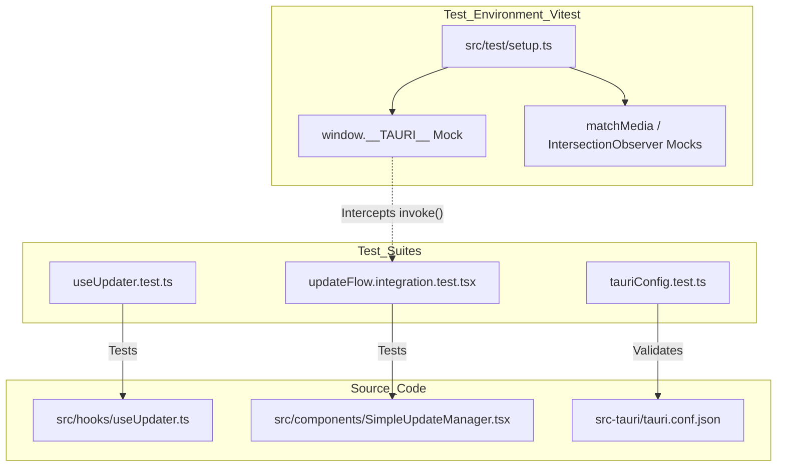
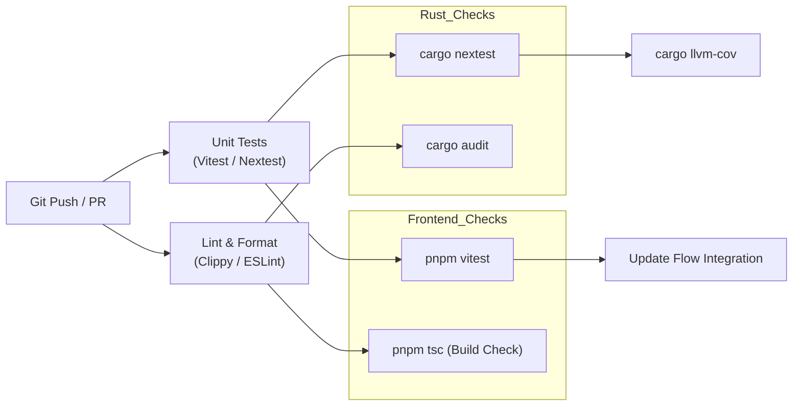

# Testing

Relevant source files

The following files were used as context for generating this wiki page:

- [.github/workflows/rust-tests.yml](.github/workflows/rust-tests.yml)
- [.github/workflows/update-flow-tests.yml](.github/workflows/update-flow-tests.yml)
- [CLAUDE.md](CLAUDE.md)
- [mise.toml](mise.toml)
- [src-tauri/src/models/message.rs](src-tauri/src/models/message.rs)
- [src-tauri/src/test_utils.rs](src-tauri/src/test_utils.rs)
- [src-tauri/tests/configImport.test.ts](src-tauri/tests/configImport.test.ts)
- [src-tauri/tests/tauriConfig.test.ts](src-tauri/tests/tauriConfig.test.ts)
- [src/test/setup.ts](src/test/setup.ts)
- [src/test/updateFlow.integration.test.tsx](src/test/updateFlow.integration.test.tsx)

This page covers the testing infrastructure for the Claude Code History Viewer, encompassing the frontend Vitest suite, the Rust backend test suite, and integrated CI workflows.

---

## Overview

The project employs a dual-layered testing strategy to ensure the reliability of both the React/TypeScript frontend and the Rust/Tauri backend.

| Layer | Framework | Runner Command | Primary Tools |
|:---|:---|:---|:---|
| **Frontend** | Vitest | `just test` | `vitest`, `@testing-library/react` |
| **Backend** | Cargo | `just rust-test` | `cargo test`, `nextest`, `insta`, `llvm-cov` |

Sources: [CLAUDE.md:25-37](), [CLAUDE.md:104-122]()

---

## Frontend Testing (Vitest)

Frontend tests are managed by **Vitest**, providing a fast, Vite-native testing environment. Tests are located in `src/test/` and alongside components as `*.test.ts(x)`.

### Test Environment and Mocking
Because the application runs within Tauri, the testing environment mocks the `__TAURI__` global object in `src/test/setup.ts` to prevent errors when components attempt to invoke backend commands or listen for events.

**Diagram: Frontend Test Architecture & Mocking**

Sources: [src/test/setup.ts:1-24](), [src/test/setup.ts:27-64](), [src-tauri/tests/tauriConfig.test.ts:1-15]()

### Integration Testing: Update Flow
A significant portion of frontend testing focuses on the update lifecycle, ensuring reliability in version checks and user notifications.

*   **`updateFlow.integration.test.tsx`**: Exercises the end-to-end flow. It uses `UpdateFlowHarness` to wrap `SettingDropdown` and `SimpleUpdateManager` within a `PlatformProvider` [src/test/updateFlow.integration.test.tsx:139-148]().
*   **Manual Check Test**: Verifies that clicking "check for updates" transitions the UI through `checking` to `up-to-date` states [src/test/updateFlow.integration.test.tsx:159-190]().
*   **Skip Version Test**: Verifies that the `skipVersion` action in the store is called when a user opts to skip a specific release [src/test/updateFlow.integration.test.tsx:192-218]().

Sources: [.github/workflows/update-flow-tests.yml:7-21](), [src/test/updateFlow.integration.test.tsx:1-219]()

---

## Backend Testing (Rust)

The Rust backend utilizes a comprehensive suite of testing tools to ensure data integrity and performance.

### Test Execution Models
The project supports two primary ways to run Rust tests:
1.  **Standard `cargo test`**: Executed with `--test-threads=1`. This is mandatory because certain tests modify the `HOME` environment variable to verify settings path resolution, which can cause race conditions if run in parallel [CLAUDE.md:116-125]().
2.  **`cargo nextest`**: The preferred runner for CI. It executes tests in isolated processes, allowing for safe parallel execution and JUnit XML reporting [ .github/workflows/rust-tests.yml:101-111]().

Sources: [CLAUDE.md:116-125](), [.github/workflows/rust-tests.yml:101-111]()

### Test Utilities (`test_utils.rs`)
The `src-tauri/src/test_utils.rs` module provides helpers for simulating the filesystem and data structures:
*   **`MockClaudeProject`**: Creates a temporary `.claude/projects` directory structure using `tempfile::TempDir` to test project scanning [src-tauri/src/test_utils.rs:21-63]().
*   **`MessageBuilder`**: A fluent API for constructing `ClaudeMessage` instances with specific roles, models, and token usage for testing analytics and rendering [src-tauri/src/test_utils.rs:73-165]().

Sources: [src-tauri/src/test_utils.rs:1-220]()

### Code Coverage and Benchmarking
*   **`cargo llvm-cov`**: Generates LCOV reports for the Rust codebase, integrated into the `coverage` job in CI [ .github/workflows/rust-tests.yml:150-153]().
*   **Benchmarks**: Performance benchmarks are run on the `main` branch to track regressions in data processing speed [ .github/workflows/rust-tests.yml:171-207]().

Sources: [.github/workflows/rust-tests.yml:150-207]()

---

## Data Model and Configuration Testing

### Model Serialization
Tests in `src-tauri/src/models/message.rs` ensure that `TokenUsage` and `ClaudeMessage` structures correctly serialize/deserialize from JSON, which is critical for the Tauri IPC bridge [src-tauri/src/models/message.rs:186-195]().

### Tauri Configuration Validation
The project includes Vitest suites to validate the `tauri.conf.json` file:
*   **`tauriConfig.test.ts`**: Checks for the correct v2 schema, product name, and window dimensions [src-tauri/tests/tauriConfig.test.ts:15-173]().
*   **`configImport.test.ts`**: Verifies that the configuration can be successfully imported as a JSON module in the frontend build [src-tauri/tests/configImport.test.ts:11-35]().

Sources: [src-tauri/src/models/message.rs:186-195](), [src-tauri/tests/tauriConfig.test.ts:1-173](), [src-tauri/tests/configImport.test.ts:1-35]()

---

## CI/CD Integration

Testing is automated via GitHub Actions across several specialized workflows:

| Workflow | Responsibility |
|:---|:---|
| **Rust Tests** | Runs `cargo nextest`, `clippy` (linting), and `fmt` (formatting) on Ubuntu and macOS [ .github/workflows/rust-tests.yml:1-64](). |
| **Update Flow Tests** | Runs Vitest for the update-related frontend components (`SimpleUpdateManager`, `useUpdater`) [ .github/workflows/update-flow-tests.yml:1-64](). |
| **Code Coverage** | Generates and uploads Rust coverage reports to Codecov (main branch only) [ .github/workflows/rust-tests.yml:114-169](). |
| **Security Audit** | Runs `cargo audit` to check for vulnerabilities in Rust dependencies [ .github/workflows/rust-tests.yml:210-226](). |

**Diagram: CI Quality Gate Flow**

Sources: [CLAUDE.md:104-122](), [.github/workflows/rust-tests.yml:1-226](), [.github/workflows/update-flow-tests.yml:1-64]()
