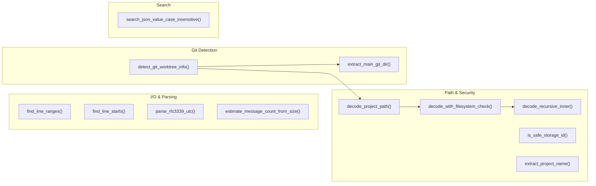
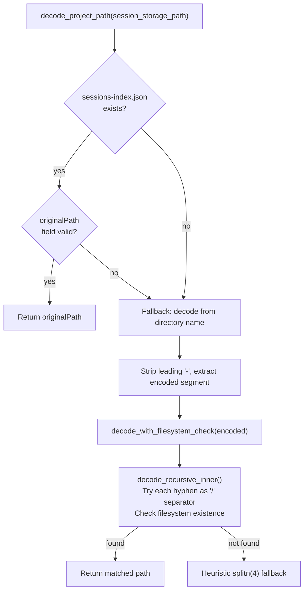
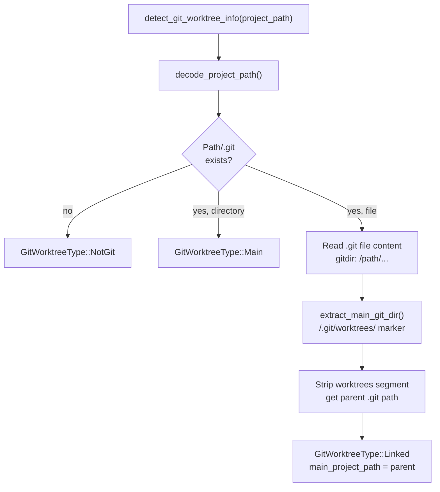
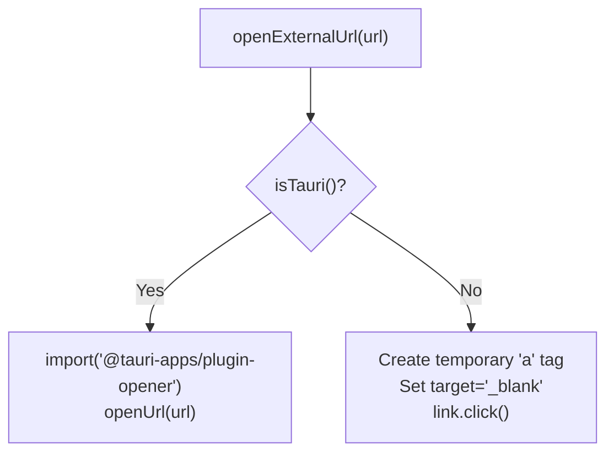

# Utility Functions

Relevant source files

The following files were used as context for generating this wiki page:

- [src-tauri/src/providers/codex.rs](src-tauri/src/providers/codex.rs)
- [src-tauri/src/providers/gemini.rs](src-tauri/src/providers/gemini.rs)
- [src-tauri/src/providers/opencode.rs](src-tauri/src/providers/opencode.rs)
- [src-tauri/src/utils.rs](src-tauri/src/utils.rs)
- [src/components/AnalyticsDashboard/utils/globalCalculations.ts](src/components/AnalyticsDashboard/utils/globalCalculations.ts)
- [src/components/MessageViewer/helpers/index.ts](src/components/MessageViewer/helpers/index.ts)
- [src/components/MessageViewer/hooks/useMessageVirtualization.ts](src/components/MessageViewer/hooks/useMessageVirtualization.ts)
- [src/hooks/analytics/useAnalyticsNavigation.ts](src/hooks/analytics/useAnalyticsNavigation.ts)
- [src/hooks/useExternalLinks.test.ts](src/hooks/useExternalLinks.test.ts)
- [src/hooks/useExternalLinks.ts](src/hooks/useExternalLinks.ts)
- [src/hooks/useSessionMetadata.ts](src/hooks/useSessionMetadata.ts)
- [src/test/projectSlice.getGroupedProjects.test.ts](src/test/projectSlice.getGroupedProjects.test.ts)
- [src/test/worktreeUtils.test.ts](src/test/worktreeUtils.test.ts)
- [src/utils/cardSemantics.ts](src/utils/cardSemantics.ts)
- [src/utils/formatters.test.ts](src/utils/formatters.test.ts)
- [src/utils/formatters.ts](src/utils/formatters.ts)
- [src/utils/platform.test.ts](src/utils/platform.test.ts)
- [src/utils/platform.ts](src/utils/platform.ts)
- [src/utils/searchIndex.ts](src/utils/searchIndex.ts)
- [src/utils/worktreeUtils.ts](src/utils/worktreeUtils.ts)

This page documents the shared utility functions used across both the Rust backend and TypeScript frontend of the application. These are pure helper functions and small modules that support higher-level systems but do not belong to any single feature area.

For information about the analytics calculation logic that consumes some of these utilities, see [Statistics and Analytics](#5.2). For how `worktreeUtils` feeds into the project tree display, see [Project Tree](#3.1).

---

## Backend Utilities (`src-tauri/src/utils.rs`)

All backend utilities live in [src-tauri/src/utils.rs]().

### Utility Function Map

**Diagram: Backend utility functions and their roles**

Sources: [src-tauri/src/utils.rs:1-312]()

---

### Line Parsing

Two functions scan raw byte buffers from memory-mapped JSONL files. They use the `memchr` crate for SIMD-accelerated newline detection.

| Function | Returns | Purpose |
|---|---|---|
| `find_line_ranges` | `Vec<(usize, usize)>` | Start and end byte offset for each non-empty line |
| `find_line_starts` | `Vec<usize>` | Start byte offset for each line |

Both pre-allocate capacity using `ESTIMATED_BYTES_PER_LINE = 500` to reduce heap reallocations.

Sources: [src-tauri/src/utils.rs:7-51]()

---

### Project Path Decoding

Claude Code stores session data in `~/.claude/projects/` using a path-encoded directory name. Forward slashes in the project path are replaced with hyphens, producing names like `-Users-jack-my-project`. Because project names can also contain hyphens, naive replacement is ambiguous.

**Diagram: decode_project_path resolution strategy**

Sources: [src-tauri/src/utils.rs:111-243]()

The recursive function `decode_recursive_inner` is depth-limited to 20 levels to prevent runaway recursion. It calls `std::fs::symlink_metadata` (not `metadata`) to avoid following symlinks when verifying candidate directory segments.

---

### Git Worktree Detection

`detect_git_worktree_info` inspects the `.git` entry in a project directory to classify the project's git status.

**Diagram: detect_git_worktree_info decision logic**

Sources: [src-tauri/src/utils.rs:245-312]()

The `.git` file in a linked worktree contains a line like:
`gitdir: /Users/jack/main-project/.git/worktrees/feature-branch`

`extract_main_git_dir` strips everything after `/.git/worktrees/` to recover the main repo's `.git` path, then `Path::parent()` gives the main project root.

Return type is `Option<GitInfo>`, where `GitInfo` holds a `GitWorktreeType` variant (`Main`, `Linked`, or `NotGit`) and an optional `main_project_path` string.

---

### Other Backend Utilities

| Function | Purpose |
|---|---|
| `extract_project_name(raw)` | Strips the leading `-seg1-seg2-` prefix from an encoded directory name to get the bare project name. [src-tauri/src/utils.rs:54-65]() |
| `estimate_message_count_from_size(size)` | Divides file size by `AVERAGE_MESSAGE_SIZE_BYTES` (1000.0) with `ceil`, minimum 1. [src-tauri/src/utils.rs:68-72]() |
| `parse_rfc3339_utc(timestamp)` | Parses an RFC 3339 string into `DateTime<Utc>`. [src-tauri/src/utils.rs:75-79]() |
| `is_safe_storage_id(id)` | Path traversal guard; ensures ID is a single normal component. [src-tauri/src/utils.rs:85-92]() |
| `search_json_value_case_insensitive(val, q)` | Recursively walks a `serde_json::Value` tree to find string matches. [src-tauri/src/utils.rs:158-169]() |

Sources: [src-tauri/src/utils.rs:53-170]()

---

## Frontend Utilities

### Platform and Runtime Detection (`src/utils/platform.ts`)

These utilities distinguish between the Tauri desktop environment and the WebUI server mode.

| Function | Logic |
|---|---|
| `isTauri()` | Returns true if `window.__TAURI_INTERNALS__` is present. [src/utils/platform.ts:28-29]() |
| `isWebUI()` | Returns `!isTauri()`. [src/utils/platform.ts:32-32]() |
| `isMacOS()` | Checks `navigator.userAgent` for "mac". [src/utils/platform.ts:16-17]() |
| `getApiBase()` | Returns `window.__WEBUI_API_BASE__` or `window.location.origin`. [src/utils/platform.ts:41-46]() |

**Diagram: Platform-dependent URL Opening**

Sources: [src/utils/platform.ts:1-165](), [src/hooks/useExternalLinks.ts:1-47]()

### Worktree Utilities (`src/utils/worktreeUtils.ts`)

This module groups `ClaudeProject` objects based on the `git_info` field populated by the backend.

| Function | Strategy |
|---|---|
| `detectWorktreeGroupsByGit` | Groups `"linked"` worktrees under their respective `"main"` repos using `main_project_path`. [src/utils/worktreeUtils.ts:97-140]() |
| `detectWorktreeGroupsHybrid` | Separates projects with valid git info for grouping and treats the rest as ungrouped. [src/utils/worktreeUtils.ts:150-176]() |
| `groupProjectsByDirectory` | Groups projects based on their parent directory path. [src/utils/worktreeUtils.ts:233-270]() |

Sources: [src/utils/worktreeUtils.ts:1-270]()

### Card Semantics (`src/utils/cardSemantics.ts`)

The `getCardSemantics` function analyzes a message to determine its visual and functional properties for the Session Board.

| Property | Detection Logic |
|---|---|
| `isError` | Checks `stopReasonSystem` for "error" or `toolUseResult.is_error === true`. [src/utils/cardSemantics.ts:35-48]() |
| `isCancelled` | Checks for "customer_cancelled" or "request canceled by user" text. [src/utils/cardSemantics.ts:51-54]() |
| `isGit` | Matches tool variants or shell commands starting with "git". [src/utils/cardSemantics.ts:66-77]() |
| `isFileEdit` | Matches tool names like `write_to_file`, `edit_file`, or `replace_file_content`. [src/utils/cardSemantics.ts:88-90]() |
| `brushMatch` | Executes `matchesBrush` predicate against the message metadata. [src/utils/cardSemantics.ts:160-174]() |

Sources: [src/utils/cardSemantics.ts:24-181]()

### Search Indexing (`src/utils/searchIndex.ts`)

The frontend uses `FlexSearch` for local message search. `extractSearchableText` traverses the complex `ClaudeMessage` content structure (including `tool_use`, `mcp_tool_use`, and `thinking` blocks) to build a flat searchable string.

| Content Type | Extraction Logic |
|---|---|
| `text` | Extracts up to 10KB of raw text. [src/utils/searchIndex.ts:41-43]() |
| `tool_use` | Extracts the tool name. [src/utils/searchIndex.ts:49-51]() |
| `mcp_tool_use` | Extracts `server_name` and `tool_name`. [src/utils/searchIndex.ts:94-97]() |
| `image` | Explicitly skipped (not searchable). [src/utils/searchIndex.ts:36-38]() |

Sources: [src/utils/searchIndex.ts:20-151]()

### Formatting Utilities (`src/utils/formatters.ts`)

| Function | Purpose |
|---|---|
| `formatDuration` | Converts minutes to strings like "<1m", "45m", or "2h 15m". [src/utils/formatters.ts:2-9]() |
| `formatNumber` | Shortens large numbers (e.g., 1.2M, 15.5K). [src/utils/formatters.ts:11-15]() |
| `formatBytes` | Converts byte counts to human-readable units (KB, MB, GB). [src/utils/formatters.ts:17-26]() |

Sources: [src/utils/formatters.ts:1-27]()
